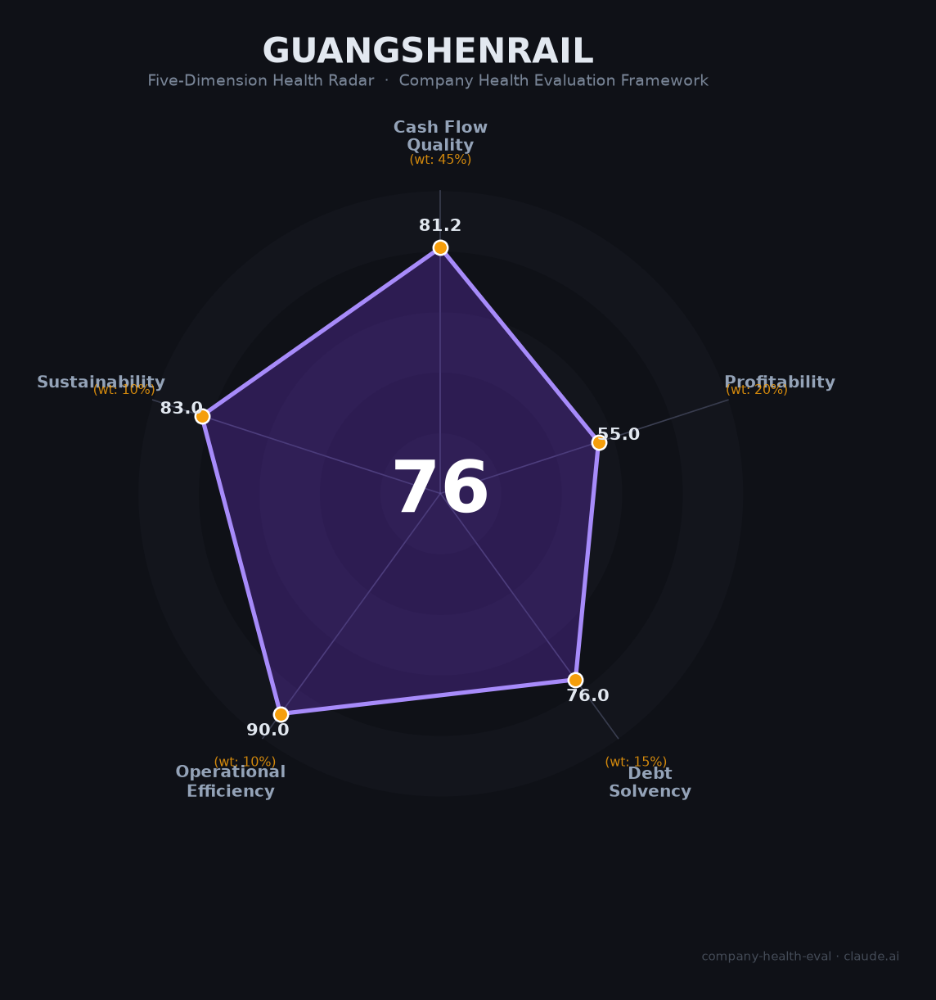

# 广深铁路（601333.SH）财务健康评估（2026-08-13）

## 一句话结论

🟡 **76/100，中等偏上** | 区域铁路运营，稳定

---

## 一、公司基本画像

| 项目 | 内容 |
|------|------|
| 主体 | 🔒 广深铁路，深圳广州干线铁路 |
| 主营 | 🔒 铁路客货运输 |
| 财务 | 🔒 区域铁路运营，稳定 |

> 一句话定性：广深干线铁路运营商，客流稳定、公用属性强。

---

## 二、五维财务健康评估

### 1. 现金流质量（81/100）| 权重45%

### 2. 盈利能力（55/100）| 权重20%

### 3. 偿债能力（76/100）| 权重15%

### 4. 运营效率（90/100）| 权重10%

### 5. 可持续发展（83/100）| 权重10%

---
## 三、综合评分

| 维度 | 得分 | 权重 | 加权 |
|------|:----:|:----:|:----:|
| 现金流质量 | 81 | 45% | 37 |
| 盈利能力 | 55 | 20% | 11 |
| 偿债能力 | 76 | 15% | 11 |
| 运营效率 | 90 | 10% | 9 |
| 可持续发展 | 83 | 10% | 8 |
| **综合得分** | **76** | 100% | 76 |

**健康等级：🟡 中等偏上**

---
## 四、核心风险清单

1. **铁路运量增长承压**
1. **高铁分流竞争**
1. **运营成本刚性**

## 五、求职/择业视角
- **核心优势**：铁路公用+客流
- **现存短板**：铁路增长有限

**结论**：铁路公用稳定
---
*评估方法：商泰汽车（iAUTO）五维企业健康度框架 · 数据截至2026年8月 · 来源：广深铁路2025年报*