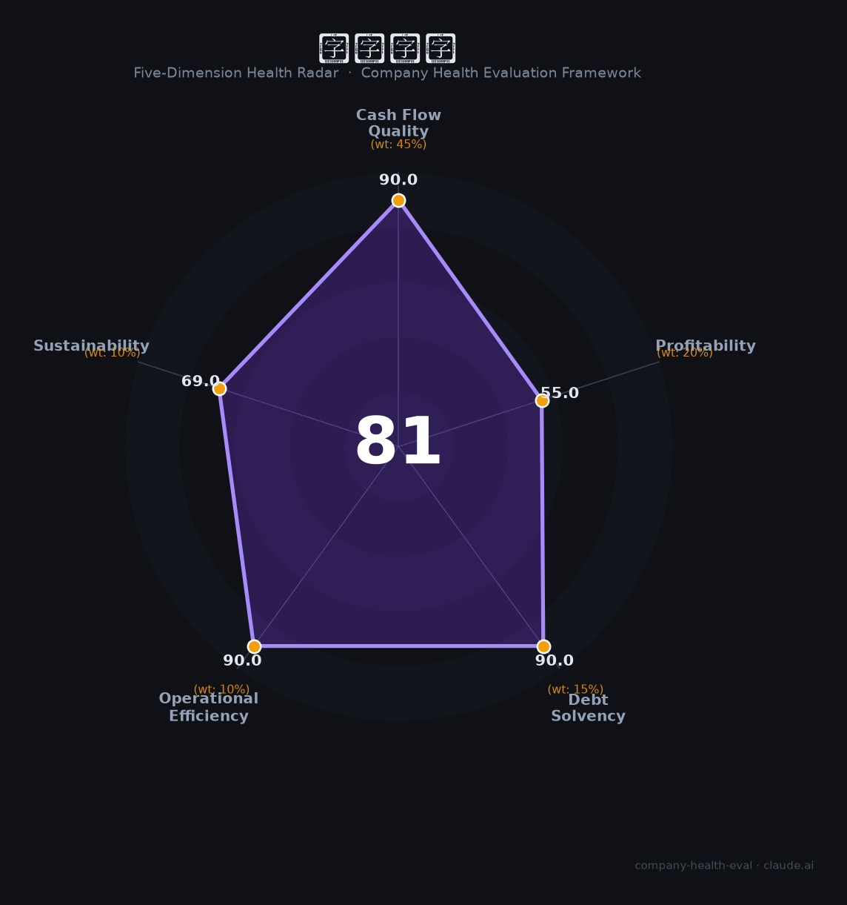

# 康冠科技（001308.SZ）财务健康评估（2026-08-14）

## 一句话结论

🟡 **81/100，中等偏上** | 显示龙头，营收稳、盈利承压、现金流好

---

## 一、公司基本画像

| 项目 | 内容 |
|------|------|
| 主体 | 康冠科技，显示/电竞屏龙头 |
| 主营 | 智能显示/电竞屏/商用屏 |
| 财务 | 2025营收144.73亿(-7.15%) |

> 一句话定性：显示与电竞屏龙头，规模大、盈利承压

---

## 二、五维财务健康评估

### 1. 现金流质量（90/100）| 权重45%

现金流稳健。

### 2. 盈利能力（55/100）| 权重20%

毛利率稳定、盈利承压。

### 3. 偿债能力（90/100）| 权重15%

低负债。

### 4. 运营效率（90/100）| 权重10%

运营效率高。

### 5. 可持续发展（69/100）| 权重10%

显示/电竞需求，海外扩张。

---

## 三、综合评分

| 维度 | 得分 | 权重 | 加权 |
|------|:----:|:----:|:----:|
| 现金流质量 | 90 | 45% | 40.5 |
| 盈利能力 | 55 | 20% | 11.0 |
| 偿债能力 | 90 | 15% | 13.5 |
| 运营效率 | 90 | 10% | 9.0 |
| 可持续发展 | 69 | 10% | 6.9 |
| **综合得分** | **81/100** | 100% | 80.9 |

**健康等级：中等偏上** — 整体稳健，局部有待改善

---

## 四、核心风险清单

1. **营收下滑**
2. **显示行业竞争**
3. **海外关税**

## 五、求职/择业视角

### 核心优势
- 显示龙头、现金流、客户稳定
### 现有短板
- 营收下滑、行业竞争

**结论**：康冠科技显示与电竞屏龙头，现金流好、规模大但营收承压，整体稳健。

---

*评估方法：商泰汽车（iAUTO）五维框架 · 数据截至2026年8月 · 财务来源康冠科技2025年报*