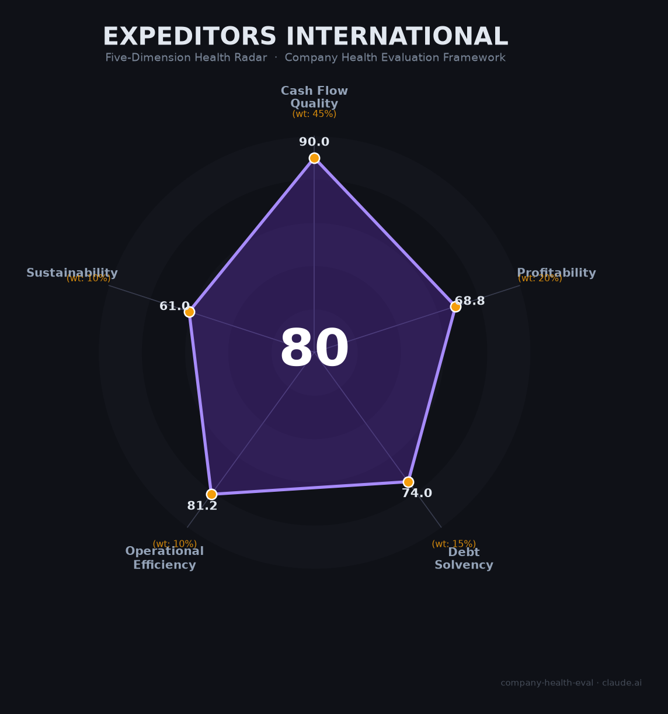

# 康捷国际物流（Expeditors International）财务健康评估（2026-07-11）

## 一句话结论
🟡 **中等偏上（79.6/100）** | 零负债现金牛，但行业低速增长 + 贸易政策不确定性压制上限

## 一、公司基本画像

| 项目 | 详情 |
|------|------|
| 主体 | Expeditors International of Washington, Inc.（NYSE: EXPD） |
| 成立时间 | 1979年5月，华盛顿州西雅图 |
| 总部 | 美国华盛顿州贝尔维尤 |
| 上市 | 1984年NASDAQ上市，2023年11月转至NYSE |
| 现任CEO | Daniel R. Wall（2025年4月上任，公司工龄38年） |
| 员工总数 | ~20,000人（2025财年） |
| 全球网络 | 100+国家，340+办事处 |
| 财富500强 | 排名第299位 |
| 机构持股 | ~97%（Vanguard 12%、BlackRock 11%、State Street 5%） |
| 主营业务 | 国际货运代理（空运35% + 海运30% + 报关及其他36%）🔒 公开财报 |

**一句话定性**：Expeditors 是全球顶级轻资产货运代理公司，以零有息负债、行业最高净利润率（7.3%）和深厚的报关核心能力著称，属于"闷声发财"的稳健型企业。

## 二、五维财务健康评估

### 1. 现金流质量（90.0/100）🟢 优秀

| 指标 | 状态 | 数据支撑 |
|------|------|----------|
| 经营现金流净额 | 🟢 健康 | FY2023: $10.5亿 / FY2024: $7.23亿 / FY2025: $10.1亿 — 连续3年为正 |
| 现金及等价物 | 🟢 健康 | $13.14亿（FY2025），完全覆盖运营需求 |
| 有息负债 | 🟢 健康 | **传统长期债务为零**，仅ASC 842租赁负债$5.71亿 |
| 净现比（OCF/NI） | 🟢 健康 | FY2025: 1.24（$10.1亿 / $8.12亿），利润含金量高 |

**核心优势**：零银行借款、零债券。这是Expeditors最突出的财务特征——完全不依赖外部融资，内生增长驱动。2025财年通过回购+分红返还股东$8.75亿，同时授权新的$30亿回购计划。

### 2. 盈利能力（68.8/100）🟡 良好

| 指标 | 状态 | 数据支撑 |
|------|------|----------|
| 毛利率 | 🟡 良好 | 15.8%（窄口径，仅运输成本），在大型货代中处于上沿（行业10-16%） |
| 净利率 | 🟡 良好 | 7.3%，远超行业平均3-4%，在四家对标公司中排名第一 |
| 营收增速（3年CAGR） | 🟠 一般 | FY2022→FY2025: -13.4%（受疫情货运泡沫正常化影响）；FY2025同比增长+4.4%，已企稳回升 |
| 人均产出 | 🟡 良好 | $58.9-62.0万/人，高于大型货代中位值（$40-50万/人） |

**说明**：营收增速从疫情峰值回落属全行业现象（同期CH Robinson、K+N均经历类似下滑），并非公司竞争力减弱。FY2025同比增长+4.4%表明业务已回归增长轨道。R&D不适用于货代行业，该指标已从评分中剔除。

### 3. 偿债能力（74.0/100）🟡 中等偏上

| 指标 | 状态 | 数据支撑 |
|------|------|----------|
| 资产负债率 | 🟠 关注 | 51.8%，处于40-70%区间，但主要构成为应付账款等经营负债，非金融负债 |
| 有息负债率 | 🟢 健康 | **0%**，零银行借款、零债券 |
| 流动比率 | 🟠 关注 | 估计1.6-2.1（货代行业经营负债较高属正常现象） |
| 现金比率 | 🟠 关注 | 估计0.67，处于0.5-1.0区间 |
| 股权质押 | 🟢 健康 | 美股公众公司，股权高度分散，无质押风险 |

**加分项**：✅ 零有息负债 + 上市公司 → +5分奖励。Expeditors的"负债"本质上是欠航空/船公司的应付运费（经营负债），而非金融杠杆——这是轻资产货代模式的天然特征，风险远低于同等资产负债率的制造业企业。

### 4. 运营效率（81.2/100）🟡 中等偏上

| 指标 | 状态 | 数据支撑 |
|------|------|----------|
| 应收周转 | 🟠 关注 | 估计DSO约60-70天，略高于行业平均（货代通常45-60天） |
| 客户集中度 | 🟢 健康 | 前5大客户<30%，无单一客户超5%收入；前20大以外客户贡献约65.8% |
| 员工规模趋势 | 🟢 健康 | 稳定在18,000-20,000人区间，无大幅缩减 |
| 高管稳定性 | 🟢 健康 | CEO过渡平稳（Musser→Wall，均为30年+内部老将）；核心管理团队长期稳定 |

### 5. 可持续发展能力（61.0/100）🟠 中等

| 指标 | 状态 | 数据支撑 |
|------|------|----------|
| 行业赛道空间 | 🔴 危险 | 全球货代市场CAGR仅~1.5%（2023-2027），北美市场甚至-0.6%萎缩 |
| 技术壁垒 | 🟠 关注 | 自研EXP.O NOW/Tradeflow/Cargo Signal平台，但1-3年内可被竞品追赶 |
| 客户/业务多元化 | 🟢 健康 | 多行业（科技/医疗/零售/汽车/航空）+ 多地区（六大洲），高度分散 |
| 资本支持 | 🟢 健康 | NYSE上市，Fortune 500，机构持股97%，$30亿回购授权 |
| 政策/监管风险 | 🟠 关注 | 中美关税、红海/中东地缘政治、全球贸易保护主义升温 |

**关键矛盾**：Expeditors的核心竞争力（报关服务）在关税壁垒升高时反而价值提升，但贸易萎缩会直接打击货运量——两者形成对冲但不完全抵消。

## 三、综合评分与健康等级

| 维度 | 得分 | 权重 | 加权得分 |
|------|------|------|----------|
| 现金流质量 | 90.0 | 45% | 40.5 |
| 盈利能力 | 68.8 | 20% | 13.8 |
| 偿债能力 | 74.0 | 15% | 11.1 |
| 运营效率 | 81.2 | 10% | 8.1 |
| 可持续发展 | 61.0 | 10% | 6.1 |
| **综合得分** | | | **79.6 / 100** |
| **健康等级** | | | **🟡 中等偏上（Moderate-High）** |

## 四、同业对标

| 指标 | **Expeditors** | **CH Robinson** | **Kuehne+Nagel** | **DSV** |
|------|:---:|:---:|:---:|:---:|
| 上市地 | NYSE | NASDAQ | 瑞士SIX | 丹麦OMX |
| 2024营收 | $106亿 | $177亿 | ~$282亿 | ~$245亿 |
| 毛利率 | **32.2%*** | 15.6% | 35.0% | 25.7% |
| 净利润率 | **7.6%** | 2.6% | 5.0% | 6.1% |
| 员工数 | ~18,000 | ~13,781 | ~80,215 | ~73,340 |
| 人均净利润 | **$45,000** | $34,000 | $15,300 | $20,200 |
| 有息负债 | **零** | 有 | 有 | 有（收购Schenker后大增） |
| 增长模式 | 内生增长 | 内生+收购 | 收购驱动 | 大规模收购 |

*\* 宽口径（含报关服务附加值），窄口径运输毛利率为15.8%*

**对标结论**：Expeditors 在四家顶级货代中**盈利能力最强**（净利润率第一、人均净利润第一），但**规模最小**（营收仅为 K+N 的 38%、DSV 的 43%）。其"小而美"策略在正常市场中表现出色，但在行业加速整合（DSV收购Schenker为标志）的大背景下，规模劣势可能逐渐显现。

## 五、核心风险清单

1. **行业低速增长（中）**：全球货代市场CAGR仅1.5%，北美市场萎缩。即使Expeditors保持市场份额，天花板也很明显。触发条件：全球贸易持续低迷或萎缩。

2. **中美贸易政策风险（中高）**：Expeditors北亚区（主要是中国）贡献约25%收入。若中美关税进一步升级或出现"脱钩"情景，货量将直接受冲击。触发条件：新一轮关税战或贸易限制。

3. **2022年网络攻击遗留风险（低-中）**：2022年Ryuk勒索软件攻击导致系统关闭，FY2022产生额外成本。虽已恢复，但作为物流信息枢纽，网络安全仍是持续性风险。触发条件：再次遭遇重大网络攻击。

4. **行业整合压力（中）**：DSV收购Schenker后成为~$400亿营收的巨无霸，在关键客户招标中可能获得规模优势（更低的承运商采购价）。Expeditors拒绝收购式增长，可能在价格竞争中承压。触发条件：大客户因价格转投整合后的竞争对手。

5. **周期性波动（中）**：FY2022→FY2023营收-45%的剧烈波动表明货代行业深度周期性的本质。下一轮下行周期中，尽管零负债提供安全垫，但盈利仍会大幅缩水。触发条件：全球经济衰退或运价暴跌。

6. **汇率风险（低）**：约50%+收入来自美国以外，美元走强会压缩海外收入折算值。FY2025北亚区收入同比-6.7%部分源于汇率影响。

## 六、求职/择业视角

### ⚠️ 重大更新（2026年6月）

Expeditors 于 **2026年6月宣布裁减约230个技术岗位**（占全球技术团队15%），涉及西雅图、Bellevue等地的软件开发者、QA测试、项目经理等。这是公司**自1979年成立47年来首次正式裁员**，终结了"永不裁员"的历史传统。CEO Daniel Wall（2025年4月上任）及CFO称部分与AI驱动的效率提升有关。**这一信号值得求职者高度关注**——虽当前仅限技术部门，但标志着公司文化可能正在转向更激进的成本管理。

### 核心优势

- **财务稳定性极高**：零负债 + $13亿现金 + Fortune 500 + 47年经营历史。FY2023行业雪崩（营收-45%）时**仅通过自然减员缩减10%**，未进行强制裁员，展现了极强的抗周期能力。
- **员工留存率高**：平均任职年限5.5年，超50%员工任职>5年。Comparably员工留存评分73/100（同行第2名）。
- **业务价值高**：报关合规、国际物流、供应链管理经验在全球贸易领域通用性极强，跳槽至DHL/DSV/K+N/马士基等同行无障碍。
- **内部晋升文化**：CEO Wall在公司工作38年从基层晋升。公司以"promote from within"著称。
- **福利尚可**：401k（自动加入6%缴存+公司匹配）、ESPP员工购股计划、医疗保险获好评。

### 现存短板

- **薪酬明显偏低**：Glassdoor薪酬评分仅**3.1/5**（全平台最低维度），与Kuehne+Nagel（3.3）、CH Robinson（3.1）持平，落后于Schneider Electric（4.0）等。Blind员工反馈薪酬仅为其他Fortune 500同岗位的50-75%。非管理岗无RSU/股权。
- **工作生活平衡差**：Glassdoor评分**2.9/5**——全平台最低维度之一。"always on"的全球供应链运作、非标准工时、远程办公政策有限。
- **职业发展缓慢**："按年限晋升"而非按业绩；内部流动受限；技术栈陈旧（2018年才用Git）。
- **行业天花板低**：货代行业增速1.5%，远低于科技行业。
- **品牌知名度有限**：物流圈外认知度低，跨行业跳槽背书价值有限。
- **⚠️ 不裁员文化已破**：2026年6月首次裁员是重大文化转折信号，需持续观察是否会扩展至其他部门。

### 中国区特别说明

Expeditors在中国约**2,000名员工**，分布在上海（亚洲区总部，约500-1,000人）、北京（中国区总部）、深圳（~200人）、厦门、大连、苏州等城市，约38-50个分公司。上海有管理培训生项目（6-12个月轮岗）。战略客户高级经理年薪可达¥150-200万。

### 分场景建议

| 个人诉求 | 推荐度 | 说明 |
|----------|--------|------|
| 稳定+深耕 | ⭐⭐⭐⭐ | 财务极稳，但"不裁员"承诺已破，降一星 |
| 高薪+跳板 | ⭐⭐⭐ | 薪资中下；物流行业跳板价值高但跨行业有限 |
| 成长+爆发 | ⭐⭐ | 行业低增速，薪酬增长慢，无股权爆发可能 |
| 多元+跨领域 | ⭐⭐⭐ | 报关、贸易合规经验可迁移至咨询/律所/跨国企业供应链部门 |

## 七、总结

**Expeditors International 是全球货运代理领域「最赚钱的稳健派」**：行业顶级的净利润率和人均产出 + 零有息负债的极端保守财务策略，构成了罕见的"高质量+低风险"组合。唯一短板是所处行业本身增速低迷（~1.5%）且面临贸易保护主义升温的结构性逆风。

在当前（2026年7月）全球贸易环境不确定性较高的背景下，Expeditors 属于 **中低风险、中低回报** 的选择——适合追求职业稳定性、愿意在物流行业长期深耕的求职者，不太适合追求高增长、高爆发或跨行业发展的类型。

---

*评估日期：2026-07-11 | 数据来源：SEC EDGAR 10-K（FY2021-FY2025）、Yahoo Finance、StockAnalysis、Macrotrends、Morningstar*
*评分引擎：`.claude/skills/company-health-eval/scripts/score.py` v3.0*
