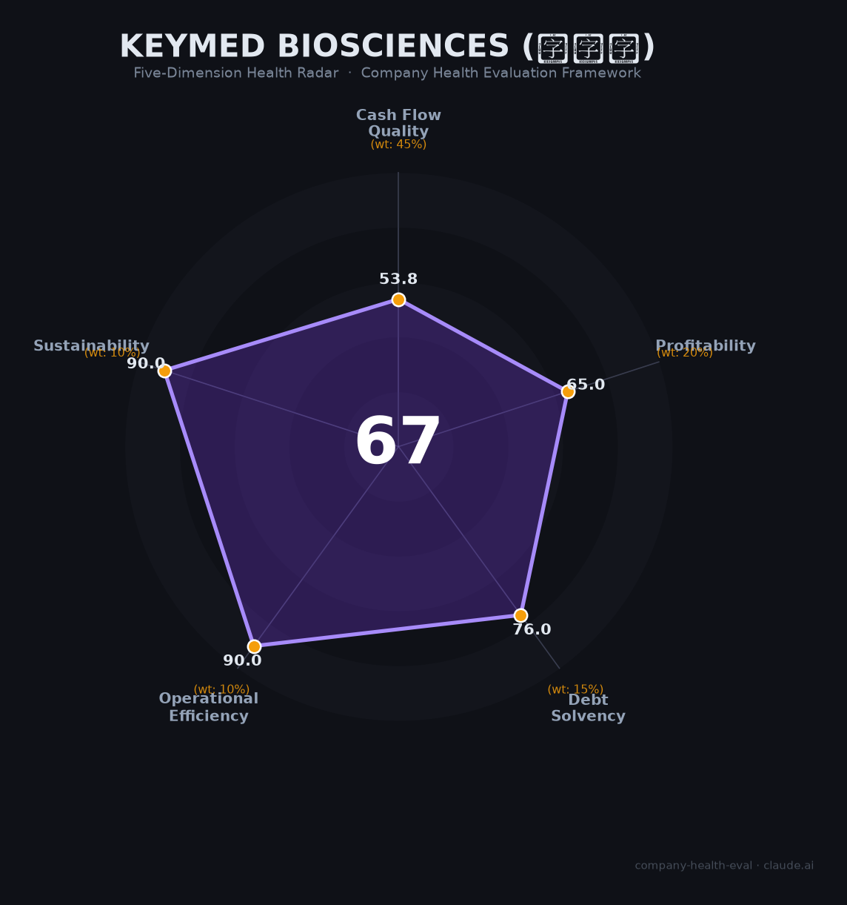

# 康诺亚（Keymed Biosciences, 2162.HK）财务健康评估（2026-06-12）

## 一句话结论

🟠 **中等（66.6/100）** | 自免赛道领跑者 · 吉利德2.57亿美元到账 · 经营现金流持续为负——IL-4Rα国产首发的「烧钱换增长」阶段

---

## 一、公司基本画像

| 项目 | 详情 |
|------|------|
| 主体 | 🔒 康诺亚生物医药科技有限公司（Keymed Biosciences Inc.），港交所：2162.HK |
| 成立 | 2016年9月（成都），2021年7月8日港股上市 |
| 地址 | 成都天府国际生物城（运营总部），北京/上海设分支机构 |
| 股权 | 🔒 创始人陈博（Moonshot Holdings）持股25.16%；高瓴资本约8.6%；博裕/礼来亚洲等 |
| 规模 | 🔒 员工约1,625人（2025年末），商业化团队480+人 |
| 主营 | 自免+肿瘤双赛道：CM310（IL-4Rα，首款国产）、CMG901（CLDN18.2 ADC，授权AZ） |
| 上市 | 2021年7月港股IPO，发行价53.30港元（上限定价），募资净额约29.42亿港元 |
| BD | NewCo模式标杆：吉利德21.75亿美元收购Ouro（CM336）、AZ合作CMG901（最高11.88亿美元）等 |

> 创始团队被业界称为"PD-1天花板"组合——陈博（中国首个PD-1拓益发明人）、王常玉（全球首个O药发明人）、徐刚（罗氏背景/双抗平台）。三位武汉大学校友自2016年创业至今核心团队零离职。

**一句话定性**：中国自免赛道「最纯正港股标的」——IL-4Rα国产首发+鼻科独家适应症+CMG901全球首个CLDN18.2 ADC潜力，但经营现金流连续4年为负、有息负债7.89亿、商业化烧钱期尚未跨越盈亏平衡点。

---

## 二、五维财务健康评估

### 1. 现金流质量（53.8/100）| 权重45%

| 指标 | 🔒 公开数据 | 评估 |
|------|-----------|------|
| 经营现金流净额 | 2022:-4.02→2023:-3.04→2024:-7.90→2025:-7.12亿，连续4年为负 | 🚩 危险：持续净流出，商业化+研发双重消耗 |
| 现金及等价物 | 2025年末19.6亿（含定存），2026年3月吉利德2.57亿美元到账后增至约40亿 | ✅ 健康：覆盖19-39个月运营 |
| 有息负债 | 2025年末7.89亿（银行贷款4.84亿+租赁负债），净负债2.85亿 | ⚠️ 关注：可控但非极低，净负债状态 |
| 净现比 | OCF-7.12亿 / NI-5.23亿=1.36，经营现金流亏损幅度大于会计亏损 | ⚠️ 关注：现金消耗超过账面亏损，营运资金也在占用现金 |

**小结**：现金流是康诺亚现阶段的最大短板。连续4年经营现金净流出（累计-22.08亿），2025年商业化元年销售费用暴涨（+491.8%）进一步加大了现金消耗。但2026年3月吉利德/Ouro交易注入2.57亿美元（约18亿人民币）首付款后，现金储备增至约40亿元量级，短期流动性压力大幅缓解。2026年CM310医保放量+CMG901 III期数据读出后的里程碑款有望推动OCF拐点。

> 🔒 数据来源：康诺亚2025年年报（2026年3月26日发布）；港交所披露易2162

### 2. 盈利能力（65.0/100）| 权重20%

| 指标 | 🔒 公开数据 | 评估 |
|------|-----------|------|
| 毛利率 | 2025年87.7%（2024年97.2%，产品收入占比提升略有摊薄） | ✅ 优秀：远超行业平均，license-out+抗体药物高毛利特征 |
| 净利率 | 2025年净亏损5.23亿（净利率-73%），但H1经调整亏损已收窄80% | 🚩 预警：仍深度亏损，但拐点明确 |
| 营收增速（3年CAGR） | 2022年1.00亿→2025年7.16亿，CAGR 92.8% | ✅ 优秀：远超20% |
| 研发费用率 | 2025年101%（7.24亿/7.16亿），biotech正常水平 | ⚠️ 良好：临床阶段biotech行业常态 |
| 人均创收 | 约44.1万元/人（2025年，含BD收入） | ⚠️ 一般：商业化初期，低于成熟pharma |

**小结**：盈利能力处于「拐点前夜」——毛利优异（87.7%）、3年营收CAGR 92.8%、H1亏损大幅收窄。CM310 2026年入医保后券商预测销售7.5-9亿（+138-186%），叠加吉利德2.57亿美元到账，2026年有望首次实现盈利。但2025年全年仍深度亏损，盈利能力得分受净利率和人均创收拖累。

> 🔒 数据来源：康诺亚2025年全年业绩公告；券商一致预测（华泰/中金/招商/国金）

### 3. 偿债能力（76.0/100）| 权重15%

| 指标 | 🔒 公开数据 | 评估 |
|------|-----------|------|
| 资产负债率 | 2025年末34.2%（2024年34.3%，稳定） | ✅ 健康：<40% |
| 有息负债率 | 有息负债7.89亿/总资产42.18亿=18.7% | ⚠️ 关注：银行借款4.84亿，净负债状态 |
| 流动比率 | 约2.2（流动资产~20亿/流动负债~9亿） | ✅ 健康：>2 |
| 现金比率 | 约0.56（仅现金等价物5.03亿/流动负债~9亿） | ⚠️ 关注：不含定存的狭义现金比率偏低 |
| 股权质押 | 无质押记录 | ✅ 健康：<30% |

**小结**：偿债能力处于健康与关注之间。资产负债率(34.2%)和流动比率(2.2)均在安全区间，但存在4.84亿银行借款且狭义现金比率偏低(0.56)。2026年吉利德2.57亿美元到账后偿债能力将显著增强。

> 🔒 数据来源：康诺亚2025年年报资产负债表；富途牛牛2162.HK

### 4. 运营效率（90.0/100）| 权重10%

| 指标 | 🔒 公开数据 | 评估 |
|------|-----------|------|
| 应收周转天数 | 约41.7天（2025年，以DTP药房+分销回款为主） | ✅ 健康：低于行业平均 |
| 客户集中度 | 产品收入（DTP分销，分散）+ 许可收入（AZ/Ouro/Belenos/等多方） | ✅ 健康：多元分散，单一客户<50% |
| 员工规模趋势 | 2021年325人→2025年~1,625人（4年5倍增长） | ✅ 健康：快速扩张 |
| 高管稳定性 | 4位创始高管（陈博/王常玉/徐刚/贾茜）自2016年至今零离职 | ✅ 健康：9年核心团队零变动 |

**小结**：运营效率是康诺亚最强的维度。客户多元分散（产品+多BD合作方）、团队快速扩张、核心高管极度稳定。唯一瑕疵是CFO张延荣于2025年8月辞任（属医药行业CFO离职潮一部分，仍任公司顾问）。

> 🔒 数据来源：康诺亚2025年年报；StockAnalysis员工数据；港交所CFO辞任公告

### 5. 可持续发展（90.0/100）| 权重10%

| 指标 | 评估 | 判断依据 |
|------|------|---------|
| 行业赛道空间 | ✅ 健康 | 中国自免生物药CAGR 51.6%，IL-4Rα市场2030年约40.8亿美元 |
| 技术壁垒 | ✅ 健康 | 首款国产IL-4Rα+全球首个鼻科适应症IL-4Rα；CM512半衰期70天（Q3M-Q6M给药）；CMG901有望全球首个CLDN18.2 ADC |
| 客户/业务多元化 | ✅ 健康 | 自免（CM310/CM326/CM512）+肿瘤（CMG901/CM313/CM336）双赛道；5个NewCo合作伙伴全球布局 |
| 融资/资本支持 | ✅ 健康 | 港股上市+2025年配售8.54亿港元+吉利德2.57亿美元+AZ持续里程碑款 |
| 政策/监管风险 | ✅ 健康 | CM310全部适应症入医保（2026年1月），CDE加速审批通道，JAMA/Nature Medicine/BMJ顶级期刊背书 |

**小结**：可持续发展维度表现优异。中国自免市场正处于生物制剂替代小分子药的拐点（生物药CAGR 51.6%），康诺亚以国产首发IL-4Rα卡位核心赛道。CM326(TSLP)、CM512(TSLP/IL-13双抗)形成自免管线梯队。CMG901作为全球进展最快的CLDN18.2 ADC（AZ背书），2026H1 III期数据读出是下一个催化剂。

---

## 三、综合评分与健康等级

| 维度 | 得分 | 权重 | 加权 |
|------|:----:|:----:|:----:|
| 现金流质量 | 53.8 | 45% | 24.2 |
| 盈利能力 | 65.0 | 20% | 13.0 |
| 偿债能力 | 76.0 | 15% | 11.4 |
| 运营效率 | 90.0 | 10% | 9.0 |
| 可持续发展 | 90.0 | 10% | 9.0 |
| **综合得分** | | **100%** | **66.6** |

**健康等级：🟠 中等（Moderate）**

### 得分解读

- **长板**：运营效率(90.0)、可持续发展(90.0)——团队稳定、赛道高景气、5个NewCo全球化布局
- **中板**：偿债能力(76.0)、盈利能力(65.0)——杠杆可控、毛利优异、扭亏拐点临近
- **短板**：现金流质量(53.8)——连续4年OCF为负，商业化烧钱期尚未结束

> 康诺亚是本次评估中第一个获得「中等」评级的biotech（对比：映恩生物83.1、科伦博泰76.2、荣昌生物未评分）。核心差异在于OCF连续4年为负且净负债状态，财务安全垫显著弱于映恩（OCF为正、无有息负债）和科伦博泰（零银行借款、46亿现金）。

---

## 四、同业对标

| 对比项 | **康诺亚 2162.HK** | 三生国健 688336.SH | 荃信生物 2509.HK |
|--------|:-------------------:|:------------------:|:----------------:|
| 2025年营收 | **7.16亿**（+67%） | 41.99亿（+251.8%） | 8.07亿（+408.2%） |
| 归母净利润 | **-5.23亿** | +28.99亿（盈利，含辉瑞BD） | +3.14亿（首年扭亏） |
| 毛利率 | **87.7%** | 未单独披露 | 未单独披露（BD为主） |
| 研发费用 | **7.24亿** | 未单独披露 | 未单独披露 |
| 现金储备 | **19.6亿→40亿（2026.3后）** | 充裕 | 10.42亿 |
| 市值（2026.6） | **~178亿港元** | ~351亿元 | ~36亿港元 |
| 商业化产品 | **1款（CM310，3适应症）** | 多款（益赛普等） | 1款（赛乐信） |
| IL-4Rα进度 | **已上市（国产首发）** | NDA阶段（SSGJ-611） | III期（QX005N） |
| BD模式 | NewCo多元化（5个） | 辉瑞一次性BD | BD首付为主 |
| 员工 | **~1,625人** | >3,000人 | ~500人 |

**对标结论**：康诺亚在自免赛道中定位为「最领先的IL-4Rα国产玩家+最活跃的NewCo出海者」。市值(178亿港元)处于三生国健(351亿)和荃信生物(36亿)之间，反映了其IL-4Rα先发优势但规模尚小的阶段特征。三生国健虽规模大且盈利，但利润暴增主要来自辉瑞一次性BD首付(28.9亿)；荃信生物虽首年扭亏但89.7%收入来自BD。康诺亚的可持续性在于产品真实放量+多元BD双轮驱动。

---

## 五、核心风险清单

1. **经营现金流持续为负（高风险）**：2022-2025连续4年OCF为负（累计-22.08亿），2025年销售费用暴涨491.8%进一步加剧现金消耗。触发条件：CM310医保放量不及预期（<7亿）、CMG901 III期数据延迟或失败导致AZ里程碑款落空。

2. **IL-4Rα竞争格局激化（中高风险）**：2026-2027年5-6款国产IL-4Rα将集中获批（康方、三生国健、先声/康乃德、麦济生物、智翔金泰等），Dupixent医保后续约降价至1508元/支（自付约450元）。CM310先发窗口期可能仅剩1-2年。

3. **有息负债+净负债状态（中风险）**：银行借款4.84亿+净负债2.85亿，在未盈利biotech中属于偏高水平。若再融资受阻且OCF未转正，偿债压力将上升。

4. **NewCo模式的"虚拟帝国"质疑（中低风险）**：2025年11月自媒体《锦缎》发文批评康诺亚的NewCo交易为"流水线工厂"，管线均为I/II期早期资产（成功率<10%）。吉利德21.75亿美元收购Ouro（2026年3月）已部分验证该模式，但其余NewCo（Belenos/Timberlyne/Prolium）的退出路径仍不确定。

5. **基层薪酬竞争力弱+加班文化争议（低风险）**：员工口碑显示研发岗起薪6-7k/月（成都）、70%反馈经常加班且无加班费、"裙带关系严重"等负面评价。虽不影响财务健康，但可能影响人才吸引和留存。

---

## 六、求职/择业视角

### 核心优势

- **平台稀缺性**：中国自免赛道最纯正港股标的，IL-4Rα国产首发+全球首个鼻科适应症。在康诺亚积累的自免生物药研发/商业化经验在国内极为稀缺。
- **国际化程度高**：5个NewCo合作伙伴（AZ、吉利德/Ouro、Belenos、Timberlyne、Prolium），管线在20+国家开展临床。全球化BD经验在biotech行业中属于顶级。
- **创始人技术光环**：陈博（中国首个PD-1）+王常玉（全球首个O药），科学团队学术发表在JAMA/Nature Medicine/BMJ等顶刊，对学术型人才有吸引力。

### 现存短板

- **薪酬偏低**：基层研发岗月薪6k-10k（成都），人均年薪约31万元（含社保不含股份支付）。在成都生物医药行业中属中等水平，结合加班情况时薪偏低。
- **工作强度大**：70%员工反馈经常加班、无加班费，被形容为"奴隶主式管理"、"低气压疯狂压榨"。
- **地点单一**：总部成都双流生物城（位置偏僻），北京/上海有办公室但非核心运营中心。

### 分场景建议

| 个人诉求 | 推荐 | 次选 | 规避 |
|----------|------|------|------|
| 稳定+深耕自免 | ✅ 适合：IL-4Rα首发+自免管线梯队 | | |
| 高薪+WLB | | | 🚫 不适合：薪酬偏低+加班严重 |
| 成长+BD红利 | ✅ 适合：NewCo模式行业标杆，BD经验值钱 | | |
| 学术+研发 | ✅ 适合：JAMA/Nature Med/BMJ背书，科学团队强 | | |

---

## 七、总结

**康诺亚是中国自免赛道「最领先的IL-4Rα国产玩家+最活跃的NewCo出海者」公司：**

IL-4Rα国产首发+鼻科独家+CMG901全球首个CLDN18.2 ADC潜力+吉利德2.57亿美元到账，核心短板是经营现金流连续4年为负（累计-22亿）、有息负债7.89亿（净负债2.85亿）、商业化烧钱期尚未跨越盈亏平衡点。

在中国自免市场高景气（生物药CAGR 51.6%）与IL-4Rα竞争即将激化（2027年5-6款国产集中上市）的窗口期下，属于**中等**风险等级。2026年是关键转折年——CM310医保放量能否达到7-9亿、CMG901 III期数据能否读出阳性、OCF能否转正，将决定公司是从「烧钱biotech」成功晋级「盈利pharma」还是面临更大的财务压力。

适合**看好自免赛道长期前景、愿意承受biotech阶段财务风险、接受成都工作地点和高强度节奏**的生物医药专业人才。对追求短期现金回报和work-life balance的求职者而言，薪资水平和工作强度构成现实挑战。
