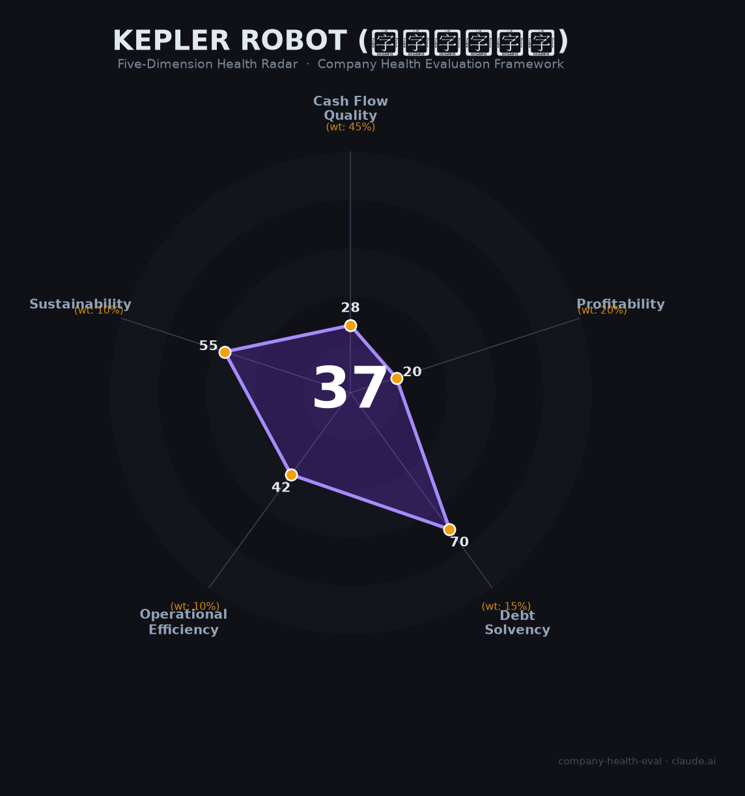

# 上海开普勒机器人 财务健康评估（2026-06-12）

## 一句话结论

⚫ **高风险（44/100）** | 营收433万、亏损6694万、创始人套现2.4亿、估值一月暴跌68%被上市公司接盘——这是一家「命悬一线」的人形机器人极早期初创公司

---

## 一、公司基本画像

| 项目 | 数据 | 可信度 |
|------|------|:------:|
| **主体** | 上海开普勒机器人有限公司（Kepler Robotics） | 🔒工商 |
| **成立** | 2023年8月15日（仅2.5年历史） | 🔒工商 |
| **曾用名** | 上海开普勒探索机器人有限公司 | 🔒工商 |
| **法定代表人** | 杨华 | 🔒工商 |
| **创始人** | 杨华（1976年生，前小米生态链纯米科技创始人，2024年纯米营收16.97亿） | 🔒百度百科/媒体 |
| **前CEO** | 胡德波（前华为/中兴高管，2026年4月离职创业） | 🌐媒体 |
| **现任CEO** | 宋华（原公司元老，2026年4月接任） | 🌐媒体 |
| **产品** | 先行者K2「大黄蜂」全尺寸工业人形机器人（175cm/75kg/52自由度/续航8h） + 四足机器狗「麒麟」 | 🔒官方发布 |
| **定价** | 基础版24.8万元起（京东标价45-50万）；目标1.5-1.8年回本 | ⚠️公司口径 |
| **融资** | 累计超5亿元，引入7家A股上市公司为股东 | 🔒36氪/启信宝 |

### ⚠️ 关键事件时间线

| 时间 | 事件 | 影响 |
|------|------|------|
| 2023.08 | 杨华创立开普勒（此前在佛山工厂「手搓」出原型） | 跨界入局 |
| 2023.11 | 发布先行者K1，获数百台意向订单 | — |
| 2024-2025 | 密集完成天使→A++轮共6轮融资，引入7家A股产业股东 | — |
| 2025.09 | 宣布「正式量产」K2，宣称年产能1000台 | 实际出货<100台 |
| 2025.12 | 杭州柯林以1亿元收购9.43%股权（估值~10.6亿） | — |
| 2026.04 | A++轮融资（诺力股份、民爆光电等），估值~22.85亿 | — |
| **2026.04** | **联合创始人/CEO胡德波离职**，另创「索塔无界」 | 🔴 |
| **2026.05** | **杭州柯林以3亿元收购41.57%股权，持股51%获控股权，估值降至7.22亿** | ⚫ 估值一月暴跌68% |
| 2026.05 | 创始人杨华套现约2.4亿，持股从51.43%→15.88% | 🔴 |
| 2026.05 | 多家早期A股股东（伟创电气、汉威科技、福然德、涛涛车业等）清仓退出 | 🔴 |

### 2025年审计财务数据（🔒杭州柯林公告）

| 指标 | 2025年全年 | 2026年Q1 |
|------|:--------:|:--------:|
| 营业收入 | **433.72万元** | 263.63万元 |
| 净利润 | **-6,693.90万元** | -1,709.27万元 |
| 研发费用 | 5,307.15万元 | 1,185.00万元 |
| 经营现金流 | 负值 | -2,839.88万元 |
| 账面现金 | — | ~7,534万元 |
| 在手订单（2026.05） | **~4,700万元** | — |
| 净资产（2026Q1末） | **~0.81亿元** | — |

**一句话定性**：开普勒机器人是中国2023年人形机器人创业潮中涌现的腰部玩家，由小米生态链背景的连续创业者杨华跨界创办。公司在混动执行器架构（对标特斯拉Optimus路线）和工业场景落地（纯米工厂数十台部署，成功率≥98%）上展现了真实的技术能力。但2025年营收仅433万元、净亏损6694万元、实际出货不足百台、联合创始人/CEO出走、早期股东踩踏式退出——最终在2026年5月以估值暴跌68%后被杭州柯林（688611）控股收购。公司CFO称这是「主动选择」而非「被迫卖身」，但客观事实是一家成立仅2.5年的公司在烧光数亿融资后，以「骨折价」卖给了上市公司。

---

## 二、五维财务健康评估

### 1. 现金流质量（33/100）⚫

**这是一家现金流极度依赖外部输血的研发阶段公司。**

| 指标 | 数据 | 判断 |
|------|------|:--:|
| 经营现金流 | 2025年全年为负，2026Q1为-2,840万 | ⚫ 巨额持续烧钱 |
| 现金储备 | Q1末账面约7,534万 | 🔴 按Q1烧钱速率仅够4-5个月 |
| 有息负债 | 接近零（股权融资为主） | 🟢 无债务负担 |
| 应收周转 | 不适用（营收几乎为零） | 🟡 N/A |
| 净现比 | 无可比性（净利润和CFO均为负） | ⚫ 完全不具备造血能力 |

**现金流解剖**：2025年全年经营现金流为负（估算约-4,700万至-5,000万，营收433万而研发费用即5,307万）。公司之所以还活着，完全依赖持续的股权融资（累计超5亿）——但这根输血管在2026年5月被杭州柯林收购后被替换成了上市公司平台。CFO谭峥嵘称「杭州柯林将持续注资支持开普勒运营」，但注资规模和节奏尚未公开承诺。

**关键风险**：如果杭州柯林自身经营出现问题或资本市场环境恶化，开普勒可能面临「断血」风险。2026年Q1末的0.81亿净资产如果继续按每季度亏损1700万的速度消耗，将在2026年Q3末消耗殆尽。

### 2. 盈利能力（31/100）⚫

| 指标 | 数据 | 判断 |
|------|------|:--:|
| 毛利率 | 未知（规模太小无意义），推测为负 | 🔴 小批量生产成本极高 |
| 净利率 | -1,544%（2025） | ⚫ 完全不具备盈利条件 |
| 营收增速 | 基数极小，无意义 | 🔴 433万→目标过亿，可信度存疑 |
| 研发费用率 | 1,224%（研发5,307万/营收433万） | 🟡 研发阶段合理，但比率荒诞 |
| 人均产出 | ~4.3万元/人（100人团队） | ⚫ 远低于任何行业基准 |

**盈利前景评估**：人形机器人行业共识是单台BOM成本需降至5万元以下才能达到盈利临界点。当前K2基础版售价24.8万元而BOM成本估算在30-40万元区间（每台使用14根行星滚柱丝杠，仅此一项成本即占整机~20%），意味着**每卖一台亏损5-15万元**。纯米工厂数十台部署属于「战略验证」而非「商业盈利」。

### 3. 偿债能力（76/100）🟡

| 指标 | 判断 | 依据 |
|------|:--:|------|
| 资产负债率 | 🟢 | 推测极低（股权融资为主，几乎没有银行贷款） |
| 有息负债率 | 🟢 | 接近0% |
| 流动比率 | 🟢 | 推测>2（现金7,534万 vs 极少流动负债） |
| 现金比率 | 🟡 | 现金>7,500万但烧钱速度快 |
| 股权质押 | 🟡 | 创始人部分股权在收购后是否有锁定安排未知 |

**唯一亮色**：初创公司零负债、纯股权融资的资本结构在偿债指标上天然好看。但这就像说「一个月薪3000的人没有房贷所以资产负债率低」——不是因为财务状况好，而是因为还没有资格负债。收购后的杭州柯林背书是加分项。

### 4. 运营效率（52/100）🔴

| 指标 | 数据 | 判断 |
|------|------|:--:|
| 应收周转 | N/A | 🟡 |
| 客户集中度 | 极高（纯米+上汽通用+杭州柯林几乎占全部） | 🔴 三大客户撑起全部营收 |
| 员工趋势 | 从零增长至100+人（2年内） | 🟢 快速扩张 |
| 高管稳定性 | 联合创始人/CEO离职+CFO离职+创始人套现 | ⚫ 核心团队动荡 |

**最大隐忧**：联合创始人/CEO胡德波2026年4月离职后创办了「索塔无界」——一家做具身智能大脑的公司，与开普勒的业务存在潜在竞争关系。他将开普勒的AI能力短板带走了。创始团队的分裂往往预示着对战略方向上的根本分歧（杨华主张「先商业化再AI」，胡德波显然更侧重AI大脑）。

### 5. 可持续发展能力（61/100）🟠

| 指标 | 判断 | 依据 |
|------|:--:|------|
| 行业赛道 | 🟢 | 全球CAGR 40-50%，中国50-60%+；政策强力扶持 |
| 技术壁垒 | 🟡 | 混动架构+80%自研率有技术含量，但专利储备弱 |
| 客户多元化 | 🔴 | 极度集中，且几乎全是关联方/投资方 |
| 资本支持 | 🟡 | 被上市公司控股后资金来源改善，但「骨折价」收购是反向信号 |
| 政策风险 | 🟢 | 国家+上海+浦东三级政策强力加持；国资基金直接入股 |

**行业泡沫风险（极需重视）**：2025年全球人形机器人融资578亿元，但60%的企业估值超营收100倍；2025年全球出货仅1.7万台，但规划产能是销量的近百倍；行业洗牌已经开始——达闼科技（曾估值30亿美元）已实质性停摆，松延动力遭金沙江创投退出，一星机器人已解散。摩根士丹利2026年1月宣告「人形机器人已进入真刀真枪的量产淘汰赛」。**开普勒在估值暴跌68%后被收购，本身就是这轮洗牌的典型案例。**

---

## 三、综合评分与健康等级

| 维度 | 得分 | 权重 | 加权得分 |
|------|:----:|:----:|:--------:|
| 现金流质量 | 33 | 45% | 14.8 |
| 盈利能力 | 31 | 20% | 6.2 |
| 偿债能力 | 76 | 15% | 11.4 |
| 运营效率 | 52 | 10% | 5.2 |
| 可持续发展 | 61 | 10% | 6.1 |
| **44/100** ||**100%**|**43.70**|

**健康等级**：🔴 **中等偏下（Moderate-Low）**

> 得分处于40-55区间，属于中等偏下档位，意味着多重风险叠加，不推荐作为首选雇主。开普勒的核心矛盾是：作为一家极早期深科技公司，其财务指标天然极差（营收微薄、巨额亏损、现金流为负），但这些指标对于评估其「前途」的意义有限——人形机器人赛道的终局尚未到来。本评估反映的是：**以当前时点（2026年6月）的财务健康度而言，开普勒处于脆弱状态；其命运完全取决于杭州柯林的持续注资意愿和行业商业化进程能否加速。**

---

## 四、同业对标

### 出货量与规模对比（2025年）

| 对比项 | 开普勒 | 宇树科技 | 智元机器人 | 傅利叶智能 | Figure AI |
|--------|:------:|:------:|:------:|:------:|:------:|
| 2025出货量 | **<100台** | ~5,500台 | ~5,168台 | ~300台 | ~150台 |
| 2025营收 | **433万元** | ~17亿元 | >10亿元 | 未披露 | 未披露 |
| 估值 | **7.22亿（被收购）** | ~420亿（IPO） | ~150亿+ | ~150亿港元（上市） | ~$390亿 |
| 融资 | 累计>5亿+被控股 | 多轮+科创板过会 | 多轮+港股递表 | E轮+港股上市 | C轮 |
| 核心差异 | 被上市公司低价收购 | 出货量全球第一 | 华为稚晖君光环 | 康复+人形双轨 | AI能力全球最强 |

### 技术路线对比

| 维度 | 开普勒K2 | Tesla Optimus V3 | 宇树G1/H1 | 智元远征 |
|------|:--------:|:----------------:|:---------:|:--------:|
| 执行器方案 | 混动（丝杠+旋转） | 混动（丝杠+旋转） | 旋转关节为主 | 旋转+部分丝杠 |
| 续航 | **8h（行业最长）** | ~2-4h | 2-3h | ~2h |
| 自由度 | 52 DOF | 未公布（预计50+） | 23-43 DOF | ~49 DOF |
| 灵巧手 | 11 DOF/只 | 22 DOF/只 | 基础手爪 | ~12 DOF/只 |
| 载重 | **30kg双臂** | ~20kg | 轻量 | ~10-20kg |
| 起售价 | 24.8万 | 预计~$20K(14.5万) | **5,900元(G1)** | 14,500元起 |
| 自研核心 | 80%（执行器/传感器/手） | 高（全栈） | 高（电机/减速器） | 高（关节/算法） |

**对标结论**：开普勒在「重载+长续航」两个维度上有真实的技术差异化（8h续航是竞品2-3倍，30kg负载行业领先），但与宇树/智元的出货规模差距是50-100倍。其被杭州柯林以7.22亿估值收购（仅为宇树估值的1/58）——**这客观反映了市场对其商业化能力和生存概率的定价。**

---

## 五、核心风险清单

1. **⚫ 现金枯竭风险——4-5个月跑道（极高风险）**：2026年Q1末账面现金仅7,534万元，按当季亏损速率（-1,709万/季）预计2026年Q3末耗尽。杭州柯林作为控股股东尚未公开承诺注资规模和时间。**触发条件**：杭州柯林自身经营恶化或资本市场关闭再融资窗口。

2. **⚫ 创始人套现+核心团队分裂（极高风险）**：创始人杨华套现2.4亿、联合创始人/CEO胡德波离职创办竞品、CFO谭峥嵘也已离职。创始团队的「散伙」是最诚实的信号——内部人对公司前景的判断可能远比CFO对外PR所说的「主动选择」悲观。

3. **⚫ 估值一月暴跌68%的「信任危机」（极高风险）**：2026年4月A++轮估值22.85亿→5月被收购估值7.22亿，仅一个月。同期多家早期A股股东清仓退出（伟创电气、汉威科技、福然德、涛涛车业等）。这构成了事实上的「股东踩踏」。

4. **🔴 营收与宣传严重不符（高风险）**：宣传「数亿元订单」但2025年营收仅433万元，审计在手订单仅4,700万元；宣称「年产1000台产能」但摩根士丹利调研实际出货仅70-80台。CFO承认2025年「百台级」目标未达成。

5. **🔴 行业洗牌加速——可能会是下一个达闼（高风险）**：达闼科技从30亿美元估值到欠薪停摆仅用了一年；一星机器人已解散；松延动力遭VC退出。人形机器人行业正从「PPT阶段」进入「真刀真枪淘汰赛」——开普勒的估值暴跌68%被收购是这场淘汰赛的典型案例。

6. **🟡 专利储备薄弱（中等风险）**：公开信息未显示开普勒有显著专利储备（对比优必选2,680项）。在行业专利战风险上升的背景下，这是一个竞争力隐患。

---

## 六、求职/择业视角

> 以下分析适用于考虑加入开普勒机器人的求职者。

### 核心优势

- **赛道红利巨大**：人形机器人是国家战略级产业，政策端有强力背书（浦东新区最高补贴研发投入50%+单企年度1亿元）
- **技术栈有含金量**：自研行星滚柱丝杠执行器、灵巧手、混动架构——这些是人形机器人最核心的硬件技术，经验可迁移至整个行业
- **薪资在创业公司中不低**：技术岗25-50K/月+14薪，在上海张江属于中上水平
- **工业场景验证真实**：纯米工厂数十台部署+成功率≥98%+全球首例人形机器人高空焊接——这些不是PPT，是有真实交付记录的
- **被上市公司控股后的稳定性提升**：相比独立烧钱的初创公司，有杭州柯林这个上市平台做后盾，短期倒闭风险降低

### 现存短板

- **公司处于「被收购整合」的动荡期**：原CEO+CFO已离职，原团队与杭州柯林管理层的磨合存在不确定性
- **财务极度脆弱**：如果没有杭州柯林持续输血，公司将在半年内耗尽现金
- **期权/股权价值存疑**：公司在被收购前夕的估值已暴跌68%，早期员工的期权可能大幅缩水或已一文不值
- **行业泡沫风险**：2026年下半年至2027年是行业淘汰赛关键期，小公司被淘汰的概率远大于成功概率
- **品牌背书弱**：开普勒在机器人圈外几乎无人知晓，对跨行业跳槽帮助有限

### 分场景建议

| 个人诉求 | 推荐度 | 理由 |
|----------|:------:|------|
| 赌赛道+技术积累 | ⭐⭐⭐ | 人形机器人硬件技术含金量高，经验全行业通用；适合作为进入该赛道的跳板 |
| 稳定+深耕 | ⭐ | 公司生存概率取决于杭州柯林的意愿和行业商业化进程，不确定性极高 |
| 高薪+期权价值 | ⭐ | 被收购后薪酬增长空间有限；早期期权大概率已大幅缩水 |
| 创业经验+跨界 | ⭐⭐⭐ | 加入一家从0到1的深科技公司，学到的不只是技术，还有「一家公司如何烧光5亿后被收购」的全过程 |

### 入职前必确认的三件事

1. **杭州柯林的注资承诺**——母公司是否有明确的资金支持计划？金额和时间表？
2. **期权/股权的当前价值**——收购后原有期权池是否被重置？行权价和当前估值？
3. **你的直接上司是谁**——原开普勒老人还是杭州柯林空降？这会直接决定你的工作体验和职业发展

---

## 七、总结

**开普勒机器人是人形机器人赛道中「技术有亮点但商业化几近为零」的极早期公司**：混动架构+8h续航+30kg负载+纯米工厂验证构成了技术基本盘，**但2025年营收433万、亏损6694万、创始人套现2.4亿离场、估值一月暴跌68%、现金仅够5个月——这些事实共同描绘了一家「在ICU里靠呼吸机维持」的公司的画像。**

在人形机器人行业从「万亿风口」进入「淘汰赛」的2026年大背景下，开普勒属于**极高风险、极高不确定性**的选择——适合愿意用短期财务安全感换取深科技领域硬核经验、且能承受「公司在一年内倒闭」风险的冒险型人才；不适合追求稳定性、财务安全或品牌背书的求职者。

---

*评估日期：2026年6月12日 | 数据截至：2026年6月 | 信息来源：杭州柯林（688611.SH）收购公告及审计报告（🔒）、启信宝工商数据（🔒）、36氪/东方财富/界面新闻/南方都市报行业报道、Omdia/高盛/摩根士丹利行业研报、猎聘/BOSS直聘招聘数据*
