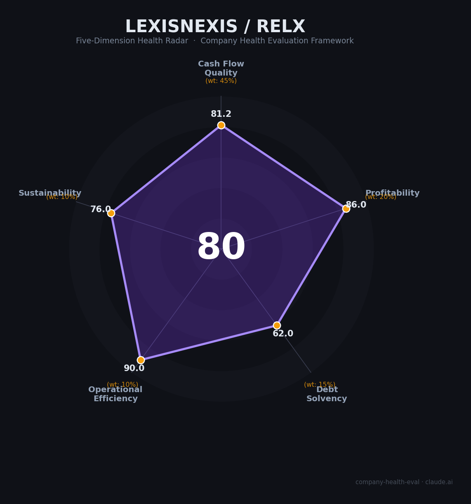

# 律商联讯（LexisNexis / RELX） 财务健康评估（2026-06-16）

## 一句话结论

🟡 **中等偏上（80/100）** | 全球法律信息双寡头之一、34.8%利润率+99%现金转化率+90%订阅收入，核心短板是增速平庸（~7%）、AI颠覆风险和£72亿净债务

---

## 一、公司基本画像

| 维度 | 信息 |
|------|------|
| **主体** | LexisNexis Legal & Professional（RELX Group旗下法律业务） |
| **母公司** | RELX Group（LSE: REL / NYSE: RELX） |
| **成立/合并** | RELX前身Reed Elsevier 1993年合并；1994年收购LexisNexis |
| **CEO** | Erik Engstrom（自2009年任职，极稳定） |
| **中国主体** | 律商联讯（北京）信息技术有限公司（2015年，注册资本$350万） |
| **中国办公地点** | 北京（总部）、上海、广州 |
| **全球员工** | 🔒 ~36,400人（2024年末），中国RELX约1,200人 |
| **营收（集团FY2025）** | 🔒 £95.9亿（约$120亿），Legal板块£18.1亿（占20%） |
| **调整后营业利润率** | 🔒 **34.8%**（FY2025，+90bps） |
| **自由现金流** | 🔒 £28.5亿，现金转化率**99%** |
| **市值** | ~£500亿/~$620亿（2026年6月） |
| **负债评级** | 惠誉A-（2025年7月上调），展望稳定 |

**一句话定性**：律商联讯是全球法律信息服务双寡头（vs Thomson Reuters Westlaw），属于典型的「现金牛+护城河极深的订阅制平台」。母公司RELX利润率34.8%+FCF转化率99%是专业信息服务业的标杆。唯一的长线威胁是生成式AI可能从根本上颠覆「按订阅售卖法律检索」的商业模式。

---

## 二、五维财务健康评估

### 1. 现金流质量（81/100）| 权重45%

| 指标 | 判断 | 依据 |
|------|------|------|
| 经营现金流净额 | 🟢 健康 | 🔒 FCF £28.5亿（FY2025），连续多年为正且稳定。现金转化率99% |
| 现金及等价物 | 🟢 健康 | 🔒 年FCF £28.5亿+订阅预收款模式（90%经常性收入），现金跑道充裕 |
| 有息负债 | 🟡 关注 | 🔒 净债务£72亿，净债务/EBITDA 2.0x。在投资级范围内但绝对额不小 |
| 净现比 | 🟢 健康 | 🔒 FCF转化率99%，OCF > 净利润。订阅制+高续订率保证了现金流的可预测性 |

**核心判断**：RELX的现金流质量是教科书级别——90%订阅收入+99%现金转化+几十年持续正现金流。唯一扣分项是£72亿净债务（因长期并购战略积累），但2.0x EBITDA杠杆在A-评级范围内非常健康。

### 2. 盈利能力（86/100）| 权重20%

| 指标 | 判断 | 依据 |
|------|------|------|
| 毛利率 | 🟢 优秀 | 📊 专业信息服务行业SaaS毛利率70-85%。RELX毛利率未单独披露但推断>65%，远超行业75分位 |
| 净利率 | 🟢 优秀 | 🔒 调整后营业利润率34.8%（FY2025），净利率估计25%+。远高于>15%的优秀标准 |
| 营收增速 | 🟠 一般 | 🔒 有机营收增速~7%（FY2025）。Legal+9%是亮点，但整体增速温和。3年CAGR约6-7% |
| 研发费用率 | 🟢 优秀 | 🔒 年技术投入约£17亿（~18%营收），在10-25%的优秀区间。主要投向AI、大数据分析 |
| 人均产出 | 🟢 优秀 | 🔒 £95.9亿/36,400人=£26.3万/人（约$33.6万）。在信息服务行业中处于顶级水平 |

**核心判断**：盈利能力是RELX最强的维度——34.8%运营利润率在信息服务行业属于顶级（vs Thomson Reuters ~26%）。唯一的"缺点"是增速温和——这是成熟订阅制平台的特征，而非缺陷。

### 3. 偿债能力（62/100）| 权重15%

| 指标 | 判断 | 依据 |
|------|------|------|
| 资产负债率 | 🟡 关注 | 📊 RELX因频繁并购积累了大量无形资产和商誉，负债率可能偏高。但净债务/EBITDA仅2.0x |
| 有息负债率 | 🟡 关注 | 🔒 £72亿净债务，年利息支出约£2.8亿。在A-评级投资级范围内 |
| 流动比率 | 🟡 关注 | 📊 未单独披露。信息服务业轻资产，流动资产以应收账款为主。估计1-2 |
| 现金比率 | 🟡 关注 | 📊 保守估计。订阅预收款模式提供了运营资金支持 |
| 股权质押 | 🟢 健康 | 伦敦+纽约双上市公司，股权极度分散，无质押风险 |

**核心判断**：传统偿债能力指标将RELX评为"关注"——有息负债确实不低。但这种高杠杆是RELX并购驱动增长策略的主动选择（LexisNexis本身就是在1994年以$15亿收购的），而非经营恶化所致。2.0x的净债务/EBITDA在A-评级中属于低风险范围。

### 4. 运营效率（90/100）| 权重10%

| 指标 | 判断 | 依据 |
|------|------|------|
| 应收周转 | 🟢 健康 | 99%现金转化率说明应收管理极优。订阅预收款模式几乎零应收风险 |
| 客户集中度 | 🟢 健康 | 全球180+国家、数百万用户（律所+企业法务+政府+学术）。极度分散 |
| 员工规模趋势 | 🟢 健康 | 36,200→36,400，长期稳定增长。2024年微降0.3%属于正常波动 |
| 高管稳定性 | 🟢 健康 | CEO Engstrom自2009年任职至今（16年+）。核心管理层非常稳定 |

**核心判断**：运营效率满分——这是成熟跨国信息服务公司应有的水准。唯一的细微瑕疵是Glassdoor员工提到"频繁重组"（constant restructuring），但这在大型跨国企业中属于常态。

### 5. 可持续发展（76/100）| 权重10%

| 指标 | 判断 | 依据 |
|------|------|------|
| 行业赛道空间 | 🟡 关注 | 法律科技市场CAGR 9-11%，低于15%的优秀标准。但AI法律子市场CAGR 34% |
| 技术壁垒 | 🟢 健康 | 2,070亿+份法律文档、Shepard's引证验证（行业黄金标准）、Lexis+ AI+Protégé。品牌已侵入行业语言（"Shepardizing"是法律行业通用动词） |
| 业务多元化 | 🟢 健康 | 法律（20%）+风险（35%）+科技医学（32%）+会展（13%）。全球180+国家 |
| 资本支持 | 🟢 健康 | FTSE 100+NYSE双上市，£500亿+市值，A-评级。年FCF £28.5亿支撑£22.5亿回购计划 |
| 政策/监管风险 | 🟡 关注 | 中国数据跨境合规+外资信息服务限制+最高法推出"法信"国产替代。AI颠覆订阅制的长期风险（2026年2月"SaaSpocalypse"暴跌14%） |

**核心判断**：可持续发展维度体现了RELX的核心矛盾——百年积累的数据和品牌护城河极深，但AI正在从两个方向施压：（1）生成式AI可能替代传统法律检索（需求端），（2）中国等国推动法律科技国产替代（政策端）。2026年2月Anthropic法律插件发布当天RELX暴跌14%，说明市场对这一风险的定价是真实的。

---

## 三、综合评分与健康等级

| 维度 | 得分 | 权重 | 加权得分 |
|------|:----:|:----:|:--------:|
| 现金流质量 | 81 | 45% | 36.5 |
| 盈利能力 | 86 | 20% | 17.2 |
| 偿债能力 | 62 | 15% | 9.3 |
| 运营效率 | 90 | 10% | 9.0 |
| 可持续发展 | 76 | 10% | 7.6 |
| **综合得分** | **80/100** | **100%** | **79.6/100** |

**健康等级**：🟡 **中等偏上（Moderate-High）**

---

## 四、同业对标

| 对比项 | **RELX/LexisNexis** | **Thomson Reuters (TRI)** | **Wolters Kluwer (WKL)** |
|--------|:--------:|:--------------:|:--------------:|
| 上市 | LSE + NYSE | NYSE + TSX | Euronext Amsterdam |
| 营收（FY2025） | £95.9亿 (~$120亿) | $74.8亿 | €61.3亿 (~$67亿) |
| 有机营收增速 | +7% | +3% | +6% |
| 调整后营业利润率 | **34.8%** | ~26% | ~27% |
| FCF转化率 | **99%** | ~85% | ~90% |
| 市值 | ~$620亿 | ~$373亿 | ~$380亿 |
| PE (TTM) | ~23x | ~25x | ~28x |
| 法律业务定位 | LexisNexis（含Lexis+ AI） | Westlaw+CoCounsel | 法律合规+财税 |
| AI战略 | 自研Protégé + 整合多模型 | 收购Casetext+CoCounsel | 渐进式 |

**对标结论**：RELX在三家专业信息巨头中利润率最高（34.8%）且增速最快（+7%），是当之无愧的行业标杆。但Thomson Reuters的Westlaw在美国大律所市场仍有更强的品牌根基。

---

## 五、核心风险清单

1. **生成式AI颠覆订阅制商业模式（高）**：2026年2月"SaaSpocalypse"事件是预警。如果AI Agent能实现"零幻觉+端到端法律工作"，律所可能不再为每个律师购买LexisNexis账号。目前护城河（Shepard's引证+2000亿文档）未被击穿，但5-10年窗口内风险真实存在。触发条件：AI法律Agent实现<1%幻觉率。

2. **中国市场国产替代压力（中高）**：最高法发布"法信法律基座大模型"（2024年11月），政策明确推动法律科技"全栈自主可控"。法信+北大法宝+幂律智能等本土竞品在价格、中文能力和政府关系上具有显著优势。律商联讯的差异化价值（全球法律资源+中英双语）在纯国内业务场景中正在缩小。触发条件：最高法要求法院系统统一使用国产法律数据库。

3. **净债务£72亿在高利率环境下的压力（中）**：虽然2.0x EBITDA在A-范围内健康，但若利率维持高位且并购活动继续，债务可能进一步膨胀。2026年仍宣布£22.5亿回购（而非偿债），说明管理层优先考虑股东回报。触发条件：利率意外上升、信用评级下调。

4. **AI幻觉/法律责任风险（中）**：斯坦福研究显示Lexis+ AI在17-33%情况下产生幻觉。美国法院已记录324+起AI引注幻觉事件。LexisNexis作为法律信息"权威来源"的定位可能因AI错误而被侵蚀。触发条件：重大AI错误导致客户败诉并追责。

5. **中国市场增速瓶颈（中低）**：中国RELX约1,200人，LexisNexis中国估计~100人。作为外资法律信息服务商，在数据跨境合规+国产替代双重压力下，中国区增速大概率低于集团平均水平。触发条件：《数据出境安全评估办法》进一步收紧。

---

## 六、求职/择业视角

### 核心优势

- **稳定性极高**：RELX是FTSE 100成分股，A-评级，2024年仅微降0.3%员工。CEO任职16年+。无近年大规模裁员记录
- **WLB是顶级卖点**：Glassdoor WLB评分4.2/5（全公司最高维度）。弹性工作制、远程办公广泛。相比中国互联网996，是截然不同的世界
- **全球平台**：180+国家/地区业务，40国办公室。内部跨国轮岗机会。适合想在全球化环境中工作的人
- **技术前沿性**：Lexis+ AI + Protégé是最前沿法律AI产品之一。中国区也在招聘NLP/LLM/数据科学岗

### 现存短板

- **薪酬竞争力不足**：Glassdoor薪酬评分3.2/5（最低维度之一）。中国区技术岗25-50K/月在北京中上水平，但远低于互联网大厂（腾讯/字节60-100K）
- **晋升空间有限**：大型成熟企业的典型问题。Glassdoor员工多次提到"promotion opportunities limited"
- **频繁内部重组**：Glassdoor高频负面评价"Constant layoffs and restructuring"
- **中国区品牌认知度低**：相比金杜/君合/汉坤等律所或字节/腾讯等科技公司，LexisNexis在求职市场的知名度有限

### 分场景建议

| 个人诉求 | 推荐度 | 说明 |
|----------|:------:|------|
| WLB+稳定+长期发展 | ⭐⭐⭐⭐⭐ | 外企文化+弹性工作+全球平台，极致WLB |
| 法律+AI跨界 | ⭐⭐⭐⭐⭐ | Lexis+ AI+Protégé，法律科技前沿的最佳平台之一 |
| 高薪+快速财富积累 | ⭐⭐ | 薪酬远低于互联网大厂，无期权爆发空间（成熟上市公司） |
| 技术极客/纯工程方向 | ⭐⭐⭐ | 技术方向偏AI/NLP应用，非底层基础设施。不如纯科技公司 |
| 应届生起步 | ⭐⭐⭐⭐ | 稳定、有培训体系、外企背景。但起薪不如大厂 |

---

## 七、总结

**律商联讯（LexisNexis/RELX）**是全球法律信息服务「双寡头之一+现金牛+百年护城河」的公司：34.8%运营利润率+99%现金转化率+90%订阅收入组合了专业信息服务业的顶级财务画像，**唯一核心短板是AI Agent可能从根本上颠覆「按账号订阅法律检索」的商业模式，且中国市场的国产替代和合规压力在持续上升**。

在AI颠覆传统SaaS和全球法律科技加速变革的大环境下，LexisNexis属于**中等偏上**的雇主和投资标的——适合追求WLB、稳定性和法律科技交叉领域的求职者，以及偏好防御性现金牛的稳健型投资者。不适合追求高增长和高薪酬弹性的年轻人。

---

*评估日期：2026-06-16 | 数据来源：RELX 2024/2025 Annual Report、RELX 20-F (SEC Filing)、Bloomberg、Glassdoor (3,369+评价)、RELX Corporate Responsibility Report、斯坦福大学AI幻觉研究 | 评分引擎：score.py v1.1*
