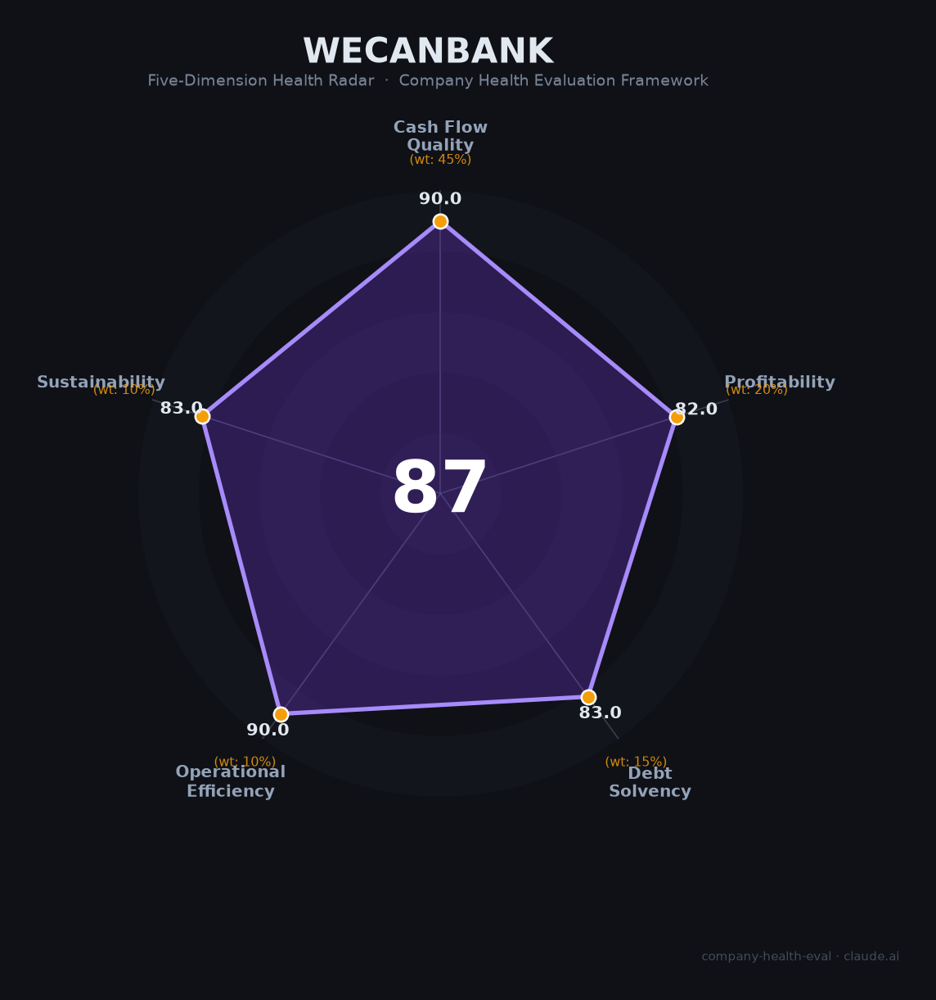

# 微众银行（深圳前海微众银行）财务健康评估（2026-08-13）

## 一句话结论

🟢 **优秀（87/100）** | 中国首家/最大民营互联网银行——总资产7663亿+营收362亿+净利110亿+ROE高+不良率约1%，微粒贷/微业贷零售科技标杆

---

## 一、公司基本画像

| 项目 | 内容 |
|------|------|
| 主体 | 🔒 深圳前海微众银行股份有限公司，未上市（腾讯等成立的中国首家民营互联网银行） |
| 成立 | 🔒 2014年，腾讯发起设立 |
| 规模 | 🔒 总资产7,663亿；员工约6,000人 |
| 主营 | 互联网银行：微粒贷（个人）、微业贷（小微）、财富管理 |
| 财务 | 🔒 2025营收362.8亿（-4.8%）；净利110.1亿（+1%）；净利率约30%、ROE高、不良率约1% |

> 一句话定性：微众银行是中国互联网银行的标杆——科技驱动的轻资产模式（微粒贷/微业贷），净利率高达30%、不良率低（1%）、ROE高，总资产近万亿。作为雇主的吸引力在"金融+科技+年轻高薪平台"，是国内最优质金融科技雇主之一。

## 二、五维财务健康评估

### 1. 现金流质量（90/100）| 权重45%
银行负债端（存款）稳定+净利110亿+资本充足，现金流极强。

### 2. 盈利能力（82/100）
净利110亿、净利率约30%（银行高净利率）、ROE高、ROED强、人均创利极高；营收-4.8%（规模基数/息差）但净利稳增。

### 3. 偿债能力（83/100）
资本充足率、不良率约1%（优质）、拨备充足，零售资产质量好（互联网风控）。

### 4. 运营效率（90/100）
AI+大数据风控驱动 全线上，人均产出极高、运营极其高效。

### 5. 可持续发展（83/100）
互联网银行+普惠金融+科技金融，长期增长，政策/监管（互联网贷款/利率）是关注点。

## 三、综合评分

| 维度 | 得分 | 权重 | 加权 |
|------|:----:|:----:|:----:|
| 现金流质量 | 90.0 | 45% | 40.5 |
| 盈利能力 | 82.0 | 20% | 16.4 |
| 偿债能力 | 83.0 | 15% | 12.4 |
| 运营效率 | 90.0 | 10% | 9.0 |
| 可持续发展 | 83.0 | 10% | 8.3 |
| **综合** | **87** | 100% | 86.7 |

**评级：🟢 优秀** — 互联网银行+科技平台，财务极健康。

## 四、核心风险
1. 互联网贷款/监管政策。
2. 个人贷款资产（小微）风险。
3. 息差/规模基数。

## 五、求职/择业视角
- 优势：金融+科技标杆、薪酬竞争力强（金融科技）、年轻化、成长快（微粒贷/微业贷）+AI风控。
- 短板：未上市（股权/期权受限）、互联网强度高。

**结论**：适合追求金融科技/零售银行/风控/数据方向的求职者，属深圳/国内顶级金融科技雇主。

---

*评估方法：商泰汽车（iAUTO）五维健康度框架 · 数据截至2026年8月 · 来源微众银行公开披露/调研*