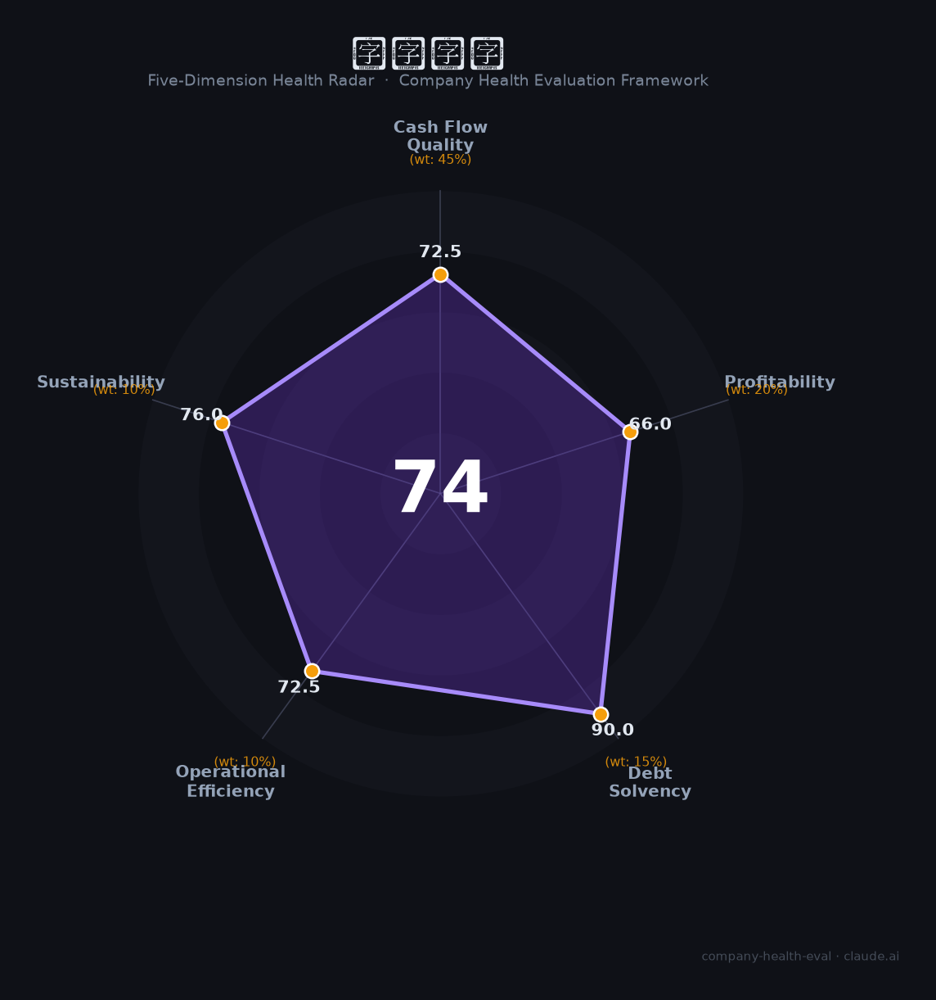

# 微芯生物（688321.SH）财务健康评估（2026-08-14）

## 一句话结论

🟡 **74/100，中等偏上** | 创新药企，平台优、低债务，但盈利薄

---

## 一、公司基本画像

| 项目 | 内容 |
|------|------|
| 主体 | 微芯生物，创新药企 |
| 主营 | 抗肿瘤/代谢类创新药(西达本胺等) |
| 财务 | 2025营收~8亿，盈亏平衡附近 |

> 一句话定性：创新药企，研发强、规模小、低债务

---

## 二、五维财务健康评估

### 1. 现金流质量（72/100）| 权重45%

现金流转好。

### 2. 盈利能力（66/100）| 权重20%

盈利薄，处于盈亏平衡附近。

### 3. 偿债能力（90/100）| 权重15%

低债务、融资能力强。

### 4. 运营效率（72/100）| 权重10%

研发转化效率待提升。

### 5. 可持续发展（76/100）| 权重10%

创新药管线丰富，商业化推进。

---

## 三、综合评分

| 维度 | 得分 | 权重 | 加权 |
|------|:----:|:----:|:----:|
| 现金流质量 | 72 | 45% | 32.6 |
| 盈利能力 | 66 | 20% | 13.2 |
| 偿债能力 | 90 | 15% | 13.5 |
| 运营效率 | 72 | 10% | 7.2 |
| 可持续发展 | 76 | 10% | 7.6 |
| **综合得分** | **74/100** | 100% | 74.2 |

**健康等级：中等偏上** — 整体稳健，局部有待改善

> 创新药企：偿债以在手现金与融资能力评估

---

## 四、核心风险清单

1. **研发投入大**
2. **创新药商业化不确定**
3. **政策/集采**

## 五、求职/择业视角

### 核心优势
- 创新药平台、低债务、管线强
### 现有短板
- 规模小、盈利承压、融资依赖

**结论**：微芯生物创新药企，技术平台强、低债务，但盈利尚薄，是高风险高成长标的。

---

*评估方法：商泰汽车（iAUTO）五维框架（金融机构特性） · 数据截至2026年8月 · 财务来源微芯生物2025年报*