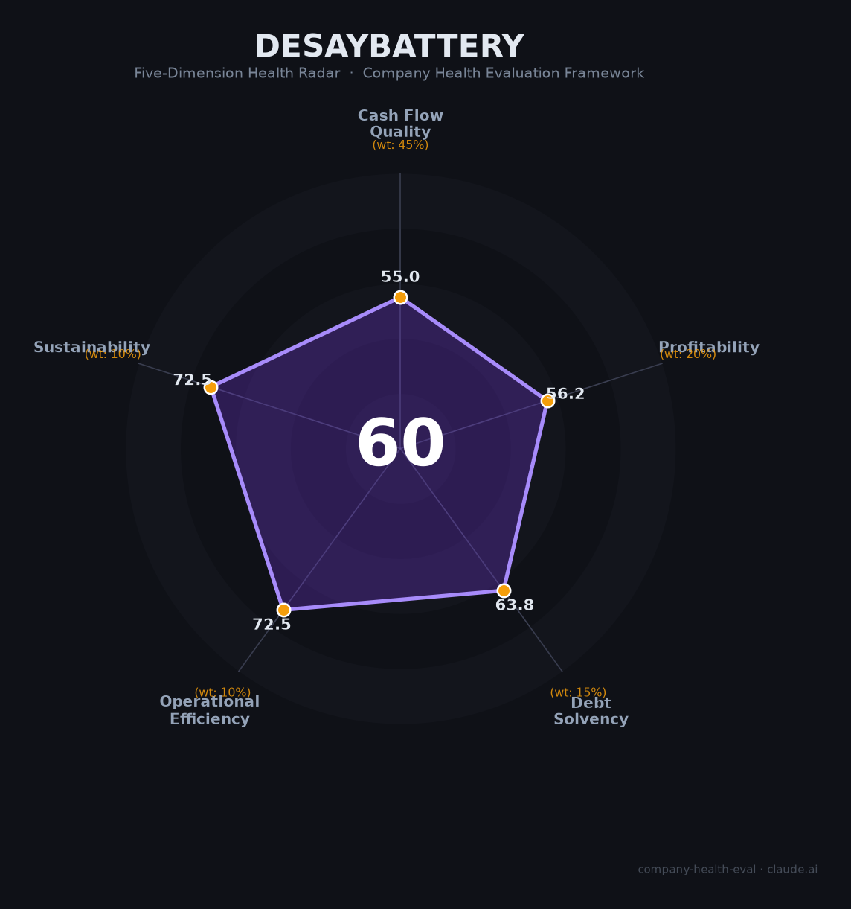

# 德赛电池（000049.SZ）财务健康评估（2026-08-13）

## 一句话结论

🟠 **60/100，中等** | 电池模组龙头，营收稳健但净利率偏薄

## 一、公司基本画像

| 项目 | 内容 |
|------|------|
| 主体 | 德赛电池，锂电池模组龙头 |
| 主营 | 手机/电动工具锂电池PACK |
| 财务 | 2025营收223.99亿(+7.38%)，归母净利2.92亿 |

> 一句话定性：锂电池PACK龙头，薄利多销、增长放缓

---

## 二、五维财务健康评估

### 1. 现金流质量（55/100）| 权重45%

经营现金流尚可，但应收与存货占用资金，现金质量一般。

### 2. 盈利能力（56/100）| 权重20%

消费电池竞争激烈，毛利率/净利率偏低。

### 3. 偿债能力（64/100）| 权重15%

负债率偏高，流动比率与现金比率一般。

### 4. 运营效率（72/100）| 权重10%

运营效率尚可，但客户集中度偏高。

### 5. 可持续发展（72/100）| 权重10%

锂电赛道稳增，公司在消费PACK领域地位稳固。

---

## 三、综合评分

| 维度 | 得分 | 权重 | 加权 |
|------|:----:|:----:|:----:|
| 现金流质量 | 55 | 45% | 24.8 |
| 盈利能力 | 56 | 20% | 11.2 |
| 偿债能力 | 64 | 15% | 9.6 |
| 运营效率 | 72 | 10% | 7.2 |
| 可持续发展 | 72 | 10% | 7.2 |
| **综合得分** | **60/100** | 100% | 60.1 |

**健康等级：中等** — 整体稳健，局部有待改善

---

## 四、核心风险清单

1. **消费电子行业需求波动**
2. **电池原材料价格波动**
3. **客户相对集中**

## 五、求职/择业视角

### 核心优势
- 锂电池PACK龙头，客户稳定、深圳产业链完善
### 现有短板
- 净利率薄、增长趋缓

**结论**：德赛电池消费PACK龙头地位稳固，业务稳健但盈利偏薄、成长性一般，适合求稳定者。

---

*评估方法：商泰汽车（iAUTO）五维框架 · 数据截至2026年8月 · 财务来源德赛电池2025年报*