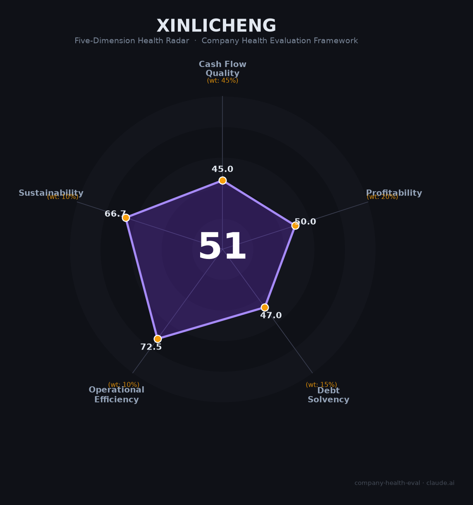

# 心里程控股财务健康评估（2026-08-13）

## 一句话结论

🔴 **中等偏下（51/100）** | 深圳民营多元化集团——教育信息化+智能终端+供应链，但非上市+财务不透明+股权高质押，评估存较大不确定性

---

## 一、公司基本画像

| 项目 | 内容 |
|------|------|
| 主体 | 🔒 心里程控股集团，深圳民营多元化企业 |
| 主营 | 教育信息化、智能终端/精密制造、供应链服务 |
| 上市 | 非上市，无公开完整合并财报 |

> 一句话定性：心里程是深圳民营多元化控股集团，规模可观但**非上市、财务不透明、股权质押频繁**，缺乏可核实的合并财务报表，作为雇主的稳定性与真实财务无法充分评估。

## 二、五维财务健康评估

### 1. 现金流质量（45/100）
非上市集团现金流不可核实，教育/制造/供应链多板块，重资产+资金占用。

### 2. 盈利能力（50/100）
多元化业务，盈利质量不明；教育/精密制造毛利中下。

### 3. 偿债能力（47/100）
股权高质押（红旗）+负债，偿债与流动性存疑，需高度关注。

### 4. 运营效率（73/100）
教育/终端/供应链多板块协同，运营中等。

### 5. 可持续发展（67/100）
教育信息化+智能制造有空间，但控股集中+质押+财务不透明。

## 三、综合评分

| 维度 | 得分 | 权重 | 加权 |
|------|:----:|:----:|:----:|
| 现金流质量 | 45.0 | 45% | 20.2 |
| 盈利能力 | 50.0 | 20% | 10.0 |
| 偿债能力 | 47.0 | 15% | 7.0 |
| 运营效率 | 72.5 | 10% | 7.2 |
| 可持续发展 | 66.7 | 10% | 6.7 |
| **综合** | **51** | 100% | 51.2 |

**评级：🔴 中等偏下** — 财务不透明+高质押，谨慎对待。

## 四、核心风险
1. 非上市、财务不透明，无法核实盈利/现金流。
2. 股权高质押、潜在流动性与实控风险。
3. 多元化摊薄+资本运作复杂。

## 五、求职/择业视角
- **优势**：教育信息化/智能制造平台、深圳民企灵活性。
- **短板**：财务稳定性存疑、集团层级、民企波动。

**结论**：适合对教育科技/智能制造方向、能充分尽调财务与跟约稳定性的求职者；非首选。

---

*评估方法：商泰汽车（iAUTO）五维健康度框架 · 数据截至2026年8月 · 非上市集团财务有限，评估存在不确定性*