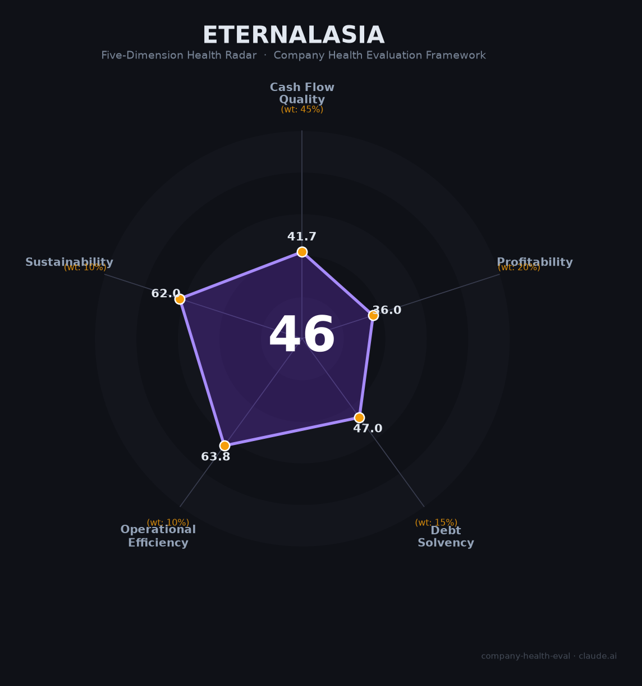

# 怡亚通（002183.SZ）财务健康评估（2026-08-13）

## 一句话结论

🔴 **中等偏下（46/100）** | 中国供应链龙头——营收681.9亿，但归母净利-3.2亿转亏+负债率约80%+财务费用吞噬利润，高杠杆亏损模式承压

---

## 一、公司基本画像

| 项目 | 内容 |
|------|------|
| 主体 | 🔒 深圳市怡亚通供应链股份有限公司，A股：002183.SZ；中国供应链服务龙头企业 |
| 成立 | 🔒 1997年深圳创立 |
| 规模 | 🔒 员工约2万；全国供应链服务网络 |
| 主营 | 供应链分销服务（快消/家电/科技等多行业采购分销）|
| 财务 | 🔒 2025营收681.9亿（-12.1%）；归母净利-3.2亿（-401%转亏）；扣非亏损 |
| 盈利 | 🔒 毛利率约3%、净利率-0.5%；负债率约80%、财务费用高 |

> 一句话定性：怡亚通是"供应链分销"龙头，营收规模大但毛利极薄（3%）、2025年由盈转亏（-3.2亿）、资产负债率高达80%，财务费用吞噬利润。本质是"高杠杆+低毛利"供应链分销模式，盈利与偿债双承压。

## 二、五维财务健康评估

### 1. 现金流质量（42/100）| 权重45%
供应链垫资+存货占用资金，净利亏损、现金流紧张，现金流预警。

### 2. 盈利能力（36/100）
毛利率3%、净利率-0.5%、归母净利-3.2亿转亏（-401%），财务费用高企吞噬毛利，盈利危险。

### 3. 偿债能力（47/100）
资产负债率约80%、高杠杆+垫资，有息负债大+流动性压力，偿债危险（靠融资周转）。

### 4. 运营效率（64/100）
供应链网络/客户分散，运营成熟但重资产资金密集、应收高。

### 5. 可持续发展（62/100）
供应链赛道稳定但利润率薄+现金流压力，多元化有限，政策/经济波动影响。

## 三、综合评分

| 维度 | 得分 | 权重 | 加权 |
|------|:----:|:----:|:----:|
| 现金流质量 | 41.7 | 45% | 18.8 |
| 盈利能力 | 36.0 | 20% | 7.2 |
| 偿债能力 | 47.0 | 15% | 7.0 |
| 运营效率 | 63.8 | 10% | 6.4 |
| 可持续发展 | 62.0 | 10% | 6.2 |
| **综合** | **46** | 100% | 45.6 |

**评级：🔴 中等偏下** — 高杠杆+亏损，谨慎对待。

## 四、核心风险
1. 归母净利-3.2亿转亏、扣非亏损。
2. 负债率80%、财务费用吞噬利润。
3. 供应链资金链/垫资风险。

## 五、求职/择业视角
- **优势**：供应链龙头、全国网络、快消/分销资源。
- **短板**：亏损+高杠杆、薪酬弹性弱、资金压力大。

**结论**：适合对供应链运营方向有兴趣、能接受行业周期与薄利的求职者；财务稳定性目前偏弱。

---

*评估方法：商泰汽车（iAUTO）五维健康度框架 · 数据截至2026年8月 · 来源怡亚通2025年报*