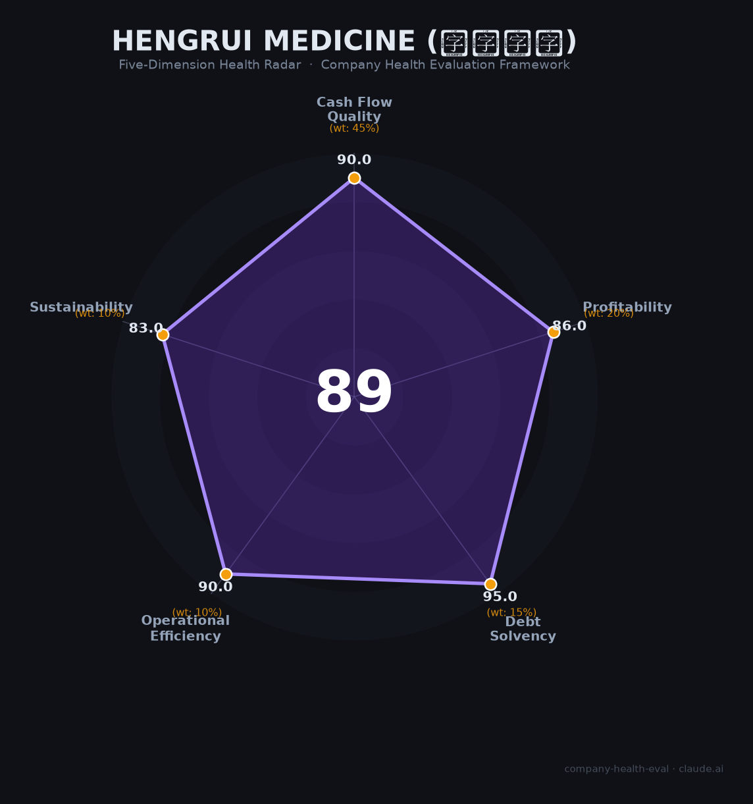

# 恒瑞医药（Hengrui Medicine, 600276.SH）财务健康评估（2026-06-12）

## 一句话结论

🟢 **优秀（89.2/100）** | 零有息负债 · 410亿现金 · 77亿净利润 · 24款创新药——中国制药「绝对龙头」

---

## 一、公司基本画像

| 项目 | 详情 |
|------|------|
| 主体 | 🔒 江苏恒瑞医药股份有限公司，A股：600276.SH（2000年上市），H股：01276.HK（2025年上市） |
| 成立 | 1970年连云港制药厂→1997年改制股份公司，总部连云港+上海双核 |
| 股权 | 🔒 创始人孙飘扬控制约21.34%（恒瑞集团），自上市以来从未减持 |
| 规模 | 🔒 员工20,602人（2025年末），研发5,684人(27.6%)，销售8,953人 |
| 主营 | 创新药+仿制药，覆盖肿瘤、麻醉、造影剂、自免、代谢等多领域 |
| 管线 | 24款1类创新药获批（中国最多），163项自研管线（全球第2，仅次于辉瑞） |
| 国际化 | 2025年5月H股上市募资97亿港元；BD许可收入33.92亿（+25.6%） |
| FDA | 卡瑞利珠单抗"双艾"组合BLA审评中，PDUFA 2026年7月23日 |

> 孙飘扬1982年加入前身连云港制药厂，1990年以技术员身份接手濒临倒闭的药厂，用30年打造中国最大制药企业。2021年短暂退休后重新出山，2025年引入前AZ中国区总经理冯佶任总裁推进国际化。

**一句话定性**：中国制药「绝对龙头」——规模第1、利润第1、创新药最多(24款)、零有息负债、410亿现金——唯一短板是国际化（0款创新药获FDA批准，海外收入仅15%）。

---

## 二、五维财务健康评估

### 1. 现金流质量（90.0/100）| 权重45%

| 指标 | 🔒 公开数据 | 评估 |
|------|-----------|------|
| 经营现金流净额 | 2021-2025连续5年为正，2025年达112.35亿（+51.4%） | ✅ 健康：持续高增长 |
| 现金及等价物 | 2025年末409.55亿（H股IPO到账97亿港元） | ✅ 健康：覆盖约20个月运营 |
| 有息负债 | **零**（2023年起无任何银行借款/债券） | ✅ 健康：零有息负债 |
| 净现比 | OCF 112.35亿 / NI 77.11亿 = 1.46 | ✅ 健康：利润含金量极高 |

**小结**：现金流维度接近满分。410亿现金+零有息负债+112亿经营现金流的组合，在A股医药板块中是顶级配置。H股IPO进一步充实了资金储备，为国际化战略提供了充足弹药。

> 🔒 数据来源：恒瑞医药2025年年报（2026年3月25日披露）；上交所600276公告

### 2. 盈利能力（86.0/100）| 权重20%

| 指标 | 🔒 公开数据 | 评估 |
|------|-----------|------|
| 毛利率 | 86.1%（近5年稳定在86%附近） | ✅ 优秀：高于行业75分位（~80%） |
| 净利率 | 2025年24.4%（2020年集采低点17.5%→持续回升） | ✅ 优秀：>15% |
| 营收增速（3年CAGR） | 2022年212.75→2025年316.29亿，CAGR 14.2% | ⚠️ 良好：10-20%区间，但加速趋势明确（2024+22.6%、2025+13%） |
| 研发费用率 | 2025年总投入27.58%（费用化22.0%），资本化率20% | ⚠️ 良好：25-35%区间，研发绝对金额87.24亿仅次于百济神州 |
| 人均创收 | 2025年154.89万元（2021年~106万→连续4年提升） | ✅ 优秀：远超行业平均（~100万） |

**小结**：盈利能力在大药企中优异——86%毛利率（5年稳定）+24.4%净利率（持续改善）+人均创收155万。营收增速在集采冲击后从低点反弹（2025年316亿创历史新高），但14.2%的3年CAGR略低于部分高增长biotech。创新药占比从38%(2022)提升至58%(2025)是盈利质量改善的核心驱动力。

> 🔒 数据来源：恒瑞医药2021-2025年年报；东方财富600276财务分析

### 3. 偿债能力（95.0/100）| 权重15%

| 指标 | 🔒 公开数据 | 评估 |
|------|-----------|------|
| 资产负债率 | 2025年末11.55%（近5年6-12%波动） | ✅ 健康：远低于40% |
| 有息负债率 | 0%（2023年起零银行借款+零债券） | ✅ 健康：零有息负债 |
| 流动比率 | 8.08（2025年末） | ✅ 健康：>2（极强） |
| 现金比率 | ~5.85（409.55亿现金/流动负债~70亿） | ✅ 健康：>1（极强） |
| 股权质押 | 无质押记录，实控人从未减持 | ✅ 健康：<30% |

**加分项**：零有息负债 + 税务信用A级 → 偿债能力行业顶级

**小结**：偿债能力维度接近满分。A股极少数同时满足"零银行借款+410亿现金+资产负债率11.55%"的上市公司。这种资产负债表结构在中国医药行业中独树一帜。

> 🔒 数据来源：恒瑞医药2025年年报资产负债表

### 4. 运营效率（90.0/100）| 权重10%

| 指标 | 🔒 公开数据 | 评估 |
|------|-----------|------|
| 应收周转天数 | 约58天（2025Q3），创新药占比提升后显著改善 | ✅ 健康：低于行业平均（60-90天） |
| 客户集中度 | 覆盖25,000+医院+200,000+药店+多BD合作方 | ✅ 健康：极度分散 |
| 员工规模趋势 | 2023年19,611人触底→2024年20,238→2025年20,602人，恢复增长 | ✅ 健康：企稳回升 |
| 高管稳定性 | 孙飘扬25年+，核心管理团队稳定，2025年引入冯佶（前AZ中国总经理）为增量 | ✅ 健康：核心稳定+国际化升级 |

**小结**：运营效率维度表现优秀。应收账款随创新药占比提升持续改善（从89天降至58天），客户极度分散（单个客户<1%），销售团队已从集采冲击中企稳（2025年首次同比增长）。2026年3月"省区裁撤"（三级压扁为两级、2,145个岗位取消）是主动组织优化而非被动裁员。

> 🔒 数据来源：恒瑞医药2025年年报；理杏仁员工数据；财报帮应收账款数据

### 5. 可持续发展（83.0/100）| 权重10%

| 指标 | 评估 | 判断依据 |
|------|------|---------|
| 行业赛道空间 | ✅ 健康 | 中国创新药市场2025-2030 CAGR 27%+，恒瑞创新药占比从38%→58%→目标60%+ |
| 技术壁垒 | ✅ 健康 | 24款1类创新药（中国最多），163项自研管线（全球第2），87亿年研发投入 |
| 客户/业务多元化 | ✅ 健康 | 肿瘤+非肿瘤（麻醉/自免/代谢/造影），国内+BD出海双轮驱动，GLP-1/Kailera纳斯达克冲刺 |
| 融资/资本支持 | ✅ 健康 | A+H双上市，410亿现金，零有息负债，12笔BD交易累计超270亿美元 |
| 政策/监管风险 | ⚠️ 关注 | 集采对仿制药余波未消（七氟烷/碘佛醇仍存国采风险）；FDA两次CRL+地缘政治不确定性 |

**小结**：可持续发展是恒瑞唯一未达90分的维度。核心扣分点是政策/监管风险——FDA国际化之路仍面临不确定性（2026年7月23日PDUFA是关键节点）。但国内创新药政策持续友好（2025年医保谈判恒瑞成最大赢家，14款创新药已入医保），整体风险可控。

---

## 三、综合评分与健康等级

| 维度 | 得分 | 权重 | 加权 |
|------|:----:|:----:|:----:|
| 现金流质量 | 90.0 | 45% | 40.5 |
| 盈利能力 | 86.0 | 20% | 17.2 |
| 偿债能力 | 95.0 | 15% | 14.2 |
| 运营效率 | 90.0 | 10% | 9.0 |
| 可持续发展 | 83.0 | 10% | 8.3 |
| **综合得分** | | **100%** | **89.2** |

**健康等级：🟢 优秀（Excellent）**

### 得分解读

- **长板**：现金流(90.0)、偿债(95.0)、运营(90.0)、盈利(86.0)——几乎无懈可击的财务基本面
- **短板**：可持续发展(83.0)——FDA国际化受阻是唯一拖累

---

## 四、同业对标

| 对比项 | **恒瑞医药 600276** | 百济神州 688235 | 翰森制药 3692.HK |
|--------|:-------------------:|:----------------:|:----------------:|
| 2025年营收 | **316.29亿**（+13%） | **382.05亿**（+40.5%） | 150.28亿（+22.6%） |
| 归母净利润 | **77.11亿**（+21.7%） | 14.61亿（首次盈利） | **55.55亿**（+27.1%） |
| 净利率 | **24.4%** | 3.8% | **37.0%** |
| 研发投入 | 87.24亿 | **155.08亿** | 33.58亿 |
| 研发强度 | 27.6% | **40.6%** | 22.3% |
| 创新药数量 | **24款获批** | 2款 | 7款+ |
| 创新药收入占比 | 58.3% | **~87%** | **82.2%** |
| 毛利率 | 86.1% | **87.3%** | — |
| 货币资金 | **409.55亿** | — | 315.49亿 |
| OCF | 112.35亿 | **137.13亿** | 67.38亿 |
| 市值（2026.6） | **~3,500亿** | ~3,960亿 | ~2,000亿+ |
| FDA创新药获批 | **0款（2次CRL）** | **2款** | 0款 |

**对标结论**：恒瑞是「利润之王+管线之王」——净利润77亿远超百济神州(14.6亿)和翰森(55.6亿)，24款创新药数量碾压同行。但百济神州在收入规模（382亿）、研发投入（155亿）和国际化（泽布替尼全球281亿）三个维度上已实现反超。翰森制药以37%净利率证明"小而精"路线同样可行。恒瑞的独特定位是「全产业链Big Pharma」——从仿制药现金牛到创新药管线到BD出海，实现了最完整的业务组合。

---

## 五、核心风险清单

1. **FDA国际化受阻（高风险）**：卡瑞利珠单抗"双艾"组合已两次收到CRL（2024年5月、2025年3月），CMC/GMP合规是核心障碍。PDUFA 2026年7月23日。若第三次仍不获批，将严重影响恒瑞创新药出海前景和市场信心。同时美国《生物安全投资法案》点名恒瑞-BMS合作（152亿美元），地缘政治风险升温。

2. **接班人不确定性（中风险）**：孙飘扬68岁连任董事长至2029年。2021年周云曙交班失败后，尚无明确内部接班人。冯佶（前AZ中国总经理）的引入是积极信号但融入效果待观察。

3. **创新药同质化竞争（中风险）**：PD-1赛道已有22款获批，卡瑞利珠单抗份额正被蚕食。ADC（SHR-A1811 HER2）面临DS-8201、科伦博泰等强力竞争。163项管线虽多，能否转化为重磅炸弹尚需验证。

4. **BD收入可持续性（中低风险）**：2025年BD许可收入33.92亿（含GSK 5亿美元首付），2025Q3"合同负债"飙升至39.71亿元引发收入确认节奏质疑。若后续BD交易放缓，利润增速可能承压。

5. **销售团队持续优化（低风险）**：2026年3月省区裁撤2,145个岗位，短期可能造成渠道摩擦，但长期有利于效率提升。销售费用率已从35.5%(2020)降至28.8%(2025)。

---

## 六、求职/择业视角

### 核心优势

- **稳定性极高**：410亿现金+零负债+年利润77亿+25年不倒的行业龙头。在中国医药行业中是罕见的"铁饭碗"——即使创新药研发失败、集采再冲击，财务安全垫足以承受。
- **品牌背书极强**：中国最大药企的履历在国内医药行业具有最高级别的认可度。跳槽至任何国内药企或MNC中国区都有极强的议价能力。
- **国际化学习机会**：A+H双上市+FDA申报实战（虽未成功但积累了全流程经验）+ BD交易（GSK/MSD/Merck KGaA等），是难得的国际化大平台。

### 现存短板

- **薪资中规中矩**：研发博士月薪~26k（年包30万+）、硕士~18k。在制药行业中属中等偏上，但低于百济神州等创新药企（百济人均薪酬94.6万）。
- **工作地点偏**：连云港总部+上海研发中心。连云港为三线城市，生活成本低但发展空间有限。
- **大公司病**：员工反馈"流程繁琐、帮派林立"、"应届生入职1-2个月被裁"、"离职需几十人签字"——典型大型传统药企的官僚化问题。
- **加班分化**：研发/职能岗双休较轻松，销售/CRC岗每晚9点下班+周末加班。

### 分场景建议

| 个人诉求 | 推荐 | 次选 | 规避 |
|----------|------|------|------|
| 稳定+深耕制药 | ✅ 适合：铁饭碗、品牌强、财务极稳 | | |
| 高薪+期权 | | ⚠️ 次选：薪酬中上但非顶尖，股权激励覆盖广但金额有限 | |
| 国际化经验 | ✅ 适合：FDA申报+全球BD交易实战 | | |
| 创业文化/WLB | | | 🚫 不适合：大公司病、流程长、地点偏 |
| 研发+学术 | ✅ 适合：87亿研发预算+163管线+顶刊发表机会 | | |

---

## 七、总结

**恒瑞医药是中国制药「绝对龙头」的公司：**

零有息负债+410亿现金+77亿净利润+86%毛利率+24款创新药，财务基本面在A股医药板块中无出其右。唯一短板是国际化——0款创新药获FDA批准（2次CRL）、海外收入仅占15%、地缘政治风险升温。

在中国创新药替代仿制药（创新药占比38%→58%）、医保政策持续友好、集采冲击高峰已过的大环境下，属于**优秀**风险等级，适合**追求稳定+品牌+国际化经验的制药行业从业者**。2026年7月23日FDA审评"双艾"组合结果，将决定恒瑞能否从「中国龙头」晋级为「全球玩家」。
