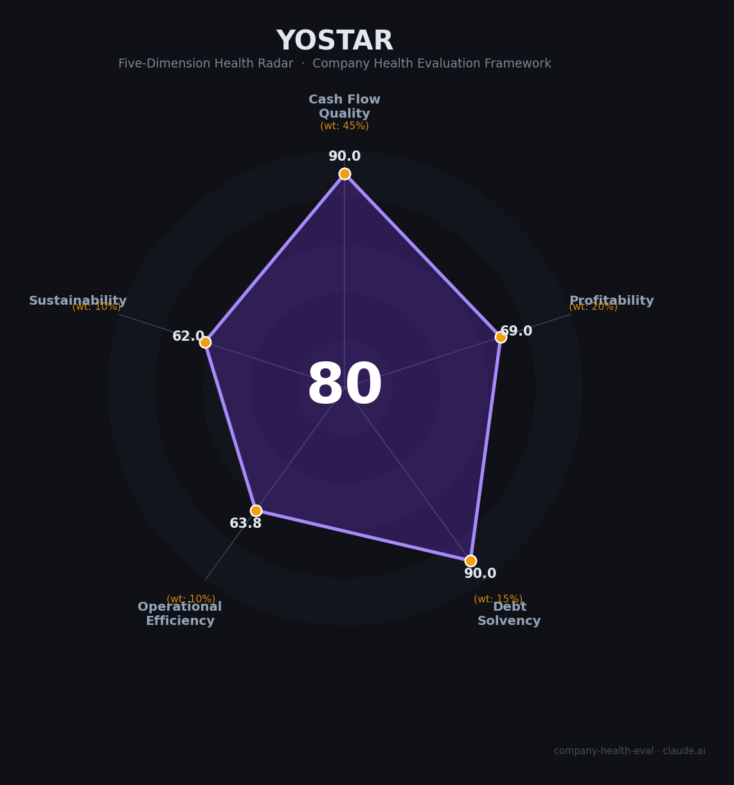

# 悠星网络 财务健康评估（2026-07-07）

## 一句话结论

🟡 **中等偏上（80/100）** | 多款长青二游+全球发行能力强，现金流大概率稳健；最大问题不是赚钱能力，而是对少数头部标题和外部合作方的依赖仍然很重

## 一、公司基本画像

| 项目 | 内容 |
|------|------|
| **主体** | 上海悠星网络科技有限公司（Yostar） |
| **成立时间** | 2014年8月14日 |
| **总部** | 上海 |
| **业务定位** | 游戏研发、发行、运营与IP衍生；近年开始强化自研能力 |
| **海外布局** | 公开资料显示在东京、香港、首尔等地均有布局；日本为核心市场之一 |
| **核心产品** | 《碧蓝航线》《雀魂麻将》《明日方舟》日/全球发行、《蔚蓝档案》日/中发行、《Heaven Burns Red》全球发行、《CookieRun: Tower of Adventures》日本发行 |
| **新动向** | 2025年推出并上线完全自研新作《星塔旅人 / Stella Sora》，这是悠星第一次明确以“自研原创”身份做全球化验证 |
| **动画业务** | 通过 Yostar Pictures 延伸到动画制作，强化“游戏 + 动画 + 音乐 + 周边”的 IP 生态 |
| **员工规模** | 公开口径较少，2019年曾有约150人的外部记载；结合多地办公室、动画业务与自研团队扩张，现阶段更接近数百人到千人级，⚠️ 仍缺统一披露 |
| **融资/资本** | 私营公司，未上市；公开财务披露有限，外部资本依赖度看起来不高，但透明度也偏低 |

**一句话定性**：悠星网络不是那种“靠融资烧钱换增长”的公司，而是典型的**高质量发行商 + 长线运营商**。它最强的资产是稳定的二游运营能力和海外发行网络，最弱的地方是财务黑箱和产品集中度。

## 二、五维健康评估

### 1. 现金流质量（90.0/100）

| 指标 | 判断 | 说明 |
|------|------|------|
| 经营现金流 | 🟢 健康 | 长线运营产品多、付费模式以游戏内消费为主，理论上现金回流快；从公开业务结构看，现金流应当长期为正 |
| 现金覆盖 | 🟢 健康 | 私营但非创业早期公司，且同时运营游戏、动画、周边与海外发行，现金跑道压力不大 |
| 有息负债 | 🟢 健康 | 未见公开高杠杆特征 |
| 净现比 | 🟢 健康 | 发行/运营型业务通常净现比优于纯重研发公司 |

**判断**：悠星最像“内容型现金牛”。它不是靠单一爆款一次性冲高，而是靠多个长线项目滚动供血。现金流质量的核心优势在于：产品线分散、回款速度快、资本开支不算重。

### 2. 盈利能力（69.0/100）

| 指标 | 判断 | 说明 |
|------|------|------|
| 毛利率 | ✅ 良好 | 发行商天然比重资产研发厂更轻，毛利通常不差 |
| 净利率 | ✅ 良好 | 成熟 live service 业务有利润，但也要承担买量、本地化、联运分成和自研投入 |
| 营收增速 | ⚠️ 一般 | 公开财务不可得，且成熟标题贡献稳定，爆发式增速不容易长期维持 |
| 研发费用率 | ✅ 良好 | 近年开始补自研短板，研发投入应高于纯发行阶段 |
| 人均产出 | ✅ 良好 | 发行/运营型公司通常人效优于重研发工作室，但悠星的透明度不足，无法量化到精确区间 |

**判断**：盈利能力是悠星的“强但不顶”区域。相比米哈游那种自研爆款驱动的超高利润率，悠星更像“稳定抽成 + 运营复利”的模型，优点是波动更小，缺点是天花板没那么高。

### 3. 偿债能力（90.0/100）

| 指标 | 判断 | 说明 |
|------|------|------|
| 资产负债率 | 🟢 健康 | 未见明显高杠杆信号 |
| 有息负债率 | 🟢 健康 | 无公开借贷压力迹象 |
| 流动比率 | 🟢 健康 | 数字内容业务的流动资产通常较好看 |
| 现金比率 | 🟢 健康 | 运营型公司现金回收较快，短债压力通常较低 |
| 股权质押 | 🟢 健康 | 未见公开股权质押风险 |

**判断**：偿债风险整体很低。对求职者来说，这意味着公司大概率不会因为现金流断裂而突然“塌方”；但也意味着外部财务透明度依旧不够。

### 4. 运营效率（63.8/100）

| 指标 | 判断 | 说明 |
|------|------|------|
| 应收周转 | 🟢 健康 | 平台型结算和数字产品回款周期通常较短 |
| 客户集中度 | ⚠️ 关注 | 对少数头部游戏标题依赖度高，标题集中度高于理想状态 |
| 员工规模趋势 | ⚠️ 关注 | 自研团队和动画业务扩张带来组织复杂度提升，组织层级更难维持轻量化 |
| 高管稳定性 | ⚠️ 关注 | 管理层总体看较稳定，但跨区域、多业务线和自研转型会提高治理复杂度 |

**判断**：悠星的运营效率不差，但已不再是“纯发行小团队”的阶段。它正在从轻资产运营向“发行 + 自研 + 动画 + 周边”的复合体演进，这会抬高管理成本，也会让执行效率更依赖组织纪律。

### 5. 可持续发展（62.0/100）

| 指标 | 判断 | 说明 |
|------|------|------|
| 行业赛道空间 | ⚠️ 关注 | 二游赛道仍有长期用户基础，但整体已进入成熟竞争区 |
| 技术/运营壁垒 | ⚠️ 关注 | 发行、联运、本地化、长线运营有壁垒，但不是不可复制壁垒 |
| 业务多元化 | ⚠️ 关注 | 已覆盖多个游戏和地区，但收入仍会被少数头部标题放大或拖累 |
| 资本支持 | 🟢 健康 | 无需重融资也能运转，说明自造血能力强 |
| 政策/监管风险 | ⚠️ 关注 | 游戏版号、抽卡合规、海外本地化与内容审查都存在长期摩擦成本 |

**判断**：悠星的可持续性比多数中小游戏公司强，但还没到“护城河无解”的程度。真正值得观察的是两件事：一是《星塔旅人》能不能证明自研成功，二是未来是否能从“代理/联运高手”升级为“原创 IP 生产者”。

## 三、综合评分与健康等级

| 维度 | 得分 | 权重 | 加权得分 |
|------|------|------|----------|
| 现金流质量 | 90.0 | 45% | 40.5 |
| 盈利能力 | 69.0 | 20% | 13.8 |
| 偿债能力 | 90.0 | 15% | 13.5 |
| 运营效率 | 63.8 | 10% | 6.4 |
| 可持续发展 | 62.0 | 10% | 6.2 |
| **综合得分** | | | **80.4 / 100** |

**健康等级**：🟡 **中等偏上**

雷达图显示悠星网络是典型的“现金流稳、组织升级中、长期上限仍待验证”的公司：财务底盘不错，但真正的战略风险在于，它的核心能力更多来自运营和发行，而不是已经被市场验证过的原创爆款制造能力。

## 四、同业对标

| 对比项 | 悠星网络 | 米哈游 | 网易游戏 |
|--------|----------|--------|---------|
| 商业模式 | 发行 + 运营 + 少量自研 | 自研为主 | 研发 + 发行 + 平台化 |
| 现金流特征 | 多款长线标题供血 | 少数超级爆款供血 | 多业务线对冲 |
| 优势 | 全球发行、本地化、联运、长线运营 | 自研爆款能力极强 | 规模、资源、体系化能力 |
| 短板 | 财务黑箱、标题集中、自研原创验证不足 | 组织强度高、竞争激烈 | 组织庞大、内部层级更重 |

**对标结论**：悠星更像“二游赛道里的精英运营商”，而不是“超级自研厂”。如果你看重的是全球发行、日文/跨区域运营、长线 live ops，它很强；如果你看重的是原创技术深度、超高收入天花板和强透明财务，米哈游/网易会更有说服力。

## 五、核心风险清单

1. **少数标题依赖（中高风险）**：虽然产品不止一个，但真正能扛收入的还是少数几个长线爆款。
2. **从发行向自研的转型风险（中高风险）**：自研的第一步通常最贵，且成败不确定。《星塔旅人》会直接决定这条路值不值得继续加码。
3. **财务透明度不足（中风险）**：没有公开财报的公司，很难把“看起来很稳”与“实际很稳”完全画等号。
4. **监管与平台依赖（中风险）**：游戏版号、抽卡合规、平台分成、本地化政策都会持续影响利润率。
5. **组织复杂度上升（中风险）**：游戏、动画、周边、海外多地团队一旦并行，管理成本会比单一发行公司高得多。

## 六、求职/择业视角

### 核心优势

- **比纯创业公司稳**：多个长线标题和成熟发行体系，倒闭风险显著低于很多中小厂
- **国际化经验强**：日本市场、全球发行、本地化协同都是可迁移能力
- **业务形态多**：可以接触发行、运营、社区、活动、动画联动、IP衍生等多条线
- **自研转型窗口期**：如果《星塔旅人》成功，早期加入的人会直接吃到组织升级红利

### 现存短板

- **财务与组织不透明**：候选人很难通过公开信息判断真实利润和团队状态
- **项目波动大**：联运和自研项目的节奏差异会带来明显工作强度分化
- **晋升上限未必像顶级自研厂那么清晰**：公司更偏“运营驱动”，不是天然的技术炫技场

### 分场景建议

| 个人诉求 | 推荐 | 理由 |
|----------|------|------|
| 稳定 + 二游经验 | **悠星网络** | 长线运营和全球发行能力强，风险低于多数中小游戏厂 |
| 国际化 + 发行运营 | **悠星网络** | 日本/全球市场经验是它最强的可迁移资产 |
| 自研成长 | 观察后再决定 | 《星塔旅人》若跑通，才说明自研线真的起来了 |
| 超高收入天花板 | 米哈游 / 网易核心岗位 | 悠星更稳，但不一定是薪酬天花板最高的选择 |

## 七、总结

**悠星网络** 是一家很典型的“强运营、强发行、强长线 live ops”公司：它的上限不靠单点爆发，而靠把几款大作长期做稳、把海外市场做透、把联运和本地化做成体系。

我给它的判断是：**值得考虑，但要看岗位和项目**。如果你要的是二游发行、国际化、长线运营经验，它是好平台；如果你要的是极高薪、极强透明度、或最激进的原创技术路线，它就不是最优解。

**一句话收尾**：悠星网络是“现金流不差、组织在升级、原创能力待验证”的中上水平游戏公司，适合看重二游行业经验和全球发行能力的人。

---

*评估日期：2026-07-07 | 数据截至：2026年7月公开信息 | 评分引擎：company-health-eval v1.1*
