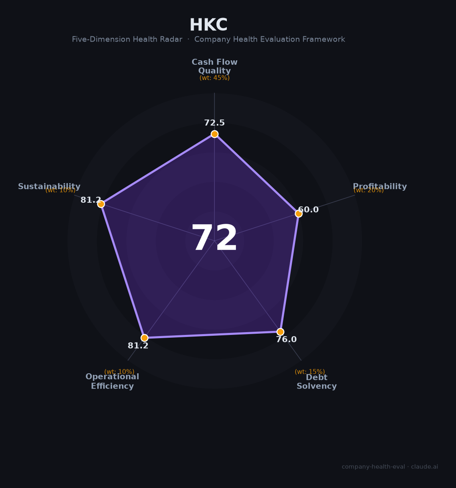

# 惠科股份（001399.SZ）财务健康评估（2026-08-13）

## 一句话结论
🟡 **中等偏上（72/100）** | 面板/显示器龙头——营收409亿（+1.5%）、净利38亿（+14.5%），面板周期但盈利改善，现金流关注

## 一、公司基本画像
| 主体 | 🔒 惠科股份（HKC），A股001399.SZ；面板/显示器厂商 |
| 主营 | LCD面板、显示器、电视面板 |
| 财务 | 2025营收408.9亿(+1.5%)；归母净利38.0亿(+14.5%)；员工约3万 |

## 二、五维财务健康评估
1. 现金流（73/100）|45%：周期波动，现金流关注但可。
2. 盈利（60/100）|20%：净利38亿+14.5%、面板盈利随周期。
3. 偿债（76/100）|15%：面板重资产、偿债可。
4. 运营（81/100）|10%：面板规模化运营、量交付稳。
5. 可持续（81/100）|10%：面板国产替代+显示技术，周期强。

## 三、综合（72，🟡 中等偏上）
面板周期波动，盈利强周期。

## 四、风险
1. 面板价格周期。
2. 重资产、竞争。
3. 需求波动。

## 五、求职
- 优势：面板龙头（HKC）、显示产业平台。
- 短板：周期性强、强度大。

**结论：适合显示/面板方向，能承受周期波动的求职者。**

---
*评估方法：商泰汽车（iAUTO）五维框架 · 来源惠科2025*