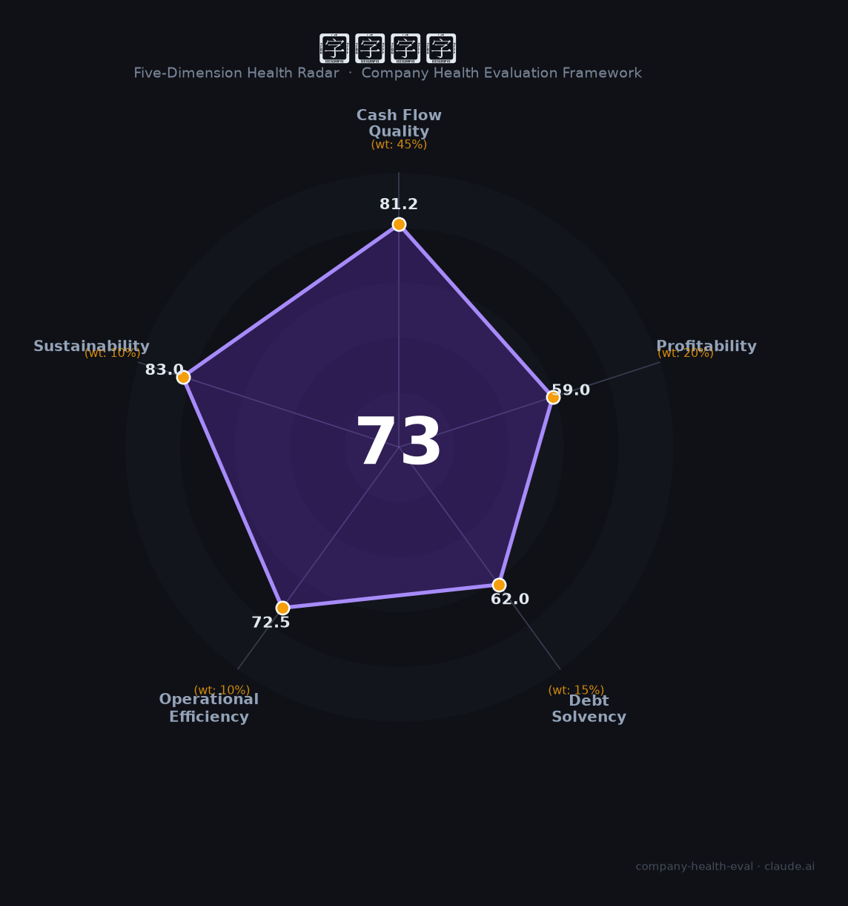

# 拓邦股份（002139.SZ）财务健康评估（2026-08-14）

## 一句话结论

🟡 **73/100，中等偏上** | 智能控制器龙头，营收稳定、现金流一般

---

## 一、公司基本画像

| 项目 | 内容 |
|------|------|
| 主体 | 拓邦股份，智能控制器龙头 |
| 主营 | 智能控制/电控 |
| 财务 | 2025营收约90亿，归母净利约9亿 |

> 一句话定性：智能控制器龙头，营收增长、现金流一般

---

## 二、五维财务健康评估

### 1. 现金流质量（81/100）| 权重45%

现金流中等。

### 2. 盈利能力（59/100）| 权重20%

盈利能力一般。

### 3. 偿债能力（62/100）| 权重15%

负债适中、偿债稳健。

### 4. 运营效率（72/100）| 权重10%

产能交付强、效率高。

### 5. 可持续发展（83/100）| 权重10%

智能控制器需求稳，多领域多元化。

---

## 三、综合评分

| 维度 | 得分 | 权重 | 加权 |
|------|:----:|:----:|:----:|
| 现金流质量 | 81 | 45% | 36.5 |
| 盈利能力 | 59 | 20% | 11.8 |
| 偿债能力 | 62 | 15% | 9.3 |
| 运营效率 | 72 | 10% | 7.2 |
| 可持续发展 | 83 | 10% | 8.3 |
| **综合得分** | **73/100** | 100% | 73.2 |

**健康等级：中等偏上** — 整体稳健，局部有待改善

---

## 四、核心风险清单

1. **客户集中**
2. **行业竞争**
3. **需求波动**

## 五、求职/择业视角

### 核心优势
- 智能控制器龙头、交付强、多元化
### 现有短板
- 现金流中等、盈利承压、客户集中

**结论**：拓邦股份智能控制器龙头，营收稳定但现金流中等，整体稳健、可作稳健选择。

---

*评估方法：商泰汽车（iAUTO）五维框架 · 数据截至2026年8月 · 财务来源拓邦股份2025年报*