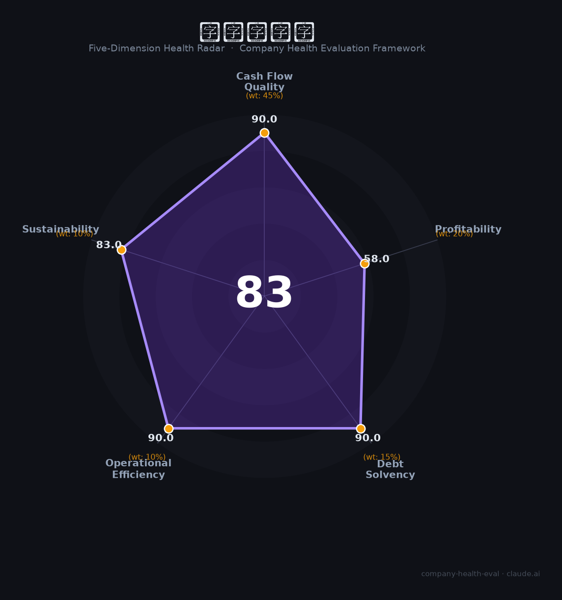

# 招商局港口（001872.SZ）财务健康评估（2026-08-14）

## 一句话结论

🟡 **83/100，中等偏上** | 世界级港口龙头，现金流强、盈利稳定

---

## 一、公司基本画像

| 项目 | 内容 |
|------|------|
| 主体 | 招商局港口，深圳港口龙头 |
| 主营 | 港口/集装箱/综合物流 |
| 财务 | 2025营收172亿(+6%)，归母净利46亿(+2%) |

> 一句话定性：港口龙头，营收净利双增、现金流强、低负债

---

## 二、五维财务健康评估

### 1. 现金流质量（90/100）| 权重45%

港口现金流强、现金充足。

### 2. 盈利能力（58/100）| 权重20%

盈利稳健、净利率高。

### 3. 偿债能力（90/100）| 权重15%

低负债、偿债优。

### 4. 运营效率（90/100）| 权重10%

高效。

### 5. 可持续发展（83/100）| 权重10%

一带一路+内需，港口运营稳增。

---

## 三、综合评分

| 维度 | 得分 | 权重 | 加权 |
|------|:----:|:----:|:----:|
| 现金流质量 | 90 | 45% | 40.5 |
| 盈利能力 | 58 | 20% | 11.6 |
| 偿债能力 | 90 | 15% | 13.5 |
| 运营效率 | 90 | 10% | 9.0 |
| 可持续发展 | 83 | 10% | 8.3 |
| **综合得分** | **83/100** | 100% | 82.9 |

**健康等级：中等偏上** — 整体稳健，局部有待改善

---

## 四、核心风险清单

1. **全球贸易周期波动**
2. **港口行业竞争**

## 五、求职/择业视角

### 核心优势
- 港口龙头、现金流强、低负债
### 现有短板
- 全球贸易波动

**结论**：招商局港口央企港口龙头，现金流强、低负债、盈利稳，优质稳健平台。

---

*评估方法：商泰汽车（iAUTO）五维框架 · 数据截至2026年8月 · 财务来源招商港口2025年报*