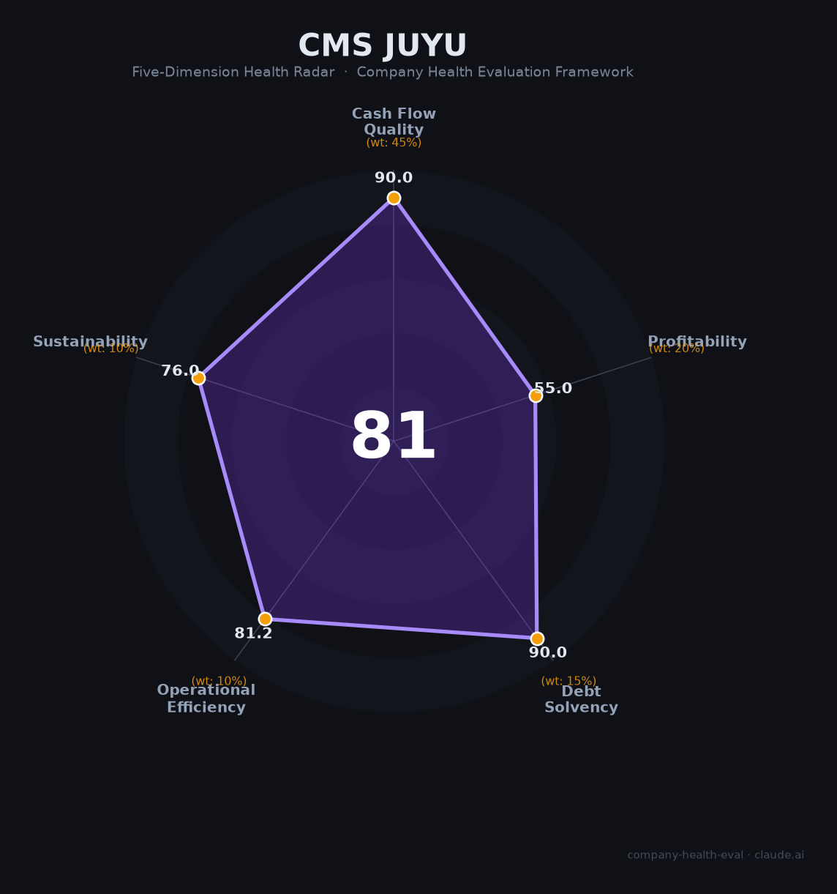

# 招商积余（001914.SZ）财务健康评估（2026-08-14）

## 一句话结论

🟡 **81/100，中等偏上** | 物业龙头，营收增长、净利短期回落、财务稳健

---

## 一、公司基本画像

| 项目 | 内容 |
|------|------|
| 主体 | 招商积余，物业管理龙头 |
| 主营 | 物业管理/资产管理/租赁 |
| 财务 | 2025营收192.73亿(+12.23%)，归母净利6.55亿(-22.12%) |

> 一句话定性：物业龙头，营收双位数增、净利受减值回落

---

## 二、五维财务健康评估

### 1. 现金流质量（90/100）| 权重45%

运营现金流健康，现金储备充足。

### 2. 盈利能力（55/100）| 权重20%

物业管理营收增长，但增值/房地产拖累净利。

### 3. 偿债能力（90/100）| 权重15%

低负债、偿债稳健。

### 4. 运营效率（81/100）| 权重10%

运营效率良好。

### 5. 可持续发展（76/100）| 权重10%

物业行业稳健，公司在管面积大、拓展积极。

---

## 三、综合评分

| 维度 | 得分 | 权重 | 加权 |
|------|:----:|:----:|:----:|
| 现金流质量 | 90 | 45% | 40.5 |
| 盈利能力 | 55 | 20% | 11.0 |
| 偿债能力 | 90 | 15% | 13.5 |
| 运营效率 | 81 | 10% | 8.1 |
| 可持续发展 | 76 | 10% | 7.6 |
| **综合得分** | **81/100** | 100% | 80.7 |

**健康等级：中等偏上** — 整体稳健，局部有待改善

---

## 四、核心风险清单

1. **坏账减值**
2. **房地产关联业务拖累**
3. **物业毛利下行**

## 五、求职/择业视角

### 核心优势
- 招商局物业龙头，平台大、稳定、央企保障
### 现有短板
- 净利短期回落、增值业务波动

**结论**：招商积余物业龙头，营收稳定增长、财务稳健，净利短期回落不改长期价值，优质平台。

---

*评估方法：商泰汽车（iAUTO）五维框架 · 数据截至2026年8月 · 财务来源招商积余2025年报*