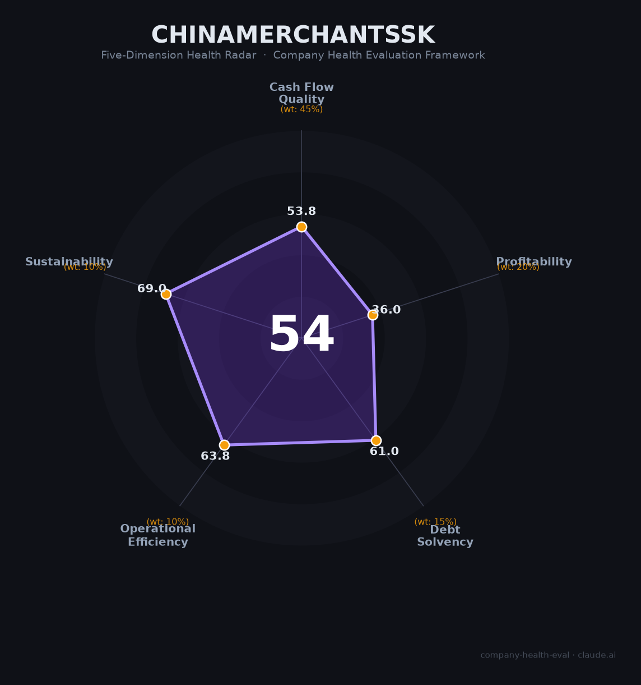

# 招商蛇口（001979.SZ）财务健康评估（2026-08-13）

## 一句话结论

🔴 **中等偏下（54/100）** | 央企招商局旗下地产平台——实现"三道红线全绿+融资成本最低+仍盈利"，但2025归母净利-74.65%、扣非仅1.69亿归零、ROE 0.73%，转型压力下的"央企困境反转"标的

---

## 一、公司基本画像

| 项目 | 内容 |
|------|------|
| 主体 | 🔒 招商局蛇口工业区控股股份有限公司（招商蛇口），注册深圳，A股：001979.SZ（2015重组上市）；央企招商局集团旗下综合地产平台 |
| 成立/背景 | 🔒 招商局集团持股约56%，国务院国资委直管央企 |
| 规模 | 🔒 总市值约633亿；员工数万人级；开发业务占营收84.55% |
| 主营 | 开发业务（住宅+商业，84.55%）+资产运营（4.64%）+物业服务（招商积余10.81%） |
| 财务 | 🔒 2025营收1,547.28亿（-13.53%）；归母净利10.24亿（-74.65%）；扣非净利1.69亿（近归零） |
| 盈利 | 🔒 五年ROE均值4.94%、2025降至0.73%；2025计提存货跌价32.69亿+信用减值11.4亿 |
| 负债 | 🔒 有息负债2,485亿；融资成本2.74%（行业最低）；三道红线全绿档；永续债清零 |

> 一句话定性：招商蛇口是"被新管理层财务清底的央企地产"——2025年集中计提存货/信用减值44亿导致扣非归零，但作为招商局系央企，仍保有行业最低融资成本（2.74%）、三道红线全绿、深圳蛇口核心资产与REITs全品类平台。是"烂苹果里相对最好的央企地产"，转型与利润修复仍待时日。

---

## 二、五维财务健康评估

### 1. 现金流质量（54/100）| 权重45%

| 指标 | 🔒 公开数据 | 评估 |
|------|-----------|------|
| 经营现金流 | 97亿（-70%但仍为正，仍在造血） | ⚠️ 关注 |
| 现金 | 央企现金相对充裕 | ✅ 健康 |
| 有息负债 | 2,485亿，利息负担约68亿/年 | 🔴 危险 |
| 净现比 | 现金/净利9.5倍（因净利润被减值压低虚高） | ⚠️ 关注 |

**小结**：经营现金流97亿虽正但骤降70%，自由现金流约-127亿（积极拿地），有息负债高达2485亿。净现比看似健康实因净利过低而失真。现金流在主营业务盈利下行的背景下承压。

> 🔒 数据来源：招商蛇口2025年报（雪球大象2025、新浪研报、公司官网）

### 2. 盈利能力（36/100）| 权重20%

| 指标 | 🔒 公开数据 | 评估 |
|------|-----------|------|
| 毛利率 | 结转毛利率持续下行（结构性下滑） | ⚠️ 一般 |
| 净利率 | 10.24亿/1547亿≈0.7% | 🔴 预警 |
| 营收增速 | -13.53%（2025） | 🔴 预警 |
| 研发 | 地产开发少 | ⚠️ 一般 |
| 人均产出 | 受营收/利润收缩影响 | ⚠️ 一般 |

**小结**：盈利能力大幅恶化——净利-74.65%、扣非仅1.69亿（归零）、五年ROE从10.83%跌至0.73%。2025年计提减值44亿是主要原因（"财务清底"），但毛利率下行是结构性趋势，转型（资产运营仅占4.64%）尚难填补开发利润缺口。

### 3. 偿债能力（61/100）| 权重15%

| 指标 | 🔒 公开数据 | 评估 |
|------|-----------|------|
| 资产负债率 | 三道红线全绿档，但绝对负债仍高 | ⚠️ 关注 |
| 有息负债率 | 2,485亿，结构性负担 | 🔴 危险 |
| 流动/短债比 | 现金短债比下滑 | ⚠️ 关注 |
| 现金 | 央企现金+融资通道顺畅 | ✅ 健康 |
| 信用/背书 | 央企2.74%融资成本，行业最低 | ✅ 健康 |

**小结**：偿债能力强——央企信用背书、三道红线全绿、融资成本行业最低（2.74%），永续债清零。相对民企/混合所有制房企，招商蛇口信用无忧；有息负债2485亿但央企可持续融资。

### 4. 运营效率（64/100）| 权重10%

| 指标 | 🔒 数据 | 评估 |
|------|-----------|------|
| 销售/开发运营 | 2025签约销售行业第四，但销售/去化承压 | ⚠️ 关注 |
| 客户分散 | 开发营收占84%，业务相对聚焦 | ⚠️ 关注 |
| 员工 | 央企稳定 | ✅ 健康 |
| 管理 | 2025年9月新管理层接棒（清底） | ⚠️ 关注 |

**小结**：运营效率中等——签约销售排行业前列但去化承压、新管理层刚接棒（经营/提质仍在磨合），央企体系稳定但市场化效率有限。

### 5. 可持续发展（69/100）| 权重10%

| 指标 | 🔒 公开数据 | 评估 |
|------|-----------|------|
| 行业赛道 | 地产下行，行业空间收窄 | ⚠️ 关注 |
| 技术/模式 | 传统开发模式 | ⚠️ 关注 |
| 多元化 | 开发+运营+物业+REITs全品类 | ✅ 健康 |
| 资本/转型 | REITs全品类平台+央企转型期权 | ✅ 健康 |
| 政策 | 地产救市/央企托底 | ⚠️ 关注 |

**小结**：可持续性靠央企+REITs转型期权支撑——国内首批REITs发行、已覆盖产业园/租赁住房/商业境内三平台+境外房托，"投融建管退"闭环成型。但地产行业整体下行、存货减值未到底（2026H1预告毛利率同比下降）。

---

## 三、综合评分与健康等级

| 维度 | 得分 | 权重 | 加权得分 |
|------|:----:|:----:|:--------:|
| 现金流质量 | 53.8 | 45% | 24.2 |
| 盈利能力 | 36.0 | 20% | 7.2 |
| 偿债能力 | 61.0 | 15% | 9.2 |
| 运营效率 | 63.8 | 10% | 6.4 |
| 可持续发展 | 69.0 | 10% | 6.9 |
| **综合得分** | **54/100** | **100%** | **53.8/100** |

**健康等级：🔴 中等偏下（Moderate-Low）** — 存在明显财务或经营短板，谨慎对待。

---

## 四、同业对标

| 对比项 | 招商蛇口 | 万科 | 保利发展 | 华润置地 |
|--------|:-------:|:---:|:-------:|:-------:|
| 2025营收 | 1,547亿 | 2,334亿 | — | — |
| 归母净利 | -10.24亿 | 股 | -885亿 | 央企盈利 | 盈利 |
| 净利润率 | 0.7% | — | — | — |
| 三道红线 | 全绿 | 承压 | 绿 | 绿 |
| 核心差异 | 央企+蛇口资产 | 民营困境 | 央企稳健 | 央企+高毛利 |

**对标结论**：同为央企地产，招商蛇口在盈利上与保利/华润差距大（华润毛利率24%），但明显好于万科（亏损）。是"烂苹果里相对最好的"，央企兜底提供缓冲，但非优质资产。

---

## 五、核心风险清单

1. **扣非净利归零+盈利探底（高）**：ROE跌至0.73%，若转型（资产运营）不加速，ROE长期1-3%。
2. **存货减值未尽（高）**：存货3623亿仅计提78亿（2.12%），非核心城市有减值压力，2026H1毛利率仍降。
3. **高有息负债（中-高）**：2,485亿、利息68亿/年，而利润仅10亿。
4. **地产周期（中）**：行业下行，开发销售/去化承压。

---

## 六、求职/择业视角

### 核心优势
- **央企稳定**：招商局央企，失业风险低，编制/福利好；
- **优势资产**：蛇口核心地块、REITs平台、招商积余物业，转型方向有空间；
- **品牌/平台**：招商局系背书，内部晋升/转岗体系。

### 现有短板
- **行业下行**：地产整体收缩，开发条线裁员/降薪，利润弹性极弱；
- **薪酬弹性差**：央企固薪为主，奖金受ROE/利润拖累；
- **转型期**：新管理层清底+销售/回款压力，部分岗位承压。

### 分场景建议

| 个人诉求 | 推荐 | 次选 | 规避 |
|----------|------|------|------|
| 稳定+央企体制 | **招商蛇口**（资产运营/物业） | 保利/华润 | 开发营销岗 |
| 高薪+市场化 | 华润置地/基金 | 万科物业 | 高负债民企 |
| 转型+REITs | 招商蛇口REITs/资产运营 | 招商积余 | 纯开发 |

---

## 七、总结

**招商蛇口是"央企招商局平台+三道红线全绿"的地产公司，2025年虽扣非利润归零、ROE 0.73%，但央企信用与REITs转型构成托底；作为雇主提供稳定的央企平台。**

相对民企/万科，优势是**央企兜底+融资成本最低+蛇口核心资产+物业/REITs转型**；短板是**盈利自由落体+存货减值未尽+地产下行**。

在行业调整筑底期，属于**中等偏下**风险等级，适合追求**央企稳定+REITs/资产运营转型方向**的求职者；对追求高薪成长者，地产周期决定了弹性有限。

---

*评估方法：商泰汽车（iAUTO）五维企业健康度框架 · 数据截至2026年8月 · 🔒财务数据来源招商蛇口2025年报（雪球/新浪财经）· 同业对标为公开数据*