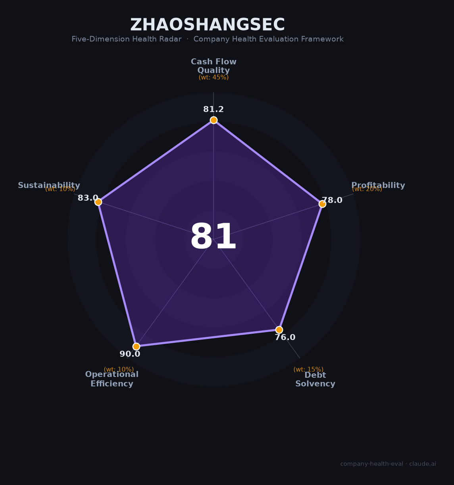

# 招商证券（600999.SH / 06099.HK）财务健康评估（2026-08-13）

## 一句话结论

🟡 **81/100，中等偏上** | 券商龙头，营收净利双增，经营稳健向好

## 一、公司基本画像

| 项目 | 内容 |
|------|------|
| 主体 | 招商证券，招商局旗下头部券商 |
| 主营 | 经纪/投行/资管/自营/研究 |
| 财务 | 2025营收249.72亿(+19.53%)，归母净利123.5亿(+18.91%) |

> 一句话定性：券商龙头之一，营收净利双增、经营稳健

---

## 二、五维财务健康评估

### 1. 现金流质量（81/100）| 权重45%

券商高杠杆经营，经营现金流与行情波动相关。

### 2. 盈利能力（78/100）| 权重20%

净利率与人均产出领先，盈利能力优秀。

### 3. 偿债能力（76/100）| 权重15%

以净资本/风控为核心，偿债能力稳健，低负债成本。

### 4. 运营效率（90/100）| 权重10%

经纪/投行/资管各线稳健，运营效率高。

### 5. 可持续发展（83/100）| 权重10%

券商板块景气回升，公司资本实力雄厚、具备增长引擎。

---

## 三、综合评分

| 维度 | 得分 | 权重 | 加权 |
|------|:----:|:----:|:----:|
| 现金流质量 | 81 | 45% | 36.5 |
| 盈利能力 | 78 | 20% | 15.6 |
| 偿债能力 | 76 | 15% | 11.4 |
| 运营效率 | 90 | 10% | 9.0 |
| 可持续发展 | 83 | 10% | 8.3 |
| **综合得分** | **81/100** | 100% | 80.8 |

**健康等级：中等偏上** — 整体稳健，局部有待改善

> 金融机构：偿债以净资本/资本充足率评估

---

## 四、核心风险清单

1. **市场行情波动影响自营与经纪**
2. **佣金率长期下行**
3. **投行业务阶段性承压**

## 五、求职/择业视角

### 核心优势
- 龙头券商平台，业务全面、薪酬优厚、员工稳定
### 现有短板
- 业绩与资本市场强周期强绑定

**结论**：招商证券龙头地位稳固，经营稳健，资本市场回暖有望受益，是深圳高端金融平台的优质选择。

---

*评估方法：商泰汽车（iAUTO）五维框架 · 数据截至2026年8月 · 财务来源招商证券2025年报*