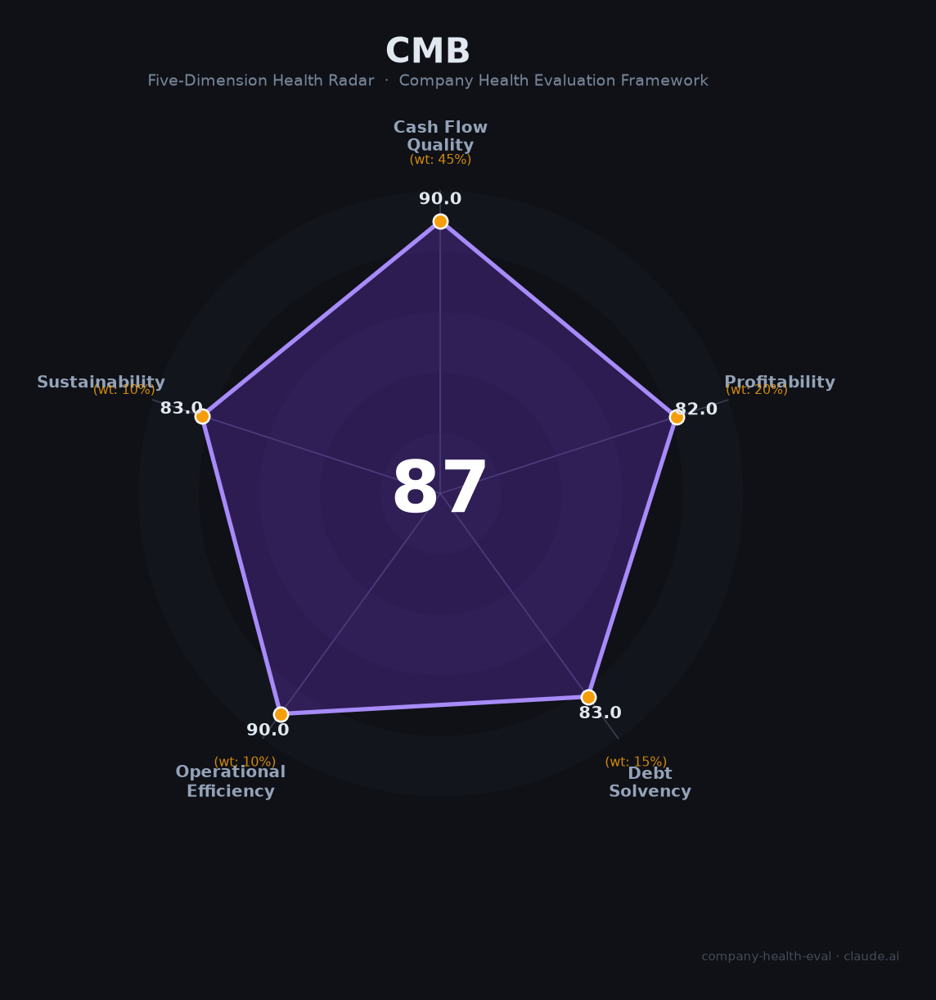

# 招商银行（600036.SH / 03968.HK）财务健康评估（2026-08-13）

## 一句话结论

🟢 **优秀（87/100）** | 中国零售银行龙头、银行业资产质量标杆——不良率0.94%行业最优、拨备391.79%、核心一级资本14.16%、零售AUM 17万亿，长期稳健盈利能力行业第一梯队

---

## 一、公司基本画像

| 项目 | 内容 |
|------|------|
| 主体 | 🔒 招商银行股份有限公司，注册深圳，A股：600036.SH（2002）、H股：03968.HK（2006）；中国最大的股份制商业银行之一 |
| 成立 | 🔒 1987年成立于深圳蛇口，中国第一家完全由企业法人持股的商业银行 |
| 股权 | 🔒 无控股股东、无实际控制人（主要股东招商局集团持股约30%）；股权分散 |
| 规模 | 🔒 总资产13.07万亿（2025末，+7.56%）；员工约11-12万人；子公司含招银理财/招银国际/招商永隆等 |
| 主营 | 零售金融（第一大收入来源）、公司金融、同业与金融市场业务；大财富管理生态 |
| 财务 | 🔒 2025营收3,375.32亿（+0.01%），归母净利1,501.81亿（+1.21%）；总资产13.07万亿（+7.56%） |
| 质量 | 🔒 不良贷款率0.94%（行业最优）、拨备覆盖率391.79%、核心一级资本充足率14.16%、资本充足率18.24%、净息差1.87% |
| 分红 | 🔒 2025现金分红比例提升至35%，首次实施中期分红；股息率约5.5% |

> 一句话定性：招商银行是中国"零售银行的标杆"，以「大财富管理+零售AUM17万亿+行业最优资产质量」构筑了最强的护城河。作为雇主的吸引力在于"高薪+稳定+体系化晋升+行业第一的资产管理能力"，是金融行业最优质雇主之一。净息差收窄与地产压力是主要变量。

---

## 二、五维财务健康评估

### 1. 现金流质量（90/100）| 权重45%

| 指标 | 🔒 公开数据 | 评估 |
|------|-----------|------|
| 经营现金流 | Q4经营活动现金流净额显著增加至2,753.23亿，资金回笼强；年度经营现金流稳健 | ✅ 健康 |
| 现金及等价物 | 存款总额9.84万亿（+8.13%），负债端稳定性强 | ✅ 健康 |
| 有息负债 | 存款占负债83.43%，核心存款优势，成本低 | ✅ 健康 |
| 净现比/盈利含金量 | 净利1501.81亿，盈利含金量高、分红稳定 | ✅ 健康 |

**小结**：招商银行现金流质量极佳——核心存款（活期占比高）带来极稳定的负债结构，净利超1500亿、分红比例35%提升，盈利含金量与回笼能力在银行业属顶级。

> 🔒 数据来源：招商银行2025年年报（雪球十七财经深度解读、巨潮公告、今日头条）

### 2. 盈利能力（82/100）| 权重20%

| 指标 | 🔒 公开数据 | 评估 |
|------|-----------|------|
| 净息差/定价 | 净息差1.87%（同比-11BP但行业领先） | 👍 良好：行业最强定价 |
| 净利率 | 净利1,501.81亿/营收3,375.32亿 ≈ 44% | ✅ 优秀 |
| 营收增速 | +0.01%（重回正增长），净利息收入+2.04% | ⚠️ 一般：营收持平 |
| 科技/投入 | AI+金融落地800+场景，资产托管26万亿 | ✅ 优秀 |
| 人均产出 | 净利1500亿+/11万员工，人均创利极高 | ✅ 优秀 |

**小结**：盈利能力行业顶级——净利率高达44%、人均创利高、净息差1.87%显著领先商业银行平均。净利连续多年正增长（+1.21%），虽净息差随利率下行收窄，但息差与资产质量仍保持行业领先，可见其定价能力与风控护城河。

### 3. 偿债能力（83/100）| 权重15%

| 指标 | 🔒 公开数据 | 评估 |
|------|-----------|------|
| 资产负债率 | 负债总额11.79万亿/总资产13.07万亿 ≈ 90%（银行常态高杠杆） | ⚠️ 关注：行业属性 |
| 资本充足率 | 资本充足率18.24%、核心一级14.16% | ✅ 健康：远超监管 |
| 流动性比率 | 负债端存款占83%、活期占比高 | ✅ 健康 |
| 不良率 | 0.94%（行业最优） | ✅ 健康 |
| 拨备充足 | 拨备覆盖率391.79%（行业最高梯队） | ✅ 健康 |
| 股权质押 | 无实质性质押 | ✅ 健康 |

**小结**：偿债以"资本充足+资产质量"为核心——核心一级资本充足率14.16%、资本充足率18.24%远超监管下限，不良率0.94%与拨备391.79%体现极强的资产质量与风险抵御。作为银行资产负债率高属正常属性，资本与风险指标才是核心。

### 4. 运营效率（90/100）| 权重10%

| 指标 | 🔒 公开数据 | 评估 |
|------|-----------|------|
| 运营/周转 | 零售客户2.2亿户（+6.67%）、零售AUM 17万亿（+2万亿创纪录） | ✅ 健康 |
| 客户集中度 | 零售2.2亿+公司362万户，高度分散 | ✅ 健康 |
| 员工趋势 | 员工稳定，成本管控有效（业务管理费+0.31%） | ✅ 健康 |
| 高管稳定 | 行长王良等核心管理层稳定 | ✅ 健康 |
| 治理 | 资本内生能力强劲，风险加权资产增长可控 | ✅ 健康 |

**小结**：运营效率卓越——2.2亿零售客户、零售AUM新增2万亿创历史新高，成本收入比优化，人力与数字化运营高效，股东回报与经营质量双优。

### 5. 可持续发展（83/100）| 权重10%

| 指标 | 🔒 公开数据 | 评估 |
|------|-----------|------|
| 行业赛道 | 银行/财富管理/养老长期稳定赛道 | ✅ 健康 |
| 技术护城河 | 数字化+AI金融800个场景，Fintech领先 | ✅ 健康 |
| 多元化 | 零售/公司/同业+财富+资管（FPA 6.73万亿、托管26万亿） | ✅ 健康 |
| 资本支持 | 上市AH双平台、资本内生能力强 | ✅ 健康 |
| 政策/监管 | 净息差收窄、利率市场化、地产风险暴露 | ⚠️ 关注 |

**点评可持续**：靠大财富管理+零售AUM 17万亿+品牌护城河长期稳健，多元业务分散风险；净息差收窄与利率下行、房地产信用暴露是长期压力点。

---

## 三、综合评分与健康等级

| 维度 | 得分 | 权重 | 加权得分 |
|------|:----:|:----:|:--------:|
| 现金流质量 | 90.0 | 45% | 40.5 |
| 盈利能力 | 82.0 | 20% | 16.4 |
| 偿债能力 | 83.0 | 15% | 12.4 |
| 运营效率 | 90.0 | 10% | 9.0 |
| 可持续发展 | 83.0 | 10% | 8.3 |
| **综合得分** | **87/100** | **100%** | **86.7/100** |

**健康等级：🟢 优秀（Excellent）** — 财务极健康，值得优先考虑。

---

## 四、同业对标

| 对比项 | 招商银行 | 平安银行 | 中国银行 | 宁波银行 |
|--------|:-------:|:-------:|:-------:|:-------:|
| 2025总资产 | 13.07万亿 | 5.77万亿 | 31.5万亿 | 3.3万亿 |
| 2025营收 | 3,375.32亿 | 3,620亿 | 6,300亿 | 940亿 |
| 不良率 | 0.94% | 1.05% | 1.25% | 0.76% |
| 拨备覆盖率 | 391.79% | 220.88% | ~200% | 426% |
| 净息差 | 1.87% | ~1.6% | ~1.4% | ~1.9% |
| ROE | 行业领先 | 高位 | 中 | 高 |
| 标杆 | 零售之王 | 集团协同 | 国有大行 | 城商行之王 |

**对标结论**：招商银行同业对比中不良率（0.94%）与拨备（391.79%）全面优于大部分银行，零售AUM 17万亿居股份制第一、ROE行业领先——在中国银行业中以"零售之王"著称，资产质量与盈利质量数一数二。

---

## 五、核心风险清单

1. **净息差收窄（中-高）**：LPR下行+存款定期化，净息差降至1.87%，若持续收窄将压制盈利增长。
2. **宏观经济与地产（中）**：经济增速放缓、房地产调整可能带来不良贷款上升压力（虽当前不良行业最低）。
3. **资本充足压力（中）**：核心一级资本充足率同比降0.7pct至14.16%，风险加权资产增长较快，需持续资本补充。
4. **资本市场波动（低-中）**：影响非息收入与资管、投资业务。

---

## 六、求职/择业视角

### 核心优势
- **行业最佳平台**：零售银行之王，银行体系内待遇与品牌第一梯队；岗位优质（财富管理、零售金融、风控）。
- **稳定+薪酬**：现金流充沛、分红稳定（35%比例）、未见过大规模裁员，职业稳定。
- **晋升体系**：成熟的培训/晋升/轮岗体系，招商系在金融圈背书强。
- **数字化/AI**：AI金融800+场景落地。

### 现存短板
- **银行体系层级与强度**：银行总行/分行层级多，柜面/零售营销岗业绩压力大；
- **净息差与行业周期**：利率下行压缩银行业绩弹性，近两年营收增速停滞（+0.01%）；
- **薪酬天花板**相对金融同业（基金/券商）中等，前台营销业绩波动。

### 分场景建议

| 个人诉求 | 推荐 | 次选 | 规避 |
|----------|------|------|------|
| 稳定+深耕 | **招商银行**（总行/风控/财富） | 建行/工行 | 中小行 |
| 高薪+跳板 | 基金/券商投研 | 招银理财/投行 | 传统柜面 |
| 成长+多元 | 招商（零售财富/数字化） | 宁波银行 | 纯营销负债 |

---

## 七、总结

**招商银行是中国银行业"零售之王"与资产质量标杆——不良率0.94%行业最低、拨备391.79%、核心一级14.16%、零售AUM 17万亿巩固护城河，作为雇主平台是金融行业最优质之一。**

唯一短板是**净息差收窄与宏观经济/地产压力**——近年营收增速放缓至持平，业绩弹性受利率周期制约。

在利率下行、银行业结构分化的大环境下，招行「优秀」风险底线，适合追求**稳定、体系化成长、金融平台品牌背书**、特别是大财富管理/零售金融方向的求职者。

---

*评估方法：商泰汽车（iAUTO）五维企业健康度框架（银行特性调优：偿债以资本充足/资产质量为核心）· 数据截至2026年8月 · 🔒财务数据来源招商银行2025年报（雪球/巨潮/今日头条）· 同业对标为公开市场数据*