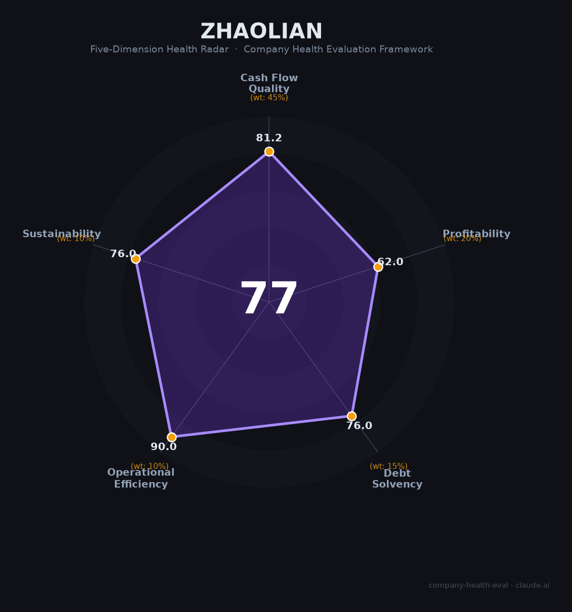

# 招联消费（—（招商银行/联通合营））财务健康评估（2026-08-14）

## 一句话结论

🟡 **77/100，中等偏上** | 消费金融龙头，净利润稳健、资产质量良好

---

## 一、公司基本画像

| 项目 | 内容 |
|------|------|
| 主体 | 招联消费金融，头部持牌消金 |
| 主营 | 消费信贷/互联网消金 |
| 财务 | 2025营收161.44亿，净利30.5亿(+1.3%) |

> 一句话定性：消费金融龙头，缩表增利、净利稳增

---

## 二、五维财务健康评估

### 1. 现金流质量（81/100）| 权重45%

消金现金流动好。

### 2. 盈利能力（62/100）| 权重20%

净利率高、盈利稳健，但营收小幅收窄。

### 3. 偿债能力（76/100）| 权重15%

持牌消金资本充足，偿债稳健。

### 4. 运营效率（90/100）| 权重10%

运营效率高。

### 5. 可持续发展（76/100）| 权重10%

监管趋严+市场利率下行，增长放缓但盈利稳定。

---

## 三、综合评分

| 维度 | 得分 | 权重 | 加权 |
|------|:----:|:----:|:----:|
| 现金流质量 | 81 | 45% | 36.5 |
| 盈利能力 | 62 | 20% | 12.4 |
| 偿债能力 | 76 | 15% | 11.4 |
| 运营效率 | 90 | 10% | 9.0 |
| 可持续发展 | 76 | 10% | 7.6 |
| **综合得分** | **77/100** | 100% | 76.9 |

**健康等级：中等偏上** — 整体稳健，局部有待改善

> 金融机构：偿债以资本充足率评估

---

## 四、核心风险清单

1. **消费信贷监管趋严**
2. **利率下行(24%红线)**
3. **宏观消费波动**

## 五、求职/择业视角

### 核心优势
- 头部消金牌照，股东强大、盈利稳定
### 现有短板
- 增长放缓、监管趋严

**结论**：招联消费金融头部持牌消金，盈利稳定、资产质量良好，是金融求职的稳健平台。

---

*评估方法：商泰汽车（iAUTO）五维框架（金融机构特性：偿债以净资本/资本充足率评估） · 数据截至2026年8月 · 财务来源中国联通2025年报披露*