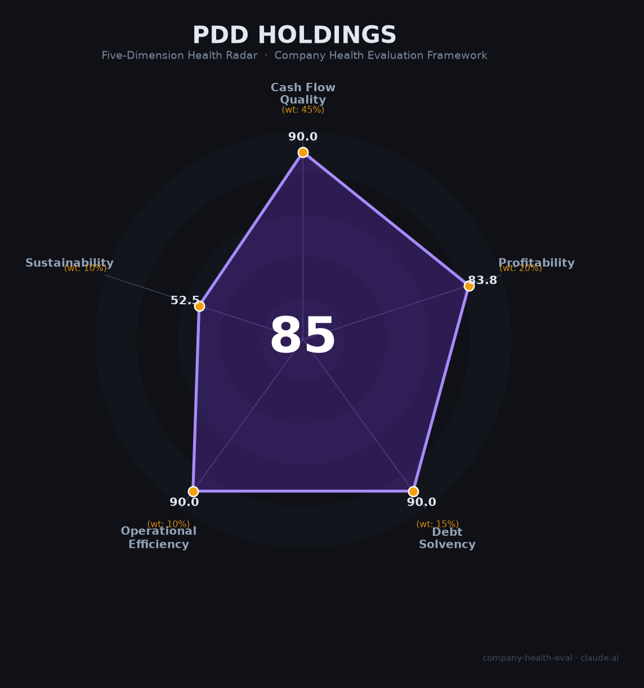

# 拼多多（PDD Holdings）财务健康评估（2026-06-12）

## 一句话结论

🟢 **优秀（85/100）** | 净现金¥4,169亿+人均创收¥1,695万全球顶级+Agent-RL全链路布局，致命伤：增速从90%→10%+中概股最大未回港标的+全球监管罚款风暴

## 一、公司基本画像

| 维度 | 内容 |
|------|------|
| **上市** | NASDAQ: PDD（2018年），未回港上市（中概股最大风险敞口） |
| **成立** | 2015年上海，黄峥创立。2021年陈磊接任董事长，2025年赵佳臻升任联席董事长 |
| **员工** | 25,474人（2025），人均创收¥1,695万（阿里2倍、京东8倍） |
| **核心业务** | 拼多多主站+Temu跨境电商（GMV ~$800-1000亿），交易服务收入¥2,141亿 |
| **2025营收** | ¥4,318亿（+10%），净利润¥994亿（-12%） |
| **财务特征** | 毛利率56.3%（Temu拖累，连续三年下滑）、净现比1.08、净现金¥4,169亿、资产负债率34% |
| **AI布局** | Agent-RL+分布式AI+AI搜索上线+Temu AI介入率>90%+新拼姆三年千亿计划 |

拼多多是中国互联网人效之王（25,474人撑起¥4,318亿营收），也是中概股中唯一未回港的重量级选手。2025年增长引擎从90%骤降至10%，Temu面临中美欧三重关税合规围剿，¥4,223亿现金是应对风暴的最大防线。

## 二、五维评估

### 1. 现金流质量（90/100）
OCF ¥942→1,219→1,069亿，Capex<0.3%营收，净现金¥4,169亿 → 全部健康

### 2. 盈利能力（84/100）
毛利率56%（平台电商顶级）、净利率23%、3Y营收CAGR ~49% → 优秀。但研发费率仅3.8% → 一般

### 3. 偿债能力（90/100）
资产负债率34%，有息负债仅¥54亿（vs ¥4,223亿现金）→ 全部健康

### 4. 运营效率（90/100）
扁平化+陈磊/赵佳臻双核稳定+25,474人持续扩招+百万商家分散 → 全部健康

### 5. 可持续发展（52/100）
电商增速5-6% → 关注。C2M供应链+Agent-RL+分布式AI → 壁垒强。Temu单一第二曲线 → 关注。未回港上市+退市风险 → 关注。幽灵外卖罚15亿+暴力抗法+欧盟DSA罚2亿欧 → 危险

## 三、评分

| 维度 | 得分 |
|------|:----:|
| 现金流 | 90.0 |
| 盈利 | 83.8 |
| 偿债 | 90.0 |
| 运营 | 90.0 |
| 可持续 | 52.5 |
| **综合** | **85.0** 🟢 |

## 四、核心风险

1. **Temu关税围剿（极高）**：美国de minimis取消→销量降50%；欧盟2026.7月每件+2欧；对华145%关税
2. **中概股退市（极高）**：唯一未回港的重量级中概股，94亿美元被动资金流出敞口
3. **增速断崖（高）**：营收增速从90%→10%，净利润首降，11-11-6模式难以持续
4. **全球监管罚款风暴（高）**：国内15亿+欧盟2亿欧+匈牙利/波兰/韩国，暴力抗法定性极为罕见

## 五、求职视角

- **优势**：现金薪酬行业顶格（校招算法72万纯现金），人效全球顶级，AI Agent-RL前沿方向
- **短板**：11-11-6极致强度，半年离职率60-70%，竞业协议覆盖所有大厂，无股权只有现金
- **建议**：仅适合25-30岁能扛压、追求极致现金回报、不介意牺牲生活质量的技术人才

*评估日期：2026-06-12 | 数据来源：PDD FY2025 6-K（SEC）、20-F年报*
