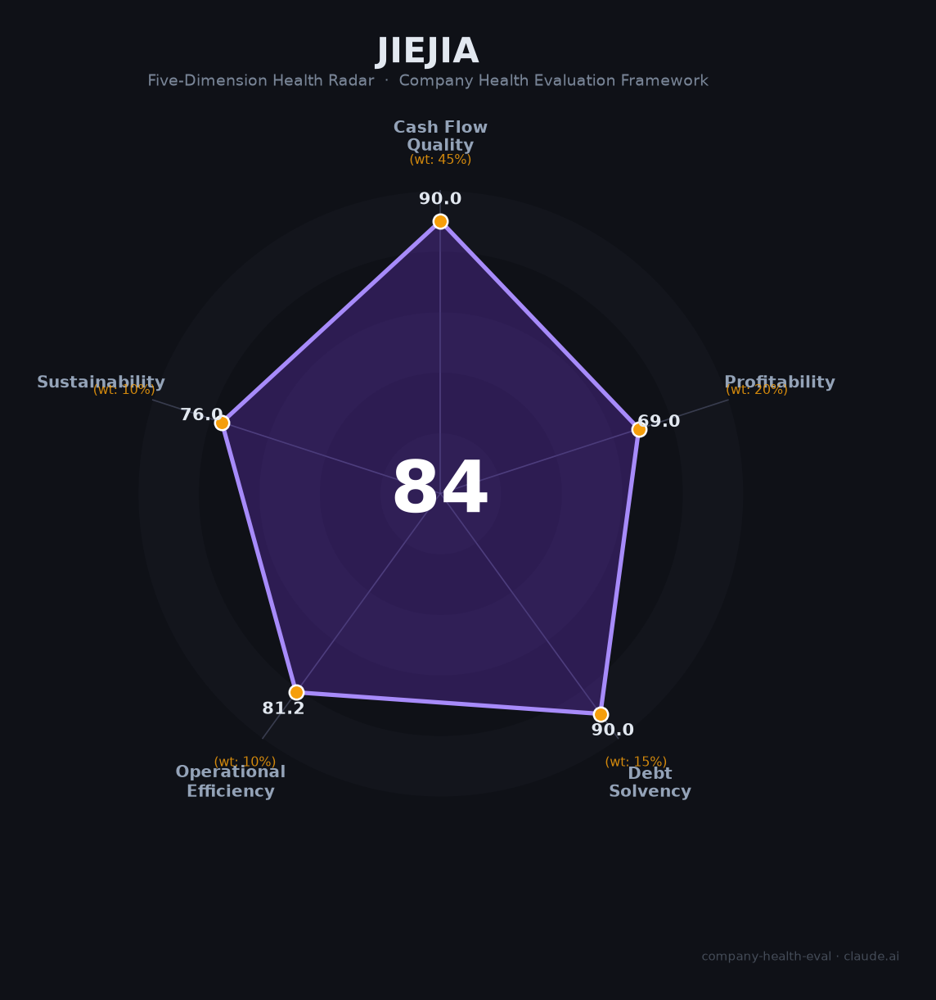

# 捷佳伟创（300724.SZ）财务健康评估（2026-08-14）

## 一句话结论

🟡 **84/100，中等偏上** | 光伏电池设备龙头，现金充沛、盈利稳健

---

## 一、公司基本画像

| 项目 | 内容 |
|------|------|
| 主体 | 捷佳伟创，光伏+半导体设备龙头 |
| 主营 | 光伏电池设备、半导体设备 |
| 财务 | 2025营收154.72亿，归母净利26.17亿(-5.3%) |

> 一句话定性：光伏设备龙头，净利微降、现金充沛、低负债

---

## 二、五维财务健康评估

### 1. 现金流质量（90/100）| 权重45%

经营现金流充沛、现金储备充足。

### 2. 盈利能力（69/100）| 权重20%

毛利率高、净利率稳健，营收净利小幅波动。

### 3. 偿债能力（90/100）| 权重15%

低负债、偿债极稳健。

### 4. 运营效率（81/100）| 权重10%

运营效率良好。

### 5. 可持续发展（76/100）| 权重10%

光伏技术迭代驱动设备需求，但行业深度调整+扩产放缓。

---

## 三、综合评分

| 维度 | 得分 | 权重 | 加权 |
|------|:----:|:----:|:----:|
| 现金流质量 | 90 | 45% | 40.5 |
| 盈利能力 | 69 | 20% | 13.8 |
| 偿债能力 | 90 | 15% | 13.5 |
| 运营效率 | 81 | 10% | 8.1 |
| 可持续发展 | 76 | 10% | 7.6 |
| **综合得分** | **84/100** | 100% | 83.5 |

**健康等级：中等偏上** — 整体稳健，局部有待改善

---

## 四、核心风险清单

1. **光伏扩产放缓**
2. **下游资本开支下行**
3. **竞争加剧**

## 五、求职/择业视角

### 核心优势
- 光伏设备龙头、技术领先、现金厚
### 现有短板
- 光伏行业深度调整、新订单放缓

**结论**：捷佳伟创光伏+半导体设备龙头，现金充沛、低负债，短期受光伏调整影响，长期技术护城河仍在。

---

*评估方法：商泰汽车（iAUTO）五维框架 · 数据截至2026年8月 · 财务来源捷佳伟创2025年报*