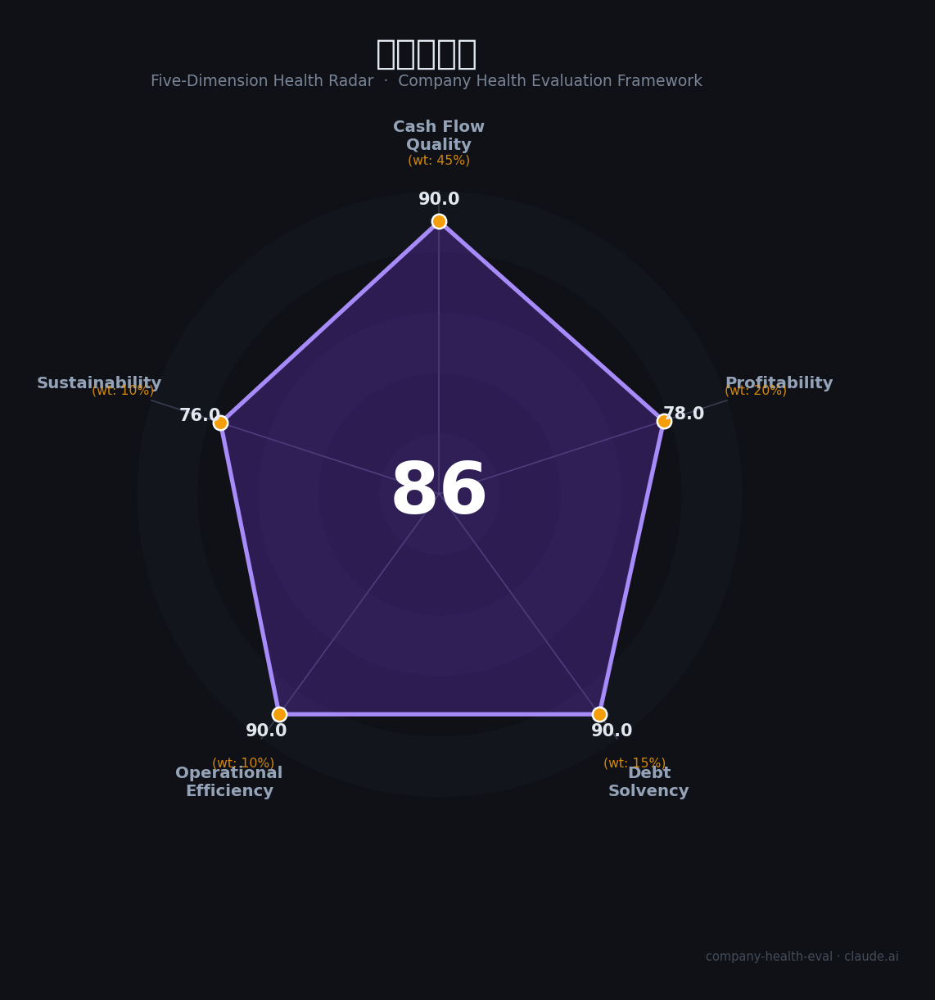

# 新产业生物（300832.SZ）财务健康评估（2026-08-14）

## 一句话结论

🟢 **86/100，优秀** | 体外诊断龙头，高毛利净利率、海外成长

---

## 一、公司基本画像

| 项目 | 内容 |
|------|------|
| 主营 | 体外诊断(免疫诊断/生化) |
| 财务 | 2025营收45.77亿(+0.91%)，归母净利16.20亿(-11.39%)，海外+19.16% |

> 一句话定性：IVD体外诊断龙头，盈利优质、海外强

---

## 二、五维财务健康评估

### 1. 现金流质量（90/100）| 权重45%

现金流充沛。

### 2. 盈利能力（78/100）| 权重20%

毛利率高、净利率高，盈利优质。

### 3. 偿债能力（90/100）| 权重15%

低负债、现金充裕。

### 4. 运营效率（90/100）| 权重10%

运营效率高。

### 5. 可持续发展（76/100）| 权重10%

海外+医疗，成长可期。

---

## 三、综合评分

| 维度 | 得分 | 权重 | 加权 |
|------|:----:|:----:|:----:|
| 现金流质量 | 90 | 45% | 40.5 |
| 盈利能力 | 78 | 20% | 15.6 |
| 偿债能力 | 90 | 15% | 13.5 |
| 运营效率 | 90 | 10% | 9.0 |
| 可持续发展 | 76 | 10% | 7.6 |
| **综合得分** | **86/100** | 100% | 86.2 |

**健康等级：优秀** — 财务极健康，值得优先考虑

---

## 四、核心风险清单

1. **医保集采**
2. **行业竞争**
3. **海外政策**

## 五、求职/择业视角

### 核心优势
- IVD龙头、高盈利、海外扩张
### 现有短板
- 净利略降、集采影响

**结论**：新产业生物体外诊断龙头，盈利优质、低负债、海外增长强劲，稳健优质平台。

---

*评估方法：商泰汽车（iAUTO）五维框架 · 数据截至2026年8月 · 财务来源新产业2025年报*