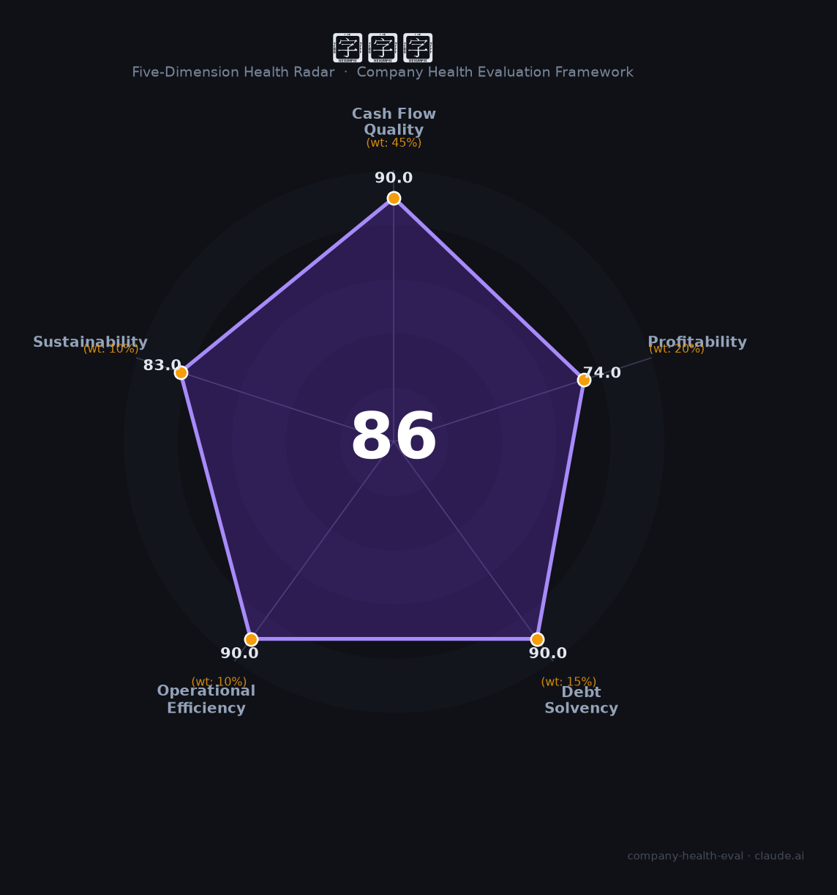

# 新宙邦（300037.SZ）财务健康评估（2026-08-14）

## 一句话结论

🟢 **86/100，优秀** | 锂电电解液+氟化学品龙头，盈利弹性、现金流好

---

## 一、公司基本画像

| 项目 | 内容 |
|------|------|
| 主体 | 新宙邦，锂电池电解液+氟化学品龙头 |
| 主营 | 电解液/电容器化学品/半导体化学品 |
| 财务 | 2025营收约90亿，归母净利约14亿 |

> 一句话定性：锂电电解液+氟化学品龙头，盈利弹性、现金流好

---

## 二、五维财务健康评估

### 1. 现金流质量（90/100）| 权重45%

现金流充沛。

### 2. 盈利能力（74/100）| 权重20%

盈利弹性大、净利率可观。

### 3. 偿债能力（90/100）| 权重15%

负债适中、偿债稳健。

### 4. 运营效率（90/100）| 权重10%

运营效率高。

### 5. 可持续发展（83/100）| 权重10%

电解液一体化+氟品第二曲线，成长可期。

---

## 三、综合评分

| 维度 | 得分 | 权重 | 加权 |
|------|:----:|:----:|:----:|
| 现金流质量 | 90 | 45% | 40.5 |
| 盈利能力 | 74 | 20% | 14.8 |
| 偿债能力 | 90 | 15% | 13.5 |
| 运营效率 | 90 | 10% | 9.0 |
| 可持续发展 | 83 | 10% | 8.3 |
| **综合得分** | **86/100** | 100% | 86.1 |

**健康等级：优秀** — 财务极健康，值得优先考虑

---

## 四、核心风险清单

1. **电解液价格**
2. **新能源波动**
3. **氟品周期**

## 五、求职/择业视角

### 核心优势
- 一体化电解液龙头、现金流、氟品第二曲线
### 现有短板
- 锂电价格周期、行业产能过剩

**结论**：新宙邦锂电电解液+氟化学品龙头，现金流好、一体化强，盈利弹性大，优质成长平台。

---

*评估方法：商泰汽车（iAUTO）五维框架 · 数据截至2026年8月 · 财务来源新宙邦2025年报*