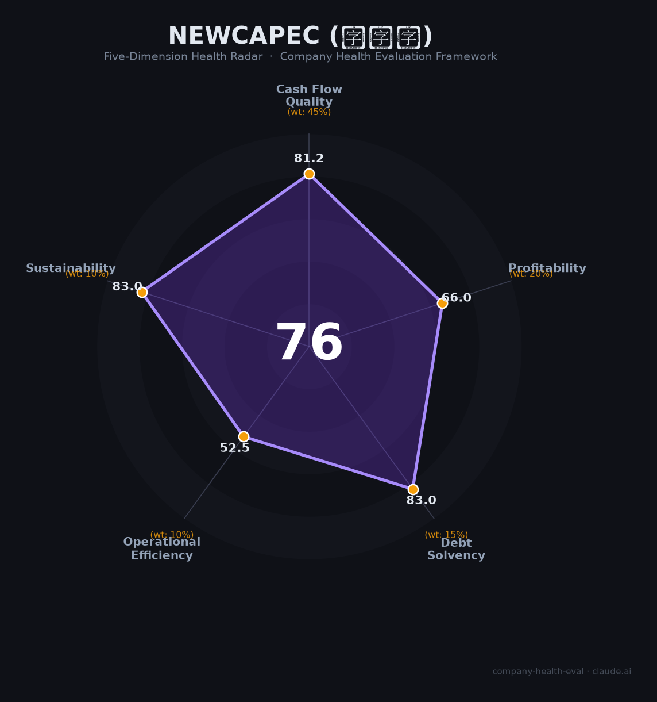

# 新开普（300248.SZ）财务健康评估（2026-06-12）

## 一句话结论

🟡 **中等偏上（75.7/100）** | 校园信息化龙头 · 高毛利 · 零质押 · 增长停滞 · 应收高企——教育IT赛道的「守成者」

---

## 一、公司基本画像

| 项目 | 详情 |
|------|------|
| 主体 | 🔒 新开普电子股份有限公司（深交所创业板：300248.SZ） |
| 成立 | 2000年4月25日，2011年7月29日上市 |
| 地址 | 河南省郑州市高新技术产业开发区迎春街18号 |
| 股权 | 🔒 实控人杨维国持股15.45%；蚂蚁集团（上海云鑫）持股3.90%为最大机构股东 |
| 规模 | 🔒 员工2,227人（2025年末），注册资本4.76亿元 |
| 主营 | 智慧校园应用+云平台（60%）、智慧政企（21%）、运维服务（19%） |
| 市占 | 高校一卡通市占率超40%，服务1,400+所高校 |
| 融资 | 🔒 2011年IPO募资约2.99亿元（净额），2016年定增募资约3.14亿元（净额） |

> 蚂蚁集团2019年以约2亿元受让6.28%股份（后摊薄至3.90%），同时以2.5亿元增资子公司完美数联——战略绑定关系至今稳固。

**一句话定性**：教育信息化行业「高毛利守成者」——现金流健康、偿债无忧、行业地位稳固，但核心业务增长停滞、应收账款高企、员工持续缩编，处于转型阵痛期。

---

## 二、五维财务健康评估

### 1. 现金流质量（81.2/100）| 权重45%

| 指标 | 🔒 公开数据 | 评估 |
|------|-----------|------|
| 经营现金流净额 | 2021-2025连续5年为正（1.61→0.91→1.20→2.72→2.23亿） | ✅ 健康：持续为正 |
| 现金及等价物 | 2024末3.80亿→2025Q3末2.03亿（季末低点），覆盖约5-6个月运营 | ⚠️ 关注：不足6个月，连续4年下降 |
| 有息负债 | 2025Q3末约1.74亿（短借+长借），占总资产~6% | ✅ 健康：极低杠杆 |
| 净现比 | 2025年：2.23/0.78=2.86倍 | ✅ 健康：利润含金量高 |
| 应收周转天数 | 2025年TTM约261.5天（近9个月），连续4年恶化 | 🚩 已在运营效率维度单独计分 |

**小结**：经营现金流持续为正、杠杆极低、净现比优秀——现金流基本面扎实。但货币资金从2021年峰值5.82亿连降至2-3亿水平，6个月内需密切关注现金消耗速度。

> 🔒 数据来源：新开普2021-2025年经审计年报（立信会计师事务所出具标准无保留意见）

### 2. 盈利能力（66.0/100）| 权重20%

| 指标 | 🔒 公开数据 | 评估 |
|------|-----------|------|
| 毛利率 | 2025年56.03%（智慧校园云平台86.44%，运维服务88.65%） | ✅ 优秀：超行业75分位（~50%） |
| 净利率 | 2025年8.05%（2021年峰值16.9%后逐年下降） | ⚠️ 良好：5-15%区间 |
| 营收增速（3年CAGR） | 2022-2025年：(9.78/10.70)^(1/3)-1 = **-3.0%** | 🚩 预警：负增长 |
| 研发费用率 | 2025年13.24%（费用化1.29亿+资本化0.44亿，总投入17.65%） | ✅ 优秀：科技公司10-25%健康区间 |
| 人均创收 | 2025年43.94万元 | ⚠️ 一般：低于行业平均（~50万） |

**小结**：高毛利是核心竞争力（云平台+运维服务贡献超额利润），但营收连年下滑拖累整体盈利维度。净利率从2021年16.9%降至8.05%，如2026年营收继续萎缩将跌破5%预警线。

> 🔒 数据来源：东方财富新开普2025年年报摘要；同行业毛利率中位数约38%（前瞻产业研究院2024）

### 3. 偿债能力（83.0/100）| 权重15%

| 指标 | 🔒 公开数据 | 评估 |
|------|-----------|------|
| 资产负债率 | 2024年末15.98%，2025Q3末19.40% | ✅ 健康：远低于40% |
| 有息负债率 | 2025Q3有息负债1.74亿/总资产28.95亿≈6.0% | ✅ 健康：极低 |
| 流动比率 | 2024年末3.60，2025Q3末3.38 | ✅ 健康：>2 |
| 现金比率 | 约0.6（估算，季末低点水平） | ⚠️ 关注：0.5-1区间 |
| 股权质押比例 | 整体仅1.33%，实控人杨维国无未解押记录 | ✅ 健康：远低于30% |

**小结**：偿债能力是公司最强维度之一。极低杠杆+零质押+高流动性，几乎不存在偿债风险。唯一瑕疵是现金比率偏低（因货币资金持续下降），但仍在安全线以上。

> 🔒 数据来源：东方财富新开普资产负债表+质押数据

### 4. 运营效率（52.5/100）| 权重10%

| 指标 | 🔒 公开数据 | 评估 |
|------|-----------|------|
| 应收周转天数 | 261.5天（2025年TTM），连续恶化（180.9→197.8→223.4→250.2→261.5） | 🚩 危险：远超行业均值（~150天） |
| 客户集中度 | 服务1,400+所高校+10,000+企业，前5大客户<30% | ✅ 健康：客户分散 |
| 员工规模趋势 | 2022年2,885人→2025年2,227人（**-22.8%**），连续三年缩减 | 🚩 危险：大幅缩编 |
| 高管稳定性 | 杨维国任董事长15年+，核心VP均从基层提拔，任期超5年 | ✅ 健康：高度稳定 |

**小结**：运营效率是公司最弱维度。应收账款周转恶化是系统性短板——2025年应收账款6.40亿，占总资产22.12%，回款天数已接近9个月。同时员工连续三年缩编（累计-22.8%），虽人均创收有所提升，但长期缩编不可持续。

> 🔒 数据来源：新开普2021-2025年年报；证券之星人均分析

### 5. 可持续发展（83.0/100）| 权重10%

| 指标 | 评估 | 判断依据 |
|------|------|---------|
| 行业赛道空间 | ✅ 健康 | 教育信息化市场规模破千亿，CAGR 15%+；AI+教育政策利好 |
| 技术壁垒 | ✅ 健康 | 高校一卡通系统与门禁/教务/水电深度绑定，切换成本极高，3年+难以复制 |
| 客户/业务多元化 | ✅ 健康 | 教育(60%)+政企(21%)+运维(19%)+农业；1,400+所学校+10,000+企业 |
| 融资/资本支持 | ✅ 健康 | A股上市+蚂蚁集团战略入股（持股3.90%+子公司30%），资本支持充足 |
| 政策/监管风险 | ⚠️ 关注 | 教育数字化政策利好，但地方高校预算压缩形成对冲；中性偏利好 |

**小结**：可持续发展维度表现优秀。行业赛道清晰、技术壁垒深厚、客户多元分散、资本支持充足。唯一的负面因素是地方财政紧缩导致的高校IT预算削减压力（已在2025年业绩中体现）。

---

## 三、综合评分与健康等级

| 维度 | 得分 | 权重 | 加权 |
|------|:----:|:----:|:----:|
| 现金流质量 | 81.2 | 45% | 36.5 |
| 盈利能力 | 66.0 | 20% | 13.2 |
| 偿债能力 | 83.0 | 15% | 12.4 |
| 运营效率 | 52.5 | 10% | 5.2 |
| 可持续发展 | 83.0 | 10% | 8.3 |
| **综合得分** | | **100%** | **75.7** |

**健康等级：🟡 中等偏上（Moderate-High）**

### 得分解读

- **长板**：偿债能力(83.0)、可持续发展(83.0)、现金流质量(81.2)——财务安全垫厚、行业前景看好
- **短板**：运营效率(52.5)——应收高企+持续缩编，反映业务结构性问题
- **关键拖累**：盈利能力(66.0)——高毛利但增长为负、净利率持续走低

---

## 四、同业对标

| 对比项 | **新开普 300248** | 正元智慧 300645 | 竞业达 003005 |
|--------|:-----------------:|:---------------:|:------------:|
| 2025年营收 | **9.78亿**（-0.58%） | 13.16亿（+10.17%） | 4.79亿（-0.66%） |
| 毛利率 | **56.03%** | 42.02% | 44.06% |
| 净利率 | **8.05%** | 1.0% | 1.79% |
| 2025年净利润 | **7,813万**（-29.11%） | 1,309万（+9.19%） | 858万（-79.9%） |
| 应收账款周转 | **261.5天** | 未披露 | 未披露 |
| 员工人数 | **2,227人** | ~2,104人 | 694人 |
| 总市值（2026.6） | **~39.7亿** | ~18.9亿 | ~34.4亿 |
| 市盈率（TTM） | ~67x | ~143x | 亏损 |

**对标结论**：新开普在盈利能力（毛利率、净利率）上显著领先同业，市值溢价合理。正元智慧营收规模更大且恢复增长，但净利率极薄(1%)；竞业达体量太小、利润暴跌。新开普是教育信息化赛道中「利润质量最高」的上市公司，但增长动能逊于正元智慧。

---

## 五、核心风险清单

1. **营收持续萎缩（中高风险）**：2022年营收峰值为10.70亿，2025年降至9.78亿(-8.6%)，连续三年下滑。触发条件：2026年高校IT预算进一步压缩或银行投资继续放缓。若营收跌破9亿，利润可能降至亏损边缘。

2. **应收账款坏账（中风险）**：6.40亿应收账款占总资产22.12%，周转天数261.5天持续恶化。触发条件：地方财政恶化导致高校延迟或拒付项目款。2025年已计提坏账准备1,845.80万元。

3. **现金持续消耗（中风险）**：货币资金从2021年5.82亿连降至2025Q3的2.03亿，降幅65%。触发条件：2026年经营现金流转负或资本开支超预期（AI大模型研发投入）。

4. **商誉减值（中低风险）**：商誉4.82亿占净资产22.15%，历史并购（北京迪科远望、上海树维等）标的业绩若下滑可能触发减值。2025年仅计提490万元，暂无明显减值迹象。

5. **实控人声誉风险（已解除）**：杨维国2023年因涉嫌泄露内幕信息罪被刑事拘留，2025年5月正式撤案。司法程序终结，但市场信任修复尚需时间。

6. **业务替代风险（低风险）**：移动支付（微信/支付宝校园码）短期不构成实质威胁（蚂蚁为战略股东），但中长期可能削弱一卡通硬件收入。NFC虚拟卡升级是机遇大于风险。

---

## 六、求职/择业视角

### 核心优势

- **稳定性**：上市12年无ST/退市风险，极低负债+零质押+正向现金流，倒闭概率极低。但2023年董事长被刑拘事件表明公司治理存在隐患（已解除）。
- **技术/业务价值**：教育信息化龙头经验在智慧校园、数字人民币、NFC支付等领域具有较高市场通用性。星普大模型AI经验可向教育科技企业迁移。
- **工作强度**：双休（8:30-17:30），加班程度可接受，整体work-life balance良好。Boss直聘/智联口碑偏正面。

### 现存短板

- **薪酬上限**：郑州本科应届生月薪6k-10k，人均薪酬16.26万/年（呈下降趋势），低于一线互联网企业。在郑州属中等水平。
- **品牌背书**：教育信息化龙头但在互联网/科技圈知名度有限，对跳槽至头部互联网公司助力一般。政府/国企/教育科技行业认可度较高。
- **职业天花板**：郑州地域限制+公司规模有限（2,200人），晋升通道不如一线大厂宽广。但高管多为内部提拔，忠诚员工有上升空间。

### 分场景建议

| 个人诉求 | 推荐 | 次选 | 规避 |
|----------|------|------|------|
| 稳定+深耕 | ✅ 适合：财务稳、行业壁垒深、双休 | | |
| 高薪+跳板 | | ⚠️ 次选：郑州薪资偏低，品牌溢价有限 | |
| 成长+AI红利 | ✅ 适合：星普大模型、数字人民币等新业务在拓展 | | |
| 多元+跨领域 | | ⚠️ 次选：教育→政企→农业有跨领域机会 | |

---

## 七、总结

**新开普是教育信息化领域「高毛利守成者」的公司：**

财务极稳（零质押+极低杠杆+经营现金流5年为正），核心短板是增长停滞（3年营收CAGR为-3%）和运营效率恶化（应收周转261.5天+连续3年缩编）。

在AI+教育政策利好与地方财政紧缩的对冲大环境下，属于**中等偏上**风险等级，适合**追求稳定、看好教育科技长期赛道、能接受郑州工作地点**的求职者的选择。对追求高薪和快速成长的年轻求职者而言，品牌和薪酬天花板构成现实约束。
