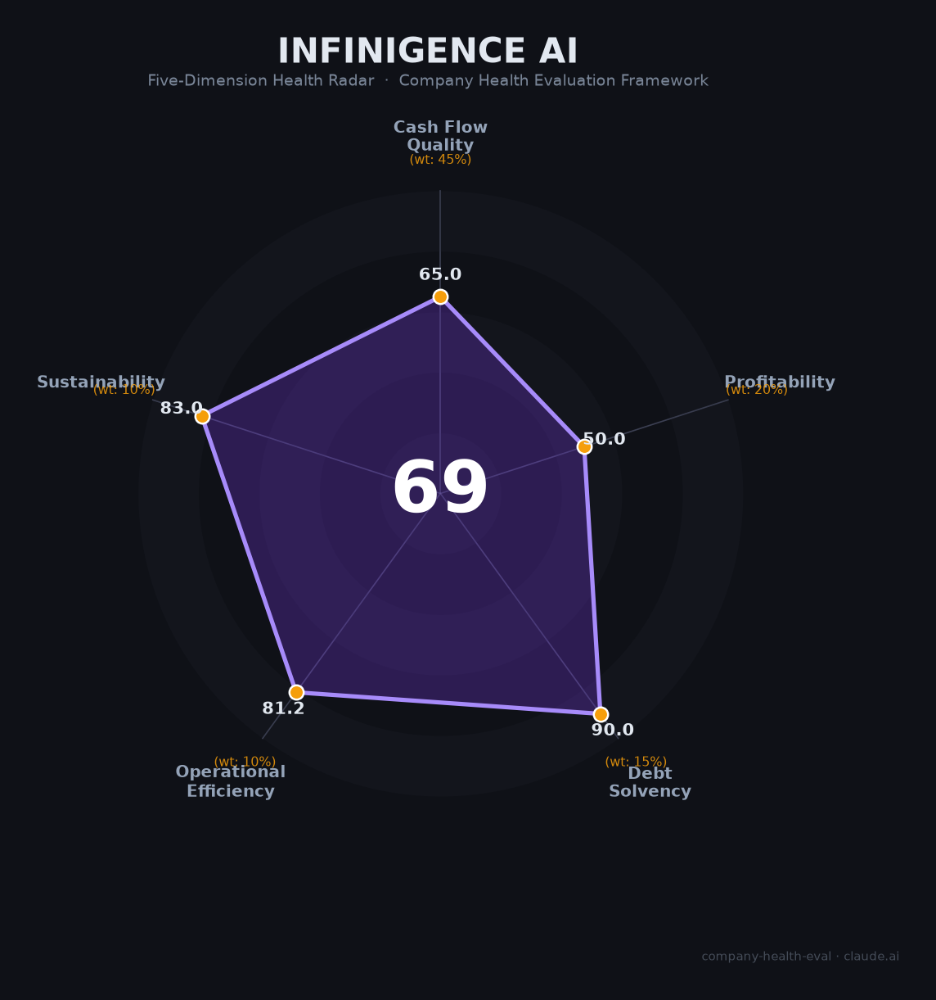

# 无问芯穹（Infinigence AI）财务健康评估（2026-06-12）

## 一句话结论

🟠 **中等（69/100）** | 清华系Agentic Infra独角兽，算力纳管25,000P行业第一，22亿融资弹药充足，商业变现和盈利是唯一待解难题

---

## 一、公司基本画像

- **主体**：上海无问芯穹智能科技股份有限公司，2023年5月成立，2026年3月完成股改
- **股权结构**：红杉中国（最大外部股东），百度、腾讯、小米、联想、智谱AI等参股，创始人夏立雪（CEO）+汪玉（清华教授/发起人）+戴国浩（首席科学家）+李伯勋（CTO）
- **规模**：约200人，硕博占比63%，清华毕业生35%+
- **主营**：AI算力调度平台（Agentic Infra），纳管25,000P算力，覆盖26城53数据中心，上线160+大模型
- **定位**："算力运营商"——通过异构芯片适配和算子优化，让算力像水电一样标准化交付
- **融资状态**：成立3年累计融资超22亿元（2026年5月最新轮超7亿），估值独角兽级别

---

## 二、五维财务健康评估

### 1. 现金流质量（65/100）
| 指标 | 判定 | 依据 |
|------|:--:|------|
| 经营现金流净额 | 🔴 危险 | 早期Infra公司，几乎必然为负 |
| 现金及等价物 | 🟢 健康 | 22亿+融资/200人团队，可支撑多年 |
| 有息负债 | 🟢 健康 | 零有息负债 |

### 2. 盈利能力（50/100）
| 指标 | 判定 | 依据 |
|------|:--:|------|
| 毛利率 | 🟡 良好 | Token调度平台边际成本低，估算60-80% |
| 净利率 | 🔴 预警 | 深度亏损（融资驱动期） |
| 营收增速 | 🟢 优秀 | Token调用量每两周翻番，较2025年底增长20倍+ |
| 研发费用率 | 🔴 预警 | AI Infra研发极高，远超35% |
| 人均产出 | 🟠 一般 | 营收未披露，估测人均中等水平 |

### 3. 偿债能力（90/100）—— 零负债，现金充裕
### 4. 运营效率（81/100）—— 团队稳定增长，客户多元，无裁员
### 5. 可持续发展（83/100）—— AI算力市场爆发+信创利好+顶级投资阵容

## 三、综合评分

| 维度 | 得分 | 权重 | 加权得分 |
|------|:----:|:----:|:--------:|
| 现金流质量 | 65 | 45% | 29.2 |
| 盈利能力 | 50 | 20% | 10.0 |
| 偿债能力 | 90 | 15% | 13.5 |
| 运营效率 | 81 | 10% | 8.1 |
| 可持续发展 | 83 | 10% | 8.3 |
| **综合得分** | | | **69/100 🟠 中等** |

## 四、核心风险

1. **商业模式待验证（高）**："算力中间件"定位面临英伟达CUDA生态+云厂商自建+国产芯片自研软件栈三面挤压
2. **营收未披露（高）**：Token调用量暴增20倍，但变现效率未知——"用量≠收入"
3. **C端关停信号（中）**：2026年6月停止个人服务，全面聚焦B端，增长天花板下移
4. **大厂竞争（中）**：阿里云/华为云均有算力调度产品，规模优势明显

## 五、总结

无问芯穹是AI算力基础设施赛道「融资最强、团队最精英、增长最迅猛」的清华系创业公司：25,000P纳管、160+模型、Token调用每两周翻番，顶级VC+产业资本加持。唯一短板是商业化验证——营收数据未公开，"Agentic Infra"概念是否转化为可持续的收入和利润，是决定其从"融资明星"走向"商业成功"的关键。

*评估日期：2026-06-12 | 评分引擎 v1.0 | 雷达图：InfinigenceAI_health_radar.png*
