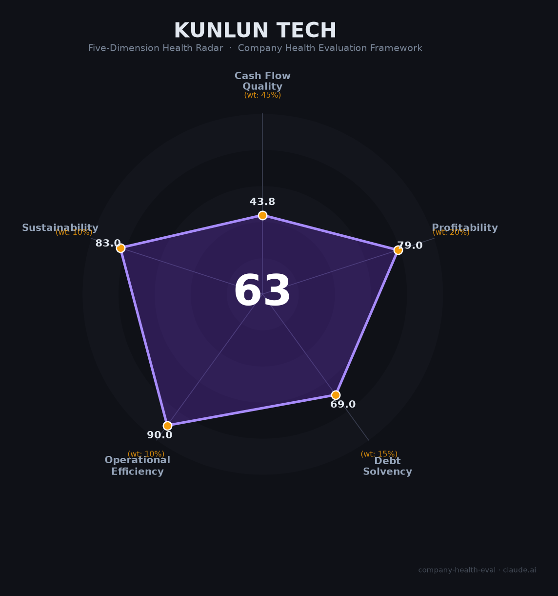

# 昆仑万维 财务健康评估（2026-06-12）

## 一句话结论

🟠 **中等（63.2/100）** | AI营收暴增252%（¥23.7亿）+天工GAIA全球第一+Opera 3亿MAU流量壁垒；唯两年累亏32亿+OCF转负+现金仅够2个月是生存级风险

---

## 一、公司基本画像

| 项目 | 内容 |
|------|------|
| **全称** | 昆仑万维科技股份有限公司（Kunlun Tech Co., Ltd.） |
| **上市** | 深交所创业板300418.SZ（2015年1月） |
| **创始人/实控人** | 周亚辉（直接+间接持股约27%） |
| **员工** | 2,394人（2025年），研发占比~61%，博士100+ |
| **主营业务** | Opera广告（37%）+AI短剧（20%）+Opera搜索（19%）+AI软件（3%）+游戏（4%） |
| **2025年营收** | 81.98亿元（+44.78%） |
| **2025年净利润** | -15.93亿元（连亏两年，累计-31.88亿） |
| **天工AI收入** | 23.69亿元（+251.74%，占总营收28.9%） |
| **海外收入** | 94.2%（77.23亿），A股最国际化的AI公司 |
| **市值** | ~480亿元（2026年6月） |

昆仑万维是中国互联网公司中转型最激进、最彻底的企业之一——从2015年上市时85%收入来自游戏，到2025年游戏仅占4.3%，全面转型为"AI大模型+Opera浏览器+短剧平台"的全球化AI公司。天工超级智能体在GAIA评测中以82.42分登顶全球第一，推理成本仅为OpenAI的40%。

---

## 二、五维财务健康评估

### 1. 现金流质量（43.8/100）

| 指标 | 状态 | 详情 |
|------|------|------|
| 经营现金流净额 | ⚠️ 关注 | 2022-2024年为正（8.3→8.9→2.9亿），2025年转负（-7.36亿）。Q1 2026恢复至+0.89亿，呈"时正时负" |
| 现金及等价物 | 🔴 危险 | 现金仅17.89亿元。年运营现金支出约9-10亿（COGS 2.5亿+S&M 4.2亿+R&D 1.7亿+G&A），现金覆盖约2个月 |
| 有息负债 | ✅ 健康 | 有息负债率仅6.1%（12.3亿/202亿总资产），整体杠杆极低 |
| 净现比 | 🔴 危险 | 连续亏损，OCF/NI无意义 |

现金仅够约2个月是昆仑万维最紧迫的财务风险。但有利因素是：①Q1 2026 OCF已转正（+0.89亿），②公司已申请12.7亿元银行授信，③Opera广告和短剧ARR（年化超5.7亿美元）提供稳定的现金流入预期。

### 2. 盈利能力（79.0/100）

| 指标 | 等级 | 详情 |
|------|------|------|
| 毛利率 | 🌟 卓越 | 69.1%（2025年）。但需注意分业务差异：搜索95% vs 广告51% vs AI软件-13.6%（负毛利投入期） |
| 净利率 | ⚠️ 预警 | -19.4%。主因销售费用41.8亿（+82%，费率51%）——AI短剧+DramaWave的全球获客成本巨大 |
| 营收增速 | 🌟 卓越 | 3年CAGR约20%，2025年加速至45%。天工AI +252%、短剧+865% |
| 研发费用率 | 🌟 卓越 | 20.4%（16.8亿），处于10-25%最优区间。2024年峰值27.2%，2025年因营收增速>研发增速而回落 |
| 人均产出 | 🌟 卓越 | 342万元/人（+28%），A股游戏公司第一。人均效率在AI转型中持续提升而非下降 |

盈利能力存在有趣的矛盾——毛利率69%属于顶级水平（搜索95%/短剧96%极高毛利），但净利率-19.4%因销售费用率51%拖垮。本质上昆仑万维正在以短期亏损换取全球用户规模（DramaWave 8000万MAU、Opera 2.89亿MAU），这是典型的平台扩张期财务特征。

### 3. 偿债能力（69.0/100）

资产负债率仅22.7%、有息负债率6.1%——财务杠杆在A股科技公司中处于极低水平。周亚辉承诺不减持至2029年，大股东无质押爆仓风险。核心风险不在偿债而在流动性（现金覆盖不足）。

### 4. 运营效率（90.0/100）

DSO从60天（2022）逐年改善至40天（2025），回款效率持续提升。员工增长13%的同时人均产出增长28%，AI替代基础岗位（工具覆盖率90%）显著提升了运营效率。

### 5. 可持续发展（83.0/100）

天工AI技术壁垒深厚（GAIA #1 + SkyReels V4 #1 + Mureka V9），Opera全球近3亿MAU是A股最稀缺的海外流量资产。94%收入来自海外，短剧ARR超5.7亿美元，AI收入+252%。主要外部风险是海外数据合规（GDPR/CCPA/中国数据出境法）和AI监管趋严。

---

## 三、综合评分与健康等级

| 维度 | 得分 | 权重 | 加权得分 |
|------|:----:|:----:|:--------:|
| 现金流质量 | 43.8 | 45% | 19.7 |
| 盈利能力 | 79.0 | 20% | 15.8 |
| 偿债能力 | 69.0 | 15% | 10.3 |
| 运营效率 | 90.0 | 10% | 9.0 |
| 可持续发展 | 83.0 | 10% | 8.3 |
| **综合得分** | **63.2** | **100%** | **63.2/100** |

**健康等级：🟠 中等（Moderate）**

---

## 四、核心风险清单

1. **现金仅够2个月（极高风险）**：17.89亿现金 vs 月均8000万+现金消耗。虽Q1 2026 OCF转正，但仍脆弱。若短剧买量回报率下降或AI投入持续增加，资金链压力将骤升。

2. **两年累亏32亿+销售费用率51%（高风险）**：短剧和AI产品全球买量获客成本极高。2026Q1亏损继续扩大（-8.87亿，同比+15%），盈利拐点推迟。

3. **商誉51.5亿减值风险（高风险）**：Opera（30亿+商誉）MAU从3.24亿持续下滑至2.89亿。若用户基础进一步萎缩触发减值，单年亏损可能达数十亿。

4. **A股AI估值泡沫（中风险）**：PS约6倍，靠AI概念支撑。若AI板块情绪降温或营收增速放缓（低于40%），估值回调空间较大。

---

## 五、求职/择业视角

**核心优势**：AI技术积累全球领先（GAIA第一）、薪酬A股游戏公司第一（人均72.6万）、Opera 3亿MAU为全球AI产品提供低成本分发渠道、Token补贴制度（700元/月）独一无二。

**现存短板**：两年累亏31.88亿财务压力大、全员AI化KPI考核末位淘汰5-20%、游戏到AI转型中组织文化剧烈调整、面试流程被吐槽混乱。

**适合人群**：看好AI+全球化赛道、愿赌"烧钱换规模"终局、能接受创业公司式高强度和高不确定性。

---

*评估日期：2026年6月12日 | 数据截至：昆仑万维2025年年报（2026年4月24日发布）*
