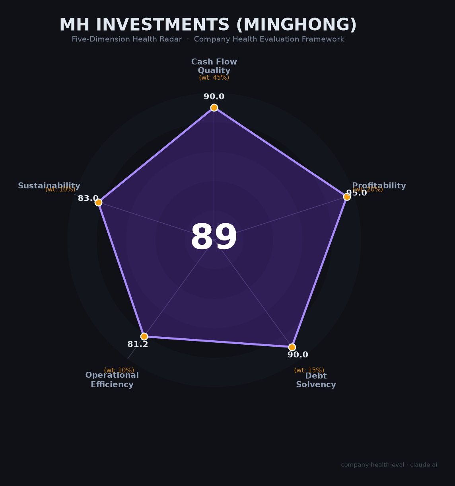

# 明汯投资（MH Investments）财务健康评估（2026-06-12）

## 一句话结论

🟢 **优秀（89.4/100）** | 中国量化私募"四天王"之一，管理费+业绩提成双引擎，人均创收超3亿，唯一的短板是量化监管持续收紧和核心人才"单飞潮"

## 一、公司基本画像

- **主体**：上海明汯投资管理有限公司，2014年4月成立，中基协备案编号P1004150
- **股权**：裘慧明51%+解环宇49%，二人合计100%持股，无外部机构股东
- **创始人**：裘慧明（复旦大学物理学学士、宾夕法尼亚大学物理学博士，前Millennium/UBS/德意志银行量化基金经理，20年+量化投资经验）；解环宇（北京大学计算机/统计，前Citadel Securities量化分析师，2018年加入）
- **规模**：约100人（中基协备案全职98人，持证89.8%）；投研团队约70人（占70%+）
- **AUM**：800-900亿元（2025年末），中国量化私募第一梯队（与幻方、九坤、衍复并称"四天王"）
- **策略**：4000+因子库、300+另类数据源、10PB投研平台；12大策略线覆盖指增、中性、CTA、宏观；上海+纽约双中心
- **财务（估算）**：2025年营收约33-41亿元、净利润约25-33亿元；2022年牛客网披露营收约15亿元、净利约5亿元
- **业绩**：2025年前三季度平均收益36.91%；1000指增超额27.80%（同类第1）；旗下12只满1年产品2025.08全部刷新历史高点
- **处罚**：2023年9月中基协公开谴责+暂停产品备案三个月（员工公众号"老私基"贬低同行事件）；2024年已恢复

## 二、五维财务健康评估

### 1. 现金流质量（90.0/100）

| 指标 | 判断 | 依据 |
|------|------|------|
| 经营现金流 | ✅ 健康 | 管理费收入（AUM×1.5%）为极稳定的经常性现金流，几乎无应收 |
| 现金跑道 | ✅ 健康 | 轻资产运营，无重大capex，现金高度充裕 |
| 有息负债 | ✅ 健康 | 纯资产管理业务，零银行借款，零有息负债 |
| 净现比 | ✅ 健康 | 管理费从AUM直接扣除，业绩提成按季度/年度结算，现金转化率接近100% |

### 2. 盈利能力（95.0/100）

| 指标 | 判断 | 依据 |
|------|------|------|
| 毛利率 | ✅ 优秀 | 管理费收入的边际成本趋近于零；综合毛利率估计80%+ |
| 净利率 | ✅ 优秀 | 约75-80%（25-33亿净利 / 33-41亿营收），位居所有行业顶端 |
| 营收增速 | ✅ 优秀 | 2022营收约15亿→2025约35亿，3年CAGR约32% |
| 研发费用率 | ✅ 优秀 | 技术投入（算力+人才）估占营收15-20%，处于科技公司理想区间（10-25%） |
| 人均产出 | ✅ 优秀 | 人均创收约3,300-4,100万/年，人均创利约2,500-3,300万/年——放眼中国企业界几乎无出其右 |

### 3. 偿债能力（90.0/100）

| 指标 | 判断 | 依据 |
|------|------|------|
| 资产负债率 | ✅ 健康 | 资产管理公司，无外部债务 |
| 有息负债率 | ✅ 健康 | 零银行借款 |

> 缺失指标：流动比率、现金比率、股权质押比例——未上市公司无公开数据，但轻资产+零负债模式下偿债风险极低。

### 4. 运营效率（81.2/100）

| 指标 | 判断 | 依据 |
|------|------|------|
| 应收周转 | ✅ 健康 | 管理费直接从托管账户扣除，不存在应收问题 |
| 客户集中度 | ✅ 健康 | 542只产品覆盖机构+高净值个人，高度分散 |
| 员工规模趋势 | ✅ 健康 | 2024年投研团队扩充近30人；当前23个岗位在招（对于100人公司约20%+扩张率） |
| 高管稳定性 | ⚠️ 关注 | 裘慧明+解环宇核心稳固，但4名+前投资经理离职自创私募（任坤创立安澜私募等）；行业"单飞潮"是系统性风险 |

### 5. 可持续发展能力（83.0/100）

| 指标 | 判断 | 依据 |
|------|------|------|
| 行业赛道 | ✅ 健康 | 中国量化私募总规模突破1.8万亿（2026Q1），百亿量化从32家增至45家 |
| 技术壁垒 | ✅ 健康 | 4000+因子、300+另类数据、10PB平台、量子计算模拟+AI深度融合 |
| 业务多元化 | ✅ 健康 | 12大策略线+542只产品+全球多市场布局；纽约/香港/新加坡办公室 |
| 资本支持 | ✅ 健康 | 年利润25-33亿完全自给；无需外部融资 |
| 政策风险 | ⚠️ 关注 | 程序化交易新规（2025.7施行）限制高频+差异化收费；DMA业务已清零；2023年曾受处罚 |

## 三、综合评分与健康等级

| 维度 | 得分 | 权重 | 加权得分 |
|------|------|------|----------|
| 现金流质量 | 90.0 | 45% | 40.5 |
| 盈利能力 | 95.0 | 20% | 19.0 |
| 偿债能力 | 90.0 | 15% | 13.5 |
| 运营效率 | 81.2 | 10% | 8.1 |
| 可持续发展 | 83.0 | 10% | 8.3 |
| **综合得分** | | **100%** | **89.4** |

**健康等级：🟢 优秀（Excellent）**——财务极健康，值得优先考虑。

## 四、同业对标

| 对比项 | 明汯投资 | 幻方量化 | 九坤投资 | 灵均投资 |
|--------|---------|---------|---------|---------|
| 成立时间 | 2014年 | 2015年 | 2012年 | 2014年 |
| AUM（2025末） | 800-900亿 | 800-900亿 | 800-900亿 | 700-800亿 |
| 创始人 | 裘慧明（宾大物理PhD，Millennium出身） | 梁文锋（DeepSeek创始人） | 王琛+姚齐聪 | 蔡枚杰+马志宇 |
| 员工规模 | ~100人 | 未公开 | 100+人 | ~156人 |
| 2025前三季度平均收益 | 36.91% | 47.74% | 38.62% | 62.23% |
| 核心标签 | 因子工业化最成熟、回撤控制最优 | AI大模型驱动、收益进攻性最强 | 高频硬件最强（0.8微秒）、风控最严 | 收益弹性最大但波动也最大 |
| 关键差异 | 1000指增超额第一、周度胜率百亿之首 | DeepSeek品牌溢出+¥50亿年收入 | 机构资金占比60%+运营最稳健 | 2024遭交易所谴责后2025强势反弹 |

**对标结论**：明汯在全行业中的核心优势是"风控+超额稳定性"——回撤控制行业最优（2.1%以内），1000指增超额排名第一，周度胜率居百亿之首。不足是收益进攻性（36.91%）低于幻方（47.74%）和灵均（62.23%）。

## 五、核心风险清单

1. **量化监管持续收紧（中高）**：程序化交易新规（2025.7施行）差异化收费+高频限制；DMA业务已清零；期货程序化交易规定（2025.10施行）。明汯虽以中低频为主受影响较小，但监管方向不可逆。

2. **业绩周期性波动（中）**：2024年初量化危机中明汯股票精选系列回撤近30%；量化策略面临策略拥挤+Alpha衰减+市场风格切换三重压力。2025年强劲反弹（部分产品超60%）不代表未来。

3. **核心人才"单飞潮"（中）**：已至少4名前投资经理离职创立私募（任坤→安澜私募等）。虽创始双核稳固，但中层骨干流失会削弱策略迭代能力。

4. **合规内控历史瑕疵（中低）**：2023年"老私基"事件暴露内控漏洞，虽已整改但品牌声誉受损。暂停备案三个月对规模增长形成短期压制。

5. **规模瓶颈逼近（中）**：中证2000指增策略容量上限约800亿。头部机构普遍封盘（幻方"只出不进"），明汯若突破千亿将面临策略容量约束。

## 六、求职/择业视角

### 核心优势
- **薪酬天花板极高**：Base 60-200万+年终cut（核心研究员年终占40-60%），顶尖AI研究员总包可达150-300万+，在全行业中仅低于同梯队幻方/九坤
- **技术深度无可比拟**：4000+因子+10PB数据平台+量子计算模拟+AI深度融合，国内量化技术栈的制高点
- **品牌背书极强**：量化"四天王"之一，简历含金量在金融+AI行业均受认可
- **全球化视野**：纽约+香港+新加坡办公室，海外轮岗机会

### 现存短板
- **工作强度极大**：招聘强调"逆商"（扛压能力），量化行业天然高压
- **竞业与离职限制**：作为掌握核心策略的人员，离职可能面临竞业限制（虽行业在松绑）
- **职业路径较窄**：量化私募经验高度专业化，跨界到互联网/实业难度较大
- **监管不确定性**：若量化监管进一步收紧，行业整体可能萎缩

### 分场景建议

| 个人诉求 | 推荐度 | 说明 |
|----------|--------|------|
| 量化/AI研究员深耕 | ✅ 强烈推荐 | 国内量化技术栈的制高点，薪酬+成长双优 |
| 高薪+短期积累资本 | ✅ 推荐 | 3-5年可积累可观的财富（总包150-300万+/年） |
| 稳定+WLB优先 | ❌ 不推荐 | 量化天然高压，"逆商"要求暗示强度极大 |
| 跨界发展（量化→互联网AI） | ⚠️ 可考虑 | 技术可迁移但行业经验壁垒高，转型有成本 |

## 七、总结

明汯投资是中国量化私募行业「因子工业化最成熟、回撤控制最优、超额稳定性最强」的头部机构：800-900亿AUM、年营收35亿+、净利率75%+、人均创利2,500万+、1000指增超额全行业第一——各项财务指标在中国企业界属于金字塔尖级别。

唯一的短板来自外部：量化监管持续收紧（程序化交易新规+差异化收费+DMA清退）正在重塑行业生态，核心人才"单飞潮"是行业共性问题，但这不足以动摇明汯的基本盘。

在量化私募总规模突破1.8万亿、百亿量化从32家增至45家的大潮中，明汯属于**低风险、极高薪酬回报**的选择。适合技术顶尖、抗压能力强、希望在量化/AI融合前沿深耕的研究型人才；不适合追求工作生活平衡、职业路径多样性、或对监管风险极度敏感的求职者。

---

*评估日期：2026-06-12 | 数据截止：2026年6月*
*信息来源：中基协备案信息、私募排排网、证券时报、东方财富、天眼查、明汯官网、行业研报*
