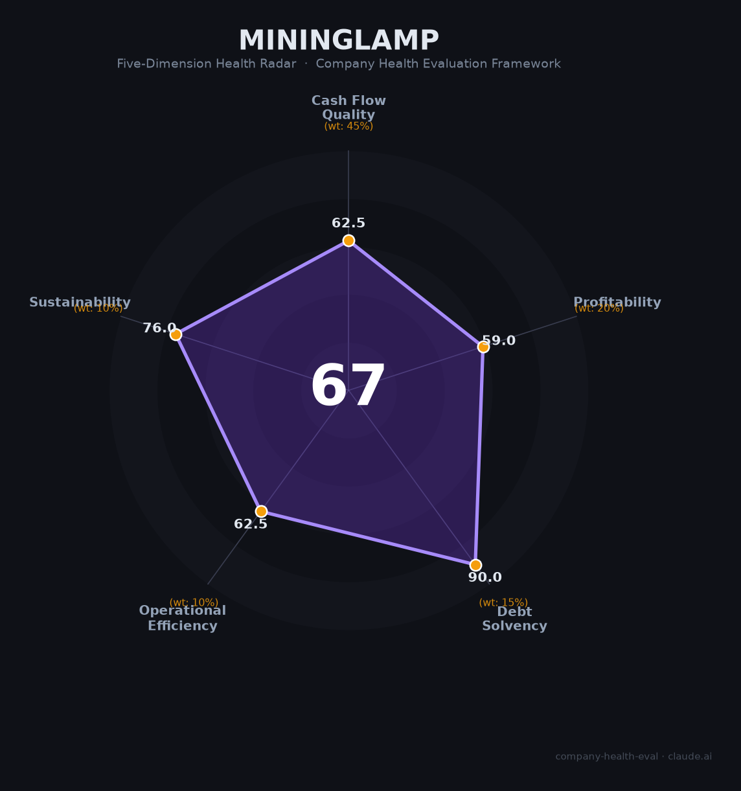

# 明略科技（MiningLamp）财务健康评估（2026-06-12）

## 一句话结论

🟠 **中等（67/100）** | "全球Agentic AI第一股"首年盈利，IPO现金充裕但传统业务停滞+7月95%解禁是最大定时炸弹

---

## 一、公司基本画像

- **主体**：明略科技集团（MiningLamp Technology），2006年从秒针系统起步，2019年正式成立集团，2025年11月3日港交所主板上市（02718.HK）
- **股权结构**：腾讯持股25.96%（第一大外部股东），创始人吴明辉持股10.28%但通过AB股架构拥有53.54%投票权，红杉中国7.46%，淡马锡4.14%
- **规模**：约1,400人（从2021年巅峰5,000人锐减72%），内部运行3,000+ AI Agent
- **主营**：营销智能（秒针系统，占50%）+ 营运智能（38%）+ Agentic Services（7%，新增长引擎）
- **资质**：港股主板上市、国家新一代AI开放创新平台（营销智能）、Mano GUI模型OSWorld全球第一
- **融资状态**：累计融资超50亿元，IPO募资净额约9.02亿港元（发行价141港元/股），2026年6月纳入港股通

**一句话定性**：从广告监测起家的AI老兵，以"Agentic AI第一股"概念港股上市，2025年首次经调整盈利，但营收增长停滞（+3.2%）、传统业务萎缩、7月31日95%股份解禁是核心风险。

---

## 二、五维财务健康评估

### 1. 现金流质量（63/100）

| 指标 | 判定 | 依据 |
|------|:--:|------|
| 经营现金流净额 | 🟡 关注 | 2025年首次转正（+1,803万），但仅一年数据，此前连续多年为负 |
| 现金及等价物 | 🟢 健康 | IPO后现金13.82亿元，按当前消耗速度可覆盖多年 |
| 有息负债 | 🟢 健康 | 资产负债率仅28.58%，几乎零有息负债 |
| 净现比 | 🔴 危险 | OCF（+1,803万）/ 经调整净利润（+4,204万）= 0.43，不足50%的利润转化为现金 |

**核心判断**：IPO后现金充裕、负债极低，且OCF首次转正——这些都是积极信号。但净现比仅0.43，说明利润质量一般（应收或营运资金占用较大）。整体从"烧钱"模式向"造血"模式过渡中。

### 2. 盈利能力（59/100）

| 指标 | 判定 | 依据 |
|------|:--:|------|
| 毛利率 | 🟡 良好 | 55.4%（2025），处于企业级软件/AI服务行业中等偏上水平 |
| 净利率 | 🟠 一般 | 经调整净利率2.9%（首次盈利），绝对值仍薄 |
| 营收增速（3年CAGR） | 🟠 一般 | 2022-2025 CAGR约4%，传统营销智能业务（占93%）增长停滞甚至萎缩 |
| 研发费用率 | 🟡 良好 | 25.3%，略超10-25%黄金区间上限但整体合理 |
| 人均产出 | 🟠 一般 | 人均营收约102万元（按1,400人计），企业服务行业中等水平 |

**核心判断**：首次经调整盈利（+4,204万）是重要里程碑，但建立在极端降本基础上（裁员72%、研发投入从7.51亿砍至3.61亿）。营收增速仅3.2%，传统业务停滞，新业务（Agentic Services）仅占7%——盈利质量有待收入端验证。

### 3. 偿债能力（90/100）

| 指标 | 判定 | 依据 |
|------|:--:|------|
| 资产负债率 | 🟢 健康 | 28.58%，远低于40%阈值 |
| 有息负债率 | 🟢 健康 | IPO后现金充足，几乎零有息负债 |
| 流动比率 | 🟢 健康 | 现金13.82亿 + 其他流动资产 vs 流动负债9.32亿，比率>2 |
| 现金比率 | 🟢 健康 | 现金13.82亿 / 流动负债9.32亿 = 1.48 |
| 股权质押 | 🟢 健康 | 未发现控股股东股权质押 |

**核心判断**：IPO后资产负债表极为干净，偿债无任何压力。唯一隐患是现金能否在收入恢复增长前被合理使用，而非被低效消耗。

### 4. 运营效率（63/100）

| 指标 | 判定 | 依据 |
|------|:--:|------|
| 应收周转 | 🟡 关注 | 企业级服务以大型客户为主，回款周期通常较长（估算90-180天），但无精确数据 |
| 客户集中度 | 🟢 健康 | 2,100+品牌客户、24万+企业用户，大客户续约率96% |
| 员工规模趋势 | 🔴 危险 | 5,000人→1,400人（-72%），经历多轮大规模裁员，毁约校招offer、拖欠赔偿等劳动纠纷 |
| 高管稳定性 | 🟢 健康 | 创始人吴明辉稳固（持股10%+AB股54%投票权），上市前管理层正常搭建，无离职 |

**核心判断**：客户留存率极高（96%）体现产品粘性，但员工端经历了极端压缩——裁员72%虽帮助公司扭亏，也留下了劳动纠纷和人才流失的后遗症。这是典型的"财务止损优先于人才保留"策略。

### 5. 可持续发展能力（76/100）

| 指标 | 判定 | 依据 |
|------|:--:|------|
| 行业赛道空间 | 🟢 健康 | 中国企业级AI Agent市场2025年212亿→2026年449亿（+112%），CAGR超100% |
| 技术壁垒 | 🟡 关注 | Mano GUI模型OSWorld全球第一、2,322项专利、Octo开源平台，但大厂和开源社区竞争激烈 |
| 客户/业务多元化 | 🟢 健康 | 营销智能+营运智能+Agentic Services三线，覆盖汽车/消费电子/跨国品牌 |
| 融资/资本支持 | 🟡 关注 | 已上市但7月31日95%股份解禁（~319亿港元），腾讯等基石投资者是否减持是最大不确定性 |
| 政策/监管风险 | 🟢 健康 | 2026年5月AI Agent首部专项政策出台，"私有化部署+开源可审计"策略合规友好 |

**核心判断**：赛道正处于爆发期，技术有差异化（Mano OSWorld第一），多元客户结构健康。最大不确定性来自资本市场——7月解禁潮的抛压可能在短期严重冲击股价和融资能力。

---

## 三、综合评分与健康等级

| 维度 | 得分 | 权重 | 加权得分 |
|------|:----:|:----:|:--------:|
| 现金流质量 | 63 | 45% | 28.1 |
| 盈利能力 | 59 | 20% | 11.8 |
| 偿债能力 | 90 | 15% | 13.5 |
| 运营效率 | 63 | 10% | 6.2 |
| 可持续发展 | 76 | 10% | 7.6 |
| **综合得分** | | | **67/100** |
| **健康等级** | | | 🟠 **中等（Moderate）** |

---

## 四、同业对标

| 对比项 | 明略科技 | 海致科技 | 第四范式 |
|--------|---------|---------|---------|
| 股票代码 | 02718.HK | 02706.HK | 06682.HK |
| 市值 | ~356亿港元 | ~223亿港元 | ~194亿港元 |
| 2025年营收 | 14.26亿元 | 6.21亿元 | 71.35亿元 |
| 营收增速 | +3.2% | +23.4% | +35.6% |
| 毛利率 | 55.4% | 43.3% | 34.8% |
| Agent业务占比 | ~7%（首年1亿） | 23.5%（1.46亿） | ~7%（5.03亿） |
| PS（市销率） | ~21倍 | ~33倍 | ~2.5倍 |
| 盈利状态 | 经调整+4,204万（首盈） | 经调整+2,415万 | 调整后+1,784万 |
| 员工数 | ~1,400 | 721 | 619 |
| 核心差异 | 营销智能+Agent协作 | 知识图谱+除幻 | AI平台规模最大 |

**对标结论**：明略科技在"港股AI三兄弟"中营收规模居中（14.26亿 vs 第四范式71亿 vs 海致6.21亿），毛利率最高（55.4%），PS估值居中（21倍）。核心问题在于营收增速（3.2%）远低于海致（23.4%）和第四范式（35.6%），市场对其"AI公司"定位存疑。

---

## 五、核心风险清单

1. **7月31日解禁潮（极高）**：95%股份（~319亿港元）获得流通权，腾讯等基石投资者的任何减持都将对当前流通盘极小的股价形成巨大冲击。次新股解禁后30个交易日平均跌幅15-30%。

2. **营收增长停滞（高）**：2025年营收+3.2%，传统营销智能（占50%）同比-1.7%。Agentic Services虽首年破亿但仅占7%，"新引擎"替代"旧引擎"的速度远不够快。

3. **极端裁员后遗症（中高）**：从5,000人裁至1,400人（-72%），拖欠赔偿、毁约校招offer、年终奖取消等劳动纠纷频发。员工口碑以负面为主（70-80%），人才吸引力下降。

4. **暴涨暴跌的股价（中高）**：155-357港元区间振幅超130%。纳入港股通后反跌，"利好出尽"模式明显。极小的流通盘（~5%）使股价不具备真实价格发现功能。

5. **研发投入大幅削减（中）**：研发开支从7.51亿（2022）降至3.61亿（2025），下降52%。在AI Agent赛道加速竞争的环境下，研发投入不足可能削弱长期技术竞争力。

6. **AI Agent监管趋严（中）**：2026年5月首部Agent专项监管政策出台，分类分级治理、决策权限边界等要求将增加1,000-3,000万级合规成本。

---

## 六、求职/择业视角

### 核心优势
- **Agentic AI赛道前沿**：3,000+ Agent协同工作的"人+AI"新型组织实验，在行业内有先发经验价值
- **上市平台稳定性**：港股主板上市公司，公积金12%全额缴纳，基本福利有保障
- **大客户经验丰富**：服务135家财富500强，对简历有背书价值
- **吴明辉技术背景**：创始人北大数学+计算机，HAO理论提出者，技术氛围尚可

### 现存短板
- **裁员阴影未散**：72%的裁员幅度、毁offer历史，在职员工稳定性焦虑高
- **薪资竞争力不足**：人均现金薪酬17-25万/年，远低于AI行业平均水平（30-50万+）
- **股价剧烈波动**：期权/股票激励的价值极不确定
- **业务增长乏力**：传统营销智能萎缩，新业务体量小，职业成长空间受限
- **研发投入腰斩**：从7.51亿降至3.61亿，技术投入收缩可能影响个人技术成长

### 分场景建议

| 个人诉求 | 推荐 | 次选 | 规避 |
|----------|------|------|------|
| 稳定+深耕 | 第四范式（规模大、已盈利） | 明略科技（上市平台稳定） | — |
| 高薪+跳板 | 字节/阿里（大厂品牌） | 第四范式 | 明略（薪酬偏低） |
| AI Agent赛道经验 | **明略科技（3,000+Agent落地经验独特）** | 海致科技 | — |
| WLB+安全 | — | — | 明略（裁员历史+口碑差） |

---

## 七、总结

明略科技是企业级AI Agent赛道「上市最早、概念最纯、但增长最慢」的港股标的：毛利率55%行业领先，首次经调整盈利标志转折点，3,000+ Agent内部运行经验在行业内独特。但营收增速仅3.2%、传统业务萎缩、裁员72%的劳动纠纷后遗症，以及7月31日95%股份解禁——这四重压力使公司处于"概念好但基本面弱"的尴尬位置。

在AI Agent赛道确定性爆发但公司自身增长乏力的大环境下，明略科技属于**中等风险、中等回报**的选择。适合追求Agent赛道独特经验、能接受薪资偏低和潜在裁员风险的人；不适合追求高增长、高现金薪酬或稳定性的人。**核心关注信号：2026年8月半年报——若Agentic Services超3亿且总营收增速恢复至15%+，则基本面拐点确认；若继续低于10%增长，则"AI故事"将更难自圆其说。**

---

*评估日期：2026-06-12 | 数据来源：港交所年报（2025）、招股书、券商研报、公开报道*
*评分引擎：company-health-eval v1.0 | 雷达图：MiningLamp_health_radar.png*
