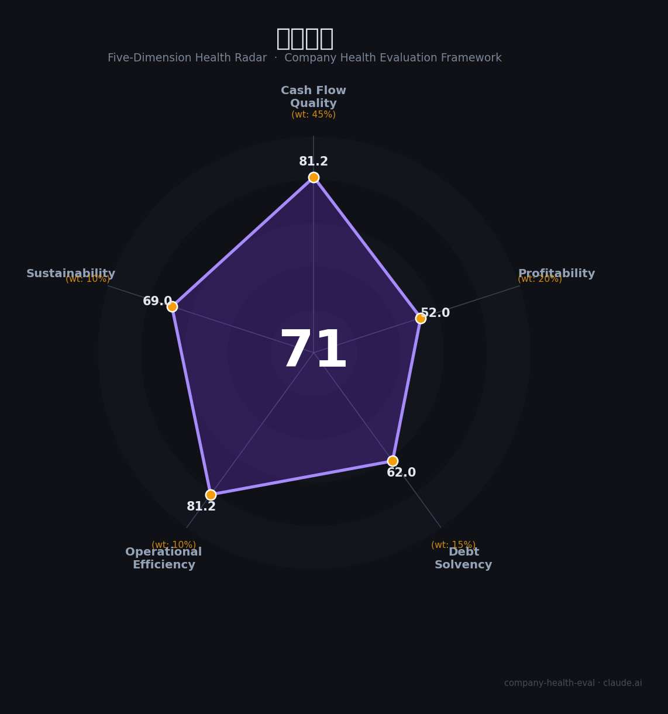

# 明阳电路（300739.SZ）财务健康评估（2026-08-14）

## 一句话结论

🟡 **71/100，中等偏上** | 中小批PCB，营收+净利修复

---

## 一、公司基本画像

| 项目 | 内容 |
|------|------|
| 主营 | PCB样板/小批量 |
| 财务 | 2025营收18.6亿(+19.35%)，归母净利0.83亿(+628.58%) |

> 一句话定性：样板小批PCB厂商，营收净利修复

---

## 二、五维财务健康评估

### 1. 现金流质量（81/100）| 权重45%

现金流良好。

### 2. 盈利能力（52/100）| 权重20%

净利修复(+629%)。

### 3. 偿债能力（62/100）| 权重15%

负债适中。

### 4. 运营效率（81/100）| 权重10%

运营效率提升。

### 5. 可持续发展（69/100）| 权重10%

AI+服务器PCB需求回暖。

---

## 三、综合评分

| 维度 | 得分 | 权重 | 加权 |
|------|:----:|:----:|:----:|
| 现金流质量 | 81 | 45% | 36.5 |
| 盈利能力 | 52 | 20% | 10.4 |
| 偿债能力 | 62 | 15% | 9.3 |
| 运营效率 | 81 | 10% | 8.1 |
| 可持续发展 | 69 | 10% | 6.9 |
| **综合得分** | **71/100** | 100% | 71.3 |

**健康等级：中等偏上** — 整体稳健，局部有待改善

---

## 四、核心风险清单

1. **基数低**
2. **PCB竞争**
3. **小盘波动**

## 五、求职/择业视角

### 核心优势
- 样板/小批PCB专业、净利修复
### 现有短板
- 规模较小、盈利基数低

**结论**：明阳电路样板小批PCB厂商，营收净利大增、净利修复，小盘弹性、观察持续。

---

*评估方法：商泰汽车（iAUTO）五维框架 · 数据截至2026年8月 · 财务来源明阳电路2025年报*