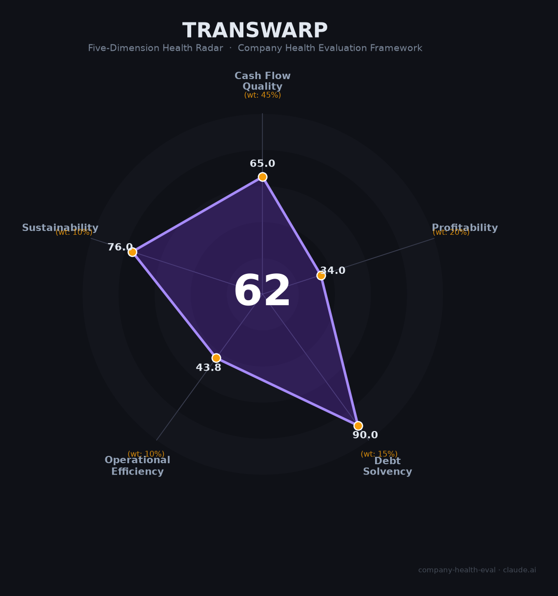

# 星环科技（Transwarp）财务健康评估（2026-06-12）

## 一句话结论

🟠 **中等（62/100）** | 大数据基础软件信创标的，亏损收窄港股冲刺中，应收账款恶化+持续裁员是核心失血点

---

## 一、公司基本画像

- **主体**：星环信息科技（上海）股份有限公司，2013年6月成立，2022年10月科创板上市（688031.SH）
- **股权结构**：孙元浩（实控人，直接9.22%+员工平台6.22%），腾讯林芝利创（6.00%持续减持中），国家军民融合基金（5.58%），联合创始人范磊（5.01%，部分股份遭司法冻结）
- **规模**：897人（2025年末），较2023年高点1,193人缩减25%，研发327人（36%）
- **主营**：大数据基础软件（数据湖/仓库/分布式计算）+ Sophon LLMOps平台（Agent全生命周期管理）+ 数据治理Agent Astro
- **资质**：科创板上市、信创基础软件厂商、港股二次上市已获证监会备案
- **融资状态**：上市前累计融资约14.81亿元，IPO募资14.30亿元，拟港股二次上市（不超过2,458万股H股）

**一句话定性**：A股科创板大数据基础软件厂商，营收4.48亿亏损收窄中，信创政策利好但自身造血能力不足，正冲刺港股二次上市寻求续命资金。

---

## 二、五维财务健康评估

### 1. 现金流质量（65/100）

| 指标 | 判定 | 依据 |
|------|:--:|------|
| 经营现金流净额 | 🔴 危险 | 连续3年为负（2023: -3.65亿, 2024: -3.27亿, 2025: -1.10亿），虽大幅改善但仍未转正 |
| 现金及等价物 | 🟢 健康 | 2025年末3.54亿元，按年烧钱1.1亿计算可覆盖3年+，但2026年1月末已降至2.52亿 |
| 有息负债 | 🟢 健康 | 有息负债率仅3.85%，几乎零杠杆 |
| 净现比 | — 缺失 | 持续亏损状态下不适用 |

**核心判断**：OCF连续三年为负但改善显著（2025年改善66%），现金储备按当前消耗速度尚可支撑2-3年，但消耗速度需持续关注。零有息负债是亮点。

### 2. 盈利能力（34/100）

| 指标 | 判定 | 依据 |
|------|:--:|------|
| 毛利率 | 🟡 良好 | 54.14%（2025），软件产品分项毛利率63.32%，处于行业中等偏上 |
| 净利率 | 🔴 预警 | -54.7%，深度亏损，累计未弥补亏损15.64亿元 |
| 营收增速（3年CAGR） | 🟠 一般 | 2022-2025 CAGR约6.3%，2024年曾大幅下滑24%，2025年恢复增长20% |
| 研发费用率 | 🔴 预警 | 55.98%且深度亏损，远超35%红线 |
| 人均产出 | 🔴 预警 | 人均营收约50万元，远低于IT行业平均（80-150万），更不及第四范式（1,153万） |

**核心判断**：毛利率尚可但被高昂的费用率吞噬——销售费用占35.7%、研发占56%，营收规模过小（4.48亿）难以覆盖固定成本。人均产出仅50万，效率改善空间巨大。

### 3. 偿债能力（90/100）

| 指标 | 判定 | 依据 |
|------|:--:|------|
| 资产负债率 | 🟢 健康 | 26.78%，远低于40%阈值 |
| 有息负债率 | 🟢 健康 | 3.85%，几乎零有息负债 |
| 流动比率 | 🟢 健康 | 现金充足，短期偿债无压力 |
| 现金比率 | 🟢 健康 | 高现金、低负债 |
| 股权质押 | 🟢 健康 | 无控股股东股权质押 |

**核心判断**：科创板上市公司的典型资产负债表——轻资产、低负债、高现金（尽管在消耗）。偿债能力不是当前核心问题，现金流持续性能才是。

### 4. 运营效率（44/100）

| 指标 | 判定 | 依据 |
|------|:--:|------|
| 应收周转 | 🔴 危险 | 应收账款3.45亿/营收4.48亿=77%，周转天数约281天（2024年达342天），远超软件行业正常水平（60-120天） |
| 客户集中度 | 🟢 健康 | 第一大客户仅占5.8%，客户分散度高 |
| 员工规模趋势 | 🔴 危险 | 1,193人→897人，两年缩减25%，媒体报道裁员10-20%，未发年终奖 |
| 高管稳定性 | 🟡 关注 | 2025年监事会三人同时离职（官方称正常换届），核心高管团队（孙元浩等）稳定 |

**核心判断**：运营效率是最大短板——应收账款回收周期极长（近1年），坏账计提比例飙升至24%，上交所已就此发出问询函。叠加持续裁员，运营压力显著。

### 5. 可持续发展能力（76/100）

| 指标 | 判定 | 依据 |
|------|:--:|------|
| 行业赛道空间 | 🟢 健康 | 信创+AI双轮驱动，LLMOps市场CAGR 18.8%，十五五规划明确支持 |
| 技术壁垒 | 🟡 关注 | 分布式数据库+大数据平台有技术积累，89.2%复购率证明客户黏性，但面临云厂商挤压 |
| 客户/业务多元化 | 🟢 健康 | 覆盖金融/政府/能源/电信多行业，软件产品（81%）+解决方案（15%）结构合理 |
| 融资/资本支持 | 🟡 关注 | 已上市但腾讯减持，港股二次上市是关键变量（已获证监会备案，待港交所批准） |
| 政策/监管风险 | 🟢 健康 | 信创国产替代+AI+数据基建均为政策鼓励方向 |

**核心判断**：赛道和政策环境极佳，技术和客户基础扎实。最大的不确定性在于港股上市能否成功——若成功则现金压力大幅缓解，若失败则资金链趋紧。

---

## 三、综合评分与健康等级

| 维度 | 得分 | 权重 | 加权得分 |
|------|:----:|:----:|:--------:|
| 现金流质量 | 65 | 45% | 29.2 |
| 盈利能力 | 34 | 20% | 6.8 |
| 偿债能力 | 90 | 15% | 13.5 |
| 运营效率 | 44 | 10% | 4.4 |
| 可持续发展 | 76 | 10% | 7.6 |
| **综合得分** | | | **62/100** |
| **健康等级** | | | 🟠 **中等（Moderate）** |

---

## 四、同业对标

| 对比项 | 星环科技 | 第四范式 | 海致科技 |
|--------|---------|---------|---------|
| 股票代码 | 688031.SH | 06682.HK | 02706.HK |
| 市值 | 161-183亿元 | ~194亿港元 | ~370亿港元 |
| 2025年营收 | 4.48亿元 | 71.35亿元 | ~5亿元（2024） |
| 人均营收 | ~50万 | ~1,153万 | ~70万 |
| 毛利率 | 54.1% | 34.8% | 38.5% |
| 盈利状态 | -2.45亿（亏损收窄） | +0.18亿（首次盈利） | -0.94亿（2024） |
| 员工数 | 897 | 619 | 721 |
| ML平台份额 | ~2.5% | ~30.4% | 不适用 |
| 核心差异 | 数据基础软件+LLMOps | AI平台+Agent+消费电子 | 知识图谱+图数据库 |

**对标结论**：星环科技在AI/大数据平台赛道中营收规模最小，但毛利率最高（54%），技术路线与第四范式互补（数据层 vs AI应用层）。核心差距在于人效和规模化交付能力——第四范式人均营收是星环的23倍。

---

## 五、核心风险清单

1. **应收账款恶化（高）**：周转天数281-342天，坏账计提飙升至24%，2-3年账龄应收同比增174%。上交所已就此发函问询。若大额坏账实际发生，将直接冲击净资产。

2. **持续亏损与现金消耗（高）**：累计亏损15.64亿，三年OCF净流出超8亿。现金从2024年末5.43亿降至2026年1月末2.52亿，若港股融资失败，2026年底现金可能降至1亿以下。

3. **腾讯持续减持（中高）**：林芝利创从7.71%降至6.00%且仍在减持，重要股东套现信号对市场信心有负面影响。

4. **持续裁员（中）**：两年缩减25%员工，未发年终奖，员工口碑负面（违法辞退、变相加班）。若人才流失加速，将影响产品交付和客户服务能力。

5. **港股上市不确定性（中）**：已获证监会备案但尚需港交所批准。以"特专科技公司"（不满足盈利标准）申请，若再失败将严重打击市场信心。

6. **上交所监管关注（中）**：年报问询涉及Q4收入突击确认、第一大客户真实性、应收坏账、研发资本化等问题，虽已回复但监管关注本身构成风险信号。

---

## 六、求职/择业视角

### 核心优势
- **上海落户支持**：科创板上市公司，有落户名额和补充公积金
- **技术积累扎实**：分布式数据库、大数据平台技术栈通用性强，可迁移至其他基础软件厂商或云厂商
- **信创赛道红利**：国产替代大趋势下，信创基础软件人才需求旺盛
- **校招薪资有竞争力**：应届生18-24K，全额五险一金+补充公积金

### 现存短板
- **裁员风险高**：两年缩减25%，2024年未发年终奖，2026年仍可能进一步压缩
- **员工口碑差**：脉脉/知乎负面评价集中在违法辞退、变相加班
- **现金薪酬竞争力下降**：研发人均55.76万含股份支付，实际现金薪酬低于此数
- **业务天花板明显**：营收仅4.48亿，市占率2.5%，长期增长空间存疑
- **港股IPO是关键变量**：成功则续命2-3年，失败则可能加速收缩

### 分场景建议

| 个人诉求 | 推荐 | 次选 | 规避 |
|----------|------|------|------|
| 稳定+深耕 | 第四范式（已盈利、人均产出极高） | 华为云（信创赛道最强） | 星环（裁员风险高） |
| 高薪+跳板 | 字节/阿里（大厂品牌+高现金） | 第四范式 | 星环（薪酬上限低） |
| 信创赛道+上海落户 | **星环科技（落户支持+基础软件经验）** | 达观数据 | — |
| WLB+稳定 | — | — | 星环（变相加班+裁员） |

---

## 七、总结

星环科技是大数据基础软件赛道「技术扎实、政策顺风、但自我造血不足」的科创板上市公司：毛利率54%行业领先，89%客户复购率证明产品价值，信创+AI双重政策利好。但应收账款恶化（周转281天、坏账24%）、持续亏损（累计15.6亿）、大幅裁员（两年-25%）、腾讯减持——这四重压力使其处于"不成功便成仁"的关键节点。

在信创国产替代确定性趋势但公司基本面承压的大环境下，星环科技属于**中等风险、中等偏下回报**的选择。适合追求信创赛道经验积累和上海落户机会、能承受裁员风险的候选人；不适合追求稳定性、高现金薪酬或WLB的人。

---

*评估日期：2026-06-12 | 数据来源：上市公司年报（2025）、上交所公告、券商研报*
*评分引擎：company-health-eval v1.0 | 雷达图：Transwarp_health_radar.png*
