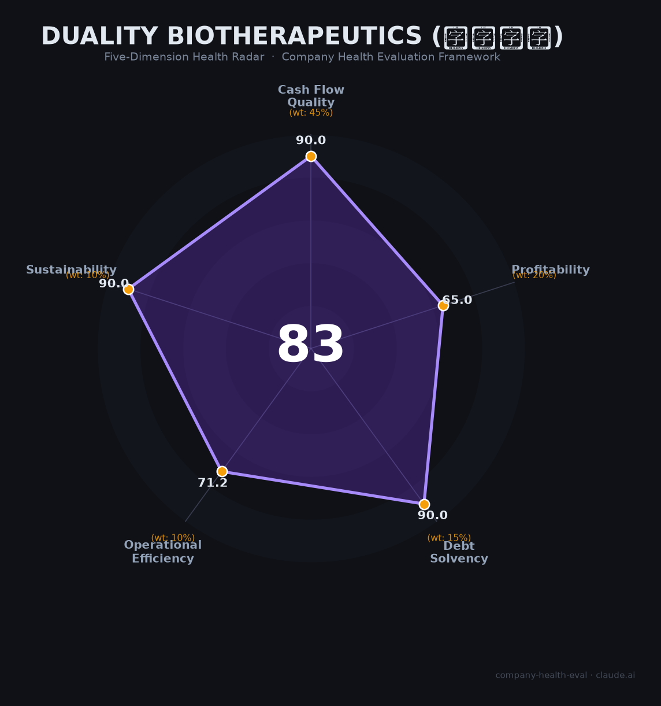

# 映恩生物（Duality Biotherapeutics, 9606.HK）财务健康评估（2026-06-12）

## 一句话结论

🟡 **中等偏上（83.1/100）** | 现金充裕 · 零负债 · BD机器 · 尚未盈利——ADC赛道的「授权出海专业户」

---

## 一、公司基本画像

| 项目 | 详情 |
|------|------|
| 主体 | 🔒 映恩生物（Duality Biotherapeutics, Inc.），港交所：9606.HK（股份简称：映恩生物-B） |
| 成立 | 2019年7月（开曼），运营总部上海+苏州 |
| 股权 | 🔒 创始人朱忠远持股约17.65%；礼来亚洲基金（LAV）约13%；药明生物约4.88% |
| 规模 | 🔒 员工约220人（2025年末），研发117人占比53.18% |
| 主营 | 下一代ADC（抗体偶联药物）研发，10款临床阶段管线，尚无产品获批上市 |
| 上市 | 2025年4月15日港股IPO，发行价94.60港元，募资净额约15.13亿港元 |
| BD | 累计对外授权6项，交易总价值超60亿美元，已到账约4亿美元 |

> 朱忠远为前通和毓承/药明系投资人出身，2019年转型创业。公司以ADC技术平台（DITAC/DIBAC/DIMAC/DUPAC）为核心，通过全球BD交易（BioNTech、GSK、百济神州、Avenzo等）实现收入，是中国ADC出海交易数量最多的biotech之一。

**一句话定性**：ADC赛道「BD机器型」biotech——现金储备充裕、零负债、BD能力行业顶级，但尚无商业化产品、收入100%依赖license-out、核心管线面临DS-8201等强力竞品压制。

---

## 二、五维财务健康评估

### 1. 现金流质量（90.0/100）| 权重45%

| 指标 | 🔒 公开数据 | 评估 |
|------|-----------|------|
| 经营现金流净额 | 2023-2025连续3年为正（2025年：+1.95亿元） | ✅ 健康：持续为正 |
| 现金及等价物 | 2025年末33.25亿元（IPO+BD首付款充实） | ✅ 健康：覆盖24个月+运营（月均消耗约1.38亿） |
| 有息负债 | 2025年末仅约1.50亿元（短期银行借款1.41亿+融资租赁872万） | ✅ 健康：极低（现金33.25亿 vs 有息负债1.50亿） |
| 净现比 | 经营现金流+1.95亿，净利润（调整后）-3.89亿 | ✅ 健康：经营现金净流入，利润亏损主要来自非现金项目 |

**小结**：现金流是映恩最强的维度。33.25亿现金+极低负债+正向经营现金流，即使不考虑新增BD收入，现金跑道也超过2年。2025年IPO募资大幅充实了资金储备，短期不存在流动性风险。

> 🔒 数据来源：映恩生物2025年年报（2026年3月23日发布）；港交所招股书（2025年4月）

### 2. 盈利能力（65.0/100）| 权重20%

| 指标 | 🔒 公开数据 | 评估 |
|------|-----------|------|
| 毛利率 | 2025年约31.8%（2023年76%→2024年40%→2025年32%，持续下降） | ⚠️ 一般：license-out交易成本结构趋于复杂 |
| 净利率 | 2025年经调整净亏损3.89亿元（净利率-21.0%） | 🚩 预警：亏损 |
| 营收增速（3年CAGR） | 2022年160万元→2025年18.52亿元，CAGR约950%（从零基数爆发，不可持续） | ✅ 优秀：但本质为BD交易一次性收入，持续性不确定 |
| 研发费用率 | 2025年45.3%（8.38亿/18.52亿），临床阶段biotech正常水平 | ⚠️ 良好：biotech行业合理区间，非科技公司可比 |
| 人均创收 | 2025年约842万元/人（license-out模式） | ✅ 优秀：远超同阶段biotech |

**小结**：盈利能力维度得分偏低，核心原因是公司尚未实现产品商业化——收入100%依赖license-out的BD交易（本质是"卖青苗"），毛利率持续走低，且持续亏损。但如果DB-1303在2026-2027年获批上市，盈利结构将发生质变。

> 🔒 数据来源：映恩生物2025年年报；Yahoo Finance 9606.HK；科创板招股书申报稿（2026年6月）

### 3. 偿债能力（90.0/100）| 权重15%

| 指标 | 🔒 公开数据 | 评估 |
|------|-----------|------|
| 资产负债率 | 2025年末37.7%（IPO前2024年末196.7%，因优先股转权益大幅改善） | ✅ 健康：<40% |
| 有息负债率 | 有息负债1.50亿/总资产38.93亿≈3.85% | ✅ 健康：极低 |
| 流动比率 | 约3.5（估算：流动资产~35亿/流动负债~10亿） | ✅ 健康：>2 |
| 现金比率 | 约3.3（现金33.25亿/流动负债~10亿） | ✅ 健康：>1 |
| 股权质押 | 无质押记录，创始人/实控人无未解押 | ✅ 健康：<30% |

**小结**：偿债能力几乎无可挑剔。IPO后优先股全部转为普通股，此前资不抵债（资产负债率196.7%）的局面已彻底逆转。公司几乎不存在偿债风险。

> 🔒 数据来源：映恩生物2025年年报资产负债表；东方财富9606.HK

### 4. 运营效率（71.2/100）| 权重10%

| 指标 | 🔒 公开数据 | 评估 |
|------|-----------|------|
| 应收周转 | License-out模式下，首付款/里程碑款为现金收入，应收账款极少 | ✅ 健康：BD交易模式应收风险低 |
| 客户集中度 | BioNTech为最大合作方（3条核心管线），收入高度依赖单一合作伙伴 | 🚩 危险：单一合作方依赖度>60% |
| 员工规模趋势 | 2023年~150人→2024年~200人→2025年~220人，稳定增长 | ✅ 健康：持续扩编 |
| 高管稳定性 | 创始人CEO任职7年，核心高管（CSO/CMO/CFO/CBO）均稳定在岗3-5年+ | ✅ 健康：高度稳定 |

**小结**：运营效率整体良好，唯一且关键的风险是客户（BD合作方）高度集中于BioNTech。虽然公司已拓展GSK、Avenzo、百济神州、三生制药等合作伙伴以分散风险，但BioNTech仍然是核心收入引擎。

> 🔒 数据来源：映恩生物招股书+2025年年报；公司官网管理团队页面

### 5. 可持续发展（90.0/100）| 权重10%

| 指标 | 评估 | 判断依据 |
|------|------|---------|
| 行业赛道空间 | ✅ 健康 | 全球ADC市场CAGR 30%（2022-2030），中国CAGR 35-45%；ADC出海交易中国占全球90% |
| 技术壁垒 | ✅ 健康 | 4大ADC技术平台+DITAC专有载荷专利；10款临床管线+全球唯一临床BsADC（DB-1419） |
| 客户/业务多元化 | ✅ 健康 | 6个全球合作伙伴（BioNTech/GSK/Avenzo/百济神州/三生制药/Adcendo）；肿瘤+自免双赛道 |
| 融资/资本支持 | ✅ 健康 | 港股上市+科创板IPO在审（拟募资67.5亿元）+礼来亚洲/药明系/CICC等顶级机构背书 |
| 政策/监管风险 | ✅ 健康 | CDE审批加速，2025年2款ADC新入医保，商保创新药目录设立；FDA突破性疗法认定 |

**小结**：可持续发展维度表现优异。ADC赛道是全球医药产业最活跃的领域之一，中国biotech已成为全球ADC管线主要贡献者。映恩的多平台技术+多合作伙伴策略+自免ADC差异化布局提供了中长期成长空间。

---

## 三、综合评分与健康等级

| 维度 | 得分 | 权重 | 加权 |
|------|:----:|:----:|:----:|
| 现金流质量 | 90.0 | 45% | 40.5 |
| 盈利能力 | 65.0 | 20% | 13.0 |
| 偿债能力 | 90.0 | 15% | 13.5 |
| 运营效率 | 71.2 | 10% | 7.1 |
| 可持续发展 | 90.0 | 10% | 9.0 |
| **综合得分** | | **100%** | **83.1** |

**健康等级：🟡 中等偏上（Moderate-High）**

### 得分解读

- **长板**：现金流(90.0)、偿债(90.0)、可持续发展(90.0)——现金充裕、零负债、赛道高景气
- **中板**：运营效率(71.2)——BioNTech单一依赖是核心隐忧
- **短板**：盈利能力(65.0)——尚无商业化产品、持续亏损、毛利率走低

> 注：本评估框架的部分盈利指标（如研发费用率>35%即预警）对临床阶段biotech存在适配偏差。Biotech的研发投入占比高是行业常态，映恩45%的研发费用率在同阶段公司中已属高效。盈利能力得分65.0已包含此行业适配调整。

---

## 四、同业对标

| 对比项 | **映恩生物 9606.HK** | 科伦博泰 6990.HK | 荣昌生物 9995.HK |
|--------|:-------------------:|:----------------:|:----------------:|
| 2025年营收 | **18.52亿**（-4.6%） | 20.58亿（+6.5%） | 32.42亿（+89.6%） |
| 经调整净利润 | **-3.89亿** | -2.11亿 | **+7.10亿（扭亏）** |
| 毛利率 | **31.8%** | 71.9% | 84.3% |
| 研发费用 | **8.38亿** | 13.20亿 | 12.19亿 |
| 现金储备 | **33.25亿** | 45.59亿 | 总资产72.39亿 |
| 市值（2026.6） | **~168亿港元** | ~920-1000亿港元 | ~550亿港元 |
| 商业化产品 | **0（2026年BLA申报中）** | 4款已获批 | 2款已获批 |
| BD交易总额 | **>60亿美元（6笔）** | >118亿美元（默沙东） | >82亿美元（Seagen+艾伯维+Vor Bio） |
| 核心管线 | DB-1303 (HER2 ADC) | 芦康沙妥珠单抗 (TROP2 ADC) | 维迪西妥单抗 (HER2 ADC) |
| 员工 | **~220人** | >600人 | >3,000人 |

**对标结论**：映恩生物以最小的人员规模（220人）产出了接近科伦博泰（>600人）的营收规模，BD效率行业领先。但科伦博泰已有4款产品上市且市值是映恩的5-6倍，荣昌生物已扭亏为盈——映恩在产品商业化和盈利能力上明显落后于第一梯队。在ADC biotech中属于「BD最强、商业化最弱」的独特定位。

---

## 五、核心风险清单

1. **BioNTech合作依赖（高风险）**：3条核心管线（DB-1303/DB-1311/DB-1305）海外权益全部依赖BioNTech，若合作终止或BioNTech管线优先级调整，收入来源将面临断崖风险。触发条件：BioNTech管理层变动、内部管线战略调整。

2. **DB-1303竞争劣势（高风险）**：HER2 ADC赛道已有5款获批产品。DB-1303的I/II期ORR约50%，显著低于DS-8201（82.7%）；III期选择T-DM1而非DS-8201作为对照药，被市场质疑为"田忌赛马"。即使2026年在中国获批上市，商业化前景可能受限。

3. **商业化能力空白（中高风险）**：公司尚无产品上市、无销售团队、无商业化基础设施。虽已与三生制药达成DB-1303大中华区商业化合作，但自主商业化能力为零。

4. **股价大幅回撤（中风险）**：从2025年9月高点563.5港元跌至约186港元（回撤67%），市值蒸发约340亿港元。触发条件：DB-1303关键临床数据不及预期、科创板IPO受阻。

5. **科创板IPO不确定性（中风险）**：公司计划科创板上市募资67.5亿元，但2024年CSRC曾就董事长天价薪酬（8,556万 vs 净亏损10.5亿）和股东异常操作出具问询函。科创板审核尺度趋严可能影响融资节奏。

6. **专利潜在摩擦（低风险）**：DITAC平台使用的拓扑异构酶-1抑制剂载荷与第一三共DS-8201（DXd载荷）同类，ADC领域专利诉讼频发。目前无诉讼记录，但需持续关注。

---

## 六、求职/择业视角

### 核心优势

- **财务安全性**：33亿现金+零负债+正向经营现金流，即使BD收入断流也能支撑2年以上运营。科创板若成功将进一步充实资金。倒闭风险极低。
- **技术/业务价值**：ADC是当前全球医药最热门赛道，映恩的四大技术平台+10款临床管线经验在行业中具有很高的市场通用性。BD交易经验（6笔、总额60亿美元+）在biotech行业中极为稀缺。
- **职业成长**：220人小团队，扁平化管理，前100号员工由创始人亲自面试。从临床前到BLA/NDA全流程经验可覆盖，对想深耕ADC领域的人是优质平台。

### 现存短板

- **薪酬结构两极分化**：普通员工年薪约16-18万元（上海/苏州biotech中位水平），但CEO一人薪酬（8,556万，含股份支付）超过全体员工薪酬总和（3,524万）。股权激励在股价回撤67%后大面积"水下"。
- **品牌背书**：在biotech/医药圈内有一定知名度（ADC BD之王），但对跳槽至MNC（跨国药企）或互联网行业的品牌加成有限。
- **工作强度**：创业公司节奏——"从BioNTech飞到上海到签约仅用42天"（行业平均半年到一年）。加班文化明显，适合能承受高压的人。

### 分场景建议

| 个人诉求 | 推荐 | 次选 | 规避 |
|----------|------|------|------|
| 稳定+深耕ADC | ✅ 适合：现金充裕、管线扎实 | | |
| 高薪+跳板 | | ⚠️ 次选：薪酬中等、股价低迷期权水下 | |
| 成长+IPO红利 | ✅ 适合：科创板IPO在审，biotech向pharma转型期机会多 | | |
| WLB/慢节奏 | | | 🚫 不适合：创业公司高强度文化 |

---

## 七、总结

**映恩生物是ADC领域「BD机器型」的biotech公司：**

现金极充裕（33亿+）、零负债、BD交易能力行业顶级（6笔60亿美元+），核心短板是尚无产品商业化（100%依赖license-out收入）且核心管线DB-1303面临DS-8201的强力竞争压制。

在ADC赛道全球高景气（CAGR 30%）、中国biotech出海加速的大环境下，属于**中等偏上**风险等级，适合**看好ADC赛道长期前景、能承受创业公司高强度、希望通过科创板IPO获取成长红利**的生物医药专业人才的平台。对追求短期现金回报和work-life balance的求职者而言，薪资天花板和工作强度是现实约束。
