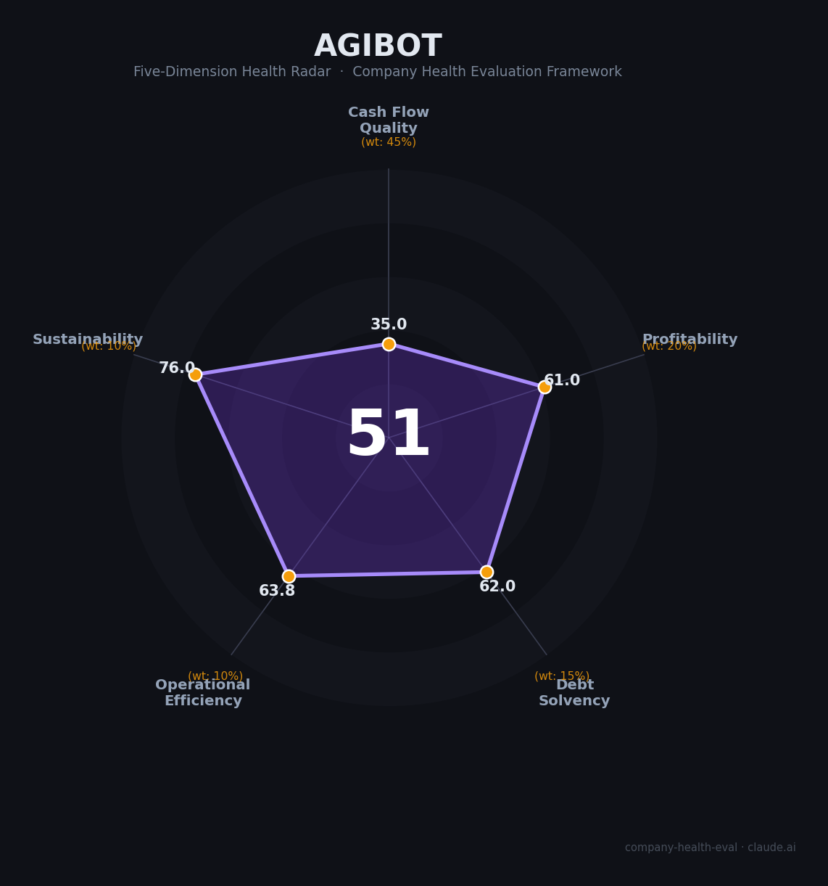

# 智元机器人（AGIBOT）财务健康评估（2026-08-12）

## 一句话结论

🔴 **中等偏下（51/100）** | 具身智能头部独角兽——2025营收突破¥10.5亿(+17.5倍)+量产1.5万台+港股IPO已启动，但持续亏损(估¥8-20亿)+收入质量存疑+高度依赖融资输血是核心隐忧

---

## 一、公司基本画像

| 项目 | 内容 |
|------|------|
| 主体 | 智元创新（上海）科技股份有限公司（AGIBOT）——通用人形机器人（具身智能）公司 |
| 成立 | 2023年2月（成立仅3年多的创业公司） |
| 创始人 | 彭志辉（网名「稚晖君」）——电子科技大学毕业，曾在华为「天才少年计划」任（年薪≈¥200万），2022年离职创业；现任总裁/CTO |
| 董事长/CEO | 邓泰华（2025年9月披露合伙人团队，CEO与创始人分工明确） |
| 总部 | 上海浦东新区（含北京海淀、深圳南山）；2025年上海工厂量产 |
| 主营 | 通用人形机器人 + 具身智能大模型 + 开放平台：远征/灵犀/精灵/酷拓系列、OmniHand灵巧手、智元启元大模型、Genie Studio开发平台、开源AGIBOT World数据集 |
| 投资方 | 高瓴创投、比亚迪、百度风投（BV）、京东、腾讯（B轮领投）、LG电子、经纬创投、鼎晖、红杉中国、临港新片区基金、上海国资系等 |
| 上市状态 | 未上市；**2026-07-24正式确认启动港股上市**（中金/中信/摩根士丹利传闻承销），目标估值 **400-500亿港元（约¥350-430亿）**；2025-07收购A股上纬新材63.62%股权（市场视为"智元概念股"，但上纬已公告36个月内无借壳计划） |
| 政府支持 | 上海临港/浦东产业基金+上海国资系深度入股；2025年4月习总书记考察上海时，AGIBOT代表具身智能行业做汇报 |

> 一句话定性：智元是「华为天才少年稚晖君 + 具身智能国家战略」双重光环下的中国最强人形机器人独角兽之一——技术领先、量产速度全球第一梯队（2026年3月万台下线行业首家），但财务上处于「高增长、高亏损、烧钱换规模」的典型创业期：营收3年增长20倍，净利持续为负，估值靠融资和市场预期支撑，2026年港股IPO是关键验证点。作为雇主，吸引力是风口行业+top公司+高薪+期权红利；风险是创业公司的高波动、期权兑现不确定、以及估值/IPO不达预期的下行风险。

---

## 二、五维财务健康评估

> 智元为非上市公司，财务数据来自融资披露/媒体/工商信息（📊/🌐）及公开量产数据（🔒）。

### 1. 现金流质量（35/100）| 权重45%

| 指标 | 📊/🔒 公开数据 | 评估 |
|------|-----------|------|
| 经营现金流净额 | 非披露；2025营收¥10.5亿但净亏损估¥8-20亿，经营现金流预计为负 | 🔴 危险：依赖融资输血 |
| 现金及等价物 | 累计融资100-150亿元级（多轮），账面现金估数十亿元，现金跑道约2-4年 | ⚠️ 关注：靠融资续命 |
| 有息负债 | 创业期负债少，但需持续融资支撑量产扩张 | ⚠️ 关注 |
| 应收周转 | 政府/国资客户占比较高、部分关联订单，账期长且收入质量存疑 | ⚠️ 关注 |
| 净现比（OCF/净利） | 持续净亏损+负经营现金流 | 🔴 危险：无内生现金 |

**小结**：现金流是智元最大的短板——这是典型的「融资驱动型」创业公司：营收从2024年¥6,000万爆发到2025年¥10.5亿（+17.5倍）说明产品化在推进，但人形机器人单价高、量产早期制造成本高企（估2025净亏¥8-20亿），经营现金流预计持续为负，全靠风险投资和产业资本「续命」。累计融资100-150亿+账面数十亿现金+现金跑道2-4年是底气，但2026年港股IPO成行与否直接决定后续弹药。

### 2. 盈利能力（61/100）| 权重20%

| 指标 | 🔒/📊 公开数据 | 评估 |
|------|-----------|------|
| 毛利率 | 人形机器人量产后毛利转正但早期偏低（2025粗估10-30%，vs 宇树60%） | 一般 |
| 净利率 | 持续亏损：2025净亏损估 **¥8-20亿**（CEO邓泰华承认"仍在亏损""以亏损换规模"） | 🔴 预警：净亏损 |
| 营收增速 | 2023: ¥30万 → 2024: ¥6,000万 → 2025: **¥10.5亿（+17.5倍）**；"中国最快破十亿的机器人/AI公司" | ✅ 优秀：爆发式增长 |
| 研发费用率 | 研发人员占70-75%（2/3 AI大模型/1/3 硬件），研发投入占比极高 | ✅ 优秀（科技型） |
| 人均产出 | ¥10.5亿/~1,500-2,500人≈¥42-70万/人（成熟制造业1/2-1/3，人均为负贡献） | 一般 |

**小结**：盈利是创业公司的挣扎形态——巨头般的研发投入（75%研发占比）+量产爬坡成本+爆发式增长（20倍）同时存在。营收增速和研发占比「好看」，但2025年净亏损估¥8-20亿（CEO公开承认），且与已盈利的宇树（2025净利¥2.78亿、毛利率60%）相比盈利质量差距明显，是典型的「烧钱抢位」阶段。作为雇主看的是未来兑现（IPO/规模效应），当下财务健康度低。

### 3. 偿债能力（62/100）| 权重15%

| 指标 | 📊 公开数据 | 评估 |
|------|-----------|------|
| 资产负债率 | 早期无重债务，但2025年收购上纬新材+扩张带来负债（📊） | ⚠️ 关注 |
| 有息负债 | 主要靠股权融资，有息负债低 | ✅ 健康 |
| 流动比率 | 筹资充裕时流动比高，亏损期承压 | ⚠️ 关注 |
| 现金比率 | 靠在手现金+后续融资 | ⚠️ 关注 |
| 股权质押 | 创始人/投资方股权质押风险存在 | ✅ 健康（暂无公开质押） |

**小结**：偿债能力中等偏上——创业期一般无重债，靠在手现金+融资能力支撑，财务上「不会暴雷但依赖持续融资」。2025年收购上纬新材（借壳路径）和扩张增加了复杂度，但整体杠杆健康。

### 4. 运营效率（63.8/100）| 权重10%

| 指标 | 🔒/📊 公开数据 | 评估 |
|------|-----------|------|
| 应收周转 | 客户以政府/大企业为主，账期可能较长 | ⚠️ 关注 |
| 客户集中度 | 量产初期客户集中于特定产业场景（工业/物流/科研/政府） | ⚠️ 关注 |
| 员工规模趋势 | 快速扩张：研发占比70-75%，平均年龄32岁，团队持续壮大 | ✅ 健康：高速扩编 |
| 高管稳定性 | 创业板独角兽要高危：2025-09披露7人合伙人、2026-08扩至9人（6位华为系）；IPO前核心科学家罗剑岚2026-08被移除合伙人名单（媒体称"商业化取代技术派"）；IPO窗口期人事变动是监管红线 | ⚠️ 关注：IPO前人事变动 |

**小结**：运营效率中上——团队快速扩张、量产效率行业领先（2026年3月万台下线、6月1.5万台），是「量产能力」这个核心指标的强项。但客户集中度高、IPO前高管调整是运营层面的风险点。

### 5. 可持续发展（76/100）| 权重10%

| 指标 | 📊/🔒 公开数据 | 评估 |
|------|-----------|------|
| 行业赛道空间 | 人形机器人/具身智能2025-2030爆发期，多家机构预测千亿级市场；已写入国家战略 | ✅ 健康：黄金赛道 |
| 技术壁垒 | 全栈自研（本体+AI大模型+数据平台+灵巧手），AGIBOT World开源数据集获IROS 2025最佳论文，技术壁垒高 | ✅ 健康 |
| 客户/业务多元化 | 产品线丰富（远征/灵犀/精灵/酷拓/灵巧手/大模型），场景覆盖工业/物流/科研/家庭；量产客户逐步多元 | ⚠️ 关注：早期依赖头部客户 |
| 资本支持 | 高瓴/比亚迪/百度/京东/LG等顶级产业资本+上海国资+国家具身智能战略 | ✅ 健康：资本充足 |
| 政策风险 | 具身智能获国家支持（十五五重点），但行业泡沫化/估值回调/商业化不及预期风险并存 | ⚠️ 关注 |

**小结**：可持续性是智元最强项——具身智能是未来十年最确定的科技赛道之一，智元技术+量产+资本三大优势齐备（全球第一梯队），「天时（政策）+地利（上海）+人和（顶配团队）」俱全。真正的风险在于**预期泡沫与商业化时间差**——若2026年IPO估值不及预期或行业整体回调，这个「强可持续」会转为估值压力。

---

## 三、综合评分与健康等级

| 维度 | 得分 | 权重 | 加权得分 |
|------|:----:|:----:|:--------:|
| 现金流质量 | 35.0 | 45% | 15.8 |
| 盈利能力 | 61.0 | 20% | 12.2 |
| 偿债能力 | 62.0 | 15% | 9.3 |
| 运营效率 | 63.8 | 10% | 6.4 |
| 可持续发展 | 76.0 | 10% | 7.6 |
| **综合得分** | **51/100** | **100%** | **51.2/100** |

**健康等级：🔴 中等偏下（Moderate-Low）** — 多个风险维度预警（现金流+盈利），靠赛道与资本支撑。

---

## 四、同业对标

| 对比项 | 智元机器人 | 宇树科技 Unitree | 优必选 UBTECH | 特斯拉 Optimus |
|--------|-----------|------------------|---------------|----------------|
| 成立/上市 | 2023/未上市预IPO | 2016/未上市 | 2012/HK上市(9880.HK) | 2022/特斯拉旗下 |
| 累计出货 | **1.5万台（2026.6，含轮式等宽口径）** | 双足~5,500台 + 四足 | 1,000台+ | 量产爬坡 |
| 2025营收 | **¥10.5亿（+17.5倍）** | ¥17亿（已盈利，净利¥2.78亿） | ~¥13亿 | 未单列 |
| 2025净利 | 亏损（估¥8-20亿） | **盈利¥2.78亿、毛利率60%** | 亏损 | 亏损 |
| 估值 | **400-500亿港元（目标，~32-41倍PS）** | 累计融资后市场估值高 | HK上市市值~¥100亿级 | 特斯拉内含 |
| 投资方 | 高瓴/比亚迪/百度/京东/腾讯/LG | 美团/源码/顺为 | 腾讯/启明 | 特斯拉 |
| 核心标签 | 具身智能独角兽·量产冠军（口径有争议） | 机器狗/四足+人形·已盈利 | 人形机器人第一股 | 全球量产野心 |

**对标结论**：智元在**量产规模、融资估值、品牌声量**三维度居中国乃至全球人形机器人第一梯队——但其「全球出货第一」口径被宇树公开质疑（Omdia统计5168台/39%份额，但核心赛道全尺寸双足2025年出货仅约1,300台，远低于宇树5,500台；智元将轮式/双臂计入口径）。更重要的是，智元**尚未盈利且毛利率远低于已盈利的宇树（毛利率60%净利¥2.78亿 vs 智元估净亏¥8-20亿）**。作为雇主，智元的「风口头部公司+技术前沿性」吸引力显著，但盈利质量与经营稳健性明显不如已扭亏的宇树。

---

## 五、核心风险清单

1. **持续亏损+现金流依赖融资（高）**：2025营收¥10.5亿但仍亏损，量产扩张与研发投入每年烧钱规模大；若2026年港股IPO融资不达预期（目标$51-64亿），现金跑道承压。
2. **估值泡沫与IPO不确定性（高）**：目标估值$51-64亿建立在人形机器人「元年/泡沫」预期上；2025-2026行业融资热度高企，若二级市场遇冷或行业整体回调，估值与期权价值可能大幅缩水。
3. **商业化落地时间差（中高）**：人形机器人技术/成本/场景仍处早期，大规模商业化（如工厂/物流/家庭）预计还需3-5年；期间「卖机器人」模式能否持续支撑多重材料与造消费，存不确定性。
4. **期权兑现风险（中高）**：早期员工期权绑定的是「未来上市+高估值」预期，若IPO推迟/估值缩水/流动性受限，员工「纸面财富」可能大幅打折甚至难兑现。
5. **竞争与技术追赶（中）**：特斯拉Optimus、宇树、Figure AI及国产新玩家激烈竞争；AI大模型技术迭代快，智元需持续保持技术领先。
6. **借壳上市复杂路径（中）**：2025年收购上纬新材+港股IPO双线推进，公司治理/整合/监管风险增加。

---

## 六、求职/择业视角

### 核心优势
- **风口行业头部公司**：具身智能是未来十年最热赛道之一，智元是技术+量产+资本综合实力最强的新势力（创始人稚晖君+华为/清华顶配团队），简历背书价值极高。
- **高薪与期权敞口**：上海/深圳平均月薪¥33-35K（本科35.4K/硕士41.8K，应届10.5K起），嵌入式/算法岗30-50K居多，「薪+期权+高速成长」组合在创业公司中顶级；若IPO成功，早期员工回报可观。
- **技术成长快**：研发70-75%占比、平均年龄32岁的「工程师文化」，接触最前沿的具身智能大模型/机器人本体/灵巧手技术，个人价值提升快。
- **成长性**：营收3年20倍、员工快速扩张、量产全球第一梯队——职业成长空间大，同期加入者随公司一起「起飞」。

### 现存短板
- **高风险波动**：创业公司，业务/组织/估值波动大；若行业遇冷或IPO不顺，裁员/降薪/期权缩水风险真实存在（对比上市车企/国企的稳定性）。
- **期权兑现不确定性**：未上市+估值波动，期权是「纸面财富」，兑现受IPO时间、价格、锁定期、回购政策多重制约。
- **强度大**：高压研发环境，量产+融资+IPO多线作战，加班强度高（年轻工程师文化）。
- **早期阶段局限**：管理/流程/职业体系相对初创，晋升和长期规划不如大厂清晰。

### 分场景建议

| 个人诉求 | 推荐 | 次选 | 规避 |
|----------|------|------|------|
| 高成长+风口 | **智元（算法/具身智能/量产岗）** | 宇树/优必选 | 传统机器人制造厂 |
| 期权+赌IPO | 智元（若接受高风险） | 宇树 | 增长放缓的老独角兽 |
| 稳定+保障 | 上市车企/国企 | 优必选(HK上市) | 未上市创业早期公司 |
| 技术深耕 | 智元AI大模型/本体研发 | 特斯拉Optimus(海外) | 纯组装/硬件流水线岗 |

---

## 七、总结

**智元机器人是中国具身智能赛道的「头号独角兽」：**

由华为天才少年稚晖君创立，成立3年做到营收20倍增长、全球首家量产1.5万台人形机器人、目标估值$51-64亿港股IPO——「赛道（具身智能）+技术（全栈自研）+资本（顶级产业资本）+量产（全球第一梯队）」四重优势加持，是风口行业最值得赌的标的之一。作为雇主，它提供「风口头部公司+顶级团队+高薪期权+极速成长」的梦幻组合。

唯一短板是**财务本质是「融资输血型」而非「自我造血型」**——持续亏损、现金流靠融资、估值依赖市场预期，2026年IPO是成败关键验证点。选智元，你赌的是「未来三年人形机器人商业化兑现+IPO成功」，对应高回报期权；风险是「行业回调+IPO延期+期权缩水」，且工作强度大、稳定性差于上市/国企。

在人形机器人商业化早期、行业泡沫与政策支持并存的大环境下，属于**中等偏下**财务健康度（现金流/盈利维度预警）——适合追求**高成长+风口赛道+期权红利**、能承受高波动的求职者；不适合追求稳定、WLB优先或看重当下现金收入的候选人。

---

*评估方法：商泰汽车（iAUTO）五维企业健康度框架 · 数据截至2026-08-12 · 智元为非上市公司，财务数据以融资披露/量产数据/媒体（📊估算）为主 · 核心数据来源：百度百科/官方公告/雪球/职友集/媒体*
