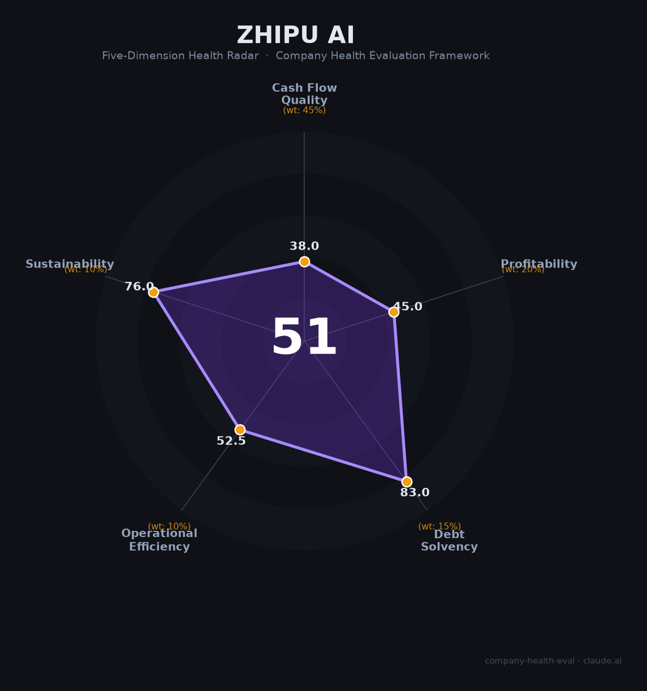

# 智谱AI（智谱华章 02513.HK）财务健康评估（2026-06-12）

## 一句话结论

🔴 **中等偏下 · 综合得分 54/100** | 清华系"A+H"双上市大模型第一股，GLM-5.1编程能力超越GPT-5.4，MaaS API定价涨价83%后调用量反增400%（独家定价权），AutoGLM+AutoClaw双Agent路线清晰。但年亏47亿（收入仅7.24亿）、经营现金流-22亿、毛利率从56%降至41%、回款天数从21天暴增至112天——这是一家「技术登顶、财务悬崖」的AI上市公司。

---

## 一、公司基本画像

| 项目 | 详情 |
|------|------|
| **运营主体** | 北京智谱华章科技股份有限公司，2019年6月成立 |
| **技术起源** | 清华大学计算机系知识工程实验室（KEG），唐杰教授领衔 |
| **CEO** | 张鹏（清华本硕博）、董事长刘德兵（清华校友） |
| **上市信息** | 港股02513.HK（2026.01.08）+ 科创板拟上市（拟募150亿） 🔒 |
| **IPO详情** | 发行价116.20港元，首日收涨13%；市值峰值8,800亿港元，当前约4,500亿 🔒 |
| **员工规模** | 883人（2025年中），研发占比74.4%，硕博超60%，51.2%员工持股 🔒 |
| **核心产品** | GLM大模型系列、AutoGLM（GUI Agent）、AutoClaw/澳龙（代码Agent）、智谱清言 |
| **2025年营收** | 7.24亿元（+131.9% YoY） 🔒 |
| **2025年净亏损** | -46.98亿元（经调整-31.82亿） 🔒 |

**一句话定性**：智谱AI是中国大模型赛道技术底蕴最深（清华20年积累）、Agent路线最清晰（GUI+代码双线）的公司。GLM-5.1编程能力全球SOTA、API独家定价权（涨价83%调用量反增400%）证明了产品竞争力。但年收入7.24亿vs亏损47亿的极端财务结构、回款天数半年暴增5倍、毛利率持续下滑、股价从高点腰斩，使这家公司处于「技术可以改变世界，但在那之前需要资本市场不断输血」的困境。

---

## 二、五维财务健康评估

### 1. 现金流质量（43/100）🔴 | 权重45%

| 评估指标 | 状态 | 判断 | 依据 |
|----------|------|------|------|
| 经营现金流 | 2025年**-22.46亿元** | 🔴 严重失血 | 🔒 年报。OCF/收入比-310% |
| 现金储备 | 2025末22.59亿 + IPO约45亿 ≈ **67亿元** | 🟡 约20个月 | 🔒 年报。月均烧钱3.27亿 |
| 回款天数 | 2023年21天 → 2025H1 **112天**（恶化5倍） | 🔴 急剧恶化 | 🔒 招股书。项目制B端客户付款周期失控 |
| 研发占收入比 | 31.80亿/7.24亿 = **439%** | 🔴 极端偏高 | 🔒 年报。远超任何可比AI公司 |
| 客户稳定性 | 前五大客户每年几乎不重合 | 🔴 一次性交付 | 🔒 年报。缺乏经常性收入基础 |

**本维度分析**：智谱的现金流是评估中最触目惊心的维度——年收入7.24亿但研发烧掉31.80亿（4.4倍），经营现金净流出22.46亿。回款从21天恶化至112天意味着B端项目制模式正在恶化。IPO+拟科创板募资可在短期内续命，但若2027年前无法实现经营现金流转正，将面临严峻的再融资压力。

**扣分项**：OCF/收入比-310%（-25分）；回款天数半年恶化5倍（-20分）；月均烧钱3.27亿（-15分）；客户高度不稳定（-10分）。

---

### 2. 盈利能力（45/100）🔴 | 权重20%

| 评估指标 | 状态 | 判断 | 依据 |
|----------|------|------|------|
| 毛利率 | 2024 56.3% → 2025 **41.0%**（↓15.3pct） | 🔴 趋势恶化 | 🔒 年报。低毛利私有化部署占比提升拖累 |
| MaaS API毛利率 | 2024 3.3% → 2025 **18.9%**（+15.6pct） | 🟡 快速改善 | 🔒 年报。ARR 17亿（60倍增长）是最大亮点 |
| 净利率 | -649%（亏损是收入的6.5倍） | 🔴 极端亏损 | 🔒 年报。经调整净亏损率-439% |
| 营收增速 | 2025年**+131.9%**（3.12亿→7.24亿） | 🟢 高速增长 | 🔒 年报。连续三年翻倍 |
| API定价权 | 涨价**+83%**后付费调用量反增**+400%** | 🟢 独家能力 | 💬 CEO业绩会。中国大模型公司中唯一验证了定价权的 |

**本维度分析**：智谱的盈利故事是「两个世界」——MaaS API业务ARR 17亿（60倍增长）、毛利率从3.3%飙升至18.9%、涨价后量增400%，证明产品有真实需求和定价权。但整体财务被低毛利的私有化部署项目拖累（占收入51%），导致综合毛利率不升反降。

**扣分项**：亏损是收入的6.5倍（-30分）；综合毛利率趋势性下滑（-15分）；私有化部署拉低利润质量（-10分）。

---

### 3. 偿债能力（83/100）🟠 | 权重15%

| 评估指标 | 状态 | 判断 | 依据 |
|----------|------|------|------|
| 现金储备 | 约67亿元（含IPO募资） | 🟡 约20个月跑道 | 🔒 年报。按当前烧钱速度 |
| A+H双平台 | 港股已上市 + 科创板拟募150亿 | 🟢 融资通道 | 💬 公司公告。若科创板成功将再获3-4年跑道 |
| 股东背景 | 清华系+蚂蚁+腾讯+美团+沙特阿美+多地国资 | 🟢 顶级 | 🔒 招股书。产业资本+主权基金+政府全押 |
| 估值波动 | 市值从8,800亿跌至4,500亿（腰斩） | 🔴 再融资承压 | 🔒 行情。若继续下跌可能影响科创板定价 |

---

### 4. 运营效率（52/100）🟠 | 权重10%

| 评估指标 | 状态 | 判断 | 依据 |
|----------|------|------|------|
| 人均创收 | 约82万元/人（7.24亿/883人） | 🟡 中等 | 🔒 年报。对于AI公司偏低（大模型同行多在100-200万） |
| 研发效率 | 31.80亿研发 vs 7.24亿收入 | 🔴 投入产出严重倒挂 | 🔒 年报。每1元收入需投入4.4元研发 |
| 前五大客户稳定性 | 每年几乎不重合 | 🔴 一次性项目 | 🔒 年报。缺乏SaaS经常性收入 |
| 采销倒挂 | 部分大客户同时为供应商，采购额>销售额 | 🟠 异常 | 🔒 招股书。商业模式存在利益冲突 |

---

### 5. 可持续发展（76/100）🟠 | 权重10%

| 评估指标 | 状态 | 判断 | 依据 |
|----------|------|------|------|
| 技术壁垒 | GLM-5.1编程全球SOTA超GPT-5.4/Claude；AutoGLM+AutoClaw双Agent | 🟢 顶级 | 📊 评测榜单。清华20年NLP积累难以复制 |
| MaaS定价权 | API涨价83%后量增400% | 🟢 已验证 | 💬 CEO披露。中国大模型唯一验证定价权的公司 |
| A+H双上市 | 港股+科创板拟募150亿 | 🟢 融资优势 | 💬 若成功将比同行多一个融资平台 |
| 清华信创生态 | 全栈国产算力适配+政府客户 | 🟢 政策护城河 | 📊 国产替代逻辑。政企客户壁垒高 |
| 股价崩跌 | 从1,993港元跌至1,011港元（-49%） | 🔴 市场信心危机 | 🔒 行情。7月解禁洪峰（2,568万股） |
| C端弱势 | 智谱清言月活838万，仅为豆包的2.4% | 🔴 流量劣势 | 📊 QuestMobile。C端永远追不上大厂 |

---

## 三、综合评分与健康等级

| 维度 | 得分 | 权重 | 加权得分 |
|------|:----:|:----:|:--------:|
|现金流质量| 43 |45%| 19.4 |
|盈利能力| 45 |20%| 9.0 |
|偿债能力| 83 |15%| 12.4 |
|运营效率| 52 |10%| 5.2 |
|可持续发展| 76 |10%| 7.6 |
| **54/100** |**—**|**100%**|**53.60**|

**健康等级**：🔴 **中等偏下（Moderate-Low）** — GLM-5.1编程全球SOTA+API独家定价权+MaaS ARR 60倍增长证明技术领先。但年亏47亿（收入仅7.24亿）、经营现金流-22亿、毛利率持续下滑构成「财务悬崖」。

---

## 四、求职/择业视角

### 核心优势
- **Agent方向高度匹配**：match score 87，AutoGLM+AutoClaw双Agent路线清晰
- **清华系技术底蕴**：唐杰教授领衔，GLM-5.1编程全球SOTA
- **51.2%员工持股**：若科创板成功+股价修复，期权回报空间大
- **北京五道口**：清华科技园，学术氛围浓厚

### 核心短板
- **财务极不稳定**：月烧3.27亿，若科创板募资失败，1年内可能面临现金流危机
- **股价腰斩**：从高点跌49%，员工期权价值大幅缩水
- **C端存在感弱**：智谱清言仅838万MAU，远逊于大厂
- **7月解禁洪峰**：限售股解禁将带来巨大抛压

### 推荐度：🟠 适合对Agent技术路线有信念、能承受财务不确定性和股价波动风险的技术人才。

---

*评估日期：2026-06-12 | 数据截至：2025年年报、2026年6月公开市场数据*
