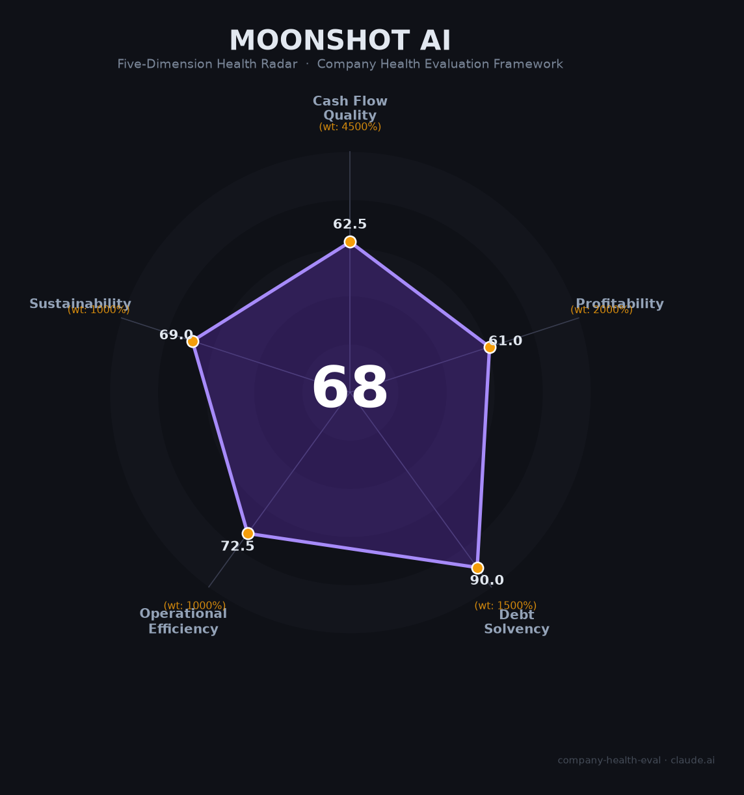

# 月之暗面（Moonshot AI）财务健康评估（2026-06-12）

## 一句话结论

🟠 **中等（68.0/100）** | 增长引擎强劲·估值透支·数据安全与芯片双高悬

---

## 一、公司基本画像

| 维度 | 详情 |
|------|------|
| 主体 | 北京月之暗面科技有限公司 |
| 成立 | 2023年4月17日（Pink Floyd《月之暗面》发行50周年） |
| 创始人 | 杨植麟（1993年生，清华→CMU博士，Transformer-XL/XLNet一作） |
| 股权 | 杨植麟持股约78.97%，AB股架构 |
| 规模 | 约300人（研发为主，极度扁平：无部门/无职级/无KPI） |
| 总部 | 北京海淀知春路（新加坡、硅谷设有海外办公室） |
| 主营 | Kimi智能助手、Kimi K2系列开源大模型（API服务）、Kimi Work本地Agent |
| 融资 | 累计超35亿美元，2026年6月最新目标估值300亿美元（D轮洽谈中） |
| 上市 | 已启动VIE架构拆除，赴港IPO筹备中（中金/高盛） |

**一句话定性**：中国增长最快的大模型独立厂商（ARR 60天翻倍至$2亿+），以"Agent集群+开源+低价"策略在海外开发者市场异军突起，但C端MAU从3600万峰值跌至834万、简历泄露事件和数据安全合规构成IPO前最大隐患。

---

## 二、五维财务健康评估

### 1. 现金流质量（62.5/100）

经营现金流数据未公开。2026年ARR超2亿美元，收入增速行业第一，但收入仍远不足以覆盖研发和推理成本。K2.5上线后20天收入超2025全年，海外收入占比首超50%。

现金储备极为充裕：累计融资超35亿美元，持有现金约100亿+人民币。按当前消耗率估算可支撑2-3年+，但K3下一代模型训练承诺"10倍于K2的算力投入"，将大幅推高资本开支。零有息负债，完全依赖股权融资。

经营现金净额大概率仍为负（📊估算），但现金跑道健康（🔒公司内部信确认）、负债为零有息负债（🔒多方交叉验证）。

### 2. 盈利能力（61.0/100）

| 指标 | 数据 | 评级 |
|------|------|------|
| 毛利率 | 估计30-45%（📊 参考MiniMax 25.4%、智谱41%） | 一般 |
| 净利率 | 严重亏损（研发支出估计为营收3-5倍） | 预警 |
| 营收增速 | ARR从近零→$2亿+仅6个月 | 优秀 |
| 研发费用率 | 估计>80%（AI实验室属性，几乎全部开支为研发） | 一般 |
| 人均产出 | ~$66.7万/人/年（300人对应$2亿ARR） | 优秀 |

盈利模式尚未验证。K3模型训练将大幅增加资本开支，盈利时间表不确定。人均产出在AI行业属于顶级水平，但高推理成本侵蚀毛利。

### 3. 偿债能力（90.0/100）

- **资产负债率**：极低（近乎零有息负债，完全股权融资）
- **有息负债率**：0%（零银行借款、零债券）
- **流动比率**：极高（现金100亿+ vs. 极少流动负债）
- **现金比率**：远超1（🔒融资公告交叉验证）
- **股权质押**：无（未上市，无质押披露）

偿债能力是本评估中最强维度。公司无任何有息负债，融资以纯股权形式进行。唯一风险是若IPO持续延迟，未来融资可能被迫引入可转债等有息工具。

### 4. 运营效率（72.5/100）

| 指标 | 评估 | 说明 |
|------|------|------|
| 应收周转 | 健康 | API订阅模式，现金流快 |
| 客户集中度 | 关注 | OpenClaw等少数平台占API消耗比例波动大（曾一度下降60%） |
| 员工趋势 | 健康 | 从120人稳步增长至300+，2026年重点招聘API商业化和Agent方向 |
| 高管稳定性 | 关注 | 杨植麟牢牢掌控，但仲裁案悬而未决；2025年部分产品经理离职 |

300人团队支撑$2亿ARR和$200亿+估值，人效极高。但"无部门/无职级/无KPI"的激进扁平模式能否从300人扩展到3000人存疑。多位观察者表示"不乐观"。

### 5. 可持续发展能力（69.0/100）

| 指标 | 评估 | 说明 |
|------|------|------|
| 行业赛道 | 健康 | AI Agent市场107%年增长，全球AI编程市场$128亿 |
| 技术壁垒 | 关注 | K2.6技术领先但MIT开源——竞对可复制并压价 |
| 业务多元化 | 关注 | 营收从C端订阅转向API+海外，但OpenClaw依赖度偏高 |
| 资本支持 | 健康 | $35亿+融资、顶级VC/战投阵营、IPO筹备中 |
| 政策风险 | 关注 | AI监管趋严（清朗行动+智能体规范）+芯片出口管制+简历泄露事件 |

**核心矛盾**：开源策略赢得开发者生态，但削弱了技术护城河。DeepSeek定价仅为Moonshot的1/30-1/100，价格战压力巨大。美国芯片出口管制持续收紧——NVIDIA H800库存消耗殆尽后，下一代模型训练面临算力"断崖"风险。

---

## 三、综合评分与健康等级

| 维度 | 得分 | 权重 | 加权得分 |
|------|------|------|----------|
| 现金流质量 | 62.5 | 45% | 28.1 |
| 盈利能力 | 61.0 | 20% | 12.2 |
| 偿债能力 | 90.0 | 15% | 13.5 |
| 运营效率 | 72.5 | 10% | 7.2 |
| 可持续发展 | 69.0 | 10% | 6.9 |
| **综合得分** | | **100%** | **68.0** |

**健康等级**：🟠 中等（Moderate）

---

## 四、同业对标

| 对比项 | **月之暗面** | 智谱AI | MiniMax | DeepSeek |
|--------|-------------|--------|---------|----------|
| 上市/融资 | 未上市（Pre-IPO） | 02513.HK | 0100.HK | 未上市 |
| 估值 | ~$200-300亿 | ~$700亿 | ~$320亿 | ~$450-515亿 |
| ARR | $2亿+（2026.4） | ¥17亿（MaaS） | $1.5亿 | ~$0 |
| 员工 | ~300人 | ~1,100人 | ~400人 | ~317人 |
| 毛利率 | 估计30-45% | 41%（2025） | 25.4%（2025） | 不适用 |
| 盈利 | 亏损 | 亏损 | 接近自负盈亏 | 亏损 |
| 开源策略 | MIT开源 | 部分开源 | 闭源+API | MIT完全开源 |
| 核心差异 | Agent集群+出海 | 代码最强+政企 | 多模态C端 | 基础设施定价者 |

**对标结论**：月之暗面在中国大模型独立厂商中估值排名第4，但增长速度排名第1。ARR从$1亿到$2亿仅用60天，海外收入占比首超50%。与已上市同行相比，其偿债能力最强（零负债），但盈利路径最不清晰。

---

## 五、核心风险清单

1. **简历数据泄露事件（高）**：2026年4月用户上传简历后收到他人真实简历（姓名/电话/工作经历）。公司私下归因"AI幻觉"，但技术专家一致判定为数据隔离失败或RAG管道绑定错误——属于真实数据泄露而非幻觉。受影响用户已向网信办投诉并聘请律师。公司在IPO前夕对此事件无任何公开正式回应，企业信任度和监管审查风险显著上升。

2. **美国芯片出口管制（高）**：K2系列基于2,048块NVIDIA H800训练——该芯片已被禁售。2026年5月美国关闭海外子公司采购漏洞。华为昇腾产能仅为NVIDIA的2-5%，软件栈迁移（CUDA→Ascend）工程浩大。分析师用"算力断崖"形容K3模型面临的训练困境——"支撑估值的下一代模型，依赖尚不存在于所需规模的硬件。"

3. **关键人依赖（高）**：杨植麟持股78.97%，AB股绝对控制。无明确接班人。同时应对仲裁案+IPO筹备+技术迭代+300人管理——压力极端。若其因健康/法律/其他原因离开，公司面临生存危机。

4. **C端MAU持续失血（中高）**：Kimi月活从3600万峰值跌至834万，已跌出中国AI应用TOP5。被字节豆包（3.45亿MAU）和阿里千问（1.66亿）碾压。虽已战略转向海外API，但品牌势能减弱影响招聘和估值叙事。

5. **估值透支基本面（中）**：$300亿目标估值对应$2亿ARR = 150倍市销率。公开SaaS公司通常5-12倍。若增长减速或IPO估值倒挂，员工期权价值将大幅缩水。

6. **仲裁案悬而未决（中）**：循环智能老股东（金沙江创投等）在香港国际仲裁中心的竞业禁止仲裁仍在进行。这是IPO的"硬阻塞"——在仲裁解决前，上市申请难以获批。

---

## 六、求职/择业视角

### 核心优势

- **薪酬行业顶级**：总包基本对齐或超过字节跳动同级。2026年激励翻倍，人均约160万元/年。期权回购机制完善（每年回购、离职保留已归属期权），IPO前即可部分变现。
- **技术密度极高**：300人团队包括XLNet/Transformer-XL核心作者、多位顶会论文高产研究者。人才密度在中国AI行业数一数二。
- **Agent赛道卡位**：Kimi Work直接对标Claude Code（后者年化$25亿+），300子Agent并行集群全球唯一。经验可直接迁移至任何Agent/LLM岗位。
- **期权潜在回报**：若以$300亿估值上市且市值稳定，早期员工期权价值可观。但需注意150x ARR的估值倍数在公开市场面临重大折价风险。

### 现存短板

- **工作强度极高**：春节几乎无休，部分团队6-7天/周。有员工描述"数百小时盯着训练监控屏"和"为月之暗面流了这辈子最多的泪"。
- **职业路径模糊**：无职级、无晋升体系。大厂背景的中层管理者可能"被年轻人碾压"而离职。80%+员工入职后职责发生变化，不确定性高。
- **上市时间不确定**：仲裁案+VIE拆除+芯片管制三重变量叠加，IPO可能在2026年下半年至2027年之间，也可能更晚。期权最终变现存在变数。
- **简历泄露事件余波**：技术团队的工程可信度受损，可能影响技术品牌和招聘吸引力。

### 分场景建议

| 个人诉求 | 推荐 | 次选 | 规避 |
|----------|------|------|------|
| 高薪+期权暴富 | 月之暗面（现金多、期权流动性好） | DeepSeek（现金占比高） | 阶跃星辰（估值小） |
| 稳定+深耕 | 智谱AI（已上市、规模大） | 字节豆包（生态稳） | 月之暗面（上市不确定） |
| 技术成长+Agent方向 | 月之暗面（Agent集群全球领先） | DeepSeek（开源生态） | — |
| WLB+身心健康 | 智谱AI、MiniMax | 阿里/腾讯AI | 月之暗面（007节奏） |

---

## 七、总结

**月之暗面是中国大模型"四小龙"中增长最快的公司，偿债能力出众（零负债+100亿现金），在Agent编码赛道具备全球竞争力。但其C端基本盘持续失血、简历数据泄露事件为IPO埋下隐患、芯片管制威胁下一代模型训练，加上杨植麟个人集中持股78.97%且无明确接班人——属于"高风险高回报"的选择。**

适合：愿意用2-3年高强度投入博取期权暴富、对Agent/Coding方向有极致热情的顶尖工程师。
不适合：追求稳定、WLB、明确晋升路径的求职者。

---

*评估日期：2026-06-12 | 数据截至：2026年6月 | 评分引擎：score.py v2.0 | 信息来源：彭博、36氪、钛媒体、LatePost、南华早报、公司披露、脉脉等行业渠道*
