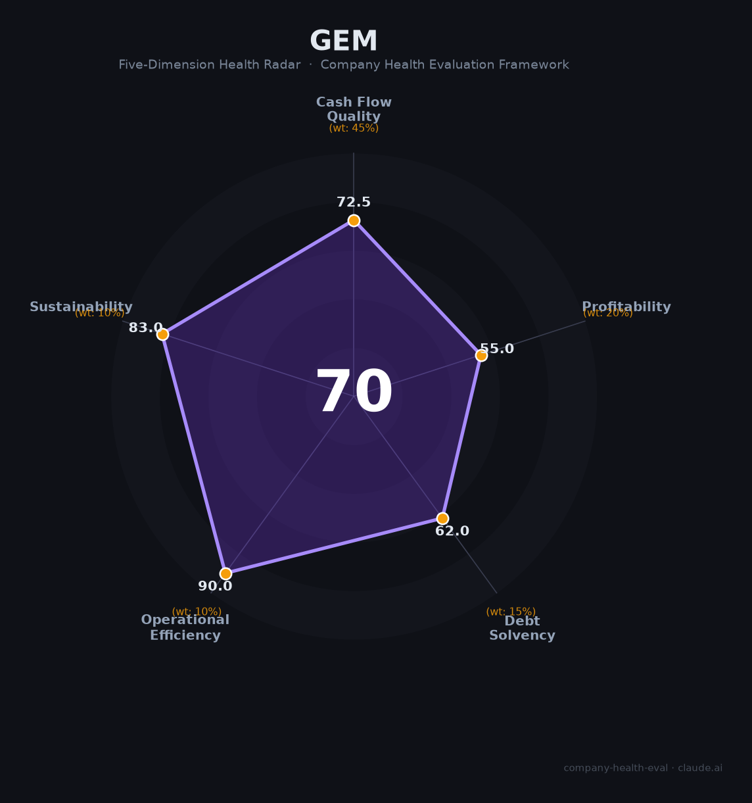

# 格林美（002340.SZ）财务健康评估（2026-08-13）

## 一句话结论

🟡 **70/100，中等偏上** | 电池回收龙头，营收净利双增

---

## 一、公司基本画像

| 项目 | 内容 |
|------|------|
| 主体 | 🔒 格林美，电池回收/三元前驱体龙头 |
| 主营 | 🔒 动力电池回收、三元前驱体、钴镍等 |
| 财务 | 🔒 2025营收371.24亿(+11.82%)，归母净利15.80亿(+54.87%) |

## 二、五维财务健康评估

### 1. 现金流质量（72/100）| 权重45%

### 2. 盈利能力（55/100）| 权重20%

### 3. 偿债能力（62/100）| 权重15%

### 4. 运营效率（90/100）| 权重10%

### 5. 可持续发展（83/100）| 权重10%

---
## 三、综合评分

| 维度 | 得分 | 权重 | 加权 |
|------|:----:|:----:|:----:|
| 现金流质量 | 72 | 45% | 33 |
| 盈利能力 | 55 | 20% | 11 |
| 偿债能力 | 62 | 15% | 9 |
| 运营效率 | 90 | 10% | 9 |
| 可持续发展 | 83 | 10% | 8 |
| **综合得分** | **70** | 100% | 70 |

**健康等级：中等偏上**

---
## 四、核心风险清单

1. **回收周期**
2. **锂电价格**
3. **重资产**
4. **资金周转**
## 五、求职/择业视角
- **核心优势**：电池回收+前驱体龙头
- **现存短板**：锂电/钴镍价格波动

**结论**：新能源电池回收龙头，电池材料方向
---
*评估方法：商泰汽车（iAUTO）五维框架 · 数据截至2026年8月 · 来源：格林美2025年报*
