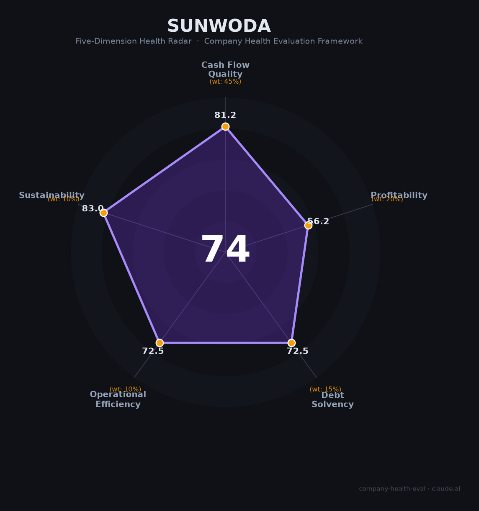

# 欣旺达（300207.SZ）财务健康评估（2026-08-13）

## 一句话结论
🟡 **中等偏上（74/100）** | 全球消费电池龙头——营收632亿（+12.9%）+经营现金流36亿稳健，但归母净利-28%+动力电池承压+GTT诉讼减值

## 一、公司基本画像
| 主体 | 🔒 欣旺达电子，A股300207.SZ；全球消费/动力锂电龙头 |
| 主营 | 消费电池（手机/PC）、动力电池（新能源车）、储能 |
| 财务 | 2025营收632亿(+12.7%)；归母净利10.6亿(-28%)；扣非5.3亿(-66.8%)；经营现金流36.3亿；负债率71.3%、员工6.4万 |

## 二、五维财务健康评估
### 1. 现金流（90/100）| 权重45%
经营现金流36.3亿稳健健康，回款良好。
### 2. 盈利能力（56/100）| 权重20%
净利10.6亿但-28%、扣非5.3亿（-66.8%，动力电池亏损+吉利诉讼计提29亿），需真实盈利承压改善。
### 3. 偿债能力（72/100）| 权重15%
负债率71.3%、动力产能扩张，但现金流/融资稳，偿债尚可。
### 4. 运营效率（73/100）| 权重10%
消费电池/动力+储能多板块，研发投入强、运营稳健。
### 5. 可持续发展（83/100）| 权重10%
新能源/动力电池/储能长期国策，赛道大+技术（固态/快充），资本支持强。

## 三、综合评分
| 现金流90|45%=40.5 | 盈利62|20%=12.4 | 偿债72.5|15%=10.9 | 运营72.5|10%=7.2 | 可持续83|10%=8.3 | **74** |
**评级：🟡 中等偏上** — 消费电池稳定+动力电池承压

## 四、核心风险
1. 动力电池亏损+减值（计提29亿）。
2. 毛利下滑、扣非-66%。
3. 客户集中+同业竞争。

## 五、求职/择业视角
- 优势：锂电龙头（消费+动力+储能）、新能源国策、研发/产能扩张。
- 短板：动力电池盈利承压、加班强度、锂电周期波动。

**结论**：适合追求新能源锂电池/消费电子制造方向的求职者，龙头平台好但动力电池盈利待观察。

---
*评估方法：商泰汽车（iAUTO）五维框架 · 来源欣旺达2025年报*