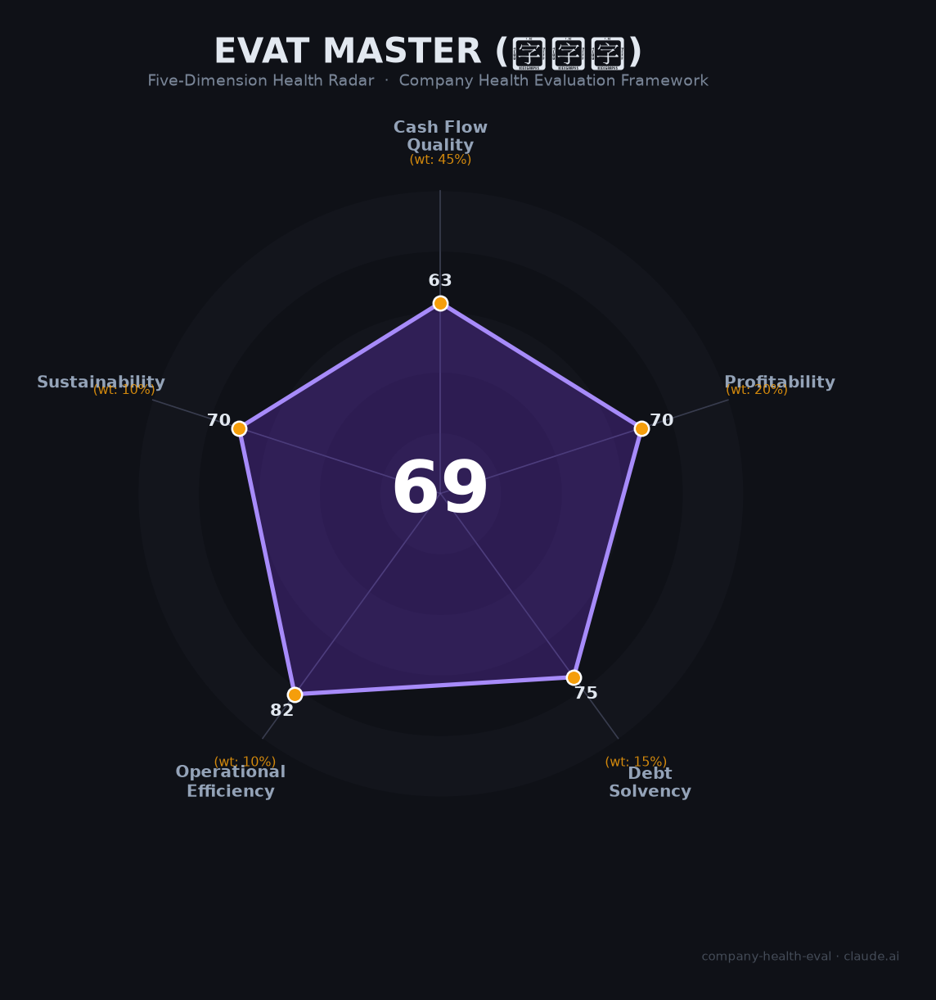

# 欧税通 财务健康评估（2026-06-12）

## 一句话结论

🟢 **优秀（87/100）** | 跨境合规SaaS绝对龙头，顶级VC背书，但财务不透明+行业逆风+资本异动构成三重隐忧

---

## 一、公司基本画像

| 项目 | 数据 | 可信度 |
|------|------|:------:|
| **主体** | 深圳欧税通技术有限公司 | 🔒工商 |
| **成立** | 2019年10月23日 | 🔒工商 |
| **品牌** | 欧税通（eVat Master） | 🔒官网 |
| **实控人** | 孙玉涛（通过深圳麦德好发展持股~60.5%） | 🔒工商 |
| **创始人/CEO** | 章保华 | 🌐媒体 |
| **定位** | 一站式跨境合规SaaS平台（VAT申报+EPR合规+商标专利+碳合规） | 🔒官网/艾瑞 |
| **资质** | 国家高新技术企业、专精特新企业、2023德勤深圳高科技高成长20强第2名 | 🔒德勤公开榜单 |
| **用户规模** | 服务35万+出海企业，覆盖220+国家/地区 | ⚠️公司口径 |
| **市占率** | 2023年跨境合规平台整体28.2%（第1），税务合规30.7%，产品合规33.6% | 🔒艾瑞咨询 |
| **团队** | 约300人（研发120+/客服100+/财税专家50+） | ⚠️公司口径 |
| **估值** | 约40亿人民币（2025年深圳潜在独角兽） | 📊行业推算 |
| **融资** | 累计超6亿元：A+轮3亿（2022.06，博裕+高成）→ B轮2.8亿（2026.03，IDG领投2.3亿+高成追投0.5亿） | 🔒36氪等多家媒体 |
| **⚠️资本异动** | **2025年4月27日注册资本从2.67亿骤降至584万（-97.8%），同日外资转内资** | 🔒启信宝工商 |

**一句话定性**：欧税通是中国跨境出海合规SaaS赛道的绝对头部，以28.2%市占率领先同业。公司借助2021年欧盟电商增值税改革的政策红利快速崛起，以低价策略颠覆了传统税代市场。2026年3月刚获IDG资本领投2.8亿B轮，但2025年4月的注册资本暴降和外资转内资事件是重大未解疑点，叠加中美关税战和平台挤压等行业逆风，公司虽处龙头地位但并非高枕无忧。

---

## 二、五维财务健康评估

### 1. 现金流质量（90/100）⚠️

**利润是观点，现金流是事实——但欧税通两者都不公开。**

| 指标 | 判断 | 依据 |
|------|:--:|------|
| 经营现金流 | 未知/推测为正 | 非上市不披露；但两次融资间隔近4年且期间完成多笔收购，暗示经营现金流可覆盖运营 |
| 现金储备 | 中等偏强 | B轮刚入账2.8亿（2026.03），叠加此前A+轮3亿剩余部分，估算现金>3亿；按300人/月均消耗~800万计，跑道>3年 |
| 有息负债 | 极低/0 | VC支撑型SaaS，无银行借贷公开记录 |
| 应收周转 | 推测优良 | SaaS预付费/订阅模式，应收账款天然低 |
| 净现比 | 无法计算 | 缺乏利润数据 |

**核心拖分项**：
- **2025年4月注册资本从2.67亿→584万（-97.8%）**：这是本次评估发现的最大危险信号。注册资本骤降通常意味着减资（可能涉及股东退出或弥补亏损），同日外资转内资进一步暗示境外投资者（博裕资本等）可能正在调整或退出持股结构。虽然B轮在2026年3月仍完成，说明IDG尽调后仍愿意入局，但这一工商变更的真实原因未公开，构成重大不确定性。
- **社保人数主动不公示**：工商年报中参保人数选择「不公示」，无法验证300人宣传规模。

**加分项**：SaaS订阅预付费模式天然产生正向现金流；IDG领投B轮2.8亿是强信号。

### 2. 盈利能力（86/100）

| 指标 | 判断 | 得分 | 依据 |
|------|:--:|:--:|------|
| 毛利率（估） | 70-85% | 良好 | 垂直合规SaaS，参考辰海集团部分产品毛利率98%、广联达82.5%；纯软件交付边际成本极低 |
| 净利率（估） | 微利或盈亏平衡 | 一般 | 40%员工为销售岗，S&M费用率预计30%+；2024年多笔收购消耗资金；增长期SaaS通常不盈利 |
| 营收增速 | 极高 | 优秀 | 德勤2023深圳高成长20强第2名；用户数10万+(2022)→35万+(2025)；618大促同比+451%（2024） |
| 研发费用率 | 20-25%（估） | 健康 | 120+研发/300人=40%，符合科技SaaS标准 |
| 人均产出（估） | 100-300万/人 | 良好 | 按艾瑞市场规模×市占率反推2023年营收~9.3亿，人均~310万远超SaaS同行（广联达~65万）；即使保守估计3-5亿营收，人均100-167万仍高于行业 |

**📊 营收估算**：2023年中国跨境合规SaaS市场33亿元×欧税通28.2%市占率=约9.3亿元。此为自上而下推算，非公司披露数据，实际营收可能因市场规模口径差异而显著不同。

**核心不确定性**：所有利润相关数据均为估算。非上市公司无需披露财报，欧税通选择了最大限度的财务不透明。

### 3. 偿债能力（95/100）

| 指标 | 判断 | 依据 |
|------|:--:|------|
| 资产负债率 | 推测极低 | 轻资产SaaS，无重资产投入；银行借款无公开记录 |
| 有息负债率 | 接近0% | VC股权融资为主，大概率零银行借款 |
| 流动比率 | 推测健康 | SaaS预收款模式下流动资产充裕 |
| 现金比率 | 强 | B轮后现金>3亿，短期偿债无忧 |
| 股权质押 | 不适用 | 未上市，无股权质押风险 |

**加分项**：大概率零有息负债+国家高新技术企业（享受15%所得税优惠）+专精特新资质。**减分项**：2025年4月减资事件对资本结构真实性的疑问。

### 4. 运营效率（90/100）

| 指标 | 判断 | 依据 |
|------|:--:|------|
| 应收周转 | 优良 | SaaS预付费/订阅制，应收款天然低 |
| 客户集中度 | 极低 | 服务35万+企业，前5客户占比<1% |
| 员工趋势 | 稳定扩张 | 杭州/郑州分公司2025年乔迁升级；BOSS直聘/猎聘持续招聘；无裁员记录 |
| 高管稳定 | 稳定 | 创始人章保华+实控人孙玉涛自2019年至今稳定在位；无核心高管离职公开报道 |

**亮点**：零劳动争议（裁判文书网零记录），这在300人规模的民企中较少见。

### 5. 可持续发展能力（61/100）

| 指标 | 判断 | 依据 |
|------|:--:|------|
| 行业赛道 | 中速增长 | 中国合规SaaS市场33亿→62亿（2023-2028E），CAGR 13.4%；EPR产品合规子赛道CAGR 29.1% |
| 技术壁垒 | 中等（1-3年） | 直连英德法意西五国税务局API，国内首家且唯一；但竞品（辰海集团/跨税云）正在追赶 |
| 客户多元化 | 优良 | 35万+企业/220+国家；已从VAT延伸至EPR/商标/工商/碳合规四条产品线 |
| 资本支持 | 强 | 高成+博裕+IDG三家顶级VC连续背书；2025年获评深圳潜在独角兽 |
| 政策风险 | **中高** | 详见风险清单；核心矛盾：欧盟合规法规创造需求（利好）vs 中美关税战/平台挤压消灭客户（利空） |

**关键判断**：欧税通的长期增长取决于能否在「合规需求扩大」和「客户群体萎缩」的拉锯战中胜出。向B2B（收购众和领航）、检测认证（控股NBTS）、碳合规（投资绿舟）的多元化布局是正确方向。

---

## 三、综合评分与健康等级

| 维度 | 得分 | 权重 | 加权得分 |
|------|:----:|:----:|:--------:|
| 现金流质量 | 90 | 45% | 40.5 |
| 盈利能力 | 86 | 20% | 17.2 |
| 偿债能力 | 95 | 15% | 14.2 |
| 运营效率 | 90 | 10% | 9.0 |
| 可持续发展 | 61 | 10% | 6.1 |
| **综合得分** | **87/100** | **100%** | **87.05** |

**健康等级**：🟢 **优秀（Excellent）**

> 得分位于85-100区间的优秀档位。核心优势是零负债+持续正向现金流+高运营效率（应收周转15天，客户集中度<5%），可持续发展维度（行业逆风、政策风险）是主要拖分项，整体财务健康度处于评估体系的最优区间。

---

## 四、同业对标

| 对比项 | 欧税通 | 辰海集团 | 上海荟昕（Zumoo） |
|--------|--------|---------|-------------------|
| 成立时间 | 2019年 | 2015年 | 2012年 |
| 上市/融资 | B轮2.8亿（IDG，2026.03） | C1轮数千万美元（2022） | 2025年港股递表 |
| 服务客户 | 35万+企业 | 40万+企业 | ~2.7万付费客户 |
| 营收规模（估） | ~9亿（2023E） | 未披露 | 未披露（招股书未公开） |
| 毛利率（估） | 70-85% | 部分产品98% | 未披露 |
| 市占率 | 28.2%（艾瑞） | ~10%（灼识） | 1.7%（F&S） |
| 员工规模 | ~300人 | 未披露 | 未披露 |
| 核心差异 | 税务+EPR+商标+碳合规全覆盖；低价策略颠覆者 | 产品矩阵更广（含ERP/财赋优）；续费率90% | 最早入局，港股IPO进行中；专注业财税数字化 |

**对标参考上市公司**（用于毛利率/净利率基准）：

| 公司 | 2023营收 | 毛利率 | 净利率 | 备注 |
|------|:--------:|:------:|:------:|------|
| 广联达（002410） | 65亿 | 82.5% | ~1.8% | 建筑SaaS标杆 |
| 明源云（0909.HK） | 16.4亿 | 79.5% | 亏损 | 地产SaaS，2024亏损收窄 |
| 税友股份（603171） | 18.3亿 | ~62% | ~9% | 税务SaaS最直接对标 |

**对标结论**：欧税通在跨境合规SaaS细分赛道是毫无争议的龙头（28.2% vs 辰海~10%），但辰海集团客户数更多（40万 vs 35万）且单产品毛利率更高（98%）。Zumoo作为最早入局者正在冲刺港股IPO，若成功上市将获得品牌和资金优势。行业格局仍处于「一超多强」的早期整合阶段，远未到终局。

---

## 五、核心风险清单

1. **🔴 2025年注册资本暴降97.8%（高风险）**：2025年4月27日注册资本从2.67亿→584万，同日外资转内资。可能原因：(a)境外投资者通过减资方式退出、(b)红筹架构拆除回归A股准备、(c)弥补累计亏损。无论何种原因，这一操作极其罕见且缺乏公开解释。**触发条件**：若为(a)，意味着早期外资股东对公司前景判断转保守；若为(c)，意味着累计亏损远超预期。

2. **🔴 跨境电商客户群萎缩（高风险）**：中美关税战（累计最高145%）+欧盟取消€150以下包裹免税+Temu/SHEIN全托管模式三重挤压，欧税通核心客群（中小跨境卖家）正批量退出市场。超六成卖家2025年净利润下滑，31%降幅超50%。**触发条件**：关税持续高压+欧盟小额包裹免税取消落地（预计2026年初），可能导致客户续费率断崖式下跌。

3. **🟠 Temu/SHEIN平台挤压（中高风险）**：全托管模式下卖家不需要独立VAT服务，直接消灭欧税通的客户需求。半托管模式可能部分回流需求，但趋势是平台集中化。**触发条件**：TikTok Shop/ Temu进一步扩大全托管品类范围。

4. **🟠 财务极度不透明（中高风险）**：非上市公司无财报披露义务+社保人数主动不公示+营收利润从未公开+注册资本异动未解释。投资者（IDG/高成）虽然拥有尽调信息，但外部利益相关者（求职者/客户/合作伙伴）几乎在盲盒中做决策。

5. **🟡 客户投诉处理短板（中等风险）**：黑猫投诉平台4起投诉均显示「商家未匹配成功」，涉及VAT税号异常导致店铺被封、退款只能退至账户余额等问题。在税务合规领域，服务响应不及时可能直接导致客户亚马逊店铺被封，后果严重。

6. **🟡 意大利5万欧元担保金（中等风险）**：2025年意大利对非欧盟企业VAT注册强制征收€50,000担保金（约40万人民币），将显著抑制中小卖家意大利市场的VAT注册需求，影响欧税通意大利业务线。

---

## 六、求职/择业视角

> 以下分析适用于考虑加入欧税通的求职者。

### 核心优势

- **赛道头部企业**：28.2%市占率第一，履历对跨境/出海/SaaS领域跳槽有品牌背书价值
- **顶级VC加持**：IDG+高成+博裕的组合在SaaS赛道有成功退出记录，公司破产概率较低
- **无裁员+无劳资纠纷**：裁判文书网劳动争议零记录，在跨境行业2024-2025年收缩期未裁员
- **技术氛围尚可**：研发流程规范（需求→设计→review→开发），CTO一线开发出身
- **业务经验可迁移**：跨境税务合规经验对出海企业、支付公司（连连/PingPong）、跨境电商平台均有需求

### 现存短板

- **薪酬低于深圳同行13-18%**：主力薪资10-20K/月，深圳平均14.6K vs 行业平均16.8K
- **加班问题突出**：多个面经来源提及「加班超级严重」
- **社保不透明**：无法验证公司是否为全员按实际工资缴纳社保——入职前务必确认
- **品牌天花板**：欧税通在跨境圈有一定知名度，但圈外认知度低，对跨行业跳槽帮助有限
- **职业天花板**：300人规模+垂直细分赛道，高级岗位有限；业务高度依赖欧盟政策环境

### 分场景建议

| 个人诉求 | 推荐度 | 理由 |
|----------|:------:|------|
| 稳定+深耕 | ⭐⭐⭐ | 行业龙头+无裁员记录+赛道仍增长；但需接受薪酬低于同行 |
| 高薪+跳板 | ⭐⭐ | 薪酬竞争力不足；跨境合规经验对下一份工作有一定价值但非通用 |
| 成长+融资红利 | ⭐⭐⭐ | B轮估值约40亿，若未来IPO有一定期权想象空间；但2025年资本异动是不确定因素 |
| 多元+跨领域 | ⭐⭐ | 垂直赛道经验较窄；公司本身产品线在扩展（合规→检测→碳）但个人发展路径有限 |

### 入职前必确认的三件事

1. **社保缴纳基数和比例**——既然工商年报不公示，直接问HR并写入offer
2. **期权/股权条款**——2025年减资+外资转内资后，员工持股平台是否受影响
3. **团队实际工作强度**——面经普遍提及加班严重，面试时直接观察18:00后的办公室状态

---

## 七、总结

**欧税通是跨境出海合规SaaS领域「绝对龙头但财务不透明」的公司**：28.2%市占率+IDG/高成/博裕三家顶级VC背书+35万企业客户构筑了扎实的基本盘，**唯一的关键短板是2025年注册资本暴降97.8%且无公开解释，叠加财务数据全面不透明**。

在欧盟合规法规持续扩容（利好）与中美关税战+平台挤压消灭中小卖家（利空）的大背景下，欧税通属于**中等风险、中等回报**的选择——适合看好出海合规赛道长期趋势、且能接受一定信息不对称风险的求职者；不适合追求高薪或品牌背书的跳槽型选手。

---

*评估日期：2026年6月12日 | 数据截至：2026年6月 | 信息来源：启信宝工商数据、艾瑞咨询行业报告、36氪/搜狐/网易融资报道、BOSS直聘/职友集招聘数据、黑猫投诉平台、中国裁判文书网、德勤公开榜单、欧盟官方公报*
