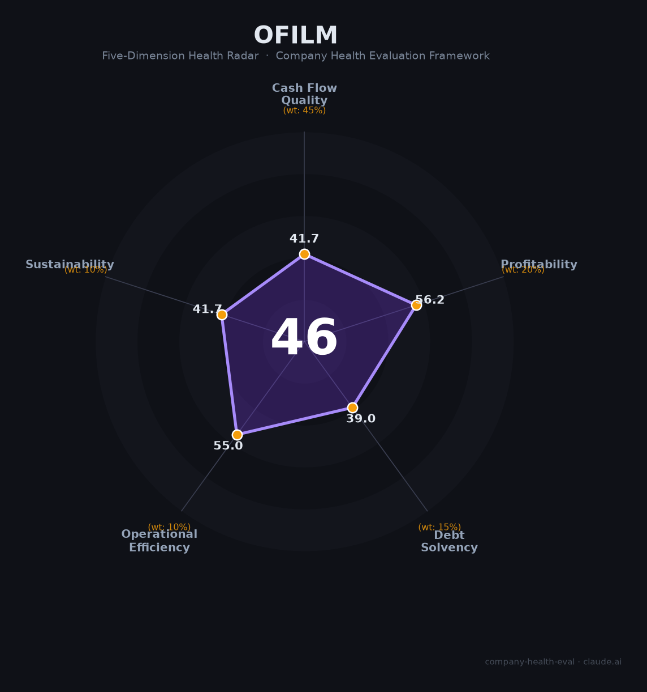

# 欧菲光（002456.SZ）财务健康评估（2026-08-13）

## 一句话结论

🔴 **46/100，中等偏下** | 光学模组龙头，扭亏拐点初现但盈利薄、负债高

## 一、公司基本画像

| 项目 | 内容 |
|------|------|
| 主体 | 欧菲光，光学光电龙头 |
| 主营 | 摄像头模组/光学镜头/触控 |
| 财务 | 2025营收221.5亿(+8.38%)，归母净利0.42亿扭亏 |

> 一句话定性：光学ODM龙头，触底回升但盈利仍弱、高杠杆

---

## 二、五维财务健康评估

### 1. 现金流质量（42/100）| 权重45%

现金流瘦弱，偿债压力大，现金跑道偏紧。

### 2. 盈利能力（56/100）| 权重20%

毛利率低，净利仅微利，盈利能力弱。

### 3. 偿债能力（39/100）| 权重15%

高负债+高有息负债，偿债能力告警。

### 4. 运营效率（55/100）| 权重10%

客户集中+应收高，运营风险偏高。

### 5. 可持续发展（42/100）| 权重10%

消费电子下行+激烈竞争，可持续性偏弱。

---

## 三、综合评分

| 维度 | 得分 | 权重 | 加权 |
|------|:----:|:----:|:----:|
| 现金流质量 | 42 | 45% | 18.8 |
| 盈利能力 | 56 | 20% | 11.2 |
| 偿债能力 | 39 | 15% | 5.8 |
| 运营效率 | 55 | 10% | 5.5 |
| 可持续发展 | 42 | 10% | 4.2 |
| **综合得分** | **46/100** | 100% | 45.5 |

**健康等级：中等偏下** — 存在较多风险点，需谨慎评估

---

## 四、核心风险清单

1. **负债率高企、现金流紧张**
2. **客户集中、苹果供应链**
3. **竞争激烈、盈利微薄**

## 五、求职/择业视角

### 核心优势
- 光学器件龙头，技术储备厚
### 现有短板
- 高负债、低盈利、行业激烈竞争

**结论**：欧菲光困境反转拐点初现，但盈利与负债结构仍脆弱，需谨慎。

---

*评估方法：商泰汽车（iAUTO）五维框架 · 数据截至2026年8月 · 财务来源欧菲光2025年报*