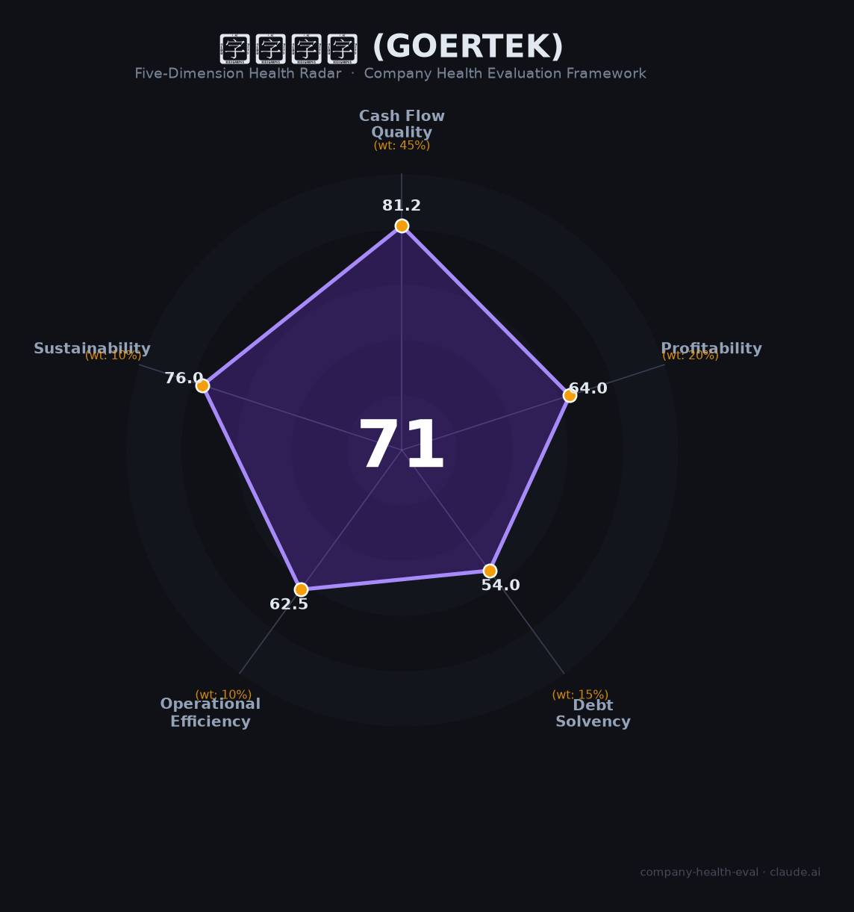

# 歌尔股份（Goertek）财务健康评估（2026-07-01）

## 一句话结论

**🟡 中等偏上（71/100）** | 全球VR代工之王，现金流强劲但债务急升+客户集中+VR市场萎缩三重压力

歌尔股份是全球VR/AR头显代工市占率超70%的绝对龙头（Meta Quest独家ODM），经营现金流连续多年超60亿元、精密零组件技术壁垒深厚。但短期借款从77亿暴增至200亿、前五大客户占比79%、VR市场2025年出货量暴跌42.8%、2026年初启动裁员——是一家"技术底子扎实但周期性风险显著"的公司。

## 一、公司基本画像

| 维度 | 内容 |
|------|------|
| **全称** | 歌尔股份有限公司（Goertek Inc.） |
| **股票代码** | 002241.SZ（深交所主板，2008年上市） |
| **总部** | 山东潍坊高新技术产业开发区（全球布局：越南、青岛、上海等） |
| **实控人** | 姜滨、胡双美夫妇（姜滨直接+歌尔集团合计控制约30%） |
| **市值** | 约800亿元（2026年6月） |
| **员工** | 111,585人（2025年报），其中越南约65,000人（58%） |
| **主营** | 智能硬件（VR/AR/MR头显代工55.7%）、智能声学整机（TWS耳机23.8%）、精密零组件（MEMS传感器/光学模组18.6%） |
| **市场地位** | 全球VR头显代工市占率>70%、AI智能眼镜代工>60%、MEMS声学传感器中国第一 |
| **主要客户** | Meta（~30%）、苹果（~26%）、索尼（~11%）、小米（~7%）、华为（~5%） |
| **关键事件** | 2022年苹果AirPods Pro 2砍单（损失20-24亿）、歌尔微电子分拆创业板撤回→转战港股 |

🔒 上市公司经审计数据：2025年年报（2026年4月23日披露）、2026年一季报。

## 二、五维财务健康评估

### 1. 现金流质量（81.2/100）

| 指标 | 判断 | 依据 |
|------|------|------|
| 经营现金流趋势 | 🟢 健康 | 连续5年为正：2021 ¥86亿→2022 ¥83亿→2023 ¥82亿→2024 ¥62亿→2025 ¥68亿 |
| 现金储备 | 🟢 健康 | OCF ¥68.5亿足以覆盖运营和偿债需求，现金生成能力强劲 |
| 有息负债 | 🟡 关注 | 短期借款从2024年末的¥77亿飙升至2026Q1的¥200亿，财务费用同比+764% |
| 净现比 | 🟢 健康 | OCF ¥68.5亿 / 归母净利润 ¥39.4亿 = 1.74倍，利润含金量高 |

**判断依据**：歌尔的经营现金流是本报告最亮眼的数据——2022年遭遇砍单重创（净利润腰斩至¥17.5亿）时，OCF仍维持¥83亿，说明其产业链议价能力和回款管理极强。但短期借款暴增（一年内从¥77亿→¥200亿）是必须关注的警示信号——2025年财务费用同比飙升764%至¥6.11亿（含汇兑损失¥3.49亿），利息负担正在侵蚀利润。

### 2. 盈利能力（64.0/100）

| 指标 | 判断 | 依据 |
|------|------|------|
| 毛利率 | 🟢 良好 | 11.85%（2025），高于立讯精密10.41%和工业富联7.28%，在EMS行业中处于上沿 |
| 净利率 | 🟡 一般 | 归母4.08%（含¥21.4亿非经常性收益），扣非仅1.53%——主业盈利极薄 |
| 营收增速 | 🟡 一般 | 2024 +2.4%、2025 -4.4%、2026Q1 +14.4%，三年CAGR约-2.7%，处于周期底部 |
| 研发费用率 | 🟢 良好 | 5.21%（¥50.26亿），累计专利37,549项，在EMS行业中属于高研发投入 |
| 人均产出 | 🟢 良好 | ¥86.5万/人（2025），高于立讯精密¥97万/人？实际约¥86.5万，处于行业中上 |

**判断依据**：歌尔的盈利能力呈现典型的"微笑曲线"特征——精密零组件（毛利率23.52%）是利润核心，智能声学整机（毛利率仅3.85%）是流血业务，智能硬件（11.37%）居中。2025年归母净利润¥39.4亿中，约¥21.4亿来自处置歌尔光学股权的非经常性收益，扣非净利润仅¥14.8亿（同比-38.17%），主业盈利修复尚需时间。好消息是2026Q1毛利率回升至13.77%（创同期新高），AI眼镜等高毛利产品占比提升正在改善产品结构。

### 3. 偿债能力（54.0/100）

| 指标 | 判断 | 依据 |
|------|------|------|
| 资产负债率 | 🟡 关注 | 58.85%（2025年末），处于制造业40-70%的中位，但债务结构在恶化 |
| 有息负债率 | 🟡 关注 | 约27.6%（短期¥200亿+长期¥50亿/总资产¥905亿），逼近30%危险线 |
| 流动比率 | 🟡 关注 | 短期借款暴增显著削弱流动性，2026Q1短期借款¥200.75亿 |
| 现金比率 | 🔴 危险 | 扣除运营资金需求后，现金类资产对短期债务的覆盖能力不足 |
| 股权质押 | 🟢 健康 | 姜滨零质押，仅姜龙质押6,500万股（占其持股26%，占总股本1.86%），整体极低 |

**判断依据**：偿债能力是歌尔最大的财务隐忧。短期借款从2024年末的¥77亿→2025年中¥111亿→2026Q1 ¥201亿，一年半翻了三倍。虽然经营现金流（¥68亿/年）有一定覆盖能力，但趋势令人不安——歌尔正在用债务驱动越南产能扩张（总投资超13亿美元），而越南2025年Q4劳动力短缺已导致旺季产能受损。如果VR市场持续低迷（2025年全球出货-42.8%），高杠杆可能成为沉重负担。

### 4. 运营效率（62.5/100）

| 指标 | 判断 | 依据 |
|------|------|------|
| 应收周转 | 🟢 健康 | 应收账款从2024年末¥179亿压降至2025年末¥133亿（-26%），周转约59天，制造业合理 |
| 客户集中度 | 🔴 危险 | 前五大客户占比79%，Meta+苹果合计56%，任一家丢失都将是百亿级冲击 |
| 员工规模趋势 | 🟡 关注 | 2021年95,780→2022年85,358（砍单裁员）→2025年111,585（越南大扩产），2026年初再次裁员 |
| 高管稳定性 | 🟢 健康 | 姜滨/姜龙兄弟控制权稳固，核心高管平均任期20年+。2025年11月姜龙回归任总裁 |

**判断依据**：歌尔的运营效率呈现"周期性波动"——应收管理在改善，但客户集中度是结构性问题（Meta 30% + 苹果26%）。员工规模如过山车：2022年砍单裁员万人，2025年越南暴扩招至11万，2026年1月再次裁员（Alpha Labs研发部门30-50%、全公司10%优化指标、晋升涨薪冻结）。这种波动本身就是运营效率低下的体现——公司无法平稳管理产能和人力。

### 5. 可持续发展能力（76.0/100）

| 指标 | 判断 | 依据 |
|------|------|------|
| 市场增速 | 🟡 关注 | VR市场2025年暴跌42.8%（IDC），但AI智能眼镜暴增241%。冰火两重天 |
| 技术护城河 | 🟢 健康 | 全球VR代工>70%份额、MEMS传感器中国#1、37,549项专利、Pancake/光波导光学自研 |
| 业务多元化 | 🟢 健康 | 三大业务板块+五大客户群（Meta/苹果/索尼/小米/华为），非单一依赖 |
| 资本支持 | 🟢 健康 | A股上市（¥800亿市值）+ 歌尔微电子港股递表，资本通道畅通 |
| 政策风险 | 🟡 关注 | 中美关税20%已落地、越南转运审查趋严、苹果供应链持续外迁 |

**判断依据**：歌尔的可持续性是一把双刃剑。VR/AR代工的技术壁垒（全球>70%份额、10年+深度绑定Meta）是真正的护城河，但VR市场本身正经历深度调整——Meta已暂停Quest 4开发、Reality Labs累计亏损超$700亿。好消息是AI智能眼镜（Meta Ray-Ban）异军突起，歌尔作为独家ODM直接受益，2025年该品类出货量增长241%。歌尔的策略是"用AI眼镜对冲VR下滑"，但单机价值差距意味着短期内难以完全弥补。

## 三、综合评分与健康等级

| 维度 | 得分 | 权重 | 加权得分 |
|------|:----:|:----:|:--------:|
| 现金流质量 | 81.2 | 45% | 36.5 |
| 盈利能力 | 64.0 | 20% | 12.8 |
| 偿债能力 | 54.0 | 15% | 8.1 |
| 运营效率 | 62.5 | 10% | 6.2 |
| 可持续发展 | 76.0 | 10% | 7.6 |
| **综合得分** | | | **71.3 → 71/100** |
| **健康等级** | | | **🟡 中等偏上（Moderate-High）** |

雷达图解读：现金流和可持续发展是两个突出长板，偿债能力是唯一拖入危险边缘的短板。整体呈"一边倒"形态——技术能力和现金生成能力强，但杠杆和客户集中度削弱了财务稳健性。

## 四、同业对标

| 对比项 | **歌尔股份** | **立讯精密（002475）** | **瑞声科技（2018.HK）** | **工业富联（601138）** |
|--------|:-----------:|:-------------------:|:---------------------:|:---------------------:|
| 市值 | ~800亿 | ~3,700亿 | ~400亿港元 | ~3,500亿 |
| 营收（2024） | 1,009.5亿 | 2,687.9亿 | 273.3亿 | 6,091.4亿 |
| 毛利率 | 11.09% | 10.41% | 22.1% | 7.28% |
| 净利率 | 2.56% | 5.42% | 6.6% | 3.82% |
| 员工 | 81,819 | 278,103 | -- | -- |
| 核心赛道 | **VR/AR代工（全球#1）** | 苹果全品类组装（#1） | 声学/光学器件 | 服务器/云计算 |
| 苹果依赖度 | ~26%（下降中） | ~74% | 中等 | 低 |
| 汽车电子 | 布局早期 | 137.6亿（+48.7%） | 有布局 | 有布局 |

**对标结论**：歌尔在EMS行业中毛利率处于上沿（高于立讯和富士康），但净利率远低于立讯（2.56% vs 5.42%），核心原因是产品结构中低毛利的声学整机（3.85%）和智能硬件（11.37%）占大头，而高毛利的精密零组件（23.52%）仅占18.6%。歌尔的差异化在于VR/AR代工的绝对领先地位，这是立讯短期内无法复制的。

## 五、核心风险清单

1. **短期借款暴增（高 🟠）**：一年半内从¥77亿→¥201亿，财务费用同比+764%。触发条件：若VR市场持续下行+越南产能爬坡不及预期，偿债压力将显著上升。

2. **VR市场断崖式下滑（高 🔴）**：2025年全球VR出货-42.8%至390万台，Meta暂停Quest 4开发，歌尔智能硬件业务因此损失超百亿。AI眼镜（+241%）正在对冲但不足以完全弥补。

3. **客户集中度（高 🟠）**：前五大79%，Meta+苹果56%。2022年苹果砍单已证明：单一客户流失可造成20-24亿直接损失。当前Meta占比已超苹果（~30%），Meta的任何战略调整都将重创歌尔。

4. **2026年裁员信号（中 🟡）**：2026年1月Alpha Labs研发部门裁30-50%、全公司10%优化、晋升涨薪冻结。官方称"正常人才流动"，但时机（紧随Meta暂停Quest 4）令人担忧。

5. **越南劳动力风险（中 🟡）**：2025年Q4已爆发一次劳动力短缺（导致旺季产能受损、毛利率骤降），随着更多电子厂涌向越南，用工竞争将加剧。歌尔越南已占员工总数58%，本土化风险在上升。

6. **扣非净利润虚胖（中 🟡）**：2025年归母¥39.4亿中¥21.4亿为非经常性收益（处置股权），扣非仅¥14.8亿且同比-38.17%。非经常性收益不可持续，主业盈利能力仍需观察。

7. **中美关税+转运审查（中 🟡）**：美国对越南征收20%关税（消费电子FOB条款下由进口方承担，直接冲击有限），但对转运商品征收40%惩罚性关税——若歌尔无法证明越南本地化率，可能面临加倍征税。

## 六、求职/择业视角

### 核心优势
- **技术积累深厚**：37,549项专利、VR/AR光学（Pancake/光波导）自研、MEMS传感器全球领先，技术经验在消费电子和汽车电子行业通用性强
- **行业龙头地位**：全球VR代工>70%份额，履历在XR/消费电子制造行业有极强背书
- **现金流稳健**：即使2022年砍单重创，OCF仍维持¥83亿，公司不会因现金流断裂倒闭
- **精英计划有吸引力**：硕士40-55万/年、博士50-73万/年，在制造业中具有竞争力

### 现存短板
- **加班文化严重**：研发部门普遍9116（早9晚11、月休2天），员工自嘲"强度堪比大厂，工资只有大厂1/4"
- **薪酬天花板低**：研发岗20-35K/月（vs 一线互联网40-80K），公积金按最低基数缴纳（月缴仅约1000元）
- **裁员不手软**：2022年砍单裁员万人+2026年初再次裁员，就业安全感低
- **地点劣势**：总部潍坊非一线城市，跳槽选择少；青岛/上海岗位有限
- **高管与员工差距扩大**：2024年高管平均薪酬+35.7%，普通员工人均薪酬-6.14%

### 分场景建议

| 个人诉求 | 推荐度 | 说明 |
|----------|:------:|------|
| 稳定+深耕 | ⭐⭐ | 持续裁员+业务周期性强，稳定性一般。适合能承受周期波动的资深人士 |
| 高薪+跳板 | ⭐⭐⭐ | VR/AR/MEMS技术经验通用，精英计划薪酬有竞争力，但普通研发薪酬偏低 |
| XR行业入门 | ⭐⭐⭐⭐ | 全球VR/AR代工#1，入行XR/AI硬件的绝佳起点，2-3年后跳槽溢价高 |
| 应届生（精英计划） | ⭐⭐⭐⭐ | 精英计划薪酬有竞争力（硕士40-55万），但要做好"9116"和"非一线城市"的心理准备 |
| 应届生（普通） | ⭐⭐ | 普通校招10-15K+潍坊，性价比一般，建议作为备选 |

## 七、总结

歌尔股份是全球XR代工领域「不可替代的龙头」：VR头显代工市占率超70%、经营现金流连续5年超60亿、精密零组件毛利率23.5%构筑护城河。但短期借款暴增至200亿、VR市场断崖式下跌（-42.8%）、前五大客户占比79%、2026年初再次裁员——这些信号同时出现，勾勒出一家「技术底子扎实但被周期性和客户集中度绑架」的公司。在XR行业大洗牌（VR退潮→AI眼镜崛起）和中美供应链重构的大背景下，歌尔属于**中等偏上风险**，适合**能承受周期波动、看重XR/AI硬件赛道长期价值**的求职者；不建议追求稳定或工作生活平衡的候选人将其作为首选。

---

*评估日期：2026-07-01 | 数据来源：歌尔股份2025年年报（2026年4月披露）、2026年一季报、IDC/Wellsenn XR行业数据、券商研报 | 评分引擎：v1.1*
