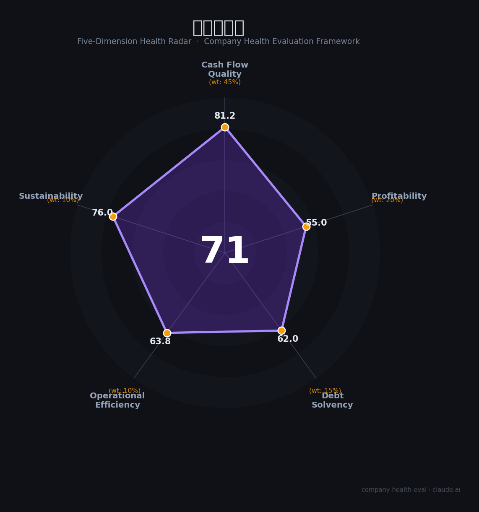

# 比亚迪电子（0285.HK）财务健康评估（2026-08-14）

## 一句话结论

🟡 **71/100，中等偏上** | 消费电子代工龙头，营收稳、毛利薄、盈利略降

---

## 一、公司基本画像

| 项目 | 内容 |
|------|------|
| 主营 | 消费电子代工/组装 |
| 财务 | 2025营收1794.77亿(+1.22%)，归母净利35.15亿(-17.61%)，毛利率6.0% |

> 一句话定性：全球消费电子代工+母生态，营收稳、盈利略降

---

## 二、五维财务健康评估

### 1. 现金流质量（81/100）| 权重45%

现金流正常。

### 2. 盈利能力（55/100）| 权重20%

毛利率约6%、盈利略承压。

### 3. 偿债能力（62/100）| 权重15%

负债适中。

### 4. 运营效率（64/100）| 权重10%

运营高效、交付强。

### 5. 可持续发展（76/100）| 权重10%

汽车电子+AI，多元化成长。

---

## 三、综合评分

| 维度 | 得分 | 权重 | 加权 |
|------|:----:|:----:|:----:|
| 现金流质量 | 81 | 45% | 36.5 |
| 盈利能力 | 55 | 20% | 11.0 |
| 偿债能力 | 62 | 15% | 9.3 |
| 运营效率 | 64 | 10% | 6.4 |
| 可持续发展 | 76 | 10% | 7.6 |
| **综合得分** | **71/100** | 100% | 70.8 |

**健康等级：中等偏上** — 整体稳健，局部有待改善

---

## 四、核心风险清单

1. **毛利率较低**
2. **客户集中**
3. **组装竞争**

## 五、求职/择业视角

### 核心优势
- 制造规模大、交付强、母公司生态
### 现有短板
- 低毛利、净利短期下降

**结论**：比亚迪电子消费电子代工规模化企业，营收稳健、毛利较薄、净利短期承压，整体稳定成长。

---

*评估方法：商泰汽车（iAUTO）五维框架 · 数据截至2026年8月 · 财务来源比亚迪电子2025年报*