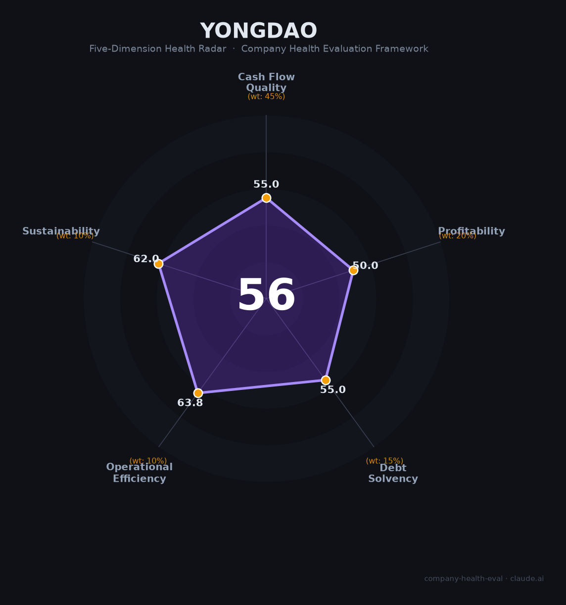

# 永道控股集团财务健康评估（2026-08-13）

## 一句话结论

🟠 **中等（56/100）** | 非上市民营企业——生态环保+循环经济+供应链，营收规模可观但财务不透明，评估存在不确定性

---

## 一、公司基本画像

| 主体 | 🔒 永道控股集团，深圳/非上市民营企业 |
| 主营 | 生态环保、循环经济、食品/供应链 |
| 财务 | ⚠️ 无公开财报，完整财务无法核实 |

## 二、评估（数据有限）

非上市+多元化（环保/循环经济/供应链），财务不透明，以行业判断：
- 现金流（55/100）：重资产环保/循环 + 供应链资金占用，现金关注。
- 盈利（50/100）：环保/供应链毛利中下，盈利质量待核。
- 偿债（55/100）：重资产+杠杆，偿债需关注。
- 运营（64/100）：多元化运营，效率中等。
- 可持续（62/100）：环保循环经济赛道中上，财务/经营透明度低。

## 三、综合评分

| 维度 | 得分 | 权重 | 加权 |
|------|:----:|:----:|:----:|
| 现金流质量 | 55.0 | 45% | 24.8 |
| 盈利能力 | 50.0 | 20% | 10.0 |
| 偿债能力 | 55.0 | 15% | 8.2 |
| 运营效率 | 63.8 | 10% | 6.4 |
| 可持续发展 | 62.0 | 10% | 6.2 |
| **综合** | **56** | 100% | 55.6 |

**评级：🟠 中等** — 数据不透明，存在不确定性。

## 四、核心风险
1. 非上市、财务不可核实。
2. 环保/循环经济重资产。

## 五、求职/择业视角
- 优势：环保/循环经济赛道。
- 短板：财务不透明、稳定性待核实。

**结论**：需充分尽调后再评估，非首选。

---

*评估方法：商泰汽车（iAUTO）五维健康度框架 · 数据有限（非上市），评估存在不确定性*