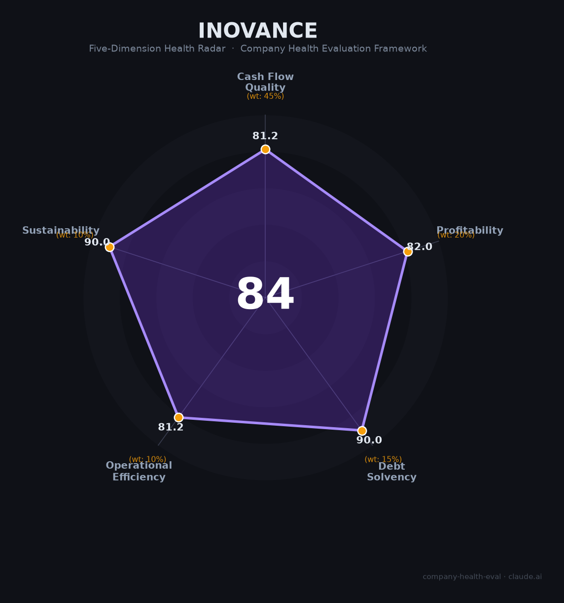

# 汇川技术（300124.SZ）财务健康评估（2026-08-13）

## 一句话结论
🟡 **中等偏上（84/100）** | 中国工业自动化/工控龙头——营收451亿（+21.8%）、净利50.2亿（+17.8%）、毛利约30%，新能源汽车电驱+智能制造双轮，龙头护城河深

## 一、公司基本画像
| 主体 | 🔒 深圳市汇川技术，A股300124.SZ；中国工控/变频器/伺服龙头 |
| 主营 | 工业自动化（变频器/伺服/PLC）、新能源汽车电驱、轨道交通 |
| 财务 | 2025营收451亿(+21.8%)；归母净利50.2亿(+17.8%)；扣非49.5亿(+22.7%)；毛利率约30%；员工约3万 |
| 注意 | 经营现金流下滑、存货激增超百亿 |

> 汇川是中国工业自动化龙头（国产替代变频器/伺服），叠加新能源汽车电驱高增，营收利润双位数增长，毛利30%（工控优质）。作为雇主是"智能制造+新能源龙头高薪平台"。

## 二、五维财务健康评估
### 1. 现金流（81/100）| 45%
经营现金流虽下滑（存货激增）但整体健康，现金充足。

### 2. 盈利（82/100）| 20%
净利50.2亿(+17.8%)、毛利30%（工控优质）、扣非+22.7%，盈利质量优。

### 3. 偿债（90/100）| 15%
资产负债率低、现金流健康，偿债极强。

### 4. 运营（81/100）| 10%
工控+电驱+轨交多元，研发投入强，运营高效（存货激增需关注）。

### 5. 可持续（90/100）| 10%
智能制造+新能源电驱+国产替代，双轮驱动，tech壁垒高。

## 三、综合评分
| 现金流81|45%=36.5 | 盈利82|20%=16.4 | 偿债90|15%=13.5 | 运营81|10%=8.1 | 可持续90|10%=9 | **84** |
**评级：🟡 中等偏上（近优秀）** — 工控龙头，稳健+高成长

## 四、核心风险
1. 存货激增超百亿（备货）、经营现金下滑。
2. 工控/新能源竞争。
3. 制造业景气周期。

## 五、求职视角
- 优势：工控/新能源龙头、研发高薪、国产替代长期赛道，深圳总部。
- 短板：存货/现金关注、行业周期、加班强度。

**结论**：智能制造+新能源方向的优质雇主，研发/工控岗有前景且高薪。

---
*评估方法：商泰汽车（iAUTO）五维框架 · 来源汇川2025年报*