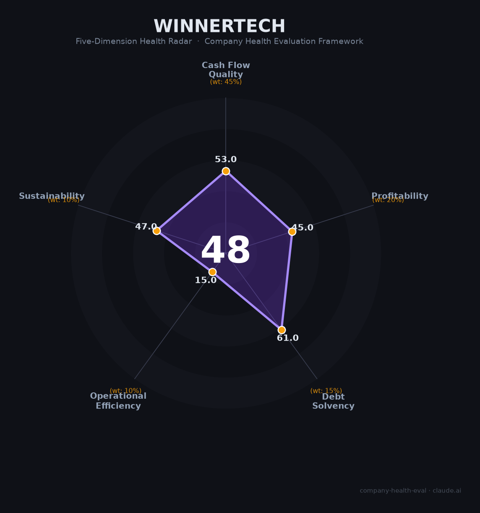

# 汇纳科技 财务健康评估（2026-06-12）

## 一句话结论

🔴 **中等偏下（52/100）** | 连续四年亏损、应收账款濒危、创始人清仓离场、80后新主跨界接盘——公司正处于「换壳求生」的关键十字路口

---

## 一、公司基本画像

| 项目 | 数据 | 可信度 |
|------|------|:------:|
| **主体** | 汇纳科技股份有限公司（Winner Technology Co., Inc.） | 🔒工商 |
| **股票代码** | 300609.SZ（深交所创业板） | 🔒深交所 |
| **成立/上市** | 2004年7月成立 / 2017年2月上市（发行价8.12元） | 🔒招股书 |
| **注册地** | 上海宝山区（实际办公：浦东张江人工智能岛→宝山） | 🔒工商 |
| **原实控人** | 张宏俊（1973年生，创始人）—— **2025年9月已完全退出** | 🔒公告 |
| **现实控人** | **江泽星**（1985年生，金石三维创始人，3D打印背景）—— 2025年5月入主 | 🔒公告 |
| **总经理** | 郝为可（原国金证券投行执行总经理） | 🔒公告 |
| **主营业务** | 线下客流分析系统（视频Re-ID）+ 数据运维服务 + 算力租赁 + 数字政法 | 🔒年报 |
| **2025营收结构** | 数据与运维47% / 数字化软硬件集成23% / 客流分析19% / 大数据平台5% / 智能屏5% | 🔒年报 |
| **市值** | 约32-51亿元（波动较大） | 🔒行情 |
| **PS估值** | 约8.3-8.5x（高于计算机行业均值3.5x，低于同类数据公司10-30x） | 📊推算 |

**⚠️ 2025年控制权变更要点**：
- 创始人张宏俊2020年曾因涉嫌行贿被刑拘（2022年不起诉），此后持续减持
- 2025年5月以24.98元/股转让15%股份给江泽星（总价约4.5亿元），累计套现约5.16亿元
- 同步推进定增：江泽星拟认购3600万股（20.52元/股，募资7.39亿元），全部用于补充流动资金
- 深交所2026年2月对定增方案发出审核问询函，质疑毛利率波动、应收账款高企、实控人认购资金来源等
- 2025年9月董事会大换血，原管理层全部退出，汇纳科技正式进入「江泽星时代」

**一句话定性**：汇纳科技曾是A股唯一专注于线下客流大数据分析的上市公司，在视频客流统计细分领域深耕20年。但连续四年亏损（2022-2025）、应收账款恶化、核心业务萎缩，迫使创始人在2025年清仓退出。80后新主江泽星从3D打印行业跨界而来，试图将公司转型为「3D打印+AI+算力+文创潮玩」平台——这场豪赌尚未看到清晰的盈利路径。

---

## 二、五维财务健康评估

### 1. 现金流质量（62/100）⚠️

**经营现金流仍为正，但三年腰斩——应收账款正在吞噬现金循环。**

| 指标 | 2023 | 2024 | 2025 | 判断 |
|------|:----:|:----:|:----:|:--:|
| 经营现金流净额 | +5,676万 | +4,067万 | +2,056万 | 🔴 连续三年为正但趋势恶化（累计-64%） |
| 现金储备（估） | — | — | 偏紧 | 🔴 定增7.39亿全部用于「补流」暗示现金紧张 |
| 有息负债 | — | — | 极低 | 🟢 资产负债率仅24%，以股权融资为主 |
| 应收周转天数 | ~248天 | ~285天 | **~579天** | ⚫ 远超行业均值128天，是危险的4.5倍 |
| 净现比 | — | — | 正（亏损主因非现金减值） | 🟡 CFO为正但净利润为负，减值驱动亏损 |

**应收账款是汇纳科技最致命的问题**（详见风险清单第1条）。2025年前三季度应收账款2.89亿元，占年化营收的153%。A客户已全额计提坏账1640万元，B/C客户逾期。回款周期从天级变成年级。

**加分项**：经营现金流三年保持正值，说明剔除减值因素后公司仍具有造血能力。资产负债率仅24%，债务风险低。

### 2. 盈利能力（45/100）

| 指标 | 数据 | 得分 | 判断 |
|------|------|:--:|:--:|
| 毛利率 | 48-51%（三年稳定） | 🟡 | 高于IT服务行业均值28%，但低于纯数据公司66-73% |
| 净利率 | -9%(2023)→-6.6%(2024)→**-27.2%(2025)** | 🔴 | 持续亏损且2025年急剧恶化 |
| 营收增速（3Y CAGR） | ~ -9.6% | 🔴 | 3.76亿→3.63亿→3.07亿，持续萎缩 |
| 研发费用率 | ~17-20%（三年均） | 🟢 | 高研发投入是技术公司的重要正向信号 |
| 人均产出 | ~56.5万/人（2025） | 🟡 | IT服务行业中游水平 |

**亏损解剖**：2025年归母净利润-8,346万，其中**减值损失合计5,468万元**（商誉1,382万+坏账1,622万+固定资产697万+存货603万+无形资产418万+投资性房地产403万等）。剔除减值后，经营层面亏损约-2,878万元。亏损主因是「历史包袱出清」而非「经营完全失血」，但出清速度太慢——已连续四年。

**研发投入值得肯定**：即使在营收下滑和亏损扩大的年份，研发费用率仍维持17-20%（2025年研发投入5,601万元占营收18.2%），研发人员197人占全员36%。Re-ID技术是公司的核心技术资产。

### 3. 偿债能力（61/100）

| 指标 | 数据 | 判断 |
|------|------|:--:|
| 资产负债率 | 24.39%（2025年末） | 🟢 远低于40%警戒线 |
| 有息负债率 | 接近0% | 🟢 几乎无银行借款 |
| 流动比率（估） | 1.5-2.0 | 🟡 但应收账款质量差使该指标虚高 |
| 现金比率（估） | <0.5 | 🔴 定增补流反向印证现金紧张 |
| 股权质押 | 原实控人曾有650万股质押（减持原因即为「归还质押本息」） | 🟡 质押问题随原实控人退出已解除 |

**核心矛盾**：账面资产负债率极低（24%），但因为资产端大量是**回收困难的应收账款**，真实偿债能力被高估。如果应收账款大规模核销，净资产将受到直接冲击（2025年末净资产9.38亿，应收账款2.89亿占净资产的31%）。

**加分项**：零有息负债 + 上市公司融资平台（若定增获批将新增7.39亿现金） + 国家级高新技术企业。

### 4. 运营效率（15/100）

| 指标 | 数据 | 判断 |
|------|------|:--:|
| 应收周转 | **579天**（2025Q3年化）vs 行业均值128天 | ⚫ 极度危险 |
| 客户集中度 | 传统业务分散，但算力租赁前五大客户占99.91% | 🔴 新业务高度集中 |
| 员工趋势 | 774人(2021)→517人(2024)→543人(2025) | 🔴 累计缩减30%，虽2025年略有反弹但非有机增长 |
| 高管稳定 | 2025年9月董事会全员更换 | 🔴 创始人+原管理层全部退出 |

2021-2024年间员工从774人持续缩减至517人，累计减少257人（-33%）。虽未公开宣布「裁员」，但这远超正常自然减员水平。2025年回升至543人，但这是控制权变更后的整合效应（合并金石三维体系人员），并非主营业务扩张。

### 5. 可持续发展能力（47/100）

| 指标 | 判断 | 依据 |
|------|:--:|------|
| 行业赛道 | 🟡 | 全球店内分析市场CAGR 24%——赛道空间大，但公司未受益 |
| 技术壁垒 | 🟡 | Re-ID+20年数据积累有价值，但海康/大华在AI底层能力上更强 |
| 客户/业务多元化 | 🟡 | 四条产品线但两条萎缩，新业务（算力/3D打印）跨界风险大 |
| 资本支持 | 🟡 | 上市公司平台+定增7.39亿（待审批）；但深交所问询是不确定因素 |
| 政策/监管风险 | 🔴 | 2021年人脸识别处罚+2023年信披违规双重监管+个保法持续加码 |

**核心困境**：公司在新赛道（算力租赁）实现的增长替代不了传统业务（客流分析、系统集成）的萎缩。2025年公共服务板块-43%，数字化软硬件集成-48%，客流分析系统-28%——三条传统支柱同时崩塌，数据服务（+31%）独木难支。

---

## 三、综合评分与健康等级

| 维度 | 得分 | 权重 | 加权得分 |
|------|:----:|:----:|:--------:|
| 现金流质量 | 62 | 45% | 27.9 |
| 盈利能力 | 45 | 20% | 9.0 |
| 偿债能力 | 61 | 15% | 9.2 |
| 运营效率 | 15 | 10% | 1.5 |
| 可持续发展 | 47 | 10% | 4.7 |
| **52/100** ||**100%**|**51.10**|

**健康等级**：🔴 **中等偏下（Moderate-Low）**

> 得分处于40-55区间的中段。现金流质量（52）和盈利能力（45）是核心拖分项——连续四年亏损+应收账款恶化是根本病因。偿债能力（68）是唯一亮色，得益于极低的资产负债率。运营效率（35）是最大短板。该等级的含义是：**有明确且严重的风险点，不建议作为首选的就业或投资标的，除非能接受高不确定性。**

---

## 四、同业对标

### 直接竞品（客流分析赛道）

| 对比项 | 汇纳科技 | 慧眼数据 | 文安智能 | 智慧图 |
|--------|:------:|:------:|:------:|:------:|
| 上市状态 | A股创业板 | 新三板 | 未上市（C轮） | 未上市（D+轮） |
| 2024营收 | 3.63亿 | ~2,144万 | 未披露 | 未披露 |
| 毛利率 | 50.66% | 53-58% | — | — |
| 净利率 | 亏损 | 微利 | — | — |
| 员工规模 | ~543人 | 小微型 | — | — |
| 核心差异 | 唯一上市、市占率第一 | 体量极小（汇纳的6%） | 侧重交通/安防 | 室内定位方案 |

**客流分析赛道结论**：汇纳科技在A股是该赛道的孤例，在纯客流分析领域市占率大幅领先未上市的竞品。**但这更像「小池塘里的大鱼」——池塘本身在萎缩。**

### 可比A股数据/科技公司

| 对比项 | 汇纳科技 | 每日互动 | 海天瑞声 |
|--------|:------:|:------:|:------:|
| 代码 | 300609 | 300766 | 688787 |
| 2024营收 | 3.63亿 | 4.70亿 | 2.37亿 |
| 营收增速 | **-3.43%** | +9.41% | **+39.45%** |
| 毛利率 | 50.66% | **73.37%** | **66.46%** |
| 净利率 | 亏损 | 亏损 | **+4.77%（盈利）** |
| 资产负债率 | 24.39% | 14.72% | 8.06% |
| PS估值 | ~8.5x | ~10-13x | ~21-30x |

**对标结论**：汇纳科技在数据/AI可比公司中处于明显劣势——营收负增长、毛利率最低、持续亏损。PS估值折价（8.5x vs 同行10-30x）是市场对其基本面的合理定价。**若公司能扭亏并恢复增长，PS有修复至10-15x的潜力；若继续恶化，PS可能向计算机行业均值3.5x回归（对应约40-50%下跌空间）。**

---

## 五、核心风险清单

1. **⚫ 应收账款危机（最高风险）**：2025年前三季度应收账款2.89亿元，占年化营收153%，周转天数579天（行业均值128天）。A客户已全额计提坏账1640万元，B/C客户逾期。**若20%的应收账款最终无法收回（约5,780万元），将对净资产（9.38亿）造成6%的直接冲击，并可能触发更大的信心危机。**触发条件：线下零售进一步恶化导致客户（购物中心/零售连锁）集中违约。

2. **🔴 连续四年亏损+营收持续萎缩（高风险）**：2022→2025年归母净利润分别为-3,767万/-3,403万/-2,386万/**-8,346万**，营收从3.76亿降至3.07亿（两年累计-18%）。当前虽未触及ST（营收>1亿+净资产>0），但若2026年营收继续下滑至逼近1亿且亏损持续，ST风险将实质性上升。

3. **🔴 控制权变更后的战略不确定性（高风险）**：新实控人江泽星是3D打印行业出身，与大数据/AI行业几乎没有交集。公司提出的「3D打印+AI+算力+文创潮玩」战略跨度极大。定增7.39亿元全部补流而非投入具体项目，被深交所问询质疑。**原创始人全部清仓离场（套现5.16亿）本身就是最诚实的信号。**

4. **🔴 监管合规记录不良（中高风险）**：2021年人脸识别非法采集被罚34万元 → 2023年「算力涨价」信披违规被证监局警示函+深交所监管函（董事长/总经理/董秘均被监管谈话）。公司在算力收入仅3.54万元时通过公众号吹嘘AI概念导致股价异常波动——**管理层的诚信度和内控能力有明确历史污点。**

5. **🟡 算力业务客户高度集中（中等风险）**：2025年Q1算力租赁前五大客户占收入99.91%。如果单一客户流失或违约，这块「增长业务」将瞬间归零。本质上更接近硬件贸易而非高粘性SaaS。

6. **🟡 线下零售长期结构性下行（中等风险）**：电商渗透率持续上升（社零线上占比已超25%），购物中心增量建设放缓（全国存量仅8,700+个），线下客流分析的市场天花板正在逼近。这不是周期性波动，而是结构性问题。

---

## 六、求职/择业视角

> 以下分析适用于考虑加入汇纳科技的求职者。

### 核心优势

- **工作生活平衡好**：看准网/员工反馈一致指向「不加班」，早9晚5:30，双休
- **福利体系完善**：五险一金+补充公积金+年终奖+带薪年假+免费班车+餐补+定期体检+员工旅游（10项福利），在民企中属于中上水平
- **无重大劳动争议**：裁判文书网零劳动争议判决，公司遣散做得相对干净
- **技术积累真实**：Re-ID技术+20年数据积累+ISO27001/27701认证，技术人员能接触到有深度的CV/大数据项目
- **若定增成功**：7.39亿现金注入将大幅缓解现金流压力，短期裁员风险降低

### 现存短板

- **薪酬低于行业平均**：人均薪酬约22-23万/年，低于上海IT行业平均水平；看准网评分「低于行业平均」
- **业务持续萎缩**：三年营收降18%，员工缩减30%，加入的是「收缩型」公司而非「成长型」公司
- **战略方向不明**：从客流分析→算力租赁→3D打印潮玩，跨度极大；对于技术人员而言，项目经验的市场通用性存疑
- **面试体验两极分化**：部分候选人反映面试官态度差（如评价「只做后端的都是残疾」）、笔试流程混乱
- **品牌背书价值低**：汇纳科技在大数据/AI圈外认知度不高，对跨行业跳槽帮助有限

### 分场景建议

| 个人诉求 | 推荐度 | 理由 |
|----------|:------:|------|
| 稳定+深耕 | ⭐⭐ | WLB好、无劳资纠纷是加分项；但公司连亏4年+战略大转型，长期稳定性存疑 |
| 高薪+跳板 | ⭐ | 薪酬低于行业均值；品牌认可度有限；技术和业务经验的市场通用性一般 |
| 成长+技术积累 | ⭐⭐⭐ | Re-ID/CV/大数据实战经验有技术含量；研发流程规范；适合作为AI/CV领域过渡平台 |
| 赌转型红利 | ⭐⭐ | 若定增成功+新战略落地，公司可能脱胎换骨；但当前不确定性太高 |

### 面试/入职必确认的三件事

1. **定增进度**——7.39亿能否获批？直接决定公司未来2年的现金流
2. **团队归属**——你将被分配到传统客流业务（萎缩中）还是新业务（算力/3D打印）？两者的前景截然不同
3. **薪酬结构**——底薪+绩效比例如何？公司连续亏损的背景下，年终奖能否兑现需要确认

---

## 七、总结

**汇纳科技是线下客流大数据领域「A股孤例但主业萎缩」的公司**：20年行业深耕+Re-ID技术积累+零有息负债+经营现金流为正构筑了底线，**但连续四年亏损+应收账款濒危（579天）+创始人清仓离场+80后跨界新主的不确定转型构成了顶部的压力天花板**。

在线下零售被电商持续渗透、购物中心增量见顶的大背景下，汇纳科技属于**高风险、高不确定性**的选择——适合认可AI+大数据长期价值、且愿意接受公司可能在未来2年发生根本性变化（无论是好转还是恶化）的求职者；不适合追求薪酬竞争力、职业稳定性或品牌背书的候选人。

---

*评估日期：2026年6月12日 | 数据截至：2025年年报（2026年4月披露）及2026年Q1公开信息 | 信息来源：巨潮资讯网/深交所公告（🔒公开财报）、东方财富/同花顺财务数据、天眼查/启信宝工商数据、深交所/上海证监局监管文件、看准网/脉脉员工评价、艾瑞/灼识/Frost & Sullivan行业报告*
