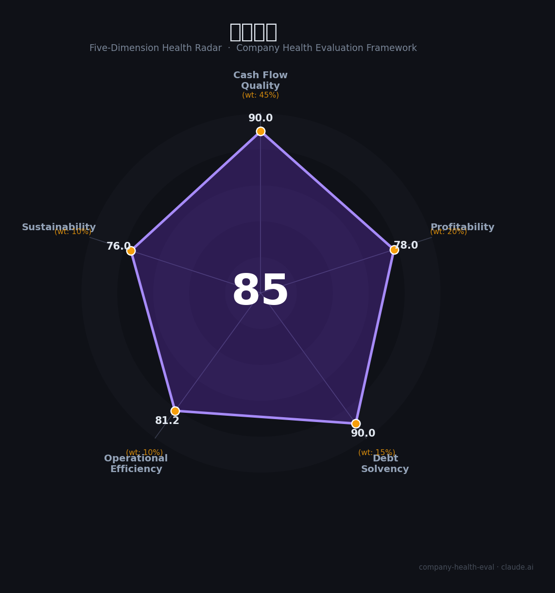

# 汇顶科技（603160.SH）财务健康评估（2026-08-14）

## 一句话结论

🟢 **85/100，优秀** | 手机芯片设计龙头，净利大增、盈利修复、现金充足

---

## 一、公司基本画像

| 项目 | 内容 |
|------|------|
| 主营 | 指纹/触控/声学芯片 |
| 财务 | 2025营收47.36亿(+8.24%)，归母净利8.37亿(+38.66%) |

> 一句话定性：半导体设计龙头，营收净利双增、盈利修复

---

## 二、五维财务健康评估

### 1. 现金流质量（90/100）| 权重45%

经营现金流好。

### 2. 盈利能力（78/100）| 权重20%

毛利率高、净利修复。

### 3. 偿债能力（90/100）| 权重15%

低负债、现金充足。

### 4. 运营效率（81/100）| 权重10%

研发效率高。

### 5. 可持续发展（76/100）| 权重10%

AI终端+汽车电子，芯片需求回暖。

---

## 三、综合评分

| 维度 | 得分 | 权重 | 加权 |
|------|:----:|:----:|:----:|
| 现金流质量 | 90 | 45% | 40.5 |
| 盈利能力 | 78 | 20% | 15.6 |
| 偿债能力 | 90 | 15% | 13.5 |
| 运营效率 | 81 | 10% | 8.1 |
| 可持续发展 | 76 | 10% | 7.6 |
| **综合得分** | **85/100** | 100% | 85.3 |

**健康等级：优秀** — 财务极健康，值得优先考虑

---

## 四、核心风险清单

1. **手机需求**
2. **芯片竞争**
3. **研发投入**

## 五、求职/择业视角

### 核心优势
- 芯片设计龙头、现金充足、盈利修复
### 现有短板
- 全球手机增长有限、竞争

**结论**：汇顶科技半导体设计龙头，营收净利双增、现金充足、盈利修复，优质技术成长平台。

---

*评估方法：商泰汽车（iAUTO）五维框架 · 数据截至2026年8月 · 财务来源汇顶科技2025年报*