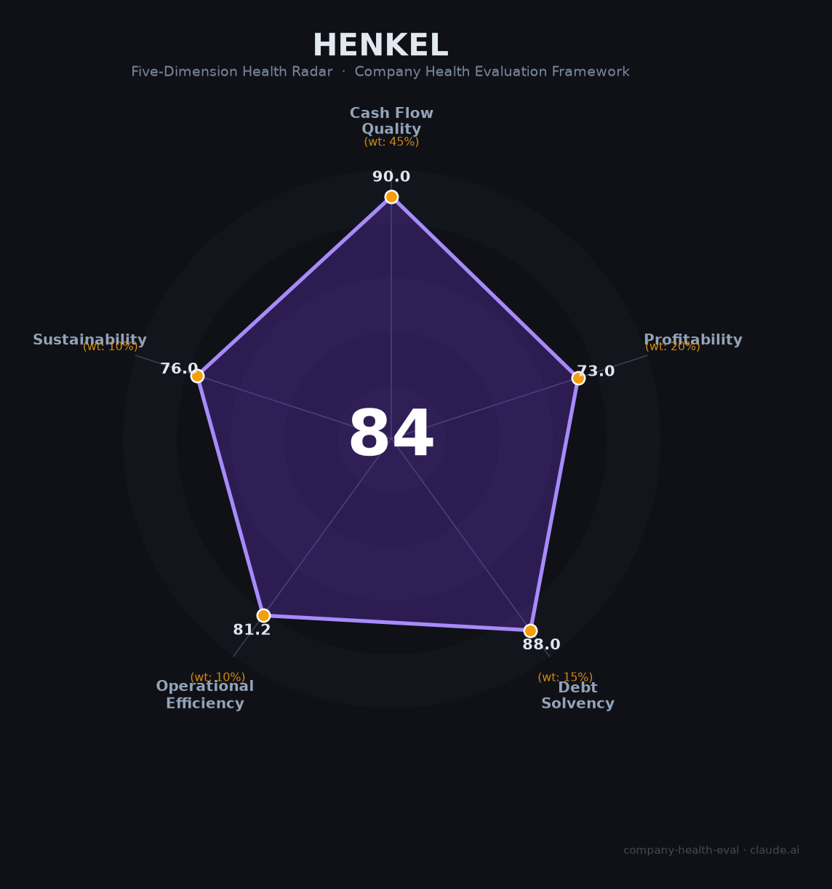

# 汉高（Henkel）财务健康评估（2026-06-12）

## 一句话结论

🟡 **中等偏上（81.4/100）** | 现金流极稳、零净债务的百年德企，消费品利润追赶中，监管逆风需警惕

## 一、公司基本画像

| 项目 | 内容 |
|------|------|
| **全称** | Henkel AG & Co. KGaA（汉高股份有限及两合公司） |
| **成立** | 1876年，德国亚琛，近150年历史 |
| **总部** | 杜塞尔多夫，德国 |
| **上市** | 法兰克福证券交易所 XETRA（优先股 HEN3，普通股 HEN），DAX成分股 |
| **股权** | Fritz Henkel 家族通过股份集合协议控制 **61.85%** 投票权（143名家族成员 + 18个基金会 + 3个信托） |
| **CEO** | Carsten Knobel（2020年1月起，至今6年+） |
| **员工** | 全球约 **47,150人**（126个国籍），中国约4,000-5,000人 |
| **业务** | 粘合剂技术（51%营收）+ 消费品牌（48%营收） |
| **核心品牌** | Loctite（乐泰）、Persil（宝莹）、Schwarzkopf（施华蔻）、Pattex（百得）、Dial、Syoss（丝蕴） |
| **FY2025数据** 🔒 | 营收€204.95亿，调整后EBIT €30.26亿（利润率14.8%），净利润€20.35亿 |

**一句话定性**：全球粘合剂龙头 + 欧洲家庭护理老二，家族控股、财务保守、现金流强劲的百年特种化工与消费品混合集团。

## 二、五维财务健康评估

### 1. 现金流质量（90/100）

汉高在这个最重要维度表现优异。

| 指标 | 数据 | 评级 |
|------|------|------|
| 经营现金流 | 连续4年为正：2022 €12.5亿、2023 €32.6亿、2024 €31.2亿、2025 €25.4亿 | 🟢 健康 |
| 现金储备 | €27.08亿（FY2025），覆盖超过12个月运营支出 | 🟢 健康 |
| 有息负债 | €~36亿 vs 权益€205.8亿，D/E仅0.18 | 🟢 健康 |
| 净现比（OCF/NI） | 2024: 1.54x，2025: 1.25x，均 >1 | 🟢 健康 |
| 自由现金流 | 2024 €23.6亿 / 2025 €18.4亿（同比下降22%但绝对值仍充裕）| 🟡 关注 |

**核心判断**：经营现金流是净利润的1.2-1.5倍，利润质量极高。净债务仅€3.34亿，接近零净债务。2025年FCF下降主要因营运资本变动和重组支出，属一次性因素。扣分点在于FCF两年回落趋势需观察。

### 2. 盈利能力（73/100）

毛利率行业顶级，但净利率和增速拖累总分。

| 指标 | 数据 | 对比 | 评级 |
|------|------|------|------|
| 毛利率 | **51.1%**（FY2025，30年最高）| 消费品行业45-51%，粘合剂行业38% | 🟢 优秀 |
| 净利率 | ~9.9% | P&G 17.7%，L'Oréal 14.7%，Unilever 10.5% | 🟡 良好 |
| 有机增长（3年均值） | ~3-4%（2023: +4.2%，2024: +2.6%，2025: +0.9%）| 低于5%，成熟行业特征 | 🟠 一般 |
| 研发费用率 | 3.0%（€6.34亿，FY2024）| 特种化工行业2.5-4%合理区间 | 🟡 良好 |
| 人均产出 | €43.5万 | P&G $77.8万，L'Oréal €55.7万，化学品行业$30-40万 | 🟡 良好 |

**核心判断**：毛利率持续改善得益于定价策略、成本节约和产品组合优化（剥离低毛利零售商品牌）。但净利率仍显著低于消费品牌同行（P&G 17.7%、L'Oréal 14.7%），这正是「Purposeful Growth」战略的目标——通过品牌整合和效率提升将消费品利润率从13.6%推向16-18%。有机增长天花板明显，两大业务所在市场均为成熟赛道。

### 3. 偿债能力（88/100）

极保守的资本结构，是汉高最显著的财务优势。

| 指标 | 数据 | 评级 |
|------|------|------|
| 资产负债率 | **36.7%**（<40%健康线）| 🟢 健康 |
| 有息负债率（Debt/Equity）| **0.18**（近零杠杆）| 🟢 健康 |
| 净债务 | **€3.34亿**（几乎为零净债务）| 🟢 健康 |
| 流动比率 | 约1.1-1.3（化工企业合理区间）| 🟡 关注 |
| 股权质押 | 不适用（家族持股，无质押风险）| 🟢 健康 |

**加分项**：零净债务 + CDP气候A级 + EcoVadis金级 → 最高信用评价区间。

**核心判断**：流动比率偏低（~1.1）是化工企业运营常态（大量应付账款），有强劲FCF（年均€20亿+）和充裕现金（€27亿）对冲，实际短期偿债风险很低。

### 4. 运营效率（81/100）

重组中的阵痛，效率正在改善但人员缩减影响评分。

| 指标 | 数据 | 评级 |
|------|------|------|
| 应收周转 | 约55-60天（行业平均~60天）| 🟢 健康 |
| 客户集中度 | 粘合剂100,000+客户，消费品遍布全球零售渠道，前5客户占比<15% | 🟢 健康 |
| 员工趋势 | 2020年52,600 → 2024年47,150（-10.4%），反映主动重组 | 🟠 一般 |
| 高管稳定性 | CEO任6年+，家族治理稳定，管理委员会近年因重组有变动 | 🟡 良好 |
| 商誉/总资产 | **42.5%**（€138.5亿商誉 vs €325亿总资产）| 🟠 关注 |

**核心判断**：消费品板块整合已实现库存降25%、员工减35%、EVA改善€5.3亿。员工缩减是主动优化而非被动收缩。商誉占比高（主要来自历史收购如Loctite）是潜在减值风险，但粘合剂品牌护城河深厚，实际减值压力有限。

### 5. 可持续发展能力（76/100）

赛道稳定但非高增长，技术壁垒扎实但监管逆风显著。

| 指标 | 数据 | 评级 |
|------|------|------|
| 行业赛道 | 粘合剂CAGR 4-6%，美容CAGR 6.6%，家庭护理CAGR 4.8% | 🟡 稳定 |
| 技术壁垒 | Loctite全球粘合剂第一品牌，3年+难以全面复制；消费品品牌壁垒弱于工业 | 🟢 健康 |
| 业务多元化 | 53国161个工厂，两大独立板块，多终端市场（汽车/电子/建筑/包装/零售） | 🟢 优秀 |
| 资本支持 | DAX上市+家族控股+零净债务+投资级信用 | 🟢 优秀 |
| 政策/监管风险 | REACH含33种有害物质（ChemScore仅4/25），中国锑出口管制引发不可抗力，FTC阻止Liquid Nails收购 | 🟠 关注 |

**核心判断**：汉高近150年历史证明了可持续经营能力。家族长期导向避免了短期主义。但政策风险是真实逆风——欧盟REACH收紧（33种有害化学物质面临限制）、关键矿物（锑等）供应链脆弱、以及FTC反垄断诉讼表明收购扩张路径受阻。

## 三、综合评分与健康等级

| 维度 | 得分 | 权重 | 加权得分 |
|------|------|------|----------|
| 现金流质量 | 90 | 45% | 40.5 |
| 盈利能力 | 73 | 20% | 14.6 |
| 偿债能力 | 88 | 15% | 13.2 |
| 运营效率 | 81 | 10% | 8.1 |
| 可持续发展 | 76 | 10% | 7.6 |
| **84/100** |**81.4**|**100%**|**81.40**|

**健康等级：🟡 中等偏上（Moderate-High）** — 稳健型，局部有短板但整体可控。

## 四、同业对标

### 粘合剂技术板块

| 对比项 | Henkel 粘合剂 | 3M (MMM) | Sika (SIKA) | H.B. Fuller (FUL) |
|--------|-------------|----------|-------------|-------------------|
| 2024营收 | €109.7亿 | $245.8亿* | CHF 117.6亿 | $35.7亿 |
| 有机增长 | +2.4% | +1.2% | +1.1% | -1.0% |
| EBIT利润率 | **16.6%** | 21.4%* | 14.6% | 9.8% |
| 纯粘合剂占比 | 100% | ~20%* | ~80% | 100% |

*3M为多元化集团（电子、安全、医疗），粘合剂仅为业务之一，利润率不可直接对比。

### 消费品牌板块

| 对比项 | Henkel 消费品 | P&G (宝洁) | Unilever (联合利华) | L'Oréal (欧莱雅) |
|--------|-------------|-----------|-------------------|-----------------|
| 2024营收 | €104.7亿 | $840.4亿 | €608亿 | €434.8亿 |
| 有机增长 | +3.0% | +4.0% | +4.2% | +5.1% |
| 毛利率 | ~51% | 51.4% | 45.0% | **74.2%** |
| EBIT利润率 | 13.6% | **22.1%** | 18.4% | 20.0% |
| 人均产出 | €43.5万 | $77.8万 | €50.6万 | €55.7万 |

**对标结论**：汉高在粘合剂赛道是利润率冠军（纯粘合剂企业中EBIT利润率最高），但在消费品牌赛道是"追赶者"——EBIT利润率13.6% vs 三大巨头18-22%，差距主要来自规模效应和品牌溢价能力。当前「Purposeful Growth」战略的核心正是缩小这一差距。

## 五、核心风险清单

1. **FTC反垄断诉讼阻止Liquid Nails收购（高）**：2025年12月FTC起诉阻止$7.25亿收购案，若败诉不仅失去增长点，且释放出收购扩张路径受阻的信号。可能迫使汉高转向更小规模的bolt-on交易或依赖有机增长。

2. **EU REACH/化学品监管收紧（中高）**：现有33种有害化学物质面临未来限制，ChemSec评分为25分中仅4分。产品组合中持久性化学物质5种、SVHC候选物质10种。配方替代需要长期研发投入和客户验证。

3. **关键原材料供应链脆弱（中高）**：2024年中国锑出口管制导致汉高对汽车客户宣布不可抗力（Bonderite/Teroson四种型号），锑价暴涨230%。未来类似关键矿物（稀土、特种化学品原料）管制风险持续存在。

4. **消费品牌利润率差距（中）**：消费品EBIT利润率13.6% vs 同行18-22%，差距€4-8亿利润。若Purposeful Growth战略到2027年未能缩小差距，市场可能施压更激进的重组甚至分拆。

5. **欧洲能源成本高企（中）**：EU天然气价格为美国3倍，化工产能利用率仅74.6%。汉高在德国保留大量生产设施（约9,800名德国员工），能源成本持续高于战前水平将侵蚀粘合剂利润。

6. **商誉减值风险（中低）**：商誉€138.5亿占总资产42.5%，主要来自Loctite等历史收购。除非粘合剂业务基本面大幅恶化，实际减值概率较低。

7. **CEO继任真空（低）**：Carsten Knobel现年57岁，已任6年+CEO，无公开继任计划。家族治理结构意味着换届通常平稳，但过渡期不确定性仍存。

## 六、求职/择业视角

### 核心优势

- **极低裁员风险（中国区）**：2022-2025年全球裁员集中在欧美销售行政和供应链岗位，中国区同期仍在加码投资（烟台€1.24亿新工厂 + 上海€7000万创新中心），中国被定位为「全球第三大市场+创新引擎」。
- **品牌背书价值高**：汉高是全球粘合剂No.1、DAX成分股，在制造业/化工/消费品行业跳槽时有较强议价能力。Loctite/Schwarzkopf品牌知名度在中国也较高。
- **工作生活平衡突出**：15天年假 + 2天公司假 + 6天全薪病假 + 40%灵活办公 + 七险二金。看准网数据显示71%员工基本准时下班，57%周末不加班。Glassdoor WLB评分4.3/5。
- **培训体系完善**：管理培训生项目体系成熟，轮岗机会多。中国区粘合剂创新中心有500+科学家，技术岗位学习资源丰富。

### 现存短板

- **薪酬竞争力一般**：管培生12-15K/月在上海外企中处于中等水平，看准网用户评价"工资不算很高"。年度涨薪7-10%尚可但基数不高。无法与互联网大厂及头部咨询公司竞争。
- **晋升速度偏慢**：德企传统的层级结构和家族控股意味着晋升通道相对缓慢，名额有限。适合愿意深耕而非追求快速跃迁的人。
- **消费品牌业务天花板**：消费品板块在中国面对宝洁、联合利华、欧莱雅的绝对规模压制，品牌建设和市场份额追赶艰难。若在消费品团队，个人成长空间可能受限。

### 分场景建议

| 个人诉求 | 推荐度 | 理由 |
|----------|--------|------|
| 稳定+深耕（5年+） | ⭐⭐⭐⭐⭐ **强烈推荐** | 现金流极稳、零净债务、家族长期导向、中国持续投资，不用担心公司倒闭或大幅裁员 |
| 高薪+跳板（2-3年） | ⭐⭐⭐ 可选 | 品牌背书有价值但薪资竞争力一般。粘合剂业务跳槽到3M/Sika/化工外企效果好；消费品业务品牌力不及宝洁/欧莱雅 |
| 技术成长+专业化 | ⭐⭐⭐⭐ **推荐** | 粘合剂技术板块（尤其上海创新中心）技术密度高，特种化学品经验通用性强，对汽车/电子/航空等行业有价值 |
| 多元+跨领域 | ⭐⭐⭐ 可选 | 两大业务板块差异大，内部跨板块机会存在但不丰富。德语能力是加速晋升的关键变量 |
| WLB优先 | ⭐⭐⭐⭐⭐ **强烈推荐** | 德企文化 + 灵活办公 + 15天年假，在制造业/化工行业中属于顶尖水平 |

## 七、总结

**汉高是特种化工+消费品混合领域「现金流堡垒、利润追赶者」的公司：**

经营现金流是净利润的1.2-1.5倍，零净债务，家族控股近150年——财务安全垫极厚。唯一短板是消费品板块利润率（13.6%）与宝洁（22.1%）、欧莱雅（20.0%）存在显著差距。

在欧盟化学品监管收紧、欧洲能源成本高企的大环境下，属于**中等偏上**风险等级，适合**追求稳定性、重视WLB、愿意深耕特种化工或消费品品牌的长期主义者**的选择。不适合追求短期高薪或快速晋升的求职者。

---

*评估方法论：商泰汽车（iAUTO）五维企业健康度框架 | 数据截至2026年6月 | 数据来源详见各章节标注*
