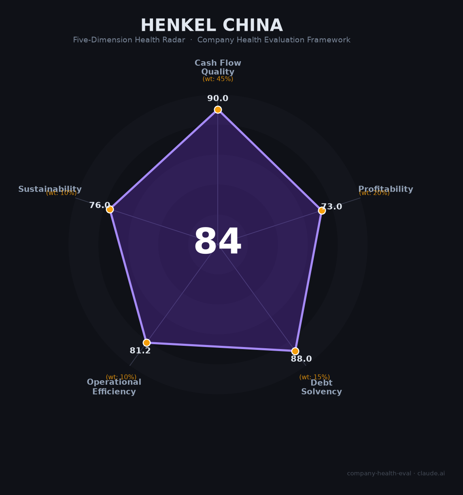

# 汉高（中国地区）财务健康评估（2026-07-12）

## 一句话结论

🟡 **中等偏上（84/100）** | 德国化工巨头中国区——全球现金流堡垒庇护下的稳健之选，中国持续加码投资，薪酬竞争力是唯一明显短板

## 一、公司基本画像

| 项目 | 内容 |
|------|------|
| **中国运营主体** | 汉高（中国）投资有限公司、汉高化学技术（上海）有限公司等多家法人 |
| **中国总部** | 上海市杨浦区江湾城路99号（汉高亚太及大中华区总部） |
| **进入中国** | 1971年（香港），1988年（北京代表处），深耕**55年** |
| **中国员工** | 约 **4,000-5,000人**（占全球约8.5%） |
| **中国布局** | 近**30个**工厂和办事处，覆盖10+城市 |
| **全球母公司** | Henkel AG & Co. KGaA，1876年成立，法兰克福DAX上市（HEN3.DE），近150年历史 |
| **全球CEO** | Carsten Knobel（2020年起，6年+） |
| **中国业务** | 粘合剂技术（约50%营收）+ 消费品牌（约50%营收）：乐泰/Loctite、施华蔻/Schwarzkopf、宝莹/Persil、丝蕴/Syoss、沙宣（2024年收购） |
| **全球FY2025数据 🔒** | 营收€204.95亿，调整后EBIT €30.26亿（利润率14.8%），净利润€20.35亿，自由现金流€18.42亿 |

**一句话定性**：全球粘合剂龙头在中国的「战略增长引擎」——母公司近零净债务、现金流极强，中国区作为全球第三大市场正享受持续资本注入（烟台¥9亿新工厂+上海研发中心+沙宣收购），而非全球重组中的裁撤对象。

## 二、五维财务健康评估

> **说明**：汉高中国不单独发布财务报告。以下评分基于汉高全球经审计财报（FY2025），结合中国区公开运营数据进行调整判断。全球财务数据标注为 🔒，中国区估算标注为 📊。

### 1. 现金流质量（90/100）

汉高全球现金流极为健康，中国区作为核心增长市场，享有母公司的充分资金支持。

| 指标 | 数据 | 评级 |
|------|------|------|
| 经营现金流 | 🔒 连续4年为正：2022 €12.5亿 → 2023 €32.6亿 → 2024 €31.2亿 → 2025 €25.4亿 | 🟢 健康 |
| 现金储备 | 🔒 €27.08亿（FY2025），覆盖超过12个月运营支出 | 🟢 健康 |
| 有息负债 | 🔒 净债务仅€3.34亿，D/E 0.18，接近零净债务 | 🟢 健康 |
| 净现比（OCF/NI） | 🔒 2024: 1.54x，2025: 1.25x，利润质量极高 | 🟢 健康 |
| 中国区资本投入 | 📊 2023-2025年累计对华投资超€2亿（烟台工厂¥9亿+上海研发中心¥1亿+沙宣€2.8亿），中国被定位为「全球第三大市场+创新引擎」 | 🟢 健康 |

**核心判断**：母公司经营现金流是净利润的1.2-1.5倍，零净债务，家族控股近150年——财务安全垫极厚。对中国求职者而言，这意味着汉高中国几乎不存在因母公司资金链断裂而裁员的风险。中国区近年获得的是增量投资而非收缩预算。

### 2. 盈利能力（73/100）

毛利率行业顶级，但净利率和增速拖累总分。中国市场增长快于全球均值。

| 指标 | 数据 | 对比 | 评级 |
|------|------|------|------|
| 毛利率 | 🔒 **51.1%**（FY2025，30年最高） | 化工行业均值14.6-27.9%，消费品头部45-51% | 🟢 优秀 |
| 净利率 | 🔒 ~9.9% | P&G 17.7%，L'Oréal 14.7%，Unilever 10.5% | 🟡 良好 |
| 有机增长 | 🔒 全球+0.9%（FY2025），📊 亚太区+5.5%（H1 2024） | 中国增速显著高于全球均值 | 🟠 一般 |
| 研发费用率 | 🔒 3.0%（€6.34亿，FY2024） | 特种化工行业2.5-4%合理区间 | 🟡 良好 |
| 人均产出 | 🔒 €43.5万 | 中国化工行业均值约¥80-120万，汉高处于中上水平 | 🟡 良好 |

**核心判断**：51.1%的毛利率在化工行业中极为突出（中国化工上市公司均值仅14.6-15.4%），反映粘合剂技术的高壁垒和品牌溢价。但净利率9.9%与消费品牌同行（P&G 17.7%）差距明显——这正是全球「Purposeful Growth」战略试图缩小的。中国区消费品业务（施华蔻+沙宣+丝蕴）盈利能力可能更低，因需持续投入品牌建设和渠道。

### 3. 偿债能力（88/100）

极保守的资本结构，是汉高最显著的财务优势。

| 指标 | 数据 | 评级 |
|------|------|------|
| 资产负债率 | 🔒 **36.7%**（<40%健康线） | 🟢 健康 |
| 有息负债率（Debt/Equity） | 🔒 **0.18**（近零杠杆） | 🟢 健康 |
| 净债务 | 🔒 **€3.34亿**（几乎为零净债务） | 🟢 健康 |
| 流动比率 | 🔒 约1.1-1.3（化工企业合理区间） | 🟡 关注 |
| 股权质押 | 🔒 不适用（家族持股61.85%投票权，无质押风险） | 🟢 健康 |

**加分项**：零净债务 + DAX上市 + 投资级信用 → 最高信用评价区间。

**核心判断**：流动比率偏低（~1.1）是化工企业运营常态（大量应付账款），有年均€20亿+自由现金流和€27亿现金储备对冲。对中国员工而言，这意味着公司不会因债务压力而被迫裁员或降薪。

### 4. 运营效率（81/100）

全球重组阵痛中，但中国区是净扩张区域。

| 指标 | 数据 | 评级 |
|------|------|------|
| 应收周转 | 🔒 约55-60天（行业平均~60天） | 🟢 健康 |
| 客户集中度 | 🔒 粘合剂100,000+客户，消费品遍布全球零售渠道，前5客户占比<15% | 🟢 健康 |
| 员工趋势 | 🔒 全球：2020年52,600 → 2024年47,150（-10.4%）；📊 中国区：逆势扩张，烟台新工厂预计新增数百岗位 | 🟠 一般 |
| 高管稳定性 | 🔒 全球CEO任6年+，大中华区总裁安娜（Anna）在任稳定 | 🟡 良好 |

**核心判断**：全球员工缩减10.4%主要发生在欧美销售行政和供应链岗位（2022-2025年裁减2,800+岗位）。中国区同期行为完全相反——烟台投资¥9亿建「鲲鹏工厂」（2025年试生产）、上海启用消费品亚洲研发中心和应用技术中心、收购沙宣和苏州博科。**中国是汉高的「增员市场」，而非「减员市场」**。

### 5. 可持续发展能力（76/100）

赛道稳定、技术壁垒扎实，但中国区面临本土竞争加剧和地缘政治双重压力。

| 指标 | 数据 | 评级 |
|------|------|------|
| 行业赛道 | 📊 全球粘合剂CAGR 4.3-6.0%，中国结构胶市场¥660亿（+20%），新能源汽车单车用胶量3.2kg→8.5kg | 🟡 稳定 |
| 技术壁垒 | 🔒 Loctite全球粘合剂第一品牌，3年+难以全面复制；中国本土企业（回天新材、硅宝科技）在高端领域差距仍大 | 🟢 健康 |
| 业务多元化 | 🔒 53国161个工厂，粘合剂+消费品双轮驱动，覆盖汽车/电子/建筑/包装/零售 | 🟢 优秀 |
| 资本支持 | 🔒 DAX上市+家族控股+零净债务+中国区持续投资 | 🟢 优秀 |
| 政策/监管风险 | ⚠️ EU REACH化学品监管收紧（ChemScore 4/25），中国锑出口管制引发不可抗力，中欧贸易摩擦不确定性 | 🟠 关注 |

**核心判断**：中国区面临独特的「双向政策风险」——欧盟端化学品监管收紧影响全球产品配方，中国端关键矿物出口管制（锑等）和可能的贸易反制措施带来供应链不确定性。但汉高55年在华深耕建立的本地化供应链（30个工厂/办事处+苏州博科收购）提供了缓冲。

## 三、综合评分与健康等级

| 维度 | 得分 | 权重 | 加权得分 |
|------|------|------|----------|
| 现金流质量 | 90 | 45% | 40.5 |
| 盈利能力 | 73 | 20% | 14.6 |
| 偿债能力 | 88 | 15% | 13.2 |
| 运营效率 | 81.2 | 10% | 8.1 |
| 可持续发展 | 76 | 10% | 7.6 |
| **84/100** |**—**|**100%**|**84.00**|

**健康等级：🟡 中等偏上（Moderate-High）** — 稳健型，局部有短板但整体可控。

## 四、同业对标

### 中国粘合剂市场：汉高 vs 本土龙头（2024年）

| 对比项 | 汉高（全球粘合剂） | 万华化学 | 回天新材 | 硅宝科技 |
|--------|-----------------|----------|----------|----------|
| 营收 | €109.7亿（~¥865亿） | ¥1,820.69亿 | ¥39.89亿 | ¥31.59亿 |
| 毛利率 | ~45-51%（推算） | 16.16% | 18.46% | 20.82% |
| 净利率 | 16.6%（EBIT） | 7.16% | 2.60% | 7.62% |
| 员工规模 | ~47,000（全球） | ~33,303 | — | — |
| 核心差异 | 全球粘合剂#1，高端垄断（溢价300-500%） | 大宗化工MDI龙头，周期性强 | 华为/比亚迪供应链，快速响应，利润暴跌66% | 新能源+电子胶增长强劲，国产替代先锋 |

### 中国洗护发市场：汉高消费品 vs 三大巨头（2024年）

| 对比项 | 汉高（施华蔻+沙宣） | 欧莱雅 | 宝洁 | 联合利华 |
|--------|-------------------|--------|------|----------|
| 中国市场份额 | **5.1%**（+沙宣后~5.7%） | **17.3%** | **13.7%** | **13.3%** |
| 核心品牌 | 施华蔻、沙宣、丝蕴 | 卡诗、欧莱雅 | 海飞丝、潘婷、飘柔 | 清扬、力士、多芬 |
| 趋势 | 📈 上升（收购沙宣+亚洲研发中心） | 📉 小幅下滑 | 📉 下滑 | 📉 下滑 |
| 核心差异 | 专业美发+高端零售双线布局，但规模差距大 | 品牌矩阵全覆盖，规模碾压 | 大众市场统治力强 | 中端市场布局完整 |

**对标结论**：汉高中国在粘合剂赛道是「高处不胜寒的高端王者」（全球龙头+中国第一梯队），但在消费品牌赛道是「奋力追赶的第四名」——市占率仅为欧莱雅的1/3，差距主要来自品牌矩阵深度和渠道渗透率。中国区的增长故事主要在粘合剂（新能源+电子+汽车）和高端美发（沙宣+施华蔻专业线）。

## 五、核心风险清单

1. **全球重组波及中国区的尾部风险（中低）**：2022-2025年全球裁减2,800+岗位，虽然目前中国区是净增员市场，但若全球「Purposeful Growth」战略未达预期（2026年底收官），不排除进一步整合波及中国区消费品板块。**触发条件**：消费品EBIT利润率到2026年底未达16%目标。

2. **中欧贸易摩擦升级（中）**：欧盟对中国电动车加征关税已引发中方反制预期。汉高作为德资企业，在中国汽车供应链深度嵌入（新能源汽车提供约300种粘合剂方案），若中方对欧洲化工品加征关税或限制市场准入，将直接冲击中国区粘合剂业务。**触发条件**：中欧贸易谈判破裂或中方正式出台反制清单。

3. **关键原材料供应链脆弱（中高）**：2024年中国锑出口管制导致汉高对汽车客户宣布不可抗力（Bonderite/Teroson四种型号），锑价暴涨230%。类似关键矿物（稀土、特种化学品）管制风险持续存在。**触发条件**：中美/中欧贸易冲突升级至战略矿产领域。

4. **本土竞争对手加速追赶（中）**：2024年国产化率已提升至58%，回天新材、硅宝科技研发投入占比从3.2%跃升至7.8%。在新能源汽车、光伏背板等增量市场，国产替代正在加速。**触发条件**：本土企业突破高端粘合剂核心技术（如动力电池封装胶）。

5. **消费品牌中国市场份额突破困难（中）**：施华蔻+沙宣市占率仅~5.7%，面对欧莱雅（17.3%）、宝洁（13.7%）和国货品牌（蜂花、阿道夫）的三重夹击。沙宣收购后的整合效果和渠道扩张需要时间和持续投入。**触发条件**：沙宣整合不及预期，或国货品牌在高端线取得突破。

6. **欧洲能源成本高企的间接影响（中低）**：EU天然气价格为美国3倍，化工产能利用率仅74.6%。虽然中国区生产依赖本地工厂，但全球利润压力可能压缩中国区的投资预算和涨薪空间。**触发条件**：欧洲能源危机再度恶化。

## 六、求职/择业视角（中国地区）

### 核心优势

- **母公司财务安全性极高**：零净债务+年均€20亿+自由现金流+家族控股近150年。汉高中国几乎不会因「公司倒闭」而失业——这是2026年中国就业市场中稀缺的安全感。
- **中国区处于扩张周期**：烟台¥9亿新工厂（鲲鹏工厂，2025年试生产）、上海消费品亚洲研发中心（投资近¥1亿）、粘合剂应用技术中心、收购沙宣和苏州博科——中国是汉高全球版图中少数「增员+增资」的市场。全球重组裁的是欧美岗位，中国在招人。
- **品牌背书价值高**：汉高是全球粘合剂No.1、DAX成分股，在制造业/化工/消费品行业跳槽时有较强议价能力。Loctite/Schwarzkopf品牌在中国消费者中知名度也较高。
- **工作生活平衡突出**：15天年假+2天公司假+6天全薪病假+弹性工作制+七险二金。82%员工基本准时下班，50%周末完全不加班。在制造业/化工行业中属于顶尖水平。
- **培训体系完善**：管理培训生项目体系成熟，轮岗机会多。中国区粘合剂创新中心有500+科学家，技术岗位学习资源丰富。

### 现存短板

- **薪酬竞争力一般**：平均月薪约¥11,242，管培生12-15K/月。在上海外企中处于中等水平，与互联网大厂（25-50K/月应届）和头部咨询公司差距明显。年度涨薪5-10%尚可但基数不高。
- **晋升速度偏慢**：德企传统的层级结构+家族控股意味着晋升通道相对缓慢，名额有限。JC（普通级）→MC（管理层）的跃升需要时间和绩效积累。适合愿意深耕而非追求快速跃迁的人。
- **消费品牌业务天花板**：消费品板块在中国面对欧莱雅、宝洁、联合利华的绝对规模压制，加上国货品牌（蜂花、珀莱雅等）的电商渠道强势。若在消费品团队，品牌建设和市场份额追赶艰难。
- **全球重组的不确定性**：虽然目前中国区是增员市场，但重组要到2026年底收官。若整体未达预期，不排除进一步措施影响中国区。

### 分场景建议

| 个人诉求 | 推荐度 | 理由 |
|----------|--------|------|
| 稳定+深耕（5年+） | ⭐⭐⭐⭐⭐ **强烈推荐** | 母公司财务极稳、零净债务、家族长期导向、中国持续投资。在中国就业市场波动中属于「防御性堡垒」型雇主 |
| WLB优先 | ⭐⭐⭐⭐⭐ **强烈推荐** | 德企文化+15天年假+弹性工作+82%准时下班，在化工/制造业外企中属于顶级 |
| 技术成长+专业化 | ⭐⭐⭐⭐ **推荐** | 粘合剂技术板块（尤其上海创新中心）技术密度高，新能源汽车/电子封装方向前景好，特种化学品经验通用性强 |
| 高薪+跳板（2-3年） | ⭐⭐⭐ 可选 | 品牌背书有价值但薪资竞争力一般。粘合剂跳槽到3M/Sika/BASF效果好；消费品跳槽到宝洁/欧莱雅有品牌认知但不如直接在大厂 |
| 多元+跨领域 | ⭐⭐⭐ 可选 | 粘合剂+消费品双板块差异大，内部跨板块存在但机会不丰富。德语能力是加速晋升的关键变量 |
| 应届生起点 | ⭐⭐⭐⭐ **推荐** | 培训体系完善、外企规范、品牌背书好。2-3年后跳槽时「汉高」在简历上是加分项。管培生项目是很好的起跳板 |

## 七、总结

**汉高（中国地区）是特种化工+消费品混合领域「全球现金流堡垒在中国的前沿阵地」：**

母公司经营现金流是净利润的1.2-1.5倍，零净债务，家族控股近150年——财务安全垫极厚。在中国外企普遍收缩的2024-2026年，汉高逆势对华投入超€2亿（烟台工厂+上海研发+沙宣收购），中国被定位为「全球第三大市场+创新引擎」而非成本优化对象。

唯一短板是薪酬竞争力——在上海外企中处于中等水平，与互联网/咨询行业差距显著。但换来的是一份在2026年中国就业市场中相当稀缺的「安全感」：不用担心公司倒闭、不用担心业务被裁撤、不用担心明天突然失业。

在中欧贸易摩擦升温、本土化工企业加速追赶的大环境下，汉高中国属于**中等偏上**风险等级，适合**追求稳定性、重视WLB、愿意在特种化工或消费品品牌领域长期深耕的求职者**。不适合追求短期高薪、快速晋升或想在风口赛道（AI/自动驾驶等）搏一把的人。

---

*评估方法论：商泰汽车（iAUTO）五维企业健康度框架 · 数据截至2026年7月 · 全球财务数据🔒来自汉高FY2025年报 · 中国区数据📊来自公开信息和估算*
