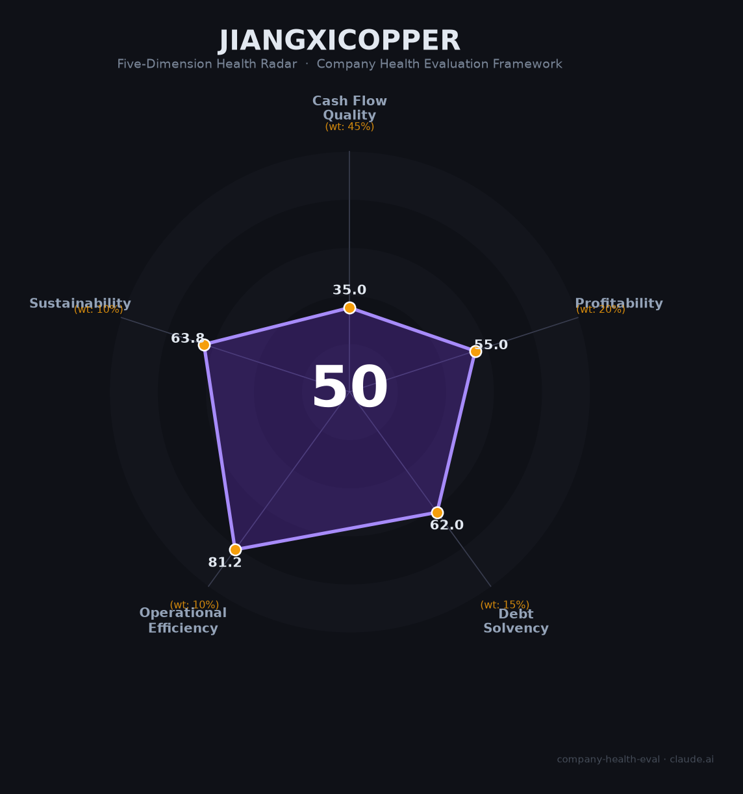

# 江西铜业（600362.SH / 00358.HK）财务健康评估（2026-08-13）

## 一句话结论

🔴 **中等偏下（50/100）** | 中国铜业龙头——营收5446亿+产能规模大，但低毛利（4.4%）+经营现金流转负（-69亿）+存货占用资金，盈利质量弱

---

## 一、公司基本画像

| 项目 | 内容 |
|------|------|
| 主体 | 🔒 江西铜业股份有限公司，A股：600362.SH（2002）、H股：00358.HK；中国最大的铜生产商之一 |
| 成立 | 🔒 1979年，江西省属国资控股 |
| 规模 | 🔒 员工26,740人；铜冶炼产能全球前列 |
| 主营 | 阴极铜、铜杆线、黄金、白银、硫酸 |
| 财务 | 🔒 2025营收5,446.23亿（+5.4%）；归母净利71.30亿（+2.4%）；扣非91.48亿（+11.3%） |
| 现金流 | 🔒 经营现金流净额-69.14亿（转负）；套保损失45.6亿；毛利率4.4%、净利率1.37%、负债率56.95% |

> 一句话定性：江西铜业是全球铜冶炼龙头之一，营收5446亿（大宗贸易体量），但低毛利（4.4%）、经营现金流-69亿转负（存货/预付占用）、套保损失，反映铜冶炼"大而不强"的低附加值+资金密集型本质。

---

## 二、五维财务健康评估

### 1. 现金流质量（35/100）| 权重45%
经营现金流-69亿转负（存货/铜精矿占用资金），净现比差，现金流预警；但产能与龙头地位。

### 2. 盈利能力（55/100）
毛利率4.4%、净利率1.37%（低毛利冶炼），归母净利71亿（+2.4%）稳健但薄；扣非91亿提升（+11%）。

### 3. 偿债能力（62/100）
负债率56.95%，有息负债、铜价/存货波动影响；但国资背景、短期资金周转偏紧。

### 4. 运营效率（81/100）
生产运营稳定、客户分散、规模经济，采购/冶炼体系成熟。

### 5. 可持续发展（64/100）
铜长期需求（新能源/电网）中上，但基本面强周期+低毛利+套保风险。

---

## 三、综合评分

| 维度 | 得分 | 权重 | 加权 |
|------|:----:|:----:|:---:|
| 现金流质量 | 35.0 | 45% | 15.8 |
| 盈利能力 | 55.0 | 20% | 11.0 |
| 偿债能力 | 62.0 | 15% | 9.3 |
| 运营效率 | 81.2 | 10% | 8.1 |
| 可持续发展 | 63.8 | 10% | 6.4 |
| **综合** | **50** | 100% | 50.5 |

**评级：🔴 中等偏下** — 龙头规模但盈利与现金流偏弱。

---

## 四、核心风险
1. 铜价/稀土价格波动+套保损失。
2. 经营现金流转负、存货资金占用。
3. 低毛利冶炼重资产。

## 五、求职/择业视角
- **优势**：国企稳定、铜业龙头、规模大；新能源/电网用铜长期需求。
- **短板**：低毛利、奖金弹性弱、冶炼/矿业工作性质偏传统。

**结论**：适合追求国企稳定+大宗有色/制造方向的求职者；相对稳健但非高增长。

---

*评估方法：商泰汽车（iAUTO）五维健康度框架 · 数据截至2026年8月 · 来源江西铜业2025年报*