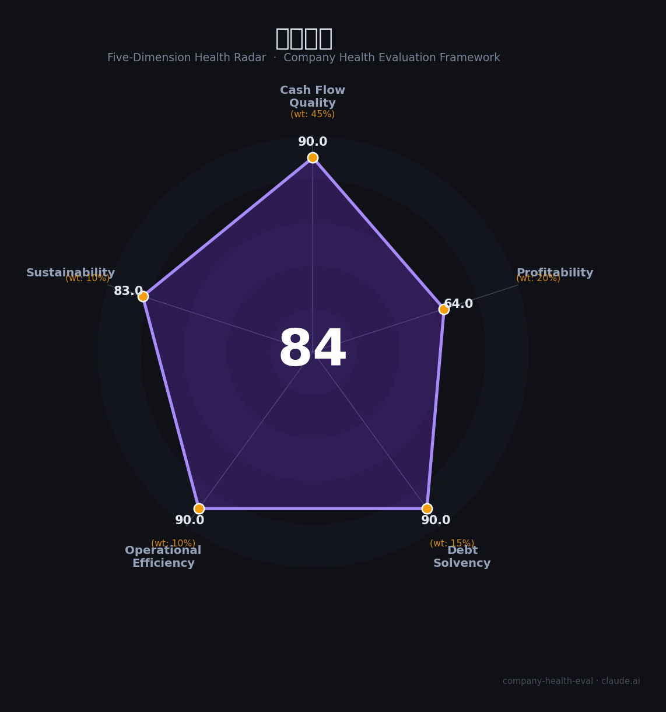

# 沃尔核材（002805.SZ）财务健康评估（2026-08-14）

## 一句话结论

🟡 **84/100，中等偏上** | 电线电缆龙头，营收净利双增、盈利强

---

## 一、公司基本画像

| 项目 | 内容 |
|------|------|
| 主营 | 电线电缆/高分子核材料 |
| 财务 | 2025营收84.51亿(+22%)，归母净利11.44亿(+34.96%) |

> 一句话定性：电线电缆+特种材料龙头，营收净利双增

---

## 二、五维财务健康评估

### 1. 现金流质量（90/100）| 权重45%

现金流充沛。

### 2. 盈利能力（64/100）| 权重20%

盈利改善、净利高增。

### 3. 偿债能力（90/100）| 权重15%

低负债、偿债优。

### 4. 运营效率（90/100）| 权重10%

运营高效。

### 5. 可持续发展（83/100）| 权重10%

AI数据中心+新能源，订单增长。

---

## 三、综合评分

| 维度 | 得分 | 权重 | 加权 |
|------|:----:|:----:|:----:|
| 现金流质量 | 90 | 45% | 40.5 |
| 盈利能力 | 64 | 20% | 12.8 |
| 偿债能力 | 90 | 15% | 13.5 |
| 运营效率 | 90 | 10% | 9.0 |
| 可持续发展 | 83 | 10% | 8.3 |
| **综合得分** | **84/100** | 100% | 84.1 |

**健康等级：中等偏上** — 整体稳健，局部有待改善

---

## 四、核心风险清单

1. **原材料价格**
2. **电缆周期**
3. **数据中心**

## 五、求职/择业视角

### 核心优势
- 电线电缆龙头、现金流好、净利高增
### 现有短板
- 原材料波动、周期性

**结论**：沃尔核材电线电缆与特种材料龙头，营收净利双增、现金流好，数据中心与新能源打开成长。

---

*评估方法：商泰汽车（iAUTO）五维框架 · 数据截至2026年8月 · 财务来源沃尔核材2025年报*